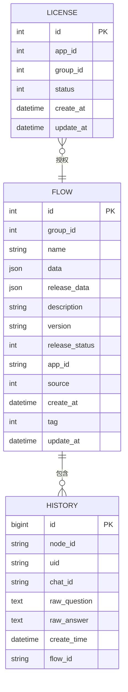

# 工作流模型

<cite>
**本文档引用的文件**  
- [flow.py](file://core/workflow/cache/flow.py)
- [license.py](file://core/workflow/cache/license.py)
- [history.py](file://core/workflow/service/history_service.py)
- [flow.py](file://core/workflow/domain/models/flow.py)
- [license.py](file://core/workflow/domain/models/license.py)
- [history.py](file://core/workflow/domain/models/history.py)
- [flow_service.py](file://core/workflow/service/flow_service.py)
- [dsl_engine.py](file://core/workflow/engine/dsl_engine.py)
- [node.py](file://core/workflow/engine/node.py)
- [base.py](file://core/workflow/domain/models/base.py)
</cite>

## 目录
1. [引言](#引言)
2. [工作流实体结构](#工作流实体结构)
3. [工作流组成元素](#工作流组成元素)
4. [工作流版本管理与历史记录](#工作流版本管理与历史记录)
5. [许可证模型与约束](#许可证模型与约束)
6. [工作流状态机](#工作流状态机)
7. [工作流ER图](#工作流er图)
8. [工作流DSL存储格式](#工作流dsl存储格式)
9. [使用模式与性能优化](#使用模式与性能优化)
10. [结论](#结论)

## 引言

工作流模型是astron-agent系统中的核心组件，负责定义、执行和管理复杂的业务流程。该模型通过可视化的方式组织各种节点和边，形成完整的业务逻辑流。工作流系统支持版本管理、历史记录追踪、许可证控制和状态转换等高级功能，确保了业务流程的可靠性和可维护性。本文档将深入分析工作流模型的各个组成部分，包括实体结构、组成元素、版本管理机制、许可证约束、状态机设计以及性能优化策略。

## 工作流实体结构

工作流模型的核心实体包括Flow、License和History，这些实体通过清晰的属性定义和关系约束构成了完整的工作流管理系统。

**工作流实体（Flow）** 是工作流系统的核心，包含以下关键属性：
- **id**: 唯一标识符，由雪花算法生成
- **group_id**: 组织分组标识
- **name**: 工作流名称
- **data**: 工作流结构数据，以JSON格式存储
- **release_data**: 发布版本的工作流数据
- **description**: 工作流描述
- **version**: 版本号
- **release_status**: 发布状态（0=未发布，1=已发布）
- **app_id**: 关联的应用标识
- **source**: 来源标识
- **create_at**: 创建时间
- **tag**: 标签分类
- **update_at**: 更新时间

**许可证实体（License）** 管理应用的授权状态，包含：
- **id**: 唯一标识符
- **app_id**: 应用标识
- **group_id**: 组织标识
- **status**: 许可证状态（1=激活，0=停用）
- **create_at**: 创建时间
- **update_at**: 更新时间

**历史记录实体（History）** 跟踪工作流节点的执行历史，包含：
- **id**: 历史记录标识
- **node_id**: 执行节点标识
- **uid**: 用户标识
- **chat_id**: 会话标识
- **raw_question**: 原始问题输入
- **raw_answer**: 原始回答输出
- **create_time**: 创建时间
- **flow_id**: 关联的工作流标识

这些实体继承自`SQLModelSerializable`基类，该基类提供了优化的JSON序列化功能，使用orjson库实现高性能的数据转换。

**Section sources**
- [flow.py](file://core/workflow/domain/models/flow.py#L1-L53)
- [license.py](file://core/workflow/domain/models/license.py#L1-L37)
- [history.py](file://core/workflow/domain/models/history.py#L1-L45)
- [base.py](file://core/workflow/domain/models/base.py#L1-L80)

## 工作流组成元素

工作流由节点、边、参数和执行配置等核心元素组成，这些元素共同定义了工作流的结构和行为。

### 节点与边

**节点（Node）** 是工作流的基本执行单元，每个节点代表一个特定的功能或操作。节点类型包括：
- **开始节点（START）**: 工作流的入口点
- **结束节点（END）**: 工作流的出口点
- **LLM节点**: 调用大语言模型进行处理
- **知识库节点**: 查询知识库获取信息
- **流程节点（FLOW）**: 嵌套子工作流
- **决策节点**: 基于条件进行分支判断
- **参数提取节点**: 从输入中提取结构化数据

**边（Edge）** 连接节点，定义了工作流的执行路径。每条边包含：
- **sourceNodeId**: 源节点ID
- **targetNodeId**: 目标节点ID
- **sourceHandle**: 源节点句柄，用于标识具体的输出端口

### 参数与执行配置

**参数配置** 定义了节点的输入输出规范：
- **输入参数**: 节点执行所需的输入数据，包括参数名称、类型、描述和是否必填
- **输出参数**: 节点执行后产生的输出数据，同样包含名称、类型和描述
- **允许的文件类型**: 对于文件输入，指定允许的文件格式

**执行配置** 包括：
- **重试配置**: 定义节点执行失败时的重试策略，包括最大重试次数和错误处理策略
- **流式处理**: 支持流式输出的节点配置
- **变量池**: 管理工作流执行过程中的变量状态

节点执行采用策略模式和模板方法模式，通过`NodeExecutionTemplate`类统一处理节点执行流程，确保了执行逻辑的一致性和可扩展性。

**Section sources**
- [node.py](file://core/workflow/engine/node.py#L1-L799)
- [flow.py](file://core/workflow/domain/models/flow.py#L1-L53)
- [flow_service.py](file://core/workflow/service/flow_service.py#L1-L427)

## 工作流版本管理与历史记录

工作流系统实现了完善的版本管理和历史记录机制，确保了工作流的可追溯性和稳定性。

### 版本管理机制

工作流版本管理通过以下方式实现：
- **版本标识**: 每个工作流版本都有唯一的版本号，遵循v3.x.x的命名规范
- **最新版本缓存**: 使用Redis缓存最新版本的工作流，键名为`flows:flow_info:new:{flow_id}:latest`
- **特定版本缓存**: 支持按版本号缓存工作流，键名为`flows:flow_info:new:{flow_id}:{version}`
- **版本发布**: 通过`PublishInput`实体管理发布操作，包含发布状态、平台标识和版本号

版本管理服务提供了以下核心功能：
- **获取最新版本**: 优先从缓存获取，未命中则查询数据库
- **获取指定版本**: 支持按版本号查询历史版本
- **版本验证**: 在获取版本时验证许可证权限和发布状态

### 历史记录模型

历史记录模型通过`History`实体和`history_service`服务实现，具有以下特点：
- **会话历史**: 记录每个节点的用户交互历史，包括问题和回答
- **大小限制**: 每个节点最多保存10条历史记录
- **长度限制**: 单条记录内容长度限制为16MB的95%，防止数据库行过长
- **令牌限制**: 总历史记录的UTF-8编码长度限制为8192令牌的95%，确保LLM处理的安全边界

历史记录服务提供了两个主要接口：
- **add_history**: 添加新的会话记录，自动处理内容截断
- **get_history**: 获取会话历史，按时间倒序排列并考虑令牌限制

历史记录的获取过程会动态计算当前使用的令牌数，当接近限制时停止添加更多记录，确保不会超出LLM的处理能力。

**Section sources**
- [flow.py](file://core/workflow/cache/flow.py#L1-L117)
- [history_service.py](file://core/workflow/service/history_service.py#L1-L186)
- [history.py](file://core/workflow/domain/models/history.py#L1-L45)

## 许可证模型与约束

许可证模型是工作流系统的重要安全机制，用于控制应用对工作流的访问权限。

### 许可证实体设计

许可证实体（License）设计简洁而有效：
- **双向关联**: 通过app_id和group_id建立应用与组织的关联
- **状态管理**: status字段控制许可证的激活状态
- **时间戳**: 记录创建和更新时间，便于审计和监控

### 许可证与工作流的关系

许可证与工作流的关系通过以下方式实现：
- **访问控制**: 在获取工作流时验证许可证，确保只有授权的应用才能访问
- **状态检查**: 验证许可证的激活状态，停用的许可证无法访问工作流
- **缓存集成**: 许可证信息也通过Redis缓存，键名为`license:license_info:new:{app_id}:{group_id}`

### 约束条件

系统实施了严格的约束条件：
- **权限验证**: 未授权的应用无法访问工作流，返回`APP_FLOW_NOT_AUTH_BOND_ERROR`
- **状态检查**: 即使有权限，停用的许可证也无法访问工作流，返回`APP_FLOW_NO_LICENSE_ERROR`
- **发布状态**: 只能访问已发布的版本，未发布的工作流返回`FLOW_NOT_PUBLISH_ERROR`

这些约束确保了工作流系统的安全性和合规性，防止未授权访问和滥用。

**Section sources**
- [license.py](file://core/workflow/cache/license.py#L1-L41)
- [license.py](file://core/workflow/domain/models/license.py#L1-L37)
- [flow_service.py](file://core/workflow/service/flow_service.py#L1-L427)

## 工作流状态机

工作流系统实现了复杂的状态机设计，管理从设计到发布的完整生命周期。

### 状态定义

工作流支持以下主要状态：
- **设计状态（Design）**: 工作流正在被创建或修改
- **测试状态（Test）**: 工作流正在进行测试验证
- **发布状态（Published）**: 工作流已发布并可供使用
- **停用状态（Disabled）**: 工作流被停用，不再可用

状态通过`release_status`字段管理：
- **0**: 未发布（设计或测试状态）
- **1**: 已发布

### 状态转换

状态转换遵循严格的规则：
- **设计 → 测试**: 通过构建验证（build）操作，验证工作流结构的正确性
- **测试 → 发布**: 通过发布操作（publish），将测试版本变为正式版本
- **发布 → 停用**: 通过更新操作，将发布状态改为未发布
- **停用 → 设计**: 重新进入编辑模式进行修改

### 状态转换机制

状态转换通过以下机制实现：
- **构建验证**: 在发布前调用`build`方法，创建工作流引擎实例验证结构正确性
- **发布操作**: 调用`get_latest_published_flow_by`方法，确保只有通过验证的版本才能发布
- **缓存更新**: 状态变更时更新Redis缓存，确保状态一致性
- **事件报告**: 通过Kafka报告状态变更，便于监控和审计

状态机的设计确保了工作流的稳定性和可靠性，防止无效或错误的工作流被发布使用。

**Section sources**
- [flow_service.py](file://core/workflow/service/flow_service.py#L1-L427)
- [flow.py](file://core/workflow/domain/models/flow.py#L1-L53)
- [dsl_engine.py](file://core/workflow/engine/dsl_engine.py#L1-L799)

## 工作流ER图



**Diagram sources**
- [flow.py](file://core/workflow/domain/models/flow.py#L1-L53)
- [license.py](file://core/workflow/domain/models/license.py#L1-L37)
- [history.py](file://core/workflow/domain/models/history.py#L1-L45)

## 工作流DSL存储格式

工作流DSL（领域特定语言）采用JSON格式存储，具有清晰的层次结构和类型安全。

### 存储结构

工作流DSL的存储结构如下：
```json
{
  "id": "workflow_id",
  "name": "工作流名称",
  "description": "工作流描述",
  "version": "v3.1.0",
  "data": {
    "nodes": [
      {
        "id": "node-type::node_id",
        "data": {
          "nodeMeta": {
            "nodeType": "node-type",
            "aliasName": "节点别名"
          },
          "inputs": [...],
          "outputs": [...],
          "retryConfig": {...},
          "nodeParam": {...}
        }
      }
    ],
    "edges": [
      {
        "sourceNodeId": "source_id",
        "targetNodeId": "target_id",
        "sourceHandle": "handle_id"
      }
    ]
  }
}
```

### 序列化方式

序列化采用以下策略：
- **orjson库**: 使用orjson进行高性能JSON序列化，比标准json库快3-5倍
- **自定义选项**: 支持排序键和2空格缩进，便于调试和阅读
- **类型安全**: 通过Pydantic模型确保数据结构的完整性和类型正确性
- **二进制兼容**: 支持bytes和str输入，确保网络传输的兼容性

### 序列化特性

序列化过程具有以下特性：
- **性能优化**: orjson的C扩展实现提供了极快的序列化速度
- **Unicode支持**: 正确处理各种Unicode字符，避免编码问题
- **循环引用**: 通过引用计数避免无限递归
- **自定义类型**: 支持datetime等复杂类型的自动转换

这种存储格式既保持了人类可读性，又确保了机器处理的高效性，是工作流系统的核心数据交换格式。

**Section sources**
- [flow.py](file://core/workflow/domain/models/flow.py#L1-L53)
- [base.py](file://core/workflow/domain/models/base.py#L1-L80)
- [dsl_engine.py](file://core/workflow/engine/dsl_engine.py#L1-L799)

## 使用模式与性能优化

工作流模型在实际使用中采用了多种模式和优化策略，确保了系统的高性能和可扩展性。

### 使用模式

系统实现了以下使用模式：
- **缓存模式**: 广泛使用Redis缓存工作流定义、许可证信息和引擎实例，减少数据库查询
- **工厂模式**: `WorkflowEngineFactory`创建工作流引擎实例，确保单例模式和资源复用
- **策略模式**: 不同节点类型使用不同的执行策略，如`QuestionAnswerNodeStrategy`确保串行执行
- **责任链模式**: 异常处理采用责任链模式，按顺序尝试不同的错误处理策略

### 性能优化策略

系统实施了多项性能优化：
- **缓存分层**: 
  - 第一层：Redis缓存工作流定义
  - 第二层：内存缓存工作流引擎实例
  - 第三层：数据库持久化存储
- **连接池**: 数据库连接使用连接池管理，避免频繁创建销毁
- **异步处理**: 节点执行采用异步模式，支持并发处理
- **流式传输**: 支持流式输出，减少等待时间
- **批量操作**: 历史记录采用批量插入，提高写入性能

### 执行优化

执行过程的优化包括：
- **预编译**: 工作流在首次使用时预编译，后续直接使用缓存的引擎实例
- **懒加载**: 按需加载工作流定义，减少内存占用
- **超时控制**: 设置合理的执行超时，防止长时间阻塞
- **资源限制**: 控制每个工作流的资源使用，防止系统过载

这些优化策略共同确保了工作流系统在高并发场景下的稳定性和响应速度。

**Section sources**
- [flow.py](file://core/workflow/cache/flow.py#L1-L117)
- [dsl_engine.py](file://core/workflow/engine/dsl_engine.py#L1-L799)
- [flow_service.py](file://core/workflow/service/flow_service.py#L1-L427)

## 结论

工作流模型是astron-agent系统的核心组件，通过精心设计的实体结构、清晰的组成元素、完善的版本管理、严格的许可证控制和高效的状态机，实现了复杂业务流程的可视化管理和自动化执行。系统采用现代化的架构设计，包括缓存分层、异步处理和策略模式，确保了高性能和可扩展性。未来可以进一步优化历史记录的压缩算法，增加工作流的版本比较功能，并完善监控告警体系，提升系统的可观测性和运维效率。