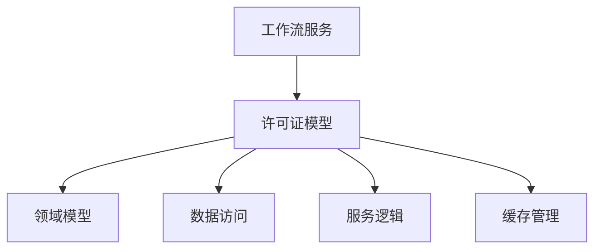
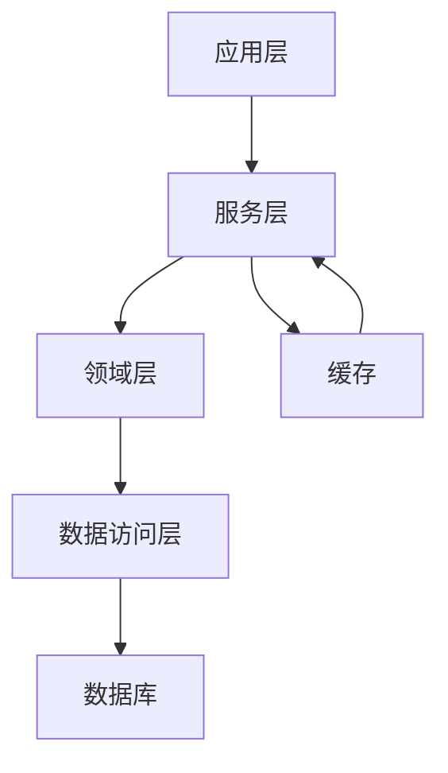
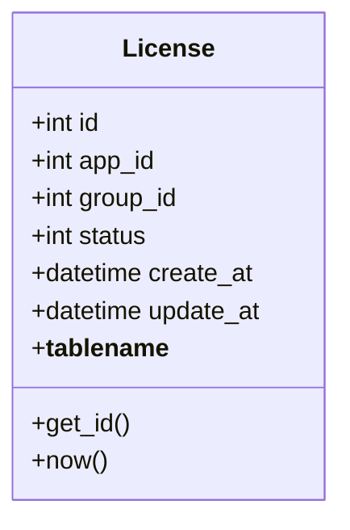
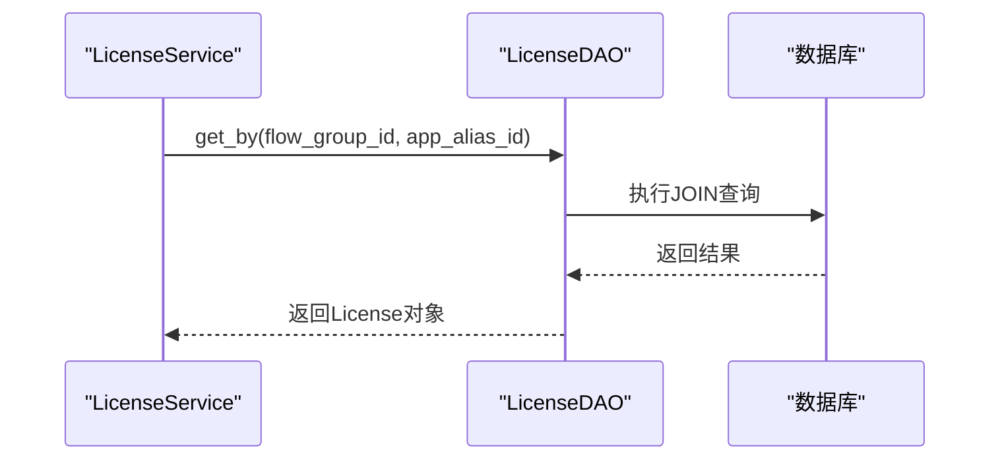
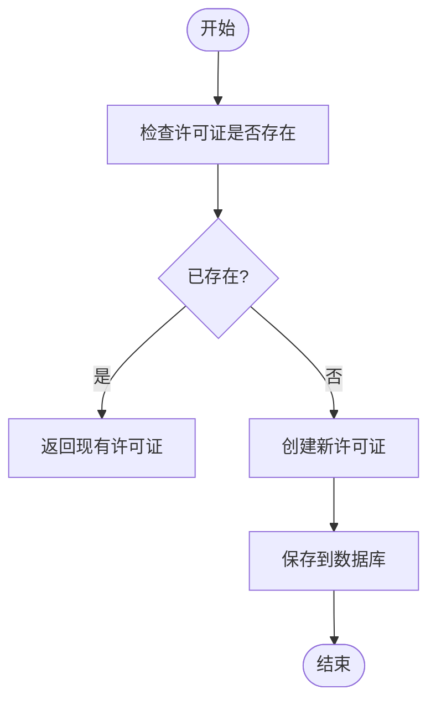
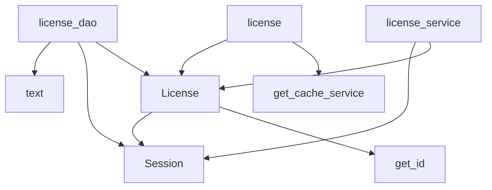

# 工作流许可证模型

<cite>
**本文档引用的文件**  
- [license.py](file://core/workflow/cache/license.py)
- [license.py](file://core/workflow/domain/models/license.py)
- [license_dao.py](file://core/workflow/repository/license_dao.py)
- [license_service.py](file://core/workflow/service/license_service.py)
</cite>

## 目录
1. [项目结构](#项目结构)
2. [核心组件](#核心组件)
3. [架构概述](#架构概述)
4. [详细组件分析](#详细组件分析)
5. [依赖分析](#依赖分析)

## 项目结构

根据项目结构，工作流许可证模型主要位于 `core/workflow` 目录下，涉及以下关键组件：
- `domain/models/license.py`：定义许可证的领域模型
- `repository/license_dao.py`：提供数据库访问操作
- `service/license_service.py`：实现许可证服务逻辑
- `cache/license.py`：管理许可证的缓存操作

**Diagram sources**
- [license.py](file://core/workflow/domain/models/license.py)
- [license_dao.py](file://core/workflow/repository/license_dao.py)
- [license_service.py](file://core/workflow/service/license_service.py)
- [license.py](file://core/workflow/cache/license.py)

**Section sources**
- [license.py](file://core/workflow/domain/models/license.py)
- [license_dao.py](file://core/workflow/repository/license_dao.py)

## 核心组件

工作流许可证模型的核心组件包括许可证实体、数据访问对象、服务层和缓存管理。许可证实体定义了许可证的基本属性和关系，数据访问对象负责与数据库交互，服务层实现业务逻辑，缓存管理提高访问性能。

**Section sources**
- [license.py](file://core/workflow/domain/models/license.py)
- [license_dao.py](file://core/workflow/repository/license_dao.py)
- [license_service.py](file://core/workflow/service/license_service.py)
- [license.py](file://core/workflow/cache/license.py)

## 架构概述

工作流许可证模型采用分层架构设计，包括领域层、数据访问层、服务层和缓存层。这种设计实现了关注点分离，提高了代码的可维护性和可测试性。

**Diagram sources**
- [license.py](file://core/workflow/domain/models/license.py)
- [license_dao.py](file://core/workflow/repository/license_dao.py)
- [license_service.py](file://core/workflow/service/license_service.py)
- [license.py](file://core/workflow/cache/license.py)

## 详细组件分析

### 许可证模型分析

#### 对象导向组件

**Diagram sources**
- [license.py](file://core/workflow/domain/models/license.py)

### 许可证数据访问分析

#### API/服务组件

**Diagram sources**
- [license_dao.py](file://core/workflow/repository/license_dao.py)
- [license_service.py](file://core/workflow/service/license_service.py)

### 许可证服务分析

#### 复杂逻辑组件

**Diagram sources**
- [license_service.py](file://core/workflow/service/license_service.py)

**Section sources**
- [license_service.py](file://core/workflow/service/license_service.py)
- [license_dao.py](file://core/workflow/repository/license_dao.py)
- [license.py](file://core/workflow/domain/models/license.py)

## 依赖分析

工作流许可证模型的依赖关系主要包括：

**Diagram sources**
- [license.py](file://core/workflow/domain/models/license.py)
- [license_dao.py](file://core/workflow/repository/license_dao.py)
- [license_service.py](file://core/workflow/service/license_service.py)
- [license.py](file://core/workflow/cache/license.py)

**Section sources**
- [license.py](file://core/workflow/domain/models/license.py)
- [license_dao.py](file://core/workflow/repository/license_dao.py)
- [license_service.py](file://core/workflow/service/license_service.py)
- [license.py](file://core/workflow/cache/license.py)