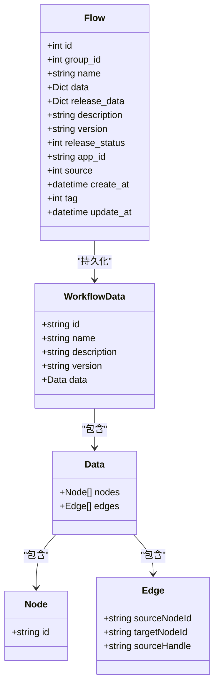
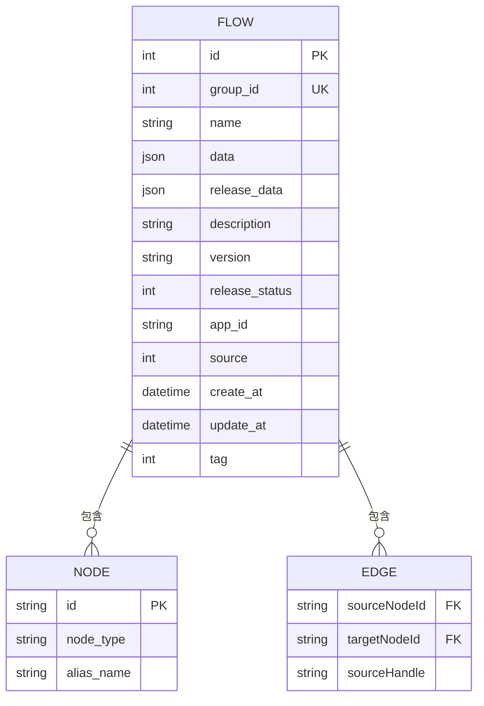

# 核心工作流模型

<cite>
**本文档引用的文件**  
- [flow.py](file://core/workflow/cache/flow.py)
- [flow.py](file://core/workflow/domain/entities/flow.py)
- [flow.py](file://core/workflow/domain/models/flow.py)
- [flow_service.py](file://core/workflow/service/flow_service.py)
- [flow_dao.py](file://core/workflow/repository/flow_dao.py)
- [node.py](file://core/workflow/engine/node.py)
- [dsl_engine.py](file://core/workflow/engine/dsl_engine.py)
- [base.py](file://core/workflow/domain/models/base.py)
</cite>

## 目录
1. [引言](#引言)
2. [工作流组成元素](#工作流组成元素)
3. [工作流DSL结构设计](#工作流dsl结构设计)
4. [工作流元数据字段](#工作流元数据字段)
5. [工作流与智能体的关联关系](#工作流与智能体的关联关系)
6. [工作流模型类图](#工作流模型类图)
7. [工作流模型ER图](#工作流模型er图)
8. [存储层持久化方式](#存储层持久化方式)
9. [使用模式与性能优化](#使用模式与性能优化)

## 引言
核心工作流模型是astron-agent系统中的关键组件，负责定义和管理复杂的工作流逻辑。该模型通过节点、边、参数和执行配置等元素构建可视化的工作流，支持AI应用的自动化执行。工作流模型采用领域驱动设计，包含领域实体、领域模型和缓存管理等多个层次，确保了系统的可扩展性和高性能。

## 工作流组成元素
工作流由节点（Node）、边（Edge）、参数和执行配置等核心元素组成。节点代表工作流中的基本执行单元，每个节点都有唯一的ID标识。边定义了节点之间的连接关系，包含源节点ID、目标节点ID和源句柄等属性。工作流数据结构包含节点列表和边列表，其中节点数量至少为2个。

工作流支持多种节点类型，包括开始节点、结束节点、LLM节点、智能体节点、知识库节点和子工作流节点等。每种节点类型都有特定的执行逻辑和配置参数。节点之间通过边建立连接，形成有向无环图（DAG）结构，确保工作流的正确执行顺序。

**Section sources**
- [flow.py](file://core/workflow/domain/entities/flow.py#L1-L128)

## 工作流DSL结构设计
工作流DSL（领域特定语言）采用JSON Schema定义，确保了数据结构的规范性和可验证性。DSL结构包含工作流ID、名称、描述、版本号和数据结构等核心字段。版本号遵循v3.x.x的语义化版本模式，便于版本管理和兼容性控制。

工作流数据结构采用嵌套的JSON格式，包含节点列表和边列表。每个节点包含ID、类型、别名名称和配置参数等属性。边结构定义了节点间的连接关系，支持复杂的条件分支和并行执行。DSL设计支持动态参数绑定和变量池机制，实现了节点间的数据传递和状态共享。

序列化方式采用orjson库进行优化，相比标准json库具有更高的性能和更小的内存占用。序列化过程支持自定义选项，如键排序和2空格缩进，确保了数据的一致性和可读性。

**Section sources**
- [flow.py](file://core/workflow/domain/entities/flow.py#L1-L128)
- [base.py](file://core/workflow/domain/models/base.py#L1-L79)

## 工作流元数据字段
工作流元数据包含名称、描述、创建时间、更新时间、版本号、发布状态等关键字段。名称字段长度至少为1个字符，用于标识工作流的业务含义。描述字段提供工作流的详细说明，帮助用户理解其功能和用途。

创建时间（create_at）和更新时间（update_at）字段记录了工作流的生命周期信息，采用datetime类型存储。版本号字段遵循v3.x.x的正则表达式模式，确保版本管理的规范性。发布状态字段为整数类型，0表示未发布，1表示已发布，支持多状态管理。

其他元数据字段包括应用ID（app_id）、源标识（source）、标签（tag）和组ID（group_id）等。组ID用于组织和管理工作流，支持批量操作和权限控制。所有元数据字段都建立了数据库索引，确保了查询性能。

**Section sources**
- [flow.py](file://core/workflow/domain/models/flow.py#L1-L52)

## 工作流与智能体的关联关系
工作流与智能体（AI App）通过应用ID（app_id）建立关联关系。每个工作流必须绑定到一个具体的智能体，确保了执行上下文的隔离和安全性。智能体提供了工作流执行所需的资源和权限，包括模型访问、知识库访问和外部服务调用等。

工作流可以作为智能体的核心执行引擎，处理复杂的业务逻辑和决策流程。智能体通过调用工作流服务接口来启动和管理工作流实例，实现AI能力的编排和组合。这种关联关系支持多对多的映射，即一个智能体可以包含多个工作流，一个工作流也可以被多个智能体复用。

在执行过程中，工作流引擎会验证智能体的许可证状态，确保只有授权的智能体才能执行特定的工作流。这种机制实现了细粒度的访问控制和资源管理，保障了系统的安全性和稳定性。

**Section sources**
- [flow_service.py](file://core/workflow/service/flow_service.py#L1-L426)

## 工作流模型类图

**Diagram sources**
- [flow.py](file://core/workflow/domain/entities/flow.py#L1-L128)
- [flow.py](file://core/workflow/domain/models/flow.py#L1-L52)

## 工作流模型ER图

**Diagram sources**
- [flow.py](file://core/workflow/domain/models/flow.py#L1-L52)

## 存储层持久化方式
工作流模型采用SQLModel框架进行数据库持久化，基于MySQL存储引擎。核心表为`flow`表，包含工作流的所有元数据和结构数据。`data`和`release_data`字段使用JSON类型存储，支持复杂的数据结构和灵活的查询。

持久化策略采用读写分离架构，写操作通过事务保证数据一致性，读操作优先从缓存获取。缓存层使用Redis，采用多级缓存策略：第一级是工作流ID缓存，第二级是最新版本缓存，第三级是特定版本缓存。缓存键采用`flows:flow_info:new:{flow_id}`的命名规范，确保了缓存的可管理性。

数据访问层（DAO）封装了数据库操作，提供类型安全的查询接口。对于发布状态的查询，采用位运算优化，支持多种发布状态的组合查询。数据变更时，自动更新最后修改时间，并清除相关缓存，确保数据的一致性。

**Section sources**
- [flow.py](file://core/workflow/domain/models/flow.py#L1-L52)
- [flow_service.py](file://core/workflow/service/flow_service.py#L1-L426)
- [flow_dao.py](file://core/workflow/repository/flow_dao.py#L1-L73)

## 使用模式与性能优化
工作流服务采用工厂模式创建工作流引擎实例，支持单例和原型两种模式。对于高频访问的工作流，采用实例缓存策略，减少重复创建的开销。引擎实例的生命周期由缓存服务管理，支持自动过期和手动清除。

性能优化策略包括：预编译节点关系、懒加载大对象、批量操作优化和连接池管理。执行过程中采用异步非阻塞IO，充分利用系统资源。对于复杂的工作流，支持分片执行和并行处理，提高整体吞吐量。

监控和诊断方面，集成OTLP（OpenTelemetry Protocol）标准，提供完整的调用链追踪。每个工作流执行都会生成详细的日志记录，包括开始时间、结束时间、执行状态和资源消耗等指标。这些数据用于性能分析、故障排查和容量规划。

**Section sources**
- [flow_service.py](file://core/workflow/service/flow_service.py#L1-L426)
- [dsl_engine.py](file://core/workflow/engine/dsl_engine.py#L1-L799)
- [node.py](file://core/workflow/engine/node.py#L1-L799)