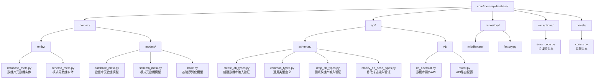
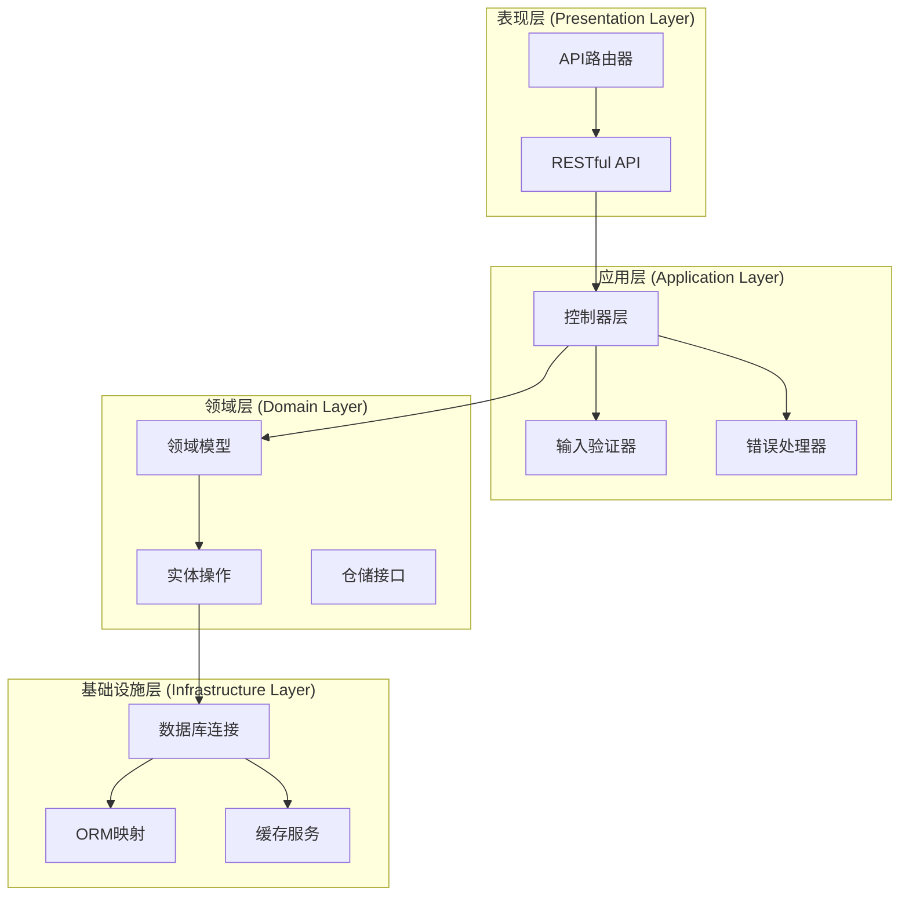
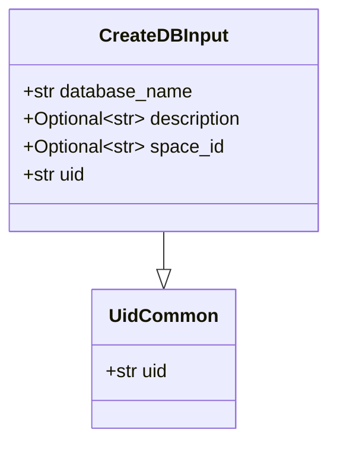
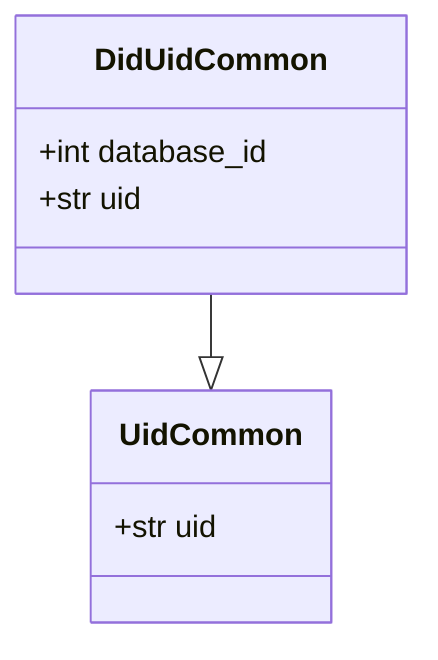
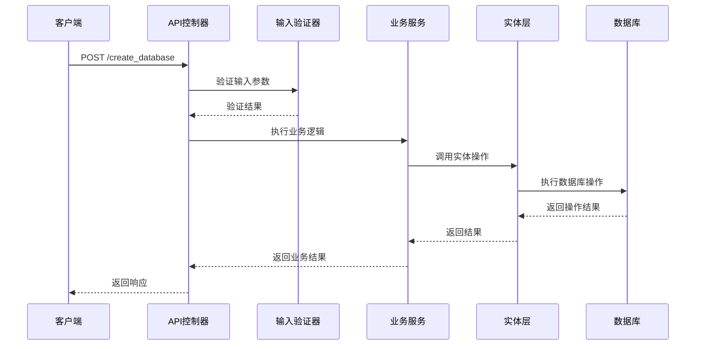
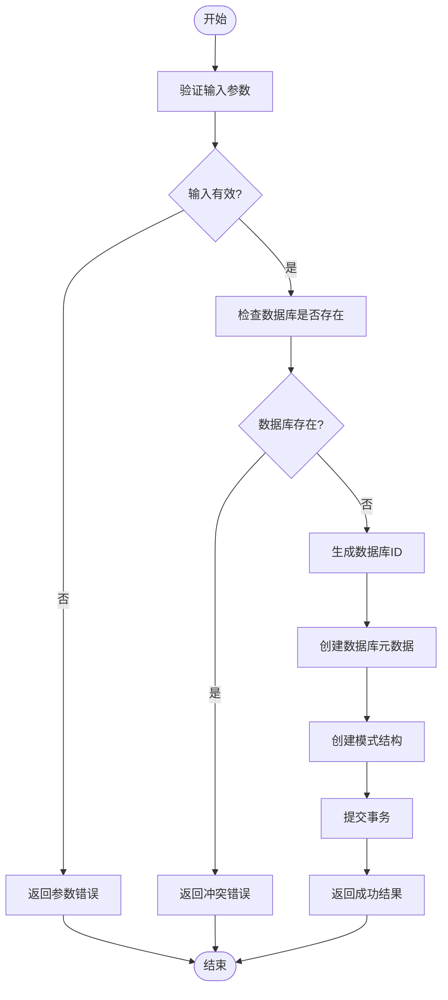
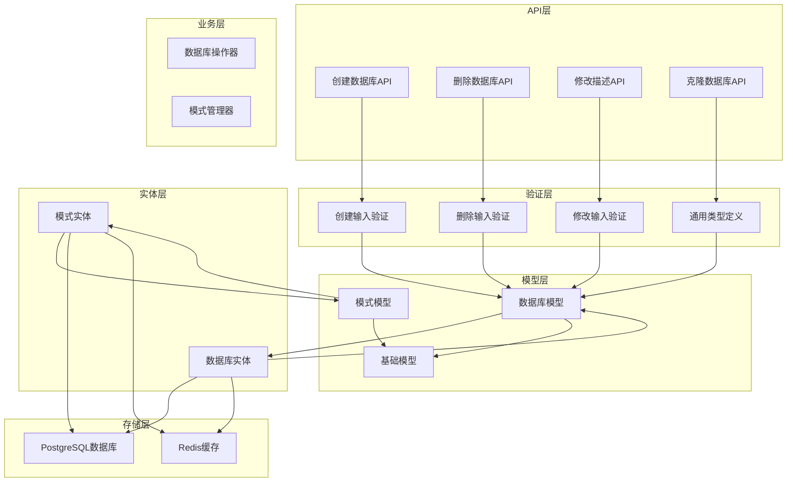

# 数据库元数据

<cite>
**本文档中引用的文件**
- [database_meta.py](file://core/memory/database/domain/models/database_meta.py)
- [database_meta.py](file://core/memory/database/domain/entity/database_meta.py)
- [schema_meta.py](file://core/memory/database/domain/models/schema_meta.py)
- [schema_meta.py](file://core/memory/database/domain/entity/schema_meta.py)
- [create_db_types.py](file://core/memory/database/api/schemas/create_db_types.py)
- [common_types.py](file://core/memory/database/api/schemas/common_types.py)
- [drop_db_types.py](file://core/memory/database/api/schemas/drop_db_types.py)
- [modify_db_desc_types.py](file://core/memory/database/api/schemas/modify_db_desc_types.py)
- [db_operator.py](file://core/memory/database/api/v1/db_operator.py)
- [router.py](file://core/memory/database/api/router.py)
- [base.py](file://core/memory/database/domain/models/base.py)
- [error_code.py](file://core/memory/database/exceptions/error_code.py)
- [consts.py](file://core/memory/database/consts/consts.py)
</cite>

## 目录
1. [简介](#简介)
2. [项目结构](#项目结构)
3. [核心组件](#核心组件)
4. [架构概览](#架构概览)
5. [详细组件分析](#详细组件分析)
6. [依赖关系分析](#依赖关系分析)
7. [性能考虑](#性能考虑)
8. [故障排除指南](#故障排除指南)
9. [结论](#结论)

## 简介

数据库元数据系统是星尘智能数据库服务的核心组件，负责管理数据库实例的元信息、生命周期和相关操作。该系统提供了完整的数据库创建、查询、修改和删除功能，同时维护数据库与表结构之间的关联关系。

数据库元数据模型采用分层架构设计，包含实体层、模型层、API层和存储层，确保了系统的可扩展性和可维护性。系统支持异步操作，具有完善的错误处理机制和性能监控功能。

## 项目结构

数据库元数据相关的文件组织结构如下：



**图表来源**
- [database_meta.py](file://core/memory/database/domain/models/database_meta.py#L1-L42)
- [schema_meta.py](file://core/memory/database/domain/models/schema_meta.py#L1-L38)
- [db_operator.py](file://core/memory/database/api/v1/db_operator.py#L1-L50)

**章节来源**
- [database_meta.py](file://core/memory/database/domain/models/database_meta.py#L1-L42)
- [schema_meta.py](file://core/memory/database/domain/models/schema_meta.py#L1-L38)
- [router.py](file://core/memory/database/api/router.py#L1-L31)

## 核心组件

数据库元数据系统由以下核心组件构成：

### 数据库元数据模型 (DatabaseMeta)
数据库元数据模型是系统的核心实体，定义了数据库实例的所有属性和约束条件。该模型继承自SQLModelSerializable基类，提供了JSON序列化功能。

### 模式元数据模型 (SchemaMeta)
模式元数据模型管理数据库中的模式信息，包括生产模式和测试模式的关联关系。

### 实体操作层
包含数据库元数据的CRUD操作函数，提供异步数据库访问能力。

### API层
提供RESTful API接口，支持数据库的创建、查询、修改和删除操作。

**章节来源**
- [database_meta.py](file://core/memory/database/domain/models/database_meta.py#L15-L42)
- [schema_meta.py](file://core/memory/database/domain/models/schema_meta.py#L15-L38)
- [db_operator.py](file://core/memory/database/api/v1/db_operator.py#L1-L50)

## 架构概览

数据库元数据系统采用分层架构设计，确保了关注点分离和模块化开发：



**图表来源**
- [db_operator.py](file://core/memory/database/api/v1/db_operator.py#L1-L50)
- [router.py](file://core/memory/database/api/router.py#L1-L31)
- [database_meta.py](file://core/memory/database/domain/entity/database_meta.py#L1-L50)

## 详细组件分析

### 数据库元数据模型详细分析

#### 数据库元数据模型结构

```mermaid
classDiagram
class DatabaseMeta {
+int id
+str uid
+str name
+Optional~str~ description
+str space_id
+datetime create_at
+datetime update_at
+Optional~str~ create_by
+Optional~str~ update_by
+__tablename__ : "database_meta"
+__table_args__ : {"schema" : "sparkdb_manager"}
+get_id_by_did_uid(session, database_id, uid) Sequence[Row]
+get_id_by_did(session, database_id) Sequence[Row]
+del_database_meta_by_did(session, database_id) None
+update_database_meta_by_did_uid(session, database_id, uid, description) None
+get_uid_by_did_space_id(session, database_id, space_id) Sequence[Row]
+get_uid_by_space_id(session, space_id) Optional[Any]
}
class SQLModelSerializable {
+json(**kwargs) str
+parse_raw(b, **kwargs) SQLModelSerializable
+orjson_dumps(v, default, sort_keys, indent_2) str
}
DatabaseMeta --|> SQLModelSerializable
```

**图表来源**
- [database_meta.py](file://core/memory/database/domain/models/database_meta.py#L15-L42)
- [base.py](file://core/memory/database/domain/models/base.py#L40-L74)

#### 字段详细说明

| 字段名 | 数据类型 | 约束条件 | 业务含义 | 默认值 |
|--------|----------|----------|----------|--------|
| id | int | 主键，自增 | 数据库唯一标识符 | 自动生成 |
| uid | str | 非空，索引 | 用户唯一标识符 | "" |
| name | str | 非空，索引 | 数据库名称 | "" |
| description | Optional[str] | 可选 | 数据库描述信息 | "" |
| space_id | str | 索引 | 工作空间ID | "" |
| create_at | datetime | 自动设置 | 创建时间戳 | 当前时间 |
| update_at | datetime | 自动设置 | 最后更新时间戳 | 当前时间 |
| create_by | Optional[str] | 可选 | 创建者标识 | "" |
| update_by | Optional[str] | 可选 | 最后更新者标识 | "" |

**章节来源**
- [database_meta.py](file://core/memory/database/domain/models/database_meta.py#L15-L42)

### 模式元数据模型详细分析

#### 模式元数据模型结构

```mermaid
classDiagram
class SchemaMeta {
+int id
+str database_id
+Optional~str~ schema_name
+datetime create_at
+datetime update_at
+Optional~str~ create_by
+Optional~str~ update_by
+__tablename__ : "schema_meta"
+__table_args__ : {"schema" : "sparkdb_manager"}
}
class SQLModelSerializable {
+json(**kwargs) str
+parse_raw(b, **kwargs) SQLModelSerializable
}
SchemaMeta --|> SQLModelSerializable
```

**图表来源**
- [schema_meta.py](file://core/memory/database/domain/models/schema_meta.py#L15-L38)
- [base.py](file://core/memory/database/domain/models/base.py#L40-L74)

#### 字段详细说明

| 字段名 | 数据类型 | 约束条件 | 业务含义 | 默认值 |
|--------|----------|----------|----------|--------|
| id | int | 主键，自增 | 模式唯一标识符 | 自动生成 |
| database_id | str | 非空 | 关联的数据库ID | 必填 |
| schema_name | Optional[str] | 索引 | 模式名称 | "" |
| create_at | datetime | 自动设置 | 创建时间戳 | 当前时间 |
| update_at | datetime | 自动设置 | 最后更新时间戳 | 当前时间 |
| create_by | Optional[str] | 可选 | 创建者标识 | "" |
| update_by | Optional[str] | 可选 | 最后更新者标识 | "" |

**章节来源**
- [schema_meta.py](file://core/memory/database/domain/models/schema_meta.py#L15-L38)

### API输入验证模型分析

#### 创建数据库输入验证



**图表来源**
- [create_db_types.py](file://core/memory/database/api/schemas/create_db_types.py#L10-L38)
- [common_types.py](file://core/memory/database/api/schemas/common_types.py#L8-L37)

#### 通用类型定义



**图表来源**
- [common_types.py](file://core/memory/database/api/schemas/common_types.py#L8-L37)

**章节来源**
- [create_db_types.py](file://core/memory/database/api/schemas/create_db_types.py#L10-L38)
- [common_types.py](file://core/memory/database/api/schemas/common_types.py#L8-L37)

### 数据库操作API分析

#### 数据库操作流程



**图表来源**
- [db_operator.py](file://core/memory/database/api/v1/db_operator.py#L200-L250)
- [router.py](file://core/memory/database/api/router.py#L15-L31)

#### 数据库生命周期管理



**图表来源**
- [db_operator.py](file://core/memory/database/api/v1/db_operator.py#L200-L280)

**章节来源**
- [db_operator.py](file://core/memory/database/api/v1/db_operator.py#L200-L280)

### 错误处理机制

#### 错误码定义

| 错误码 | 错误类型 | 描述 | 使用场景 |
|--------|----------|------|----------|
| 25000 | ParamError | 参数验证错误 | 输入参数格式不正确 |
| 25010 | DatabaseExecutionError | 数据库操作失败 | 数据库执行异常 |
| 25011 | CreatDBError | 创建数据库失败 | 数据库创建过程出错 |
| 25012 | DeleteDBError | 删除数据库失败 | 数据库删除过程出错 |
| 25013 | DatabaseNotExistError | 数据库不存在 | 尝试操作不存在的数据库 |
| 25014 | ModifyDBDescriptionError | 修改数据库描述失败 | 更新数据库描述信息失败 |
| 25015 | SpaceIDNotExistError | 团队空间不存在 | 团队空间ID无效 |

**章节来源**
- [error_code.py](file://core/memory/database/exceptions/error_code.py#L1-L41)

## 依赖关系分析

### 组件依赖关系图



**图表来源**
- [db_operator.py](file://core/memory/database/api/v1/db_operator.py#L1-L50)
- [router.py](file://core/memory/database/api/router.py#L1-L31)
- [database_meta.py](file://core/memory/database/domain/models/database_meta.py#L1-L42)

### 数据流分析

数据库元数据系统中的数据流向遵循单向流动原则，确保了数据的一致性和可追溯性：

1. **输入验证阶段**：API接收客户端请求，进行参数验证
2. **业务逻辑处理**：根据验证结果执行相应的业务逻辑
3. **数据持久化**：将业务处理结果持久化到数据库
4. **响应返回**：将处理结果返回给客户端

**章节来源**
- [db_operator.py](file://core/memory/database/api/v1/db_operator.py#L1-L50)
- [router.py](file://core/memory/database/api/router.py#L1-L31)

## 性能考虑

### 异步操作优化

数据库元数据系统采用异步编程模型，通过以下方式提升性能：

1. **异步数据库操作**：所有数据库操作都采用异步模式，避免阻塞主线程
2. **连接池管理**：使用SQLAlchemy的连接池机制，减少连接创建开销
3. **批量操作**：支持批量插入和更新操作，减少网络往返次数
4. **缓存策略**：对频繁访问的数据实施缓存机制

### 错误重试机制

系统实现了智能重试机制，当遇到临时性错误时自动重试：

```python
@retry_on_invalid_cached_statement(max_retries=3)
async def get_id_by_did_uid(session: AsyncSession, database_id: int, uid: str) -> Sequence[Row[Any]]:
    # 数据库查询逻辑
```

### 性能监控指标

系统集成了OTLP性能监控，跟踪以下关键指标：

- 服务入口延迟时间
- 服务出口延迟时间
- 服务并发请求数
- 错误计数统计

## 故障排除指南

### 常见问题及解决方案

#### 数据库创建失败

**问题现象**：创建数据库时返回"Database consistency error"错误

**可能原因**：
1. 数据库名称重复
2. 权限不足
3. 数据库连接超时

**解决方案**：
1. 检查数据库名称是否唯一
2. 验证用户权限配置
3. 检查数据库连接状态

#### 数据库删除失败

**问题现象**：删除数据库时返回"Failed to delete database"错误

**可能原因**：
1. 数据库正在被使用
2. 模式删除失败
3. 事务回滚

**解决方案**：
1. 确保没有活跃连接
2. 检查模式删除SQL语法
3. 查看事务日志

#### 权限验证失败

**问题现象**：返回"NoAuthorityError"错误

**可能原因**：
1. 用户UID验证失败
2. 空间ID不存在
3. 权限配置错误

**解决方案**：
1. 验证用户身份认证
2. 检查团队空间配置
3. 更新权限策略

**章节来源**
- [error_code.py](file://core/memory/database/exceptions/error_code.py#L1-L41)
- [db_operator.py](file://core/memory/database/api/v1/db_operator.py#L300-L400)

## 结论

数据库元数据系统是一个设计精良的企业级数据库管理系统，具有以下特点：

### 技术优势

1. **分层架构**：清晰的分层设计确保了系统的可维护性和可扩展性
2. **异步处理**：采用异步编程模型，提升了系统性能和响应速度
3. **强类型验证**：使用Pydantic进行输入验证，确保数据完整性
4. **完善的错误处理**：多层次的错误处理机制保证了系统的稳定性

### 功能特性

1. **完整的CRUD操作**：支持数据库的创建、查询、修改和删除
2. **生命周期管理**：完整的数据库生命周期管理功能
3. **模式关联**：与表结构元数据的紧密关联
4. **团队协作支持**：支持团队空间和权限管理

### 应用价值

数据库元数据系统为星尘智能数据库服务提供了坚实的基础支撑，不仅满足了当前的功能需求，还具备良好的扩展性，能够适应未来业务发展的需要。通过标准化的API接口和完善的错误处理机制，系统能够为企业级应用提供稳定可靠的数据库元数据管理服务。