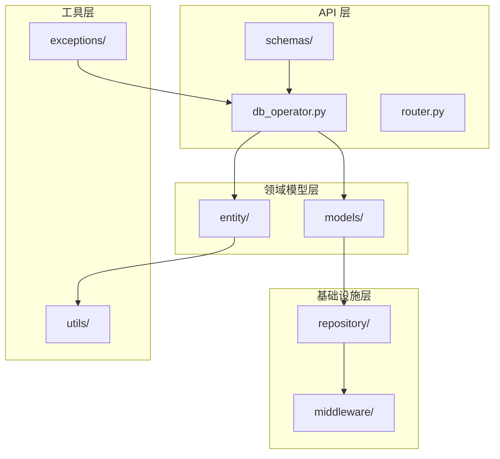
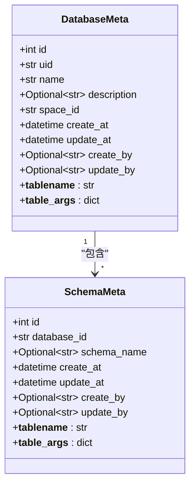
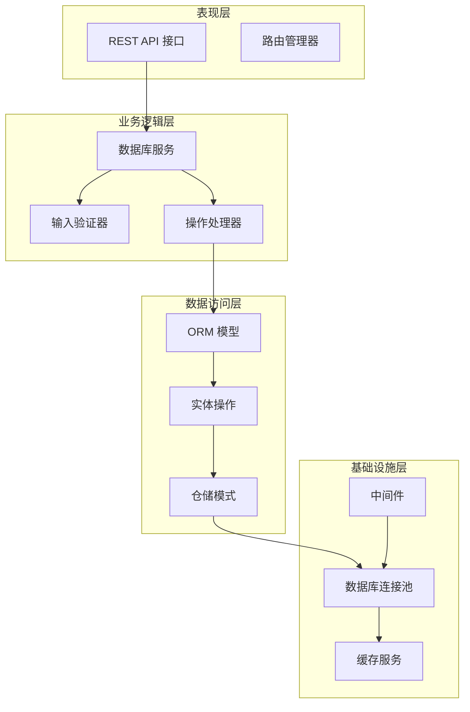
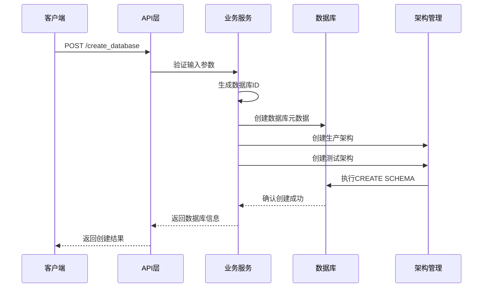
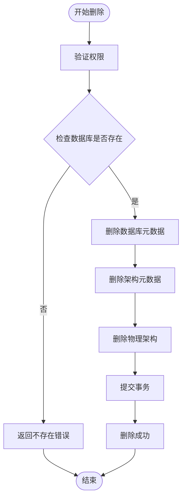
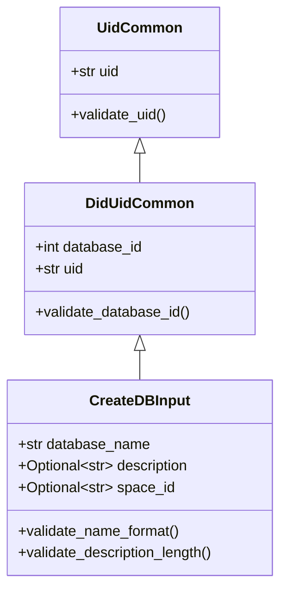
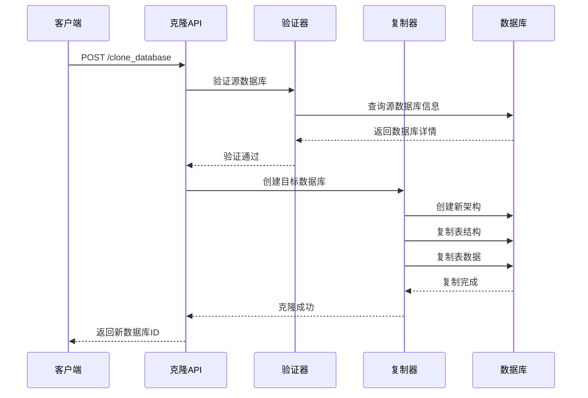
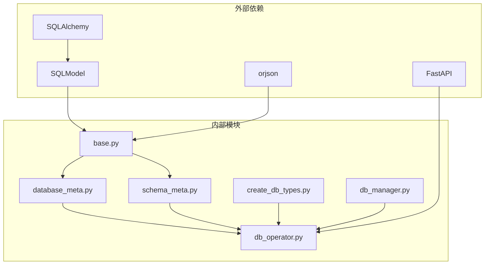
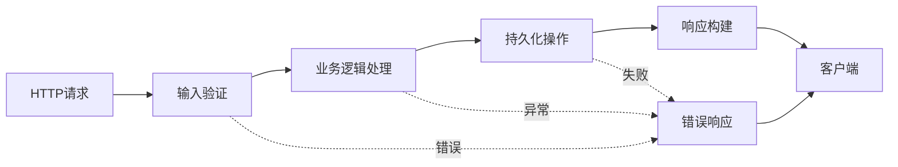

# 数据库模型

<cite>
**本文档引用的文件**
- [database_meta.py](file://core/memory/database/domain/models/database_meta.py)
- [schema_meta.py](file://core/memory/database/domain/models/schema_meta.py)
- [base.py](file://core/memory/database/domain/models/base.py)
- [db_operator.py](file://core/memory/database/api/v1/db_operator.py)
- [create_db_types.py](file://core/memory/database/api/schemas/create_db_types.py)
- [common_types.py](file://core/memory/database/api/schemas/common_types.py)
- [drop_db_types.py](file://core/memory/database/api/schemas/drop_db_types.py)
- [modify_db_desc_types.py](file://core/memory/database/api/schemas/modify_db_desc_types.py)
- [error_code.py](file://core/memory/database/exceptions/error_code.py)
- [db_manager.py](file://core/memory/database/repository/middleware/database/db_manager.py)
- [http_resp.py](file://core/memory/database/domain/entity/views/http_resp.py)
- [consts.py](file://core/memory/database/consts/consts.py)
</cite>

## 目录
1. [简介](#简介)
2. [项目结构](#项目结构)
3. [核心组件](#核心组件)
4. [架构概览](#架构概览)
5. [详细组件分析](#详细组件分析)
6. [依赖关系分析](#依赖关系分析)
7. [性能考虑](#性能考虑)
8. [故障排除指南](#故障排除指南)
9. [结论](#结论)

## 简介

astron-agent 的数据库服务模型是一个基于 PostgreSQL 的内存数据库管理系统，提供了完整的数据库生命周期管理功能。该系统采用异步架构设计，支持多租户、多空间的数据库隔离，并实现了完善的访问控制和权限管理机制。

系统的核心特性包括：
- 基于 SQLAlchemy 和 SQLModel 的 ORM 模型
- 异步数据库连接池管理
- 完整的 CRUD 操作支持
- 数据库克隆和复制功能
- 严格的权限验证机制
- 标准化的错误处理和响应格式

## 项目结构

数据库服务模块位于 `core/memory/database/` 目录下，采用分层架构设计：

**图表来源**
- [db_operator.py](file://core/memory/database/api/v1/db_operator.py#L1-L50)
- [database_meta.py](file://core/memory/database/domain/models/database_meta.py#L1-L42)
- [db_manager.py](file://core/memory/database/repository/middleware/database/db_manager.py#L1-L50)

**章节来源**
- [db_operator.py](file://core/memory/database/api/v1/db_operator.py#L1-L100)
- [database_meta.py](file://core/memory/database/domain/models/database_meta.py#L1-L42)

## 核心组件

### 数据库元数据模型 (DatabaseMeta)

DatabaseMeta 是数据库服务的核心实体模型，负责存储数据库的基本信息和所有权信息。

#### 主要属性

| 属性名 | 类型 | 描述 | 约束 |
|--------|------|------|------|
| id | int | 主键标识符 | 自增，主键 |
| uid | str | 数据库唯一标识符 | 非空，带索引 |
| name | str | 数据库名称 | 非空，带索引，1-20字符，字母开头 |
| description | Optional[str] | 数据库描述 | 可选，最大200字符 |
| space_id | str | 关联的工作空间ID | 带索引 |
| create_at | datetime | 创建时间戳 | 默认当前时间 |
| update_at | datetime | 最后更新时间戳 | 默认当前时间 |
| create_by | Optional[str] | 创建者标识 | 可选 |
| update_by | Optional[str] | 最后更新者标识 | 可选 |

#### 设计特点

- 使用 Snowflake 算法生成唯一 ID
- 支持软删除标记
- 实现了时间戳自动更新
- 提供完整的序列化支持

**章节来源**
- [database_meta.py](file://core/memory/database/domain/models/database_meta.py#L15-L42)

### 架构元数据模型 (SchemaMeta)

SchemaMeta 模型用于管理数据库架构信息，支持生产环境和测试环境的分离。

#### 主要属性

| 属性名 | 类型 | 描述 | 约束 |
|--------|------|------|------|
| id | int | 主键标识符 | 自增，主键 |
| database_id | str | 父数据库ID外键 | 非空 |
| schema_name | Optional[str] | 架构名称 | 带索引 |
| create_at | datetime | 创建时间戳 | 默认当前时间 |
| update_at | datetime | 最后更新时间戳 | 默认当前时间 |
| create_by | Optional[str] | 创建者标识 | 可选 |
| update_by | Optional[str] | 最后更新者标识 | 可选 |

#### 架构设计

**图表来源**
- [database_meta.py](file://core/memory/database/domain/models/database_meta.py#L15-L42)
- [schema_meta.py](file://core/memory/database/domain/models/schema_meta.py#L15-L38)

**章节来源**
- [schema_meta.py](file://core/memory/database/domain/models/schema_meta.py#L15-L38)

## 架构概览

数据库服务采用分层架构，确保了良好的可维护性和扩展性：

**图表来源**
- [db_operator.py](file://core/memory/database/api/v1/db_operator.py#L30-L80)
- [db_manager.py](file://core/memory/database/repository/middleware/database/db_manager.py#L20-L70)

## 详细组件分析

### 数据库生命周期管理

#### 创建数据库流程

数据库创建过程包含多个步骤，确保数据一致性和安全性：

**图表来源**
- [db_operator.py](file://core/memory/database/api/v1/db_operator.py#L350-L420)
- [create_db_types.py](file://core/memory/database/api/schemas/create_db_types.py#L10-L38)

#### 删除数据库流程

数据库删除操作需要级联删除所有相关数据和架构：

**图表来源**
- [db_operator.py](file://core/memory/database/api/v1/db_operator.py#L420-L480)

**章节来源**
- [db_operator.py](file://core/memory/database/api/v1/db_operator.py#L350-L517)

### 访问控制策略

#### 权限验证机制

系统实现了基于用户ID和空间ID的双重验证机制：

| 验证类型 | 验证对象 | 验证内容 | 错误码 |
|----------|----------|----------|--------|
| 用户验证 | UID | 用户身份合法性 | NoAuthorityError |
| 空间验证 | SpaceID | 工作空间存在性 | SpaceIDNotExistError |
| 数据库验证 | DatabaseID | 数据库所有权 | DatabaseNotExistError |
| 权限验证 | 操作类型 | 具体操作权限 | NoAuthorityError |

#### 输入验证规则

**图表来源**
- [common_types.py](file://core/memory/database/api/schemas/common_types.py#L8-L37)
- [create_db_types.py](file://core/memory/database/api/schemas/create_db_types.py#L10-L38)

**章节来源**
- [common_types.py](file://core/memory/database/api/schemas/common_types.py#L1-L37)
- [create_db_types.py](file://core/memory/database/api/schemas/create_db_types.py#L1-L38)

### 数据库克隆功能

#### 克隆操作流程

数据库克隆功能支持完整复制现有数据库的所有架构和数据：

**图表来源**
- [db_operator.py](file://core/memory/database/api/v1/db_operator.py#L120-L200)

**章节来源**
- [db_operator.py](file://core/memory/database/api/v1/db_operator.py#L120-L250)

### 错误处理机制

#### 错误码体系

系统定义了完整的错误码体系，便于问题诊断和用户反馈：

| 错误类别 | 错误码范围 | 主要错误类型 | 描述 |
|----------|------------|--------------|------|
| 成功状态 | 0 | Successes | 操作成功 |
| 参数错误 | 25000 | ParamError | 参数验证失败 |
| 数据库执行错误 | 25010 | DatabaseExecutionError | 数据库操作失败 |
| 权限错误 | 25020 | NoAuthorityError | 权限验证失败 |
| SQL语法错误 | 25030 | SQLParseError | SQL解析失败 |
| DDL/DML限制 | 25040/25050 | DDLNotAllowed/DMLNotAllowed | 不允许的操作类型 |

**章节来源**
- [error_code.py](file://core/memory/database/exceptions/error_code.py#L1-L41)

## 依赖关系分析

### 组件依赖图

**图表来源**
- [base.py](file://core/memory/database/domain/models/base.py#L1-L30)
- [database_meta.py](file://core/memory/database/domain/models/database_meta.py#L1-L20)
- [db_manager.py](file://core/memory/database/repository/middleware/database/db_manager.py#L1-L30)

### 数据流分析

数据库服务的数据流遵循清晰的单向流动原则：

**图表来源**
- [db_operator.py](file://core/memory/database/api/v1/db_operator.py#L50-L100)
- [http_resp.py](file://core/memory/database/domain/entity/views/http_resp.py#L60-L84)

**章节来源**
- [db_operator.py](file://core/memory/database/api/v1/db_operator.py#L1-L100)
- [http_resp.py](file://core/memory/database/domain/entity/views/http_resp.py#L1-L84)

## 性能考虑

### 连接池优化

数据库服务采用了高性能的连接池配置：

| 参数 | 默认值 | 说明 |
|------|--------|------|
| pool_size | 20 | 连接池大小 |
| max_overflow | 20 | 最大溢出连接数 |
| pool_recycle | 3600 | 连接回收时间（秒） |
| connect_timeout | 10 | 连接超时时间（秒） |

### 查询优化策略

1. **索引设计**：关键字段如 `uid`、`space_id`、`database_id` 均建立索引
2. **批量操作**：支持批量插入和更新操作
3. **缓存机制**：对频繁查询的结果进行缓存
4. **异步处理**：所有数据库操作均采用异步模式

### 内存数据库服务使用场景

1. **临时数据存储**：适合短期数据处理和分析
2. **缓存层**：作为应用层缓存的底层存储
3. **原型开发**：快速原型验证和开发测试
4. **微服务数据**：为微服务提供独立的数据存储

## 故障排除指南

### 常见问题及解决方案

#### 连接问题

**问题**：数据库连接失败
**原因**：连接池耗尽或网络问题
**解决方案**：
- 检查连接池配置
- 验证数据库服务状态
- 查看连接超时设置

#### 权限问题

**问题**：权限验证失败
**原因**：用户ID或空间ID不匹配
**解决方案**：
- 验证用户认证信息
- 检查工作空间权限
- 确认数据库所有权

#### 数据一致性问题

**问题**：数据操作失败
**原因**：并发冲突或事务回滚
**解决方案**：
- 实现重试机制
- 检查事务边界
- 验证数据完整性约束

**章节来源**
- [error_code.py](file://core/memory/database/exceptions/error_code.py#L1-L41)
- [db_manager.py](file://core/memory/database/repository/middleware/database/db_manager.py#L80-L134)

## 结论

astron-agent 的数据库服务模型展现了现代数据库管理系统的设计精髓：

1. **架构清晰**：分层架构确保了良好的可维护性和扩展性
2. **功能完整**：涵盖了数据库生命周期的各个环节
3. **安全可靠**：完善的权限控制和错误处理机制
4. **性能优化**：异步处理和连接池优化提升了系统性能
5. **易于使用**：标准化的API设计降低了使用门槛

该系统为 astron-agent 提供了稳定可靠的数据库服务基础，支持复杂的业务场景和高并发访问需求。通过持续的优化和改进，该数据库服务模型将继续为系统的稳定运行提供强有力的支持。