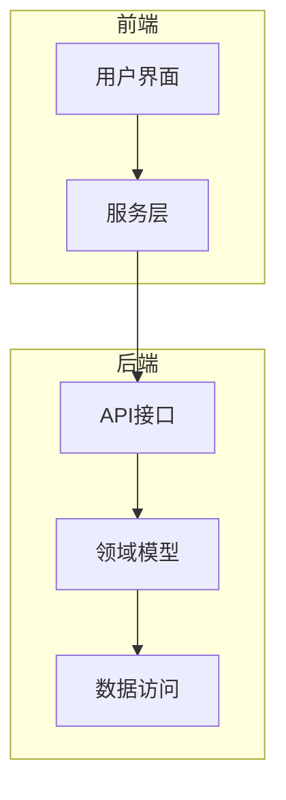
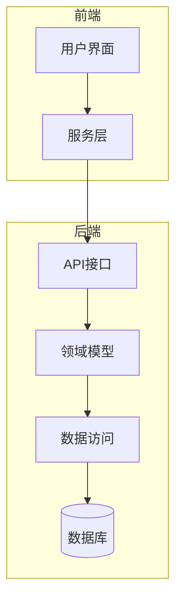
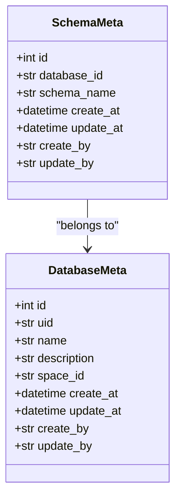
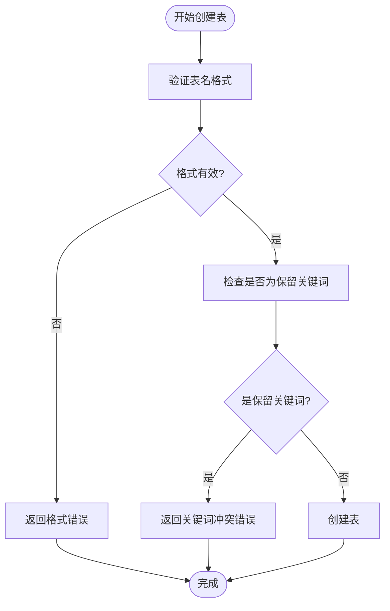
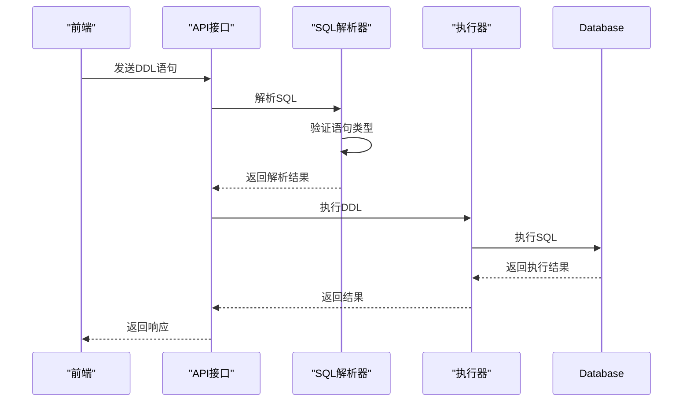
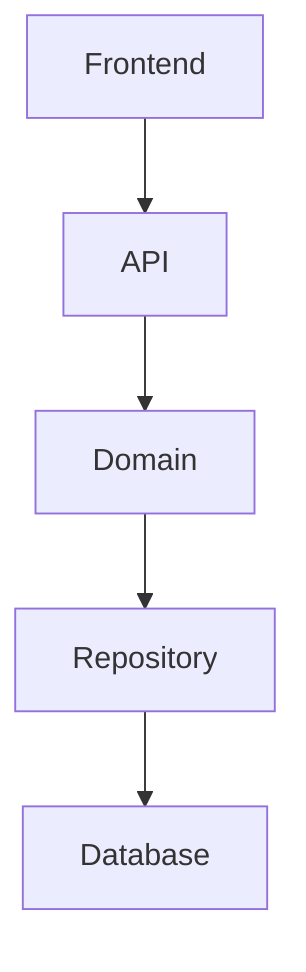

# 表结构元数据

<cite>
**本文档引用的文件**
- [schema_meta.py](file://core/memory/database/domain/models/schema_meta.py)
- [database_meta.py](file://core/memory/database/domain/models/database_meta.py)
- [exec_ddl.py](file://core/memory/database/api/v1/exec_ddl.py)
- [exec_dml.py](file://core/memory/database/api/v1/exec_dml.py)
- [resource.ts](file://console/frontend/src/types/resource.ts)
- [database.ts](file://console/frontend/src/types/database.ts)
</cite>

## 目录
1. [介绍](#介绍)
2. [项目结构](#项目结构)
3. [核心组件](#核心组件)
4. [架构概述](#架构概述)
5. [详细组件分析](#详细组件分析)
6. [依赖分析](#依赖分析)
7. [性能考虑](#性能考虑)
8. [故障排除指南](#故障排除指南)
9. [结论](#结论)
10. [附录](#附录)（如有必要）

## 介绍
本文档详细分析了表结构元数据模型的设计与实现，重点关注`schema_meta.py`中的实体定义。文档将深入探讨表结构元数据的组成、设计意图、实现方式以及在数据库操作中的作用。通过分析核心组件和架构，我们将全面理解表结构元数据如何支持数据库的创建、修改和查询操作，以及其在多表关联查询中的应用。

## 项目结构
本项目采用分层架构设计，主要分为前端和后端两个部分。后端核心功能集中在`core`目录下，其中`memory/database`模块负责数据库相关的元数据管理和操作。前端部分位于`console/frontend`目录，提供了用户界面和API调用服务。

**图表来源**
- [schema_meta.py](file://core/memory/database/domain/models/schema_meta.py)
- [database_meta.py](file://core/memory/database/domain/models/database_meta.py)

**章节来源**
- [schema_meta.py](file://core/memory/database/domain/models/schema_meta.py#L1-L50)
- [database_meta.py](file://core/memory/database/domain/models/database_meta.py#L1-L50)

## 核心组件
表结构元数据的核心组件包括`SchemaMeta`和`DatabaseMeta`两个模型类，分别定义了表结构和数据库的元数据信息。这些组件通过API接口暴露给前端应用，支持创建表、修改表结构和查询表信息等操作。

**章节来源**
- [schema_meta.py](file://core/memory/database/domain/models/schema_meta.py#L1-L38)
- [database_meta.py](file://core/memory/database/domain/models/database_meta.py#L1-L42)

## 架构概述
系统架构采用分层设计，从前端到后端依次为：用户界面层、服务层、API接口层、领域模型层和数据访问层。这种分层架构确保了各组件之间的松耦合，提高了系统的可维护性和可扩展性。

**图表来源**
- [exec_ddl.py](file://core/memory/database/api/v1/exec_ddl.py#L1-L227)
- [exec_dml.py](file://core/memory/database/api/v1/exec_dml.py#L1-L457)

## 详细组件分析
### SchemaMeta模型分析
`SchemaMeta`模型定义了表结构元数据的核心属性，包括ID、数据库ID、模式名称、创建时间和更新时间等。该模型通过SQLModel框架实现，支持异步数据库操作。

#### 类图

**图表来源**
- [schema_meta.py](file://core/memory/database/domain/models/schema_meta.py#L1-L38)
- [database_meta.py](file://core/memory/database/domain/models/database_meta.py#L1-L42)

**章节来源**
- [schema_meta.py](file://core/memory/database/domain/models/schema_meta.py#L1-L38)
- [database_meta.py](file://core/memory/database/domain/models/database_meta.py#L1-L42)

### 表结构元数据组成
表结构元数据由多个关键字段组成，每个字段都有特定的设计意图和实现方式：

- **表名**：通过`schema_name`字段存储，支持索引查询
- **字段列表**：在前端通过`TableField`接口定义，包含字段名、类型、长度等属性
- **数据类型**：支持String、Integer、Time、Number、Boolean等基本类型
- **主键**：通过`isPrimaryKey`字段标识
- **外键**：在DDL语句中通过ALTER TABLE语句定义
- **索引**：通过CREATE INDEX语句创建
- **约束**：包括非空约束、唯一性约束等

**章节来源**
- [resource.ts](file://console/frontend/src/types/resource.ts#L525-L605)
- [database.ts](file://console/frontend/src/types/database.ts#L71-L147)

### 字段类型系统和约束验证机制
系统实现了完整的字段类型系统和约束验证机制。前端在创建表时会对字段名进行验证，确保符合命名规范（以小写字母开头，只能包含小写字母、数字和下划线）。同时，系统会检查字段名是否为保留关键词，防止命名冲突。

**图表来源**
- [table-form.tsx](file://console/frontend/src/pages/resource-management/database-detail/database-table-add/components/table-form.tsx#L0-L62)
- [use-table-initializer.ts](file://console/frontend/src/pages/resource-management/database-detail/database-table-add/hooks/use-table-initializer.ts#L0-L52)

**章节来源**
- [table-form.tsx](file://console/frontend/src/pages/resource-management/database-detail/database-table-add/components/table-form.tsx#L0-L62)
- [use-table-initializer.ts](file://console/frontend/src/pages/resource-management/database-detail/database-table-add/hooks/use-table-initializer.ts#L0-L52)

### DDL语句解析与执行
系统通过`exec_ddl.py`文件实现了DDL语句的解析和执行功能。支持的DDL语句包括CREATE TABLE、ALTER TABLE、DROP TABLE等。系统使用sqlglot库进行SQL解析，并验证语句的合法性。

**图表来源**
- [exec_ddl.py](file://core/memory/database/api/v1/exec_ddl.py#L1-L227)

**章节来源**
- [exec_ddl.py](file://core/memory/database/api/v1/exec_ddl.py#L1-L227)

## 依赖分析
系统各组件之间存在明确的依赖关系。前端组件依赖于API接口，API接口依赖于领域模型，领域模型又依赖于数据访问层。这种依赖关系确保了系统的模块化和可测试性。

**图表来源**
- [exec_ddl.py](file://core/memory/database/api/v1/exec_ddl.py#L1-L227)
- [exec_dml.py](file://core/memory/database/api/v1/exec_dml.py#L1-L457)

**章节来源**
- [exec_ddl.py](file://core/memory/database/api/v1/exec_ddl.py#L1-L227)
- [exec_dml.py](file://core/memory/database/api/v1/exec_dml.py#L1-L457)

## 性能考虑
系统在设计时充分考虑了性能因素。通过异步数据库操作、连接池管理和SQL语句缓存等技术，确保了高并发场景下的性能表现。同时，对DDL和DML语句进行预处理和验证，减少了数据库层面的错误处理开销。

## 故障排除指南
当遇到表结构元数据相关的问题时，可以按照以下步骤进行排查：
1. 检查前端输入是否符合验证规则
2. 查看API调用是否成功
3. 检查数据库连接状态
4. 查阅系统日志获取详细错误信息

**章节来源**
- [exec_ddl.py](file://core/memory/database/api/v1/exec_ddl.py#L1-L227)
- [exec_dml.py](file://core/memory/database/api/v1/exec_dml.py#L1-L457)

## 结论
本文档详细分析了表结构元数据模型的设计与实现。通过分层架构和模块化设计，系统提供了完整的表结构管理功能，支持从创建表到复杂查询的全流程操作。未来可以进一步优化字段类型系统，增加更多数据类型支持，并完善约束验证机制。

## 附录
### API定义表
| 端点 | 方法 | 描述 | 请求参数 | 响应格式 |
|------|------|------|----------|----------|
| /db/create-table | POST | 创建表 | CreateTableParams | void |
| /db/table-list | GET | 获取表列表 | TableListParams | TableItem[] |
| /db/delete-table | GET | 删除表 | DeleteTableParams | void |
| /db/table-field-list | POST | 获取表字段 | FieldListParams | { records: TableField[] } |

**章节来源**
- [database.ts](file://console/frontend/src/services/database.ts#L56-L101)