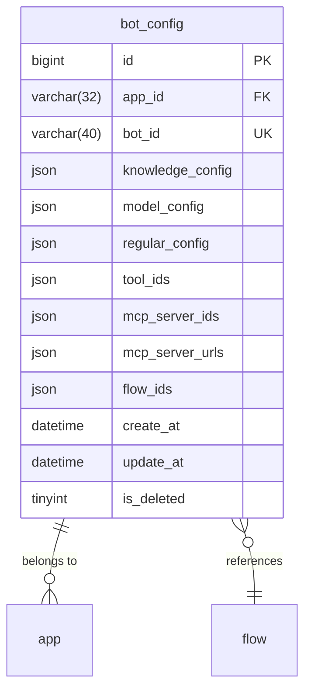
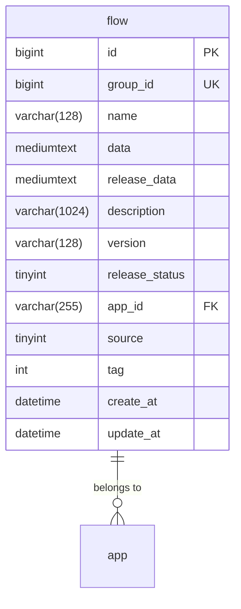
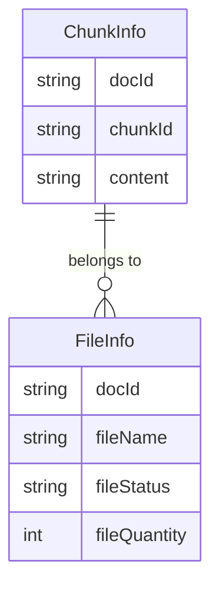
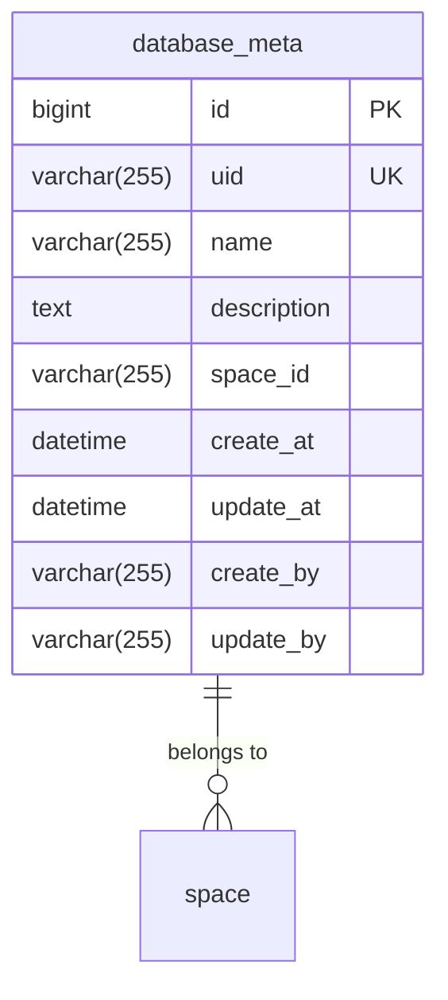

# 数据模型设计

<cite>
**本文档中引用的文件**  
- [bot_config_table.py](file://core/agent/domain/models/bot_config_table.py)
- [flow.py](file://core/workflow/domain/models/flow.py)
- [rag_do.py](file://core/knowledge/domain/entity/rag_do.py)
- [database_meta.py](file://core/memory/database/domain/models/database_meta.py)
- [agent.sql](file://docker/astronAgent/mysql/agent.sql)
- [workflow.sql](file://docker/astronAgent/mysql/workflow.sql)
- [memory.sql](file://docker/astronAgent/pgsql/memory.sql)
</cite>

## 目录
1. [引言](#引言)
2. [智能体配置模型](#智能体配置模型)
3. [工作流模型](#工作流模型)
4. [知识库文档模型](#知识库文档模型)
5. [数据库元数据模型](#数据库元数据模型)
6. [数据验证规则与生命周期](#数据验证规则与生命周期)
7. [存储策略](#存储策略)
8. [结论](#结论)

## 引言
本文档详细描述了Astron-Agent系统中的关键数据模型，包括智能体配置、工作流、知识库文档和数据库元数据等核心实体。通过分析这些模型的字段定义、业务规则和相互关系，为系统的设计、开发和维护提供权威参考。

## 智能体配置模型

智能体配置模型（`bot_config_table.py`）定义了智能体的核心配置信息，存储在`bot_config`表中。该模型通过JSON字段存储复杂的配置参数，支持灵活的智能体行为定义。

**图源**
- [bot_config_table.py](file://core/agent/domain/models/bot_config_table.py#L1-L44)
- [agent.sql](file://docker/astronAgent/mysql/agent.sql#L1-L30)

**字段说明：**
- `id`: 主键ID，自增
- `app_id`: 应用ID，外键关联应用表
- `bot_id`: Bot唯一标识，具有唯一约束
- `knowledge_config`: 知识库参数配置（JSON格式）
- `model_config`: 模型配置（JSON格式）
- `regular_config`: 知识库选择配置（JSON格式）
- `tool_ids`: 工具ID配置（JSON数组）
- `mcp_server_ids`: MCP服务器ID配置（JSON数组）
- `mcp_server_urls`: MCP服务器URL配置（JSON数组）
- `flow_ids`: 关联的工作流ID配置（JSON数组）
- `create_at`: 创建时间
- `update_at`: 更新时间
- `is_deleted`: 软删除标志

**业务规则：**
- 支持通过`app_id`和`bot_id`组合唯一确定一个智能体配置
- 提供`create_or_update`和`delete`方法实现配置的创建/更新和软删除操作
- 所有JSON字段均为必填，确保配置完整性

**节源**
- [bot_config_table.py](file://core/agent/domain/models/bot_config_table.py#L1-L44)

## 工作流模型

工作流模型（`flow.py`）定义了工作流的结构和元数据，存储在`flow`表中。该模型支持版本控制和发布管理，是系统编排能力的核心。

**图源**
- [flow.py](file://core/workflow/domain/models/flow.py#L1-L52)
- [workflow.sql](file://docker/astronAgent/mysql/workflow.sql#L1-L113)

**字段说明：**
- `id`: 工作流唯一标识
- `group_id`: 组ID，与版本号组成唯一约束
- `name`: 工作流名称
- `data`: 编排协议数据（JSON格式存储为mediumtext）
- `release_data`: 发布后的数据
- `description`: 描述信息
- `version`: 版本号
- `release_status`: 发布状态（0=未发布，1=已发布）
- `app_id`: 关联的应用ID
- `source`: 来源标识
- `tag`: 标签（0=无标签，1=对照组）
- `create_at`: 创建时间
- `update_at`: 更新时间

**业务规则：**
- `group_id`和`version`组合具有唯一约束，支持同一工作流的多版本管理
- 支持工作流的草稿状态（`data`）和发布状态（`release_data`）分离
- 通过`release_status`字段控制工作流的发布状态
- 名称字段建立索引，支持快速检索

**节源**
- [flow.py](file://core/workflow/domain/models/flow.py#L1-L52)

## 知识库文档模型

知识库文档模型（`rag_do.py`）定义了检索增强生成（RAG）相关的数据结构，包含文档分块和文件信息等实体。

**图源**
- [rag_do.py](file://core/knowledge/domain/entity/rag_do.py#L1-L52)

**实体说明：**

### ChunkInfo（文档分块信息）
- `docId`: 文档标识符
- `chunkId`: 分块标识符
- `content`: 分块内容文本

### FileInfo（文件信息）
- `docId`: 文档标识符
- `fileName`: 文件名称
- `fileStatus`: 文件状态
- `fileQuantity`: 文件数量

**业务规则：**
- `ChunkInfo`表示文档的分块信息，支持大文档的分段处理和检索
- `FileInfo`表示文件的元数据信息，用于文件管理和状态跟踪
- 两个实体通过`docId`建立关联关系
- 提供`__repr__`方法便于调试和日志输出

**节源**
- [rag_do.py](file://core/knowledge/domain/entity/rag_do.py#L1-L52)

## 数据库元数据模型

数据库元数据模型（`database_meta.py`）定义了数据库资源的元信息，存储在`database_meta`表中。该模型支持多租户环境下的数据库资源管理。

**图源**
- [database_meta.py](file://core/memory/database/domain/models/database_meta.py#L1-L41)
- [memory.sql](file://docker/astronAgent/pgsql/memory.sql#L1-L20)

**字段说明：**
- `id`: 主键ID，使用雪花算法生成
- `uid`: 数据库唯一标识，具有唯一索引
- `name`: 数据库名称
- `description`: 数据库描述
- `space_id`: 关联的工作区ID
- `create_at`: 创建时间
- `update_at`: 更新时间
- `create_by`: 创建者
- `update_by`: 更新者

**业务规则：**
- `uid`字段建立唯一索引，确保数据库标识的全局唯一性
- `name`和`space_id`字段建立索引，支持按名称和工作区检索
- 使用雪花算法生成分布式唯一ID，避免ID冲突
- 提供软删除支持，通过业务逻辑控制数据可见性

**节源**
- [database_meta.py](file://core/memory/database/domain/models/database_meta.py#L1-L41)

## 数据验证规则与生命周期

### 数据验证规则
- **智能体配置模型**：所有JSON字段必须存在且格式正确，`app_id`和`bot_id`不能为空
- **工作流模型**：`name`长度限制为128字符，`version`不能为空，`group_id`和`version`组合必须唯一
- **知识库文档模型**：`docId`必须存在，`content`不能为空
- **数据库元数据模型**：`uid`必须唯一，`name`不能为空

### 数据生命周期
- **创建**：所有实体在创建时自动设置`create_at`和`update_at`时间戳
- **更新**：更新操作会自动更新`update_at`时间戳
- **删除**：采用软删除策略，通过`is_deleted`标志位控制数据可见性
- **归档**：历史数据通过独立的历史表（如`workflow_node_history`）进行归档

**节源**
- [bot_config_table.py](file://core/agent/domain/models/bot_config_table.py#L1-L44)
- [flow.py](file://core/workflow/domain/models/flow.py#L1-L52)
- [database_meta.py](file://core/memory/database/domain/models/database_meta.py#L1-L41)

## 存储策略

### 数据库存储
- **智能体配置**：存储在MySQL的`agent`数据库中，使用InnoDB引擎
- **工作流**：存储在MySQL的`workflow`数据库中，使用InnoDB引擎
- **数据库元数据**：存储在PostgreSQL的`sparkdb_manager`模式中

### 索引策略
- **主键索引**：所有表都定义了主键索引
- **唯一索引**：`bot_config`表的`app_id`+`bot_id`组合，`database_meta`表的`uid`
- **普通索引**：名称、状态、时间戳等常用查询字段

### 缓存策略
- 工作流数据使用Redis缓存，键名为`flows:flow_info:new:{flow_id}`
- 支持按ID、ID+版本、最新版本等多种缓存模式
- 缓存失效策略结合TTL和主动删除机制

**节源**
- [agent.sql](file://docker/astronAgent/mysql/agent.sql#L1-L30)
- [workflow.sql](file://docker/astronAgent/mysql/workflow.sql#L1-L113)
- [memory.sql](file://docker/astronAgent/pgsql/memory.sql#L1-L20)
- [flow.py](file://core/workflow/cache/flow.py#L1-L116)

## 结论
本文档详细描述了Astron-Agent系统的核心数据模型，包括智能体配置、工作流、知识库文档和数据库元数据等关键实体。这些模型通过合理的字段设计、约束规则和关联关系，支撑了系统的智能体管理、工作流编排、知识检索和资源管理等核心功能。建议在开发和维护过程中严格遵循本文档定义的模型规范，确保数据的一致性和完整性。