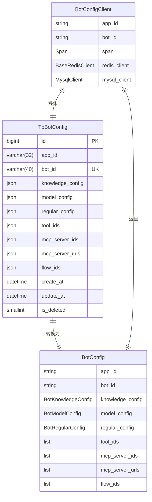
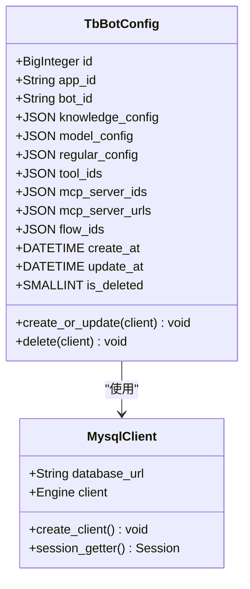
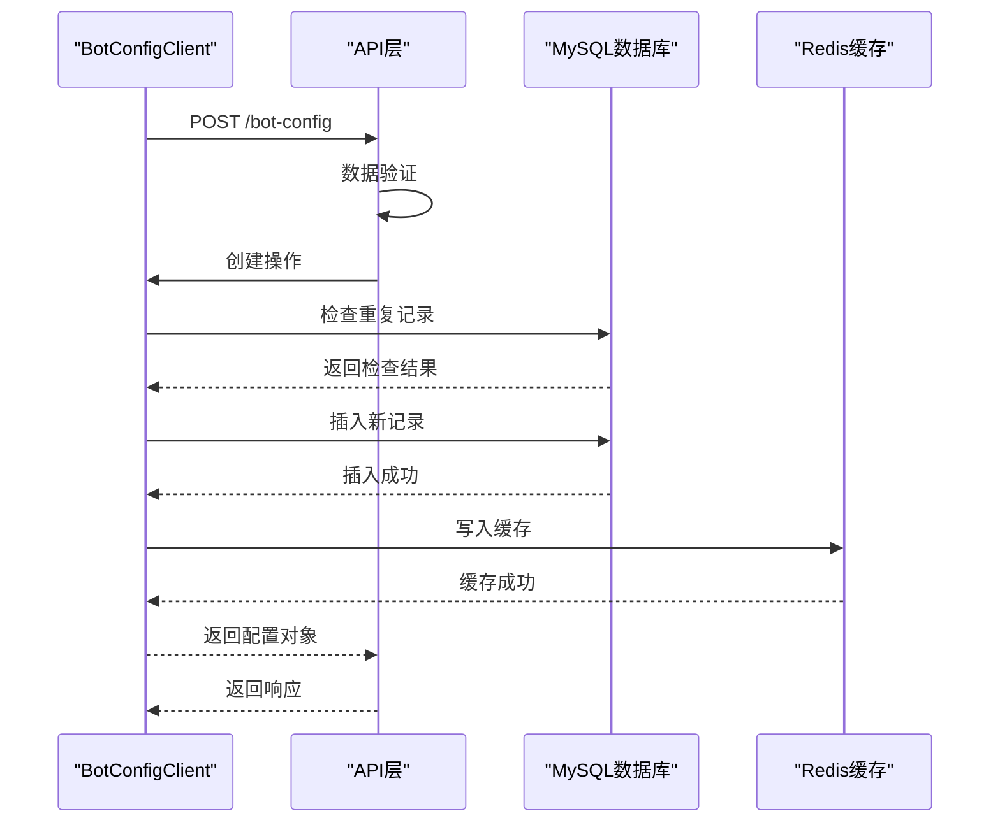
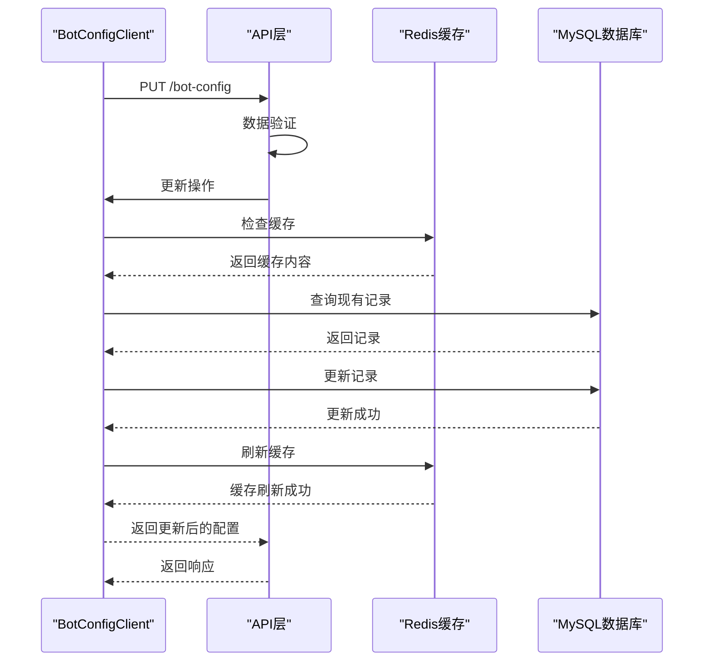
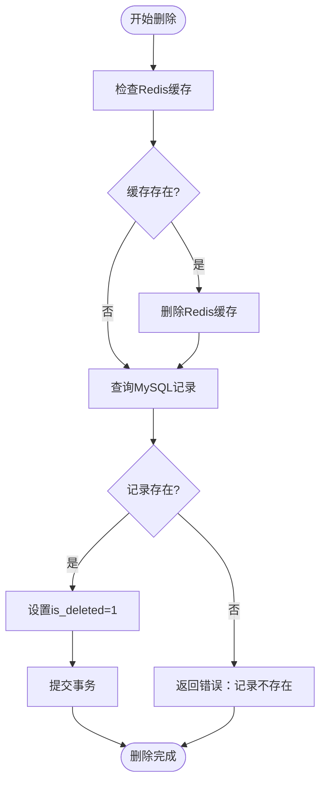
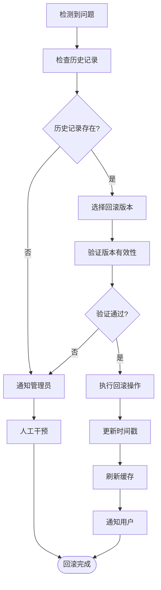
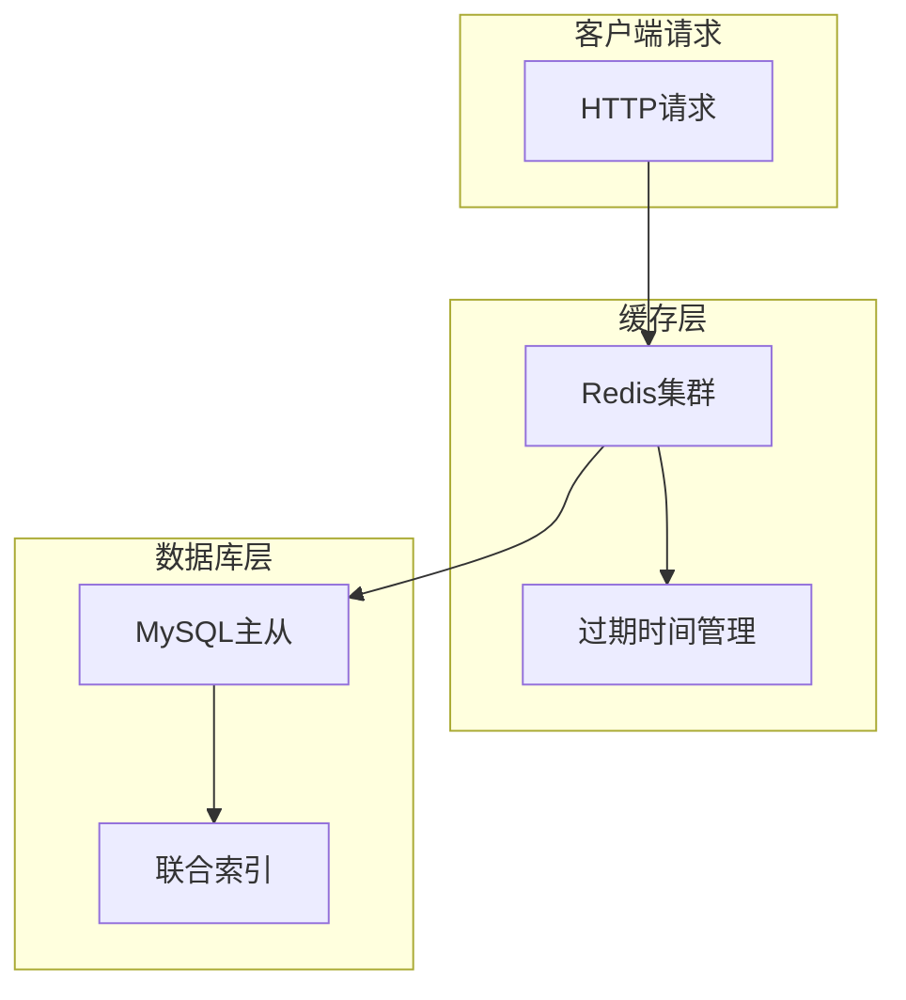
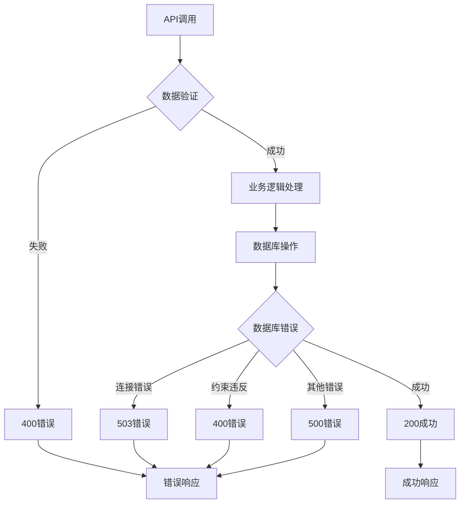
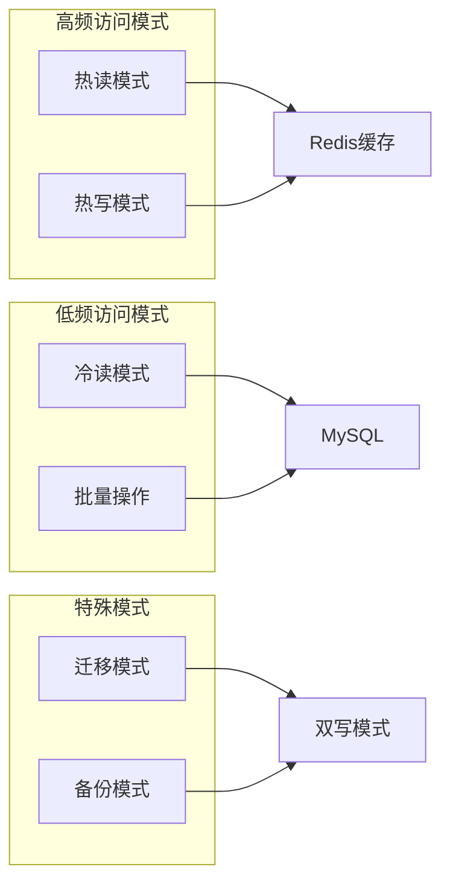

# 智能体配置模型详细文档

<cite>
**本文档中引用的文件**
- [bot_config_table.py](file://core/agent/domain/models/bot_config_table.py)
- [mysql_client.py](file://core/agent/repository/mysql_client.py)
- [bot_config.py](file://core/agent/api/schemas/bot_config.py)
- [bot_config_mgr_api.py](file://core/agent/api/v1/bot_config_mgr_api.py)
- [bot_config_mgr_inputs.py](file://core/agent/api/schemas/bot_config_mgr_inputs.py)
- [bot_config_client.py](file://core/agent/repository/bot_config_client.py)
- [agent.sql](file://docker/astronAgent/mysql/agent.sql)
</cite>

## 目录
1. [简介](#简介)
2. [模型架构概览](#模型架构概览)
3. [核心实体定义](#核心实体定义)
4. [字段详细说明](#字段详细说明)
5. [生命周期管理](#生命周期管理)
6. [版本控制与回滚](#版本控制与回滚)
7. [数据验证与约束](#数据验证与约束)
8. [缓存与性能优化](#缓存与性能优化)
9. [API接口设计](#api接口设计)
10. [使用场景与访问模式](#使用场景与访问模式)
11. [故障排除指南](#故障排除指南)
12. [总结](#总结)

## 简介

智能体配置模型（TbBotConfig）是Astron-Agent系统的核心数据模型，用于存储和管理智能体的各种配置信息。该模型采用关系型数据库设计，支持复杂的JSON配置结构，并提供了完整的生命周期管理功能。

## 模型架构概览



**图表来源**
- [bot_config_table.py](file://core/agent/domain/models/bot_config_table.py#L10-L35)
- [bot_config.py](file://core/agent/api/schemas/bot_config.py#L45-L58)
- [bot_config_client.py](file://core/agent/repository/bot_config_client.py#L20-L35)

## 核心实体定义

### TbBotConfig实体

TbBotConfig是数据库中的核心实体，直接映射到bot_config表。该实体包含以下关键属性：



**图表来源**
- [bot_config_table.py](file://core/agent/domain/models/bot_config_table.py#L10-L45)
- [mysql_client.py](file://core/agent/repository/mysql_client.py#L20-L54)

**节来源**
- [bot_config_table.py](file://core/agent/domain/models/bot_config_table.py#L10-L45)

## 字段详细说明

### 主键与唯一标识符

| 字段名 | 数据类型 | 长度限制 | 唯一性 | 描述 |
|--------|----------|----------|--------|------|
| id | BigInteger | - | 是 | 主键ID，自增生成 |
| app_id | String | 32字符 | 否 | 应用ID，用于应用级别的隔离 |
| bot_id | String | 40字符 | 是 | 智能体唯一标识符 |

### 配置字段

| 字段名 | 数据类型 | JSON格式 | 默认值 | 业务含义 |
|--------|----------|----------|--------|----------|
| knowledge_config | JSON | 复杂对象 | 必填 | 知识库参数配置，包括相似度阈值、检索数量等 |
| model_config | JSON | 层级结构 | 必填 | 模型配置，包含API信息、领域、密钥等 |
| regular_config | JSON | 对象结构 | 必填 | 知识库选择配置，匹配规则和RAG类型 |
| tool_ids | JSON | 数组 | [] | 工具ID列表，支持的功能插件 |
| mcp_server_ids | JSON | 数组 | [] | MCP服务器ID列表 |
| mcp_server_urls | JSON | 数组 | [] | MCP服务器URL列表 |
| flow_ids | JSON | 数组 | [] | 工作流ID列表 |

### 时间戳字段

| 字段名 | 数据类型 | 自动设置 | 描述 |
|--------|----------|----------|------|
| create_at | DATETIME | 当前时间 | 记录创建时间，默认为当前时间 |
| update_at | DATETIME | 当前时间+更新触发 | 记录最后修改时间，自动更新 |

### 软删除字段

| 字段名 | 数据类型 | 取值范围 | 默认值 | 业务逻辑 |
|--------|----------|----------|--------|----------|
| is_deleted | SMALLINT | 0/1 | 0 | 0表示未删除，1表示已删除 |

**节来源**
- [bot_config_table.py](file://core/agent/domain/models/bot_config_table.py#L12-L35)
- [agent.sql](file://docker/astronAgent/mysql/agent.sql#L12-L28)

## 生命周期管理

### 创建流程



**图表来源**
- [bot_config_mgr_api.py](file://core/agent/api/v1/bot_config_mgr_api.py#L110-L130)
- [bot_config_client.py](file://core/agent/repository/bot_config_client.py#L150-L180)

### 更新流程



**图表来源**
- [bot_config_mgr_api.py](file://core/agent/api/v1/bot_config_mgr_api.py#L140-L160)
- [bot_config_client.py](file://core/agent/repository/bot_config_client.py#L280-L310)

### 删除流程

智能体配置采用软删除机制，通过设置is_deleted字段实现：



**图表来源**
- [bot_config_client.py](file://core/agent/repository/bot_config_client.py#L200-L240)

**节来源**
- [bot_config_mgr_api.py](file://core/agent/api/v1/bot_config_mgr_api.py#L110-L210)
- [bot_config_client.py](file://core/agent/repository/bot_config_client.py#L150-L310)

## 版本控制与回滚

### 版本控制机制

当前系统采用基于时间戳的版本控制策略：

1. **创建时间跟踪**：每次创建或更新时，update_at字段会自动更新
2. **历史记录保留**：通过软删除机制保留历史配置记录
3. **并发控制**：使用数据库事务确保操作的原子性

### 回滚策略



### 最佳实践建议

1. **定期备份**：建议定期导出bot_config表进行备份
2. **版本标记**：在应用层面添加版本标记机制
3. **变更日志**：记录重要的配置变更事件
4. **测试环境**：在测试环境中先行验证回滚操作

## 数据验证与约束

### 字段验证规则

| 字段 | 验证规则 | 错误处理 |
|------|----------|----------|
| app_id | 非空，长度1-64字符 | BotConfigMgrExc |
| bot_id | 非空，长度1-64字符 | BotConfigMgrExc |
| knowledge_config | JSON格式，必填 | BotConfigMgrExc |
| model_config | JSON格式，必填 | BotConfigMgrExc |
| regular_config | JSON格式，必填 | BotConfigMgrExc |

### 数据完整性约束

```mermaid
erDiagram
TbBotConfig {
bigint id PK "自增主键"
varchar(32) app_id "非空，应用级别隔离"
varchar(40) bot_id UK "非空，全局唯一"
json knowledge_config "非空，知识库配置"
json model_config "非空，模型配置"
json regular_config "非空，规则配置"
json tool_ids "非空，工具列表"
json mcp_server_ids "非空，MCP服务器ID"
json mcp_server_urls "非空，MCP服务器URL"
json flow_ids "非空，工作流ID"
datetime create_at "自动设置"
datetime update_at "自动更新"
smallint is_deleted "软删除标志"
}
CONSTRAINTS {
UNIQUE "app_id, bot_id组合唯一"
INDEX "union_app_bot索引"
CHECK "is_deleted取值范围"
}
```

**图表来源**
- [agent.sql](file://docker/astronAgent/mysql/agent.sql#L12-L28)
- [bot_config_table.py](file://core/agent/domain/models/bot_config_table.py#L12-L35)

### 默认值设置

| 字段 | 默认值 | 设置位置 |
|------|--------|----------|
| create_at | 当前时间 | 数据库默认值 |
| update_at | 当前时间 | 数据库默认值+更新触发器 |
| is_deleted | 0 | 数据库默认值 |
| tool_ids | [] | Pydantic模型默认工厂 |
| mcp_server_ids | [] | Pydantic模型默认工厂 |
| mcp_server_urls | [] | Pydantic模型默认工厂 |
| flow_ids | [] | Pydantic模型默认工厂 |

**节来源**
- [bot_config.py](file://core/agent/api/schemas/bot_config.py#L45-L58)
- [bot_config_table.py](file://core/agent/domain/models/bot_config_table.py#L12-L35)

## 缓存与性能优化

### 缓存架构



**图表来源**
- [bot_config_client.py](file://core/agent/repository/bot_config_client.py#L40-L120)

### 缓存策略

1. **读写分离**：
   - 读操作优先从Redis缓存获取
   - 缓存未命中时查询MySQL
   - 查询结果同时写入Redis缓存

2. **缓存失效**：
   - 写操作后立即清理相关缓存
   - 支持手动刷新缓存
   - 自动过期机制防止数据不一致

3. **性能指标**：
   - 命中率监控
   - 响应时间统计
   - 缓存大小管理

### 连接池配置

| 参数 | 配置值 | 说明 |
|------|--------|------|
| pool_size | 200 | 连接池基础大小 |
| max_overflow | 800 | 最大溢出连接数 |
| pool_recycle | 3600秒 | 连接回收时间 |

**节来源**
- [mysql_client.py](file://core/agent/repository/mysql_client.py#L25-L40)
- [bot_config_client.py](file://core/agent/repository/bot_config_client.py#L40-L120)

## API接口设计

### RESTful API端点

| HTTP方法 | 端点 | 功能 | 请求参数 | 响应格式 |
|----------|------|------|----------|----------|
| POST | `/agent/v1/bot-config` | 创建智能体配置 | BotConfig对象 | GeneralResponse |
| GET | `/agent/v1/bot-config` | 查询智能体配置 | app_id, bot_id | GeneralResponse |
| PUT | `/agent/v1/bot-config` | 更新智能体配置 | BotConfig对象 | GeneralResponse |
| DELETE | `/agent/v1/bot-config` | 删除智能体配置 | app_id, bot_id | GeneralResponse |

### API错误处理



**图表来源**
- [bot_config_mgr_api.py](file://core/agent/api/v1/bot_config_mgr_api.py#L20-L100)

### 请求响应示例

#### 创建配置请求
```json
{
  "app_id": "test_app_001",
  "bot_id": "bot_001",
  "knowledge_config": {
    "score_threshold": 0.3,
    "top_k": 3
  },
  "model_config": {
    "instruct": "",
    "plan": {
      "api": "chat_api",
      "domain": "general",
      "sk": "secret_key",
      "parameter": {
        "max_tokens": 2048,
        "temperature": 0.5,
        "top_k": 4
      }
    }
  },
  "regular_config": {
    "match": {
      "repoId": ["repo_001"]
    },
    "rag": {
      "type": "AIUI-RAG2"
    }
  },
  "tool_ids": [],
  "mcp_server_ids": [],
  "mcp_server_urls": [],
  "flow_ids": []
}
```

**节来源**
- [bot_config_mgr_api.py](file://core/agent/api/v1/bot_config_mgr_api.py#L110-L210)
- [bot_config_mgr_inputs.py](file://core/agent/api/schemas/bot_config_mgr_inputs.py#L45-L70)

## 使用场景与访问模式

### 主要使用场景

1. **智能体初始化**：
   - 应用启动时加载智能体配置
   - 支持多租户隔离

2. **动态配置更新**：
   - 实时调整智能体行为
   - 支持A/B测试场景

3. **配置模板管理**：
   - 提供标准配置模板
   - 支持快速复制和定制

### 访问模式



### 性能优化建议

1. **读写分离**：高频读取使用Redis缓存，写入操作确保数据一致性
2. **批量操作**：对于大量配置更新，使用批量API减少网络开销
3. **连接复用**：合理配置连接池参数，避免频繁创建连接
4. **索引优化**：利用联合索引加速查询性能

**节来源**
- [bot_config_client.py](file://core/agent/repository/bot_config_client.py#L120-L200)

## 故障排除指南

### 常见问题与解决方案

| 问题类型 | 症状 | 可能原因 | 解决方案 |
|----------|------|----------|----------|
| 连接超时 | 数据库连接失败 | 连接池耗尽 | 增加连接池大小或优化查询 |
| 缓存穿透 | 缓存中无数据但数据库有 | 缓存未及时更新 | 手动刷新缓存或检查更新逻辑 |
| 数据不一致 | 读取到旧数据 | 缓存过期时间过长 | 调整TTL或强制刷新缓存 |
| 并发冲突 | 更新失败或数据丢失 | 并发写入冲突 | 使用乐观锁或重试机制 |

### 监控指标

1. **数据库指标**：
   - 连接数使用率
   - 查询响应时间
   - 锁等待时间

2. **缓存指标**：
   - 缓存命中率
   - 内存使用情况
   - 过期数据比例

3. **业务指标**：
   - API响应时间
   - 错误率统计
   - 用户体验指标

### 调试工具

1. **日志分析**：启用详细日志记录，追踪请求链路
2. **性能分析**：使用OTLP监控系统收集性能数据
3. **数据验证**：编写单元测试验证数据完整性

## 总结

智能体配置模型（TbBotConfig）作为Astron-Agent系统的核心组件，具备以下关键特性：

### 技术优势

1. **数据完整性**：通过数据库约束和应用层验证确保数据质量
2. **高性能**：采用Redis缓存和连接池技术提升访问性能
3. **可扩展性**：支持JSON格式的灵活配置结构
4. **可靠性**：软删除机制和事务保证数据安全

### 设计亮点

1. **分层架构**：清晰的分层设计便于维护和扩展
2. **统一接口**：RESTful API提供标准化的数据操作接口
3. **错误处理**：完善的异常处理机制确保系统稳定性
4. **监控支持**：内置监控和日志功能便于运维管理

### 最佳实践

1. **合理使用缓存**：根据访问模式选择合适的缓存策略
2. **定期维护**：清理过期数据和优化数据库性能
3. **安全考虑**：对敏感配置进行加密存储
4. **版本管理**：建立完善的配置版本控制机制

该模型为智能体系统的稳定运行提供了坚实的数据基础，是整个系统架构中不可或缺的重要组成部分。