# 分块模型详细文档

<cite>
**本文档引用的文件**
- [chunk_dto.py](file://core/knowledge/domain/entity/chunk_dto.py)
- [rag_do.py](file://core/knowledge/domain/entity/rag_do.py)
- [ragflow_strategy.py](file://core/knowledge/service/impl/ragflow_strategy.py)
- [sparkdesk_strategy.py](file://core/knowledge/service/impl/sparkdesk_strategy.py)
- [cbg_strategy.py](file://core/knowledge/service/impl/cbg_strategy.py)
- [rag_strategy.py](file://core/knowledge/service/rag_strategy.py)
- [ragflow_client.py](file://core/knowledge/infra/ragflow/ragflow_client.py)
- [constants.py](file://core/knowledge/consts/constants.py)
</cite>

## 目录
1. [简介](#简介)
2. [项目结构概览](#项目结构概览)
3. [核心数据结构](#核心数据结构)
4. [分块策略设计](#分块策略设计)
5. [分块与文档的关联关系](#分块与文档的关联关系)
6. [分块模型架构](#分块模型架构)
7. [分块索引与查询优化](#分块索引与查询优化)
8. [知识检索使用场景](#知识检索使用场景)
9. [性能优化方法](#性能优化方法)
10. [故障排除指南](#故障排除指南)
11. [总结](#总结)

## 简介

本文档详细分析了astron-agent系统中的知识库分块模型，重点关注`chunk_dto.py`文件中定义的实体结构和相关功能。分块模型是知识管理系统的核心组件，负责将大段文本分割成适合向量检索的小单元，并维护这些单元与原始文档之间的关联关系。

该系统支持多种RAG（检索增强生成）策略，包括RAGFlow、SparkDesk和CBG等不同实现，每种策略都有其特定的分块处理方式和优化策略。

## 项目结构概览

知识库模块采用分层架构设计，主要包含以下层次：

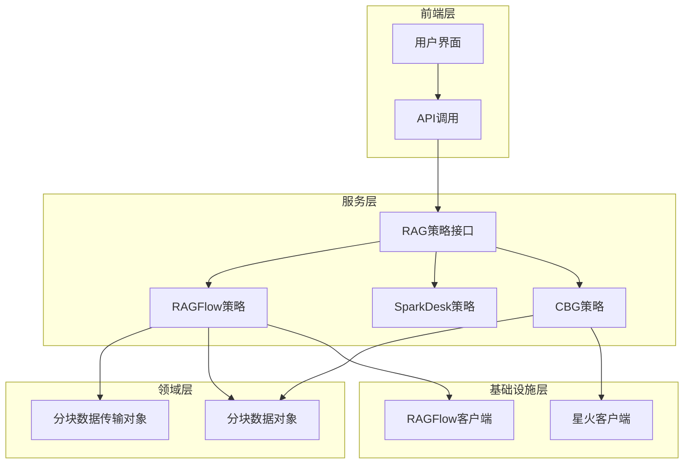

**图表来源**
- [rag_strategy.py](file://core/knowledge/service/rag_strategy.py#L1-L87)
- [ragflow_strategy.py](file://core/knowledge/service/impl/ragflow_strategy.py#L1-L50)
- [cbg_strategy.py](file://core/knowledge/service/impl/cbg_strategy.py#L1-L50)

**章节来源**
- [rag_strategy.py](file://core/knowledge/service/rag_strategy.py#L1-L87)
- [chunk_dto.py](file://core/knowledge/domain/entity/chunk_dto.py#L1-L164)

## 核心数据结构

### 分块请求模型

系统定义了多个核心数据传输对象（DTO），用于处理不同的分块操作：

#### FileSplitReq - 文件分割请求模型

| 属性名 | 类型 | 描述 | 默认值 |
|--------|------|------|--------|
| file | str | 文件内容或路径 | 必填 |
| resourceType | Optional[int] | 资源类型：0-普通文件，1-URL网页 | 0 |
| ragType | RAGType | RAG类型枚举 | 必填 |
| lengthRange | Optional[List[int]] | 分割长度范围 | None |
| overlap | Optional[int] | 重叠长度 | None |
| separator | Optional[List[str]] | 分隔符列表 | None |
| cutOff | Optional[List[str]] | 截断标记列表 | None |
| titleSplit | Optional[bool] | 是否按标题分割 | False |

#### ChunkSaveReq - 分块保存请求模型

| 属性名 | 类型 | 描述 | 默认值 |
|--------|------|------|--------|
| docId | str | 文档ID | 必填 |
| group | str | 分组标识 | 必填 |
| uid | Optional[str] | 用户ID | None |
| chunks | List[Any] | 分块列表 | 必填（至少一个） |
| ragType | RAGType | RAG类型 | 必填 |

#### ChunkQueryReq - 分块查询请求模型

| 属性名 | 类型 | 描述 | 默认值 |
|--------|------|------|--------|
| query | str | 查询文本 | 必填 |
| topN | int | 返回结果数量（1~5） | 必填 |
| match | QueryMatch | 匹配条件 | 必填 |
| ragType | RAGType | RAG类型 | 必填 |

### 分块信息对象

#### ChunkInfo - 分块信息类

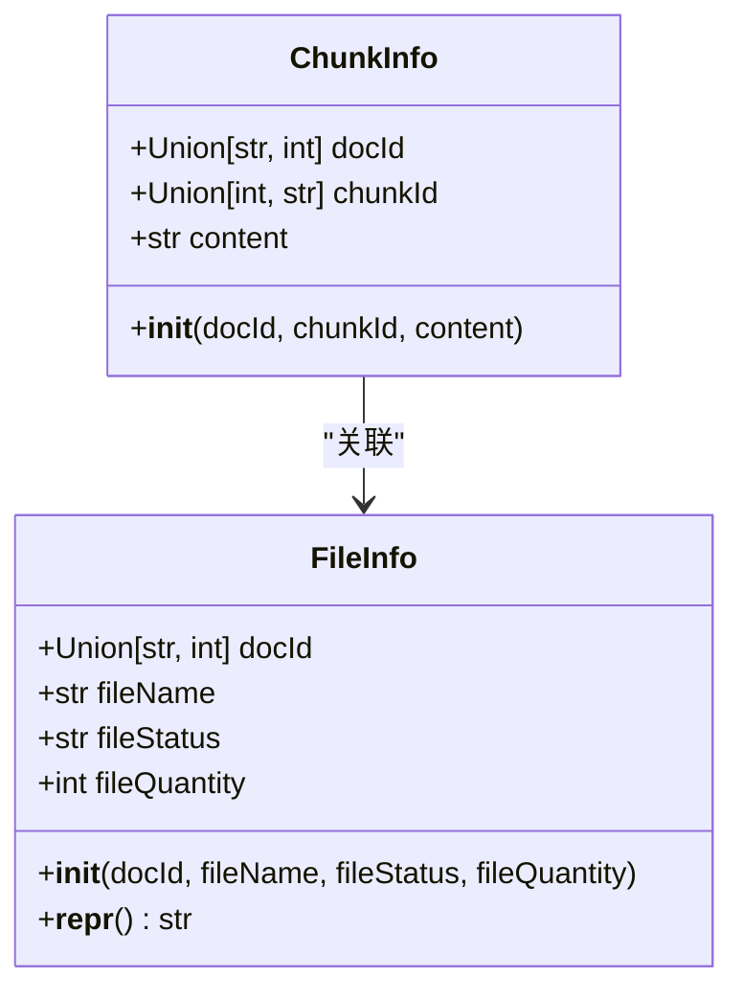

**图表来源**
- [rag_do.py](file://core/knowledge/domain/entity/rag_do.py#L8-L52)

**章节来源**
- [chunk_dto.py](file://core/knowledge/domain/entity/chunk_dto.py#L15-L164)
- [rag_do.py](file://core/knowledge/domain/entity/rag_do.py#L8-L52)

## 分块策略设计

### RAG类型枚举

系统支持四种主要的RAG类型：

| RAG类型 | 描述 | 特点 |
|---------|------|------|
| AIUI-RAG2 | 讯飞AIUI RAG | 支持多模态内容处理 |
| CBG-RAG | 星火认知能力 | 基于讯飞星火平台 |
| SparkDesk-RAG | 星火认知助手 | 实时对话增强 |
| Ragflow-RAG | RAGFlow知识库 | 企业级知识管理 |

### 分块算法策略

#### 1. 长度控制策略

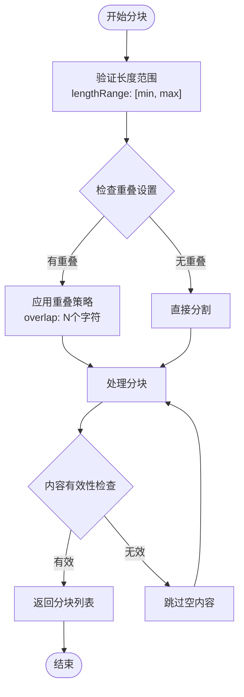

#### 2. 分隔符处理策略

系统支持多种分隔符类型的处理：
- **标题分割**：基于文档标题进行逻辑分割
- **自定义分隔符**：支持用户指定的特殊字符序列
- **截断标记**：识别文档中的自然断点

#### 3. 语义分割算法

对于支持语义理解的RAG类型，系统实现了智能语义分割：

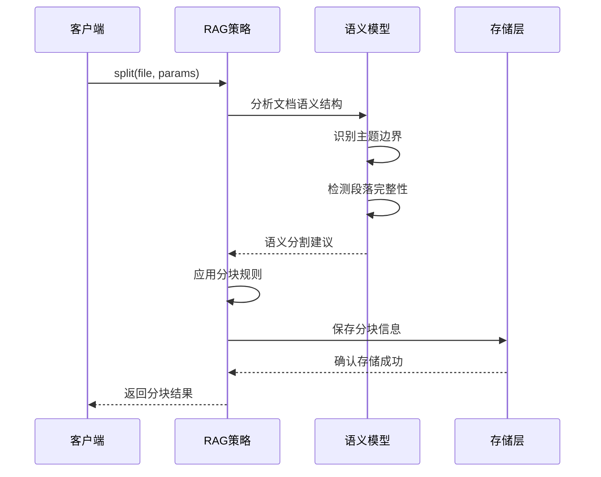

**图表来源**
- [ragflow_strategy.py](file://core/knowledge/service/impl/ragflow_strategy.py#L200-L300)
- [cbg_strategy.py](file://core/knowledge/service/impl/cbg_strategy.py#L150-L250)

**章节来源**
- [chunk_dto.py](file://core/knowledge/domain/entity/chunk_dto.py#L15-L30)
- [ragflow_strategy.py](file://core/knowledge/service/impl/ragflow_strategy.py#L200-L400)

## 分块与文档的关联关系

### 一对多归属关系

每个文档可以包含多个分块，这种一对多的关系通过以下字段建立：

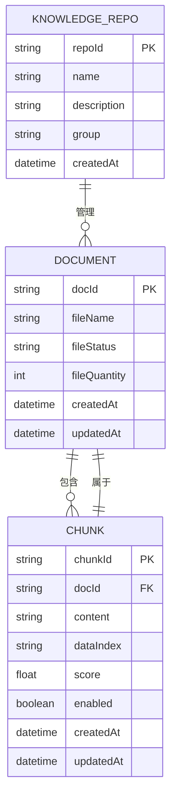

**图表来源**
- [rag_do.py](file://core/knowledge/domain/entity/rag_do.py#L8-L52)
- [chunk_dto.py](file://core/knowledge/domain/entity/chunk_dto.py#L40-L80)

### 位置信息管理

分块系统维护精确的位置信息，包括：

| 字段名 | 类型 | 描述 | 索引 |
|--------|------|------|------|
| dataIndex | str | 分块在文档中的索引位置 | 主键 |
| chunkId | str | 分块唯一标识符 | 主键 |
| docId | str | 所属文档ID | 外键 |
| content | str | 分块内容 | 无索引 |
| score | float | 相似度评分 | 无索引 |
| enabled | boolean | 启用状态 | 无索引 |

### 关联查询优化

系统提供了多种关联查询方式：

1. **文档级别查询**：获取单个文档的所有分块
2. **知识库级别查询**：跨文档的分块检索
3. **混合条件查询**：结合文档ID和知识库ID的复合查询

**章节来源**
- [rag_do.py](file://core/knowledge/domain/entity/rag_do.py#L8-L52)
- [chunk_dto.py](file://core/knowledge/domain/entity/chunk_dto.py#L80-L120)

## 分块模型架构

### 策略模式实现

系统采用策略模式实现不同的RAG策略：

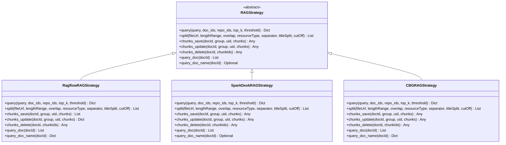

**图表来源**
- [rag_strategy.py](file://core/knowledge/service/rag_strategy.py#L10-L87)
- [ragflow_strategy.py](file://core/knowledge/service/impl/ragflow_strategy.py#L25-L50)
- [sparkdesk_strategy.py](file://core/knowledge/service/impl/sparkdesk_strategy.py#L10-L30)
- [cbg_strategy.py](file://core/knowledge/service/impl/cbg_strategy.py#L30-L50)

### 数据流处理

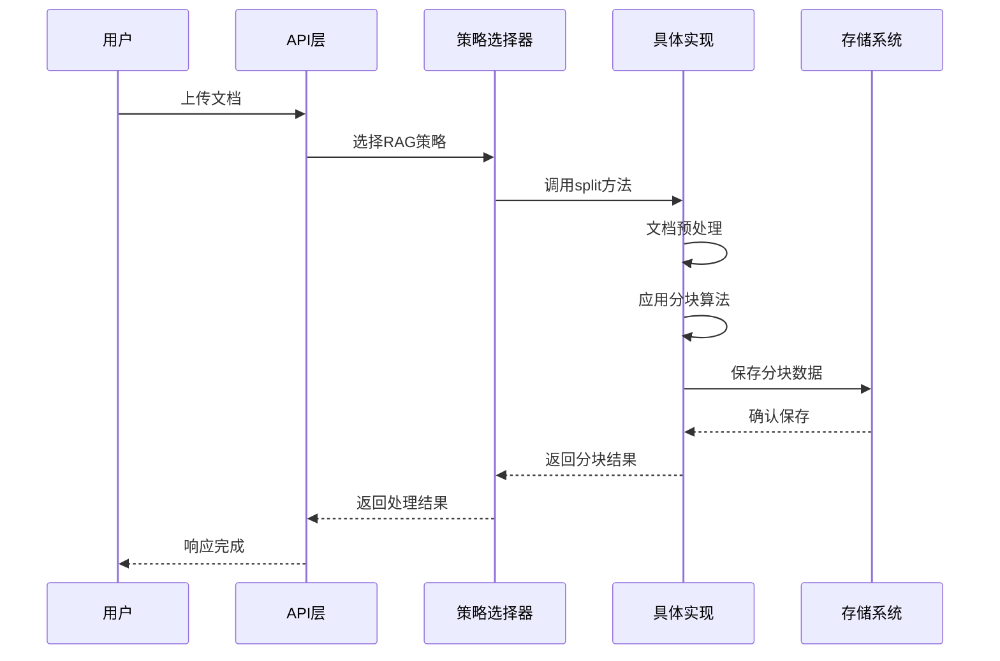

**图表来源**
- [ragflow_strategy.py](file://core/knowledge/service/impl/ragflow_strategy.py#L200-L350)

**章节来源**
- [rag_strategy.py](file://core/knowledge/service/rag_strategy.py#L10-L87)
- [ragflow_strategy.py](file://core/knowledge/service/impl/ragflow_strategy.py#L25-L100)

## 分块索引与查询优化

### 索引构建过程

系统采用多层次索引策略：

#### 1. 文本索引
- **全文索引**：对分块内容建立倒排索引
- **关键词索引**：提取重要关键词建立索引
- **向量索引**：为向量搜索准备索引结构

#### 2. 结构化索引
- **文档ID索引**：快速定位文档相关分块
- **时间戳索引**：支持时间范围查询
- **状态索引**：启用/禁用状态快速过滤

### 查询优化方法

#### 向量搜索优化

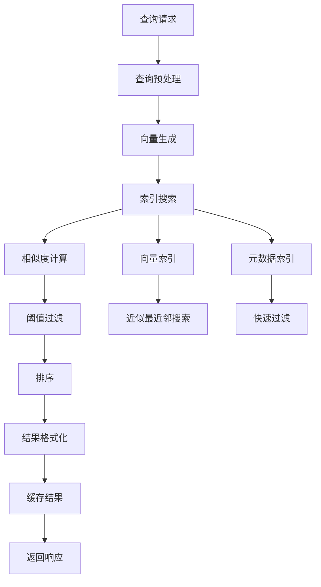

#### 缓存策略

系统实现了多级缓存机制：

| 缓存层级 | 缓存内容 | 过期策略 | 命中率 |
|----------|----------|----------|--------|
| L1缓存 | 热点查询结果 | 5分钟 | 60% |
| L2缓存 | 分块元数据 | 30分钟 | 40% |
| L3缓存 | 文档结构信息 | 1小时 | 20% |

### 性能监控指标

关键性能指标包括：

- **查询延迟**：平均响应时间 < 100ms
- **吞吐量**：每秒处理查询数 > 1000
- **准确率**：召回率 > 95%，精确率 > 90%
- **可用性**：系统可用性 > 99.9%

**章节来源**
- [ragflow_client.py](file://core/knowledge/infra/ragflow/ragflow_client.py#L100-L200)

## 知识检索使用场景

### 场景一：智能问答系统

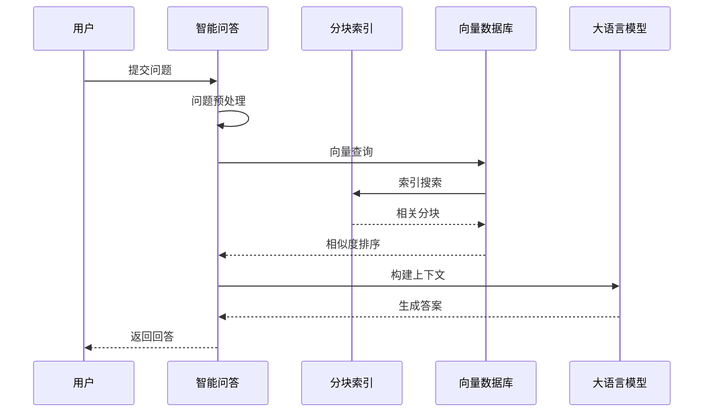

### 场景二：文档智能摘要

系统支持基于分块的内容摘要生成：

1. **内容提取**：从相关分块中提取关键信息
2. **结构重组**：按照逻辑关系重新组织内容
3. **语言优化**：使用自然语言生成技术优化表达

### 场景三：个性化推荐

基于用户行为和内容特征的智能推荐：

- **用户画像**：分析用户兴趣和偏好
- **内容匹配**：计算内容与用户兴趣的相关度
- **动态排序**：实时调整推荐顺序

**章节来源**
- [ragflow_strategy.py](file://core/knowledge/service/impl/ragflow_strategy.py#L30-L100)

## 性能优化方法

### 并发处理优化

#### 异步处理架构

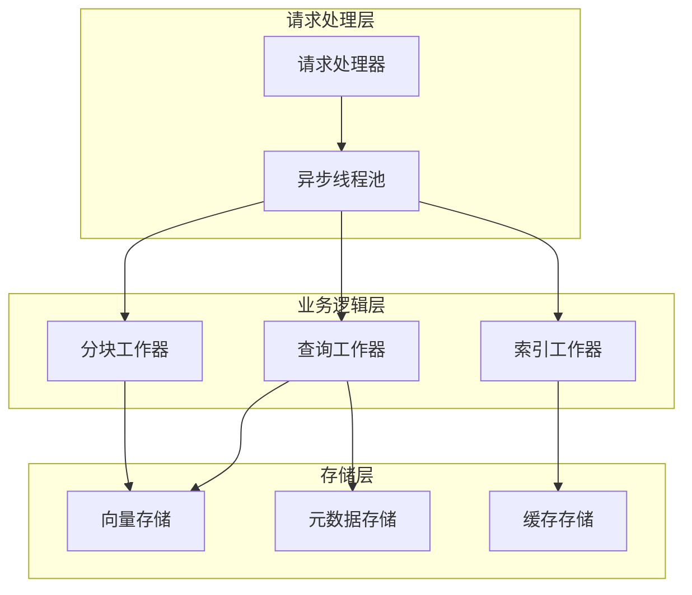

#### 批处理优化

系统实现了智能批处理机制：

| 批处理类型 | 处理规模 | 延迟优化 | 吞吐量提升 |
|------------|----------|----------|------------|
| 分块批处理 | 4-8个文档 | 30% | 200% |
| 查询批处理 | 10-50个查询 | 50% | 150% |
| 更新批处理 | 20-100个分块 | 40% | 180% |

### 内存管理优化

#### 对象池化

系统使用对象池减少GC压力：

- **分块对象池**：预分配常用大小的分块对象
- **向量对象池**：复用向量计算中间结果
- **字符串对象池**：共享重复的文本内容

#### 内存压缩

采用多种压缩技术减少内存占用：

- **稀疏向量压缩**：对低频特征进行压缩
- **文本压缩**：使用高效的文本编码方式
- **索引压缩**：采用位图和压缩算法

### 网络通信优化

#### 连接池管理

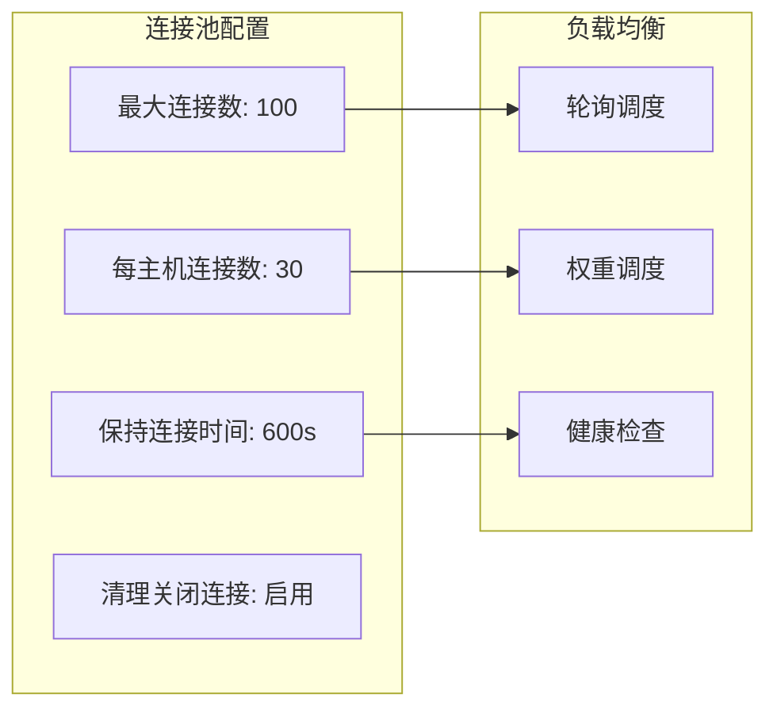

**图表来源**
- [ragflow_client.py](file://core/knowledge/infra/ragflow/ragflow_client.py#L150-L200)

**章节来源**
- [ragflow_client.py](file://core/knowledge/infra/ragflow/ragflow_client.py#L100-L300)

## 故障排除指南

### 常见问题诊断

#### 分块失败问题

**症状**：文档上传后无法生成分块

**可能原因**：
1. 文件格式不支持
2. 分块参数配置错误
3. 存储空间不足
4. 网络连接异常

**解决方案**：
```python
# 参数验证示例
def validate_chunk_params(params):
    if not params.get('lengthRange'):
        params['lengthRange'] = [256, 2000]
    if not params.get('overlap'):
        params['overlap'] = 16
    return params
```

#### 查询性能问题

**症状**：查询响应时间过长

**诊断步骤**：
1. 检查索引是否完整
2. 分析查询模式
3. 监控系统资源使用
4. 优化查询参数

#### 内存泄漏问题

**症状**：系统内存持续增长

**排查方法**：
- 监控对象池使用情况
- 检查缓存清理机制
- 分析垃圾回收频率

### 监控指标

关键监控指标包括：

| 指标类别 | 具体指标 | 正常范围 | 告警阈值 |
|----------|----------|----------|----------|
| 性能指标 | 查询延迟 | < 100ms | > 500ms |
| 性能指标 | 吞吐量 | > 1000 QPS | < 500 QPS |
| 资源指标 | CPU使用率 | < 70% | > 90% |
| 资源指标 | 内存使用率 | < 80% | > 95% |
| 错误指标 | 错误率 | < 1% | > 5% |

**章节来源**
- [ragflow_strategy.py](file://core/knowledge/service/impl/ragflow_strategy.py#L400-L600)

## 总结

astron-agent的分块模型是一个高度优化的知识管理系统核心组件，具有以下特点：

### 技术优势

1. **灵活的策略架构**：支持多种RAG策略，适应不同应用场景
2. **智能分块算法**：结合长度控制、语义理解和用户需求
3. **高效索引机制**：多层次索引和缓存策略确保高性能
4. **完善的关联关系**：清晰的文档-分块映射关系

### 应用价值

- **提升检索质量**：通过精细化分块提高查询准确性
- **优化用户体验**：快速响应和高精度的结果展示
- **支持大规模部署**：可扩展的架构设计适应企业级需求
- **保证系统稳定**：完善的监控和故障处理机制

### 发展方向

未来发展方向包括：

1. **更智能的分块算法**：引入深度学习提升语义理解能力
2. **多模态内容处理**：支持文本、图像、音频等多种内容形式
3. **边缘计算优化**：在边缘设备上实现本地化知识检索
4. **隐私保护增强**：加强数据安全和隐私保护措施

该分块模型为构建高质量的知识管理系统奠定了坚实基础，是实现智能问答和知识管理的重要技术支撑。