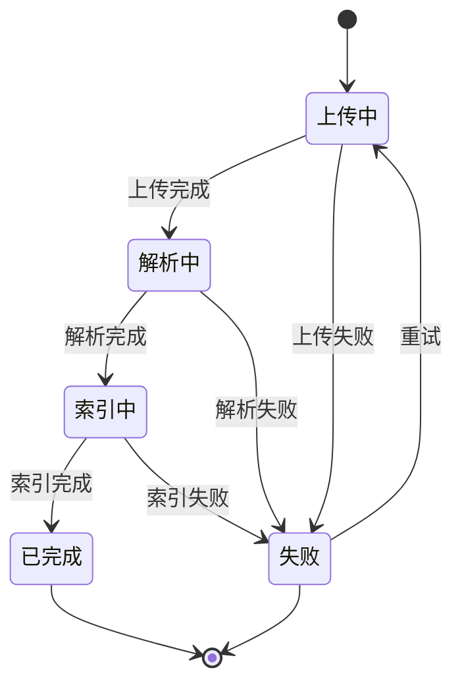
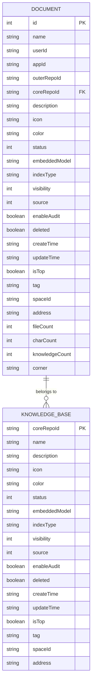
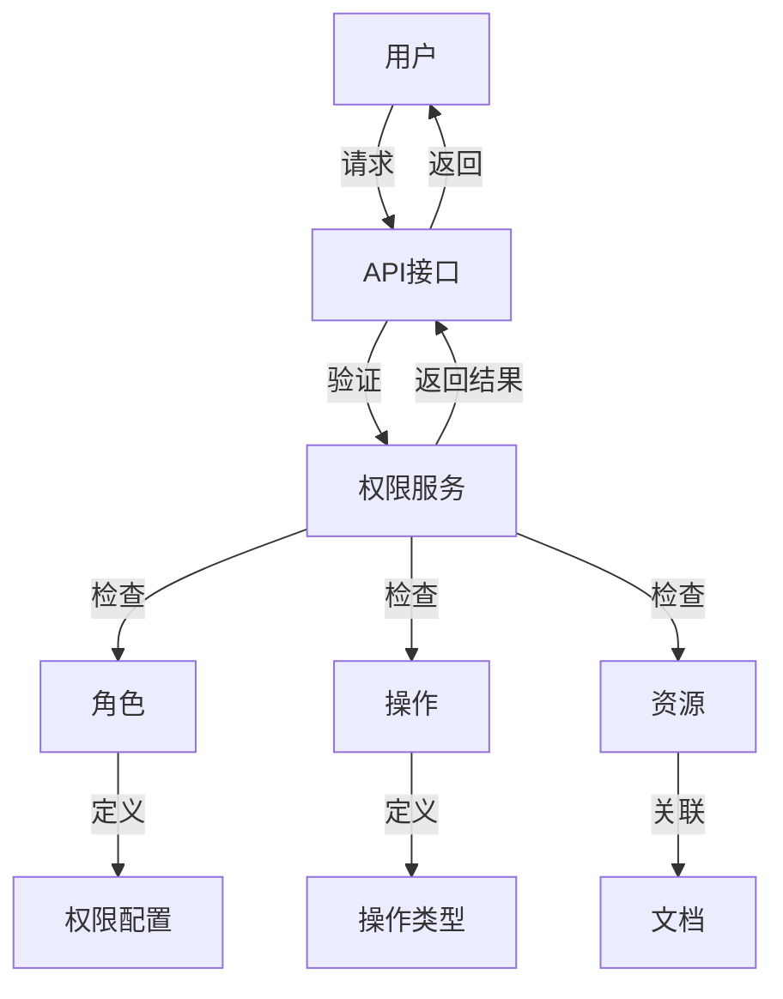

# 文档模型

<cite>
**本文档中引用的文件**  
- [rag_do.py](file://core/knowledge/domain/entity/rag_do.py)
- [api.py](file://core/knowledge/api/v1/api.py)
- [ragflow_strategy.py](file://core/knowledge/service/impl/ragflow_strategy.py)
- [resource.ts](file://console/frontend/src/types/resource.ts)
- [knowledge.py](file://core/agent/service/plugin/knowledge.py)
</cite>

## 目录
1. [引言](#引言)
2. [文档元数据结构](#文档元数据结构)
3. [文档状态机设计](#文档状态机设计)
4. [文档与知识库的关联关系](#文档与知识库的关联关系)
5. [文档模型ER图](#文档模型er图)
6. [文档访问控制策略](#文档访问控制策略)
7. [文档模型使用场景](#文档模型使用场景)
8. [性能优化方法](#性能优化方法)
9. [结论](#结论)

## 引言
本文档详细描述了知识库文档模型的设计与实现，重点分析了文档实体的定义、元数据结构、状态机设计、与知识库的关联关系、访问控制策略以及在知识服务中的使用场景和性能优化方法。文档模型是知识库系统的核心组成部分，负责管理文档的生命周期、元数据、权限和访问控制。

## 文档元数据结构
知识库文档模型的元数据结构包括文档ID、名称、类型、创建者、创建时间、更新时间、状态等属性。这些属性在前端和后端代码中都有定义和使用。

文档元数据结构的主要属性包括：
- **id**: 文档唯一标识符，整数类型
- **name**: 文档名称，字符串类型
- **userId**: 创建者ID，字符串类型
- **appId**: 应用ID，可为空的字符串类型
- **outerRepoId**: 外部知识库ID，字符串类型
- **coreRepoId**: 核心知识库ID，字符串类型
- **description**: 文档描述，字符串类型
- **icon**: 图标，字符串类型
- **color**: 颜色，可为空的字符串类型
- **status**: 状态，整数类型
- **embeddedModel**: 嵌入模型，可为空的字符串类型
- **indexType**: 索引类型，可为空的字符串类型
- **visibility**: 可见性，整数类型
- **source**: 来源，整数类型
- **enableAudit**: 是否启用审核，布尔类型
- **deleted**: 是否已删除，布尔类型
- **createTime**: 创建时间，字符串类型（ISO格式）
- **updateTime**: 更新时间，字符串类型（ISO格式）
- **isTop**: 是否置顶，布尔类型
- **tag**: 标签，字符串类型
- **spaceId**: 空间ID，可为空的字符串类型
- **address**: 地址，字符串类型
- **tagDtoList**: 标签列表，TagDto对象数组
- **bots**: 关联的应用列表，对象数组
- **fileCount**: 文件数量，整数类型
- **charCount**: 字符数量，整数类型
- **knowledgeCount**: 知识点数量，可为空的整数类型
- **corner**: 角标，字符串类型

**Section sources**
- [resource.ts](file://console/frontend/src/types/resource.ts#L97-L157)

## 文档状态机设计
文档状态机设计涵盖了文档从上传到索引完成的整个生命周期。文档的状态通过整数类型表示，不同的状态值代表文档在处理流程中的不同阶段。

文档状态机的主要状态包括：
- **上传中**: 文档正在上传到服务器
- **解析中**: 文档正在被解析和分块
- **索引中**: 文档内容正在被向量化和索引
- **已完成**: 文档处理完成，可以用于检索
- **失败**: 文档处理过程中出现错误

文档状态机的转换流程如下：
1. 当用户上传文档时，文档状态设置为"上传中"
2. 上传完成后，系统开始解析文档，状态变为"解析中"
3. 解析完成后，系统开始对文档内容进行向量化和索引，状态变为"索引中"
4. 索引完成后，文档状态变为"已完成"，可以用于检索
5. 如果在任何阶段出现错误，文档状态变为"失败"

文档状态的管理通过后端服务实现，前端通过API接口查询文档状态。状态查询接口会返回文档的当前状态和处理进度。

**Diagram sources**
- [ragflow_strategy.py](file://core/knowledge/service/impl/ragflow_strategy.py#L200-L300)
- [api.py](file://core/knowledge/api/v1/api.py#L200-L300)

## 文档与知识库的关联关系
文档与知识库之间存在一对多的归属关系。一个知识库可以包含多个文档，但每个文档只能属于一个知识库。

这种关联关系通过文档元数据中的`coreRepoId`属性实现，该属性存储了文档所属知识库的ID。在数据库层面，这通常通过外键约束来实现，确保文档的`coreRepoId`必须引用存在的知识库记录。

文档与知识库的关联关系具有以下特点：
- **归属关系**: 每个文档必须归属于一个知识库，不能独立存在
- **权限继承**: 文档的访问权限继承自其所属的知识库
- **生命周期管理**: 知识库的删除操作会级联删除其包含的所有文档
- **批量操作**: 可以对知识库中的所有文档进行批量操作，如批量索引、批量删除等

在前端界面中，用户可以通过知识库的文档管理页面查看和管理其包含的所有文档。文档列表会显示每个文档的名称、状态、创建时间等信息，并提供上传新文档、删除文档、查看文档详情等操作。

**Section sources**
- [resource.ts](file://console/frontend/src/types/resource.ts#L97-L157)
- [rag_do.py](file://core/knowledge/domain/entity/rag_do.py#L1-L53)

## 文档模型ER图
文档模型的实体关系图（ER图）展示了文档实体的属性、主键、外键和索引。

**Diagram sources**
- [resource.ts](file://console/frontend/src/types/resource.ts#L97-L157)
- [rag_do.py](file://core/knowledge/domain/entity/rag_do.py#L1-L53)

## 文档访问控制策略
文档访问控制策略和权限管理机制确保只有授权用户才能访问和操作文档。权限管理基于角色和操作类型，实现了细粒度的访问控制。

文档访问控制策略的主要特点包括：
- **基于角色的访问控制（RBAC）**: 系统定义了不同的用户角色，如超级管理员、所有者、管理员、成员等，每个角色具有不同的权限
- **操作权限**: 定义了查看、创建、编辑、删除、发布、使用、管理等操作权限
- **资源所有者**: 每个文档都有明确的创建者（所有者），所有者具有对该文档的完全控制权
- **权限检查**: 在执行任何文档操作前，系统会检查当前用户是否具有相应的权限

权限管理机制通过前端和后端协同实现：
- **前端权限控制**: 前端界面根据用户权限动态显示或隐藏操作按钮，如只有管理员才能看到删除按钮
- **后端权限验证**: 后端API接口在处理请求前验证用户权限，拒绝未经授权的访问
- **权限配置**: 权限配置信息存储在系统配置中，可以灵活调整不同角色的权限

**Diagram sources**
- [resource.ts](file://console/frontend/src/types/resource.ts#L35-L87)
- [knowledge.py](file://core/agent/service/plugin/knowledge.py#L1-L100)

## 文档模型使用场景
文档模型在知识服务中有多种使用场景，主要包括：

### 文档上传与管理
用户可以通过界面上传各种类型的文档（如PDF、Word、HTML等），系统会自动解析文档内容并进行分块处理。上传完成后，用户可以在文档管理页面查看文档的处理状态、编辑文档信息、删除文档等。

### 知识检索
文档经过索引后，可以用于知识检索。用户输入查询内容，系统会从知识库中检索相关的文档块，并返回最相关的结果。检索结果可以用于问答系统、智能助手等应用场景。

### 文档审核
系统支持文档审核功能，可以对文档内容进行合规性检查。审核结果会标记在文档上，管理员可以根据审核结果决定是否启用该文档。

### 知识库构建
多个文档可以组成一个知识库，用于特定领域的知识管理。知识库可以被多个应用共享使用，提高知识的复用率。

### 数据分析
系统可以统计文档的各种指标，如文档数量、字符数量、知识点数量等，为知识库的管理和优化提供数据支持。

**Section sources**
- [api.py](file://core/knowledge/api/v1/api.py#L1-L500)
- [ragflow_strategy.py](file://core/knowledge/service/impl/ragflow_strategy.py#L1-L1000)

## 性能优化方法
为了提高文档模型的性能，系统采用了多种优化方法，包括查询优化和缓存策略。

### 查询优化
- **索引优化**: 为文档的关键字段（如ID、名称、状态等）创建数据库索引，提高查询效率
- **分页查询**: 对于大量文档的查询，采用分页方式，避免一次性加载过多数据
- **批量操作**: 对于需要处理多个文档的操作，采用批量方式，减少数据库交互次数

### 缓存策略
- **文档元数据缓存**: 将常用的文档元数据缓存到Redis中，减少数据库查询
- **查询结果缓存**: 对于频繁的查询操作，缓存查询结果，提高响应速度
- **分布式缓存**: 使用分布式缓存系统，支持高并发访问

### 异步处理
- **异步任务**: 文档的解析、索引等耗时操作采用异步任务处理，避免阻塞主线程
- **消息队列**: 使用消息队列（如Kafka）管理异步任务，确保任务的可靠执行

### 资源管理
- **连接池**: 使用数据库连接池，提高数据库连接的复用率
- **资源监控**: 监控文档处理过程中的资源使用情况，及时发现和解决性能瓶颈

**Section sources**
- [ragflow_strategy.py](file://core/knowledge/service/impl/ragflow_strategy.py#L1-L1000)
- [api.py](file://core/knowledge/api/v1/api.py#L1-L500)

## 结论
本文档详细描述了知识库文档模型的设计与实现。文档模型通过完善的元数据结构、状态机设计、关联关系、访问控制策略和性能优化方法，为知识库系统提供了可靠的基础支持。文档模型的设计考虑了实际使用场景和性能要求，能够满足大规模知识管理的需求。未来可以进一步优化文档的分块算法、提高索引效率、增强权限管理的灵活性，以适应更复杂的应用场景。