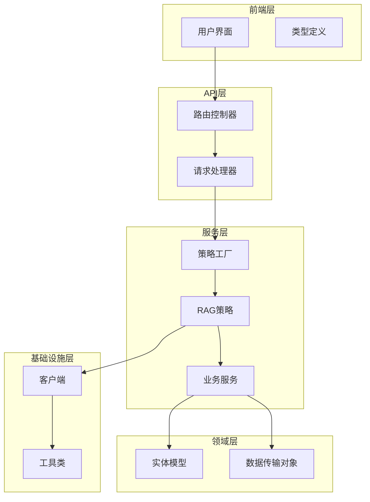
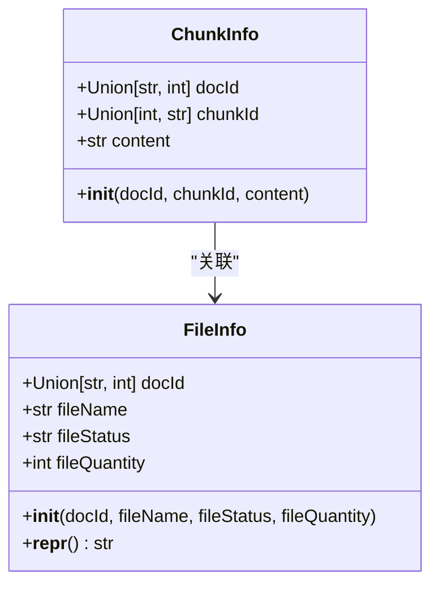
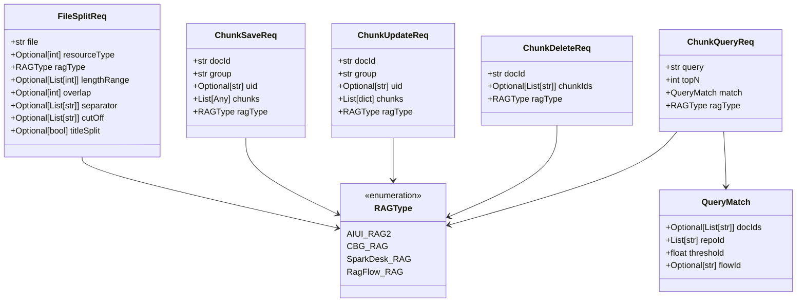
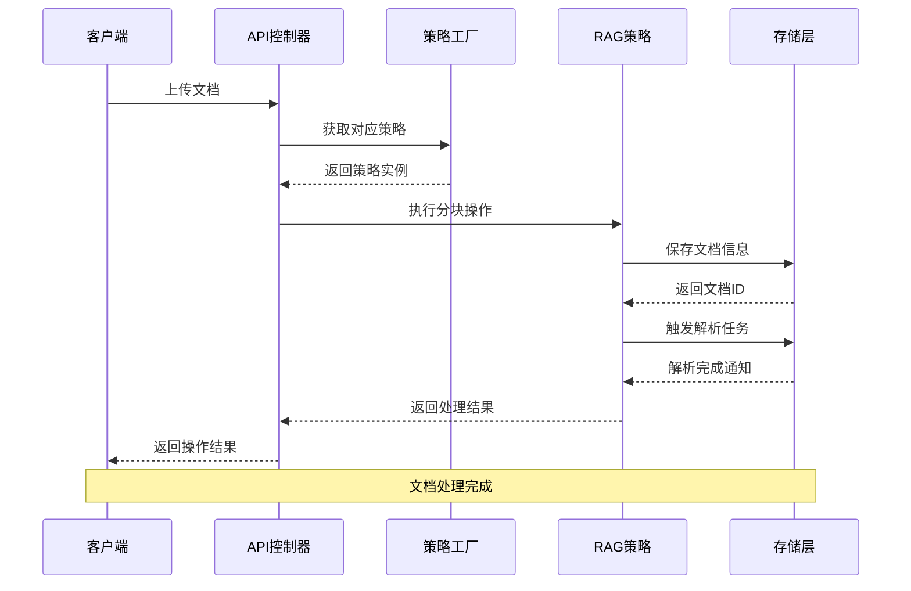
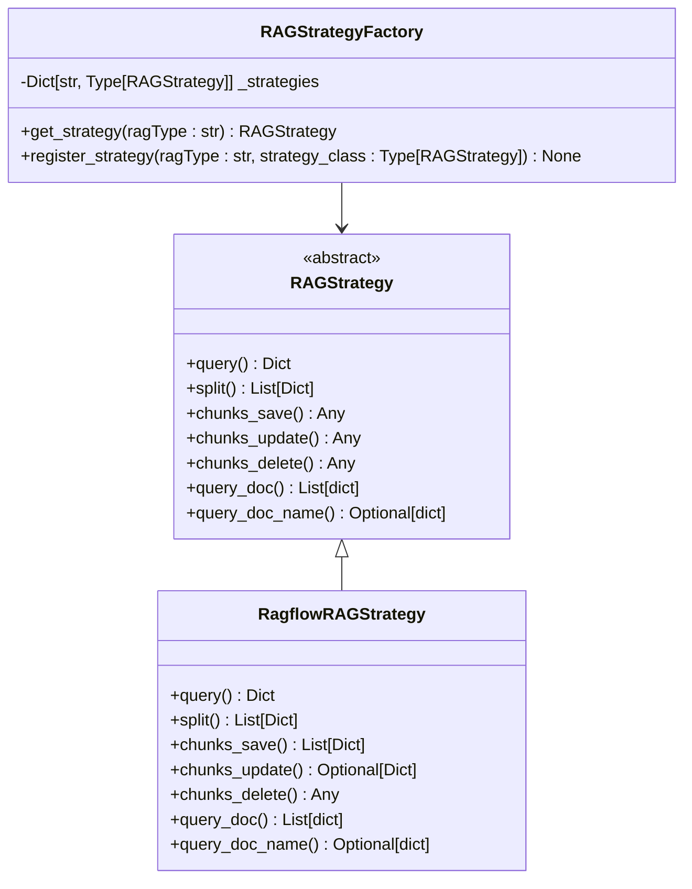
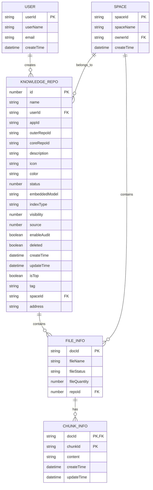
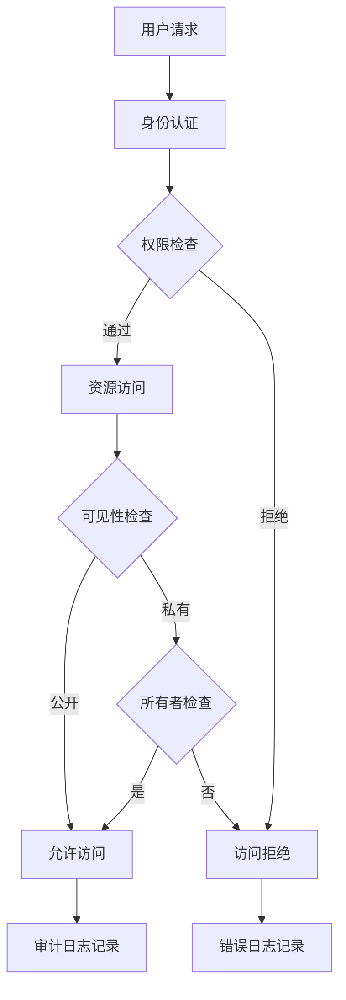
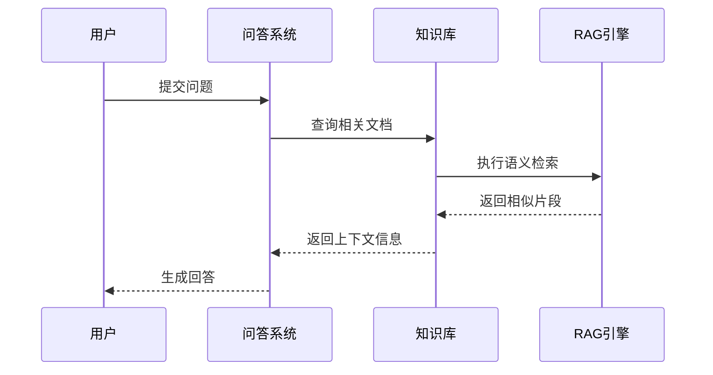
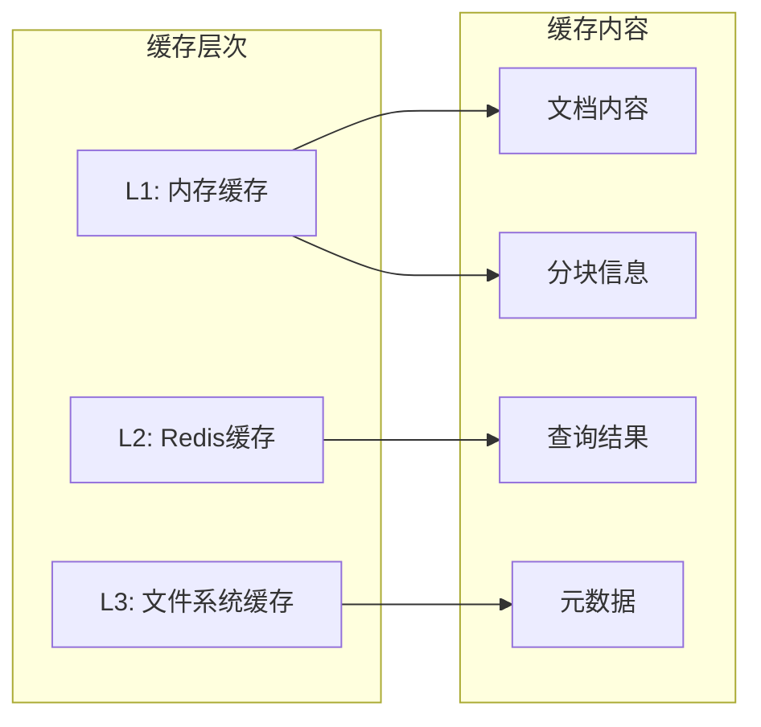
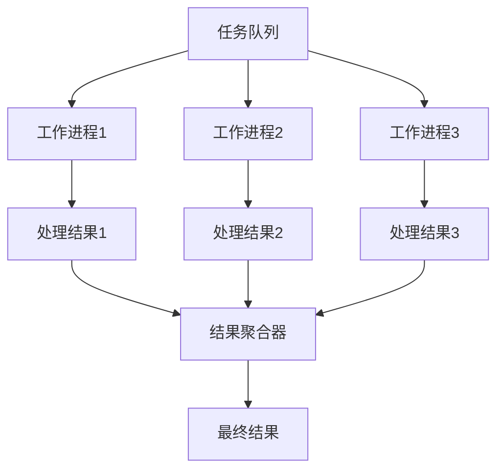

# 知识库模型详细文档

<cite>
**本文档引用的文件**
- [rag_do.py](file://core/knowledge/domain/entity/rag_do.py)
- [chunk_dto.py](file://core/knowledge/domain/entity/chunk_dto.py)
- [api.py](file://core/knowledge/api/v1/api.py)
- [rag_strategy.py](file://core/knowledge/service/rag_strategy.py)
- [rag_strategy_factory.py](file://core/knowledge/service/rag_strategy_factory.py)
- [ragflow_strategy.py](file://core/knowledge/service/impl/ragflow_strategy.py)
- [ragflow_client.py](file://core/knowledge/infra/ragflow/ragflow_client.py)
- [constants.py](file://core/knowledge/consts/constants.py)
- [resource.ts](file://console/frontend/src/types/resource.ts)
</cite>

## 目录
1. [简介](#简介)
2. [项目结构概览](#项目结构概览)
3. [核心实体模型](#核心实体模型)
4. [知识库文档元数据结构](#知识库文档元数据结构)
5. [文档分块模型设计](#文档分块模型设计)
6. [知识库文档生命周期管理](#知识库文档生命周期管理)
7. [知识库模型架构图](#知识库模型架构图)
8. [访问控制与权限管理](#访问控制与权限管理)
9. [知识库模型使用场景](#知识库模型使用场景)
10. [性能优化方法](#性能优化方法)
11. [总结](#总结)

## 简介

本文档详细分析了astron-agent知识库系统的核心模型设计，重点关注`rag_do.py`中的实体定义。该知识库系统采用RAG（Retrieval-Augmented Generation）技术，提供了完整的文档处理、存储、检索和管理功能。系统支持多种RAG策略，包括RAGFlow、AIUI、SparkDesk等，并实现了统一的接口抽象。

## 项目结构概览

知识库模块采用分层架构设计，包含以下主要层次：

**图表来源**
- [api.py](file://core/knowledge/api/v1/api.py#L1-L50)
- [rag_strategy_factory.py](file://core/knowledge/service/rag_strategy_factory.py#L1-L30)

## 核心实体模型

知识库系统的核心实体模型定义在`rag_do.py`中，主要包括两个关键类：

### ChunkInfo类

`ChunkInfo`类表示文档分块的基本信息，是知识库中最基础的数据结构之一。

**图表来源**
- [rag_do.py](file://core/knowledge/domain/entity/rag_do.py#L8-L25)
- [rag_do.py](file://core/knowledge/domain/entity/rag_do.py#L28-L52)

### FileInfo类

`FileInfo`类封装了文件的基本信息，支持文档级别的元数据管理。

**节来源**
- [rag_do.py](file://core/knowledge/domain/entity/rag_do.py#L8-L52)

## 知识库文档元数据结构

知识库文档的元数据结构通过前端类型定义和后端实体模型共同定义，形成了完整的文档信息体系。

### 文档基本信息

| 属性名 | 类型 | 描述 | 必填 |
|--------|------|------|------|
| id | number | 文档唯一标识符 | 是 |
| name | string | 文档名称 | 是 |
| userId | string | 创建者用户ID | 是 |
| appId | string \| null | 应用程序ID | 否 |
| outerRepoId | string | 外部知识库ID | 是 |
| coreRepoId | string | 核心知识库ID | 是 |
| description | string | 文档描述 | 否 |
| icon | string | 图标路径 | 否 |
| color | string \| null | 主题颜色 | 否 |
| status | number | 文档状态 | 是 |
| embeddedModel | string \| null | 嵌入模型 | 否 |
| indexType | string \| null | 索引类型 | 否 |
| visibility | number | 可见性设置 | 是 |
| source | number | 数据源类型 | 是 |
| enableAudit | boolean | 是否启用审核 | 是 |
| deleted | boolean | 是否已删除 | 是 |
| createTime | string | 创建时间 | 是 |
| updateTime | string | 更新时间 | 是 |
| isTop | boolean | 是否置顶 | 是 |
| tag | string | 标签 | 是 |
| spaceId | string \| null | 空间ID | 否 |
| address | string | 存储地址 | 是 |

### 文档统计信息

| 属性名 | 类型 | 描述 |
|--------|------|------|
| fileCount | number | 文件数量 |
| charCount | number | 字符总数 |
| knowledgeCount | number \| null | 知识点数量 |
| corner | string | 角色标识 |

**节来源**
- [resource.ts](file://console/frontend/src/types/resource.ts#L97-L157)

## 文档分块模型设计

文档分块模型通过`chunk_dto.py`中的多个DTO类实现，支持复杂的分块操作和查询需求。

### 分块策略枚举

**图表来源**
- [chunk_dto.py](file://core/knowledge/domain/entity/chunk_dto.py#L15-L25)
- [chunk_dto.py](file://core/knowledge/domain/entity/chunk_dto.py#L28-L50)
- [chunk_dto.py](file://core/knowledge/domain/entity/chunk_dto.py#L53-L75)
- [chunk_dto.py](file://core/knowledge/domain/entity/chunk_dto.py#L78-L100)
- [chunk_dto.py](file://core/knowledge/domain/entity/chunk_dto.py#L103-L125)
- [chunk_dto.py](file://core/knowledge/domain/entity/chunk_dto.py#L128-L150)

### 分块参数配置

分块策略支持丰富的配置选项：

| 参数名 | 类型 | 默认值 | 描述 |
|--------|------|--------|------|
| lengthRange | List[int] | [256, 1024] | 分块长度范围 |
| overlap | int | 16 | 分块重叠长度 |
| separator | List[str] | null | 分隔符列表 |
| cutOff | List[str] | null | 截断标记 |
| titleSplit | bool | false | 是否按标题分割 |
| resourceType | int | 0 | 资源类型（0-文件，1-URL） |

**节来源**
- [chunk_dto.py](file://core/knowledge/domain/entity/chunk_dto.py#L28-L50)

## 知识库文档生命周期管理

知识库文档的生命周期管理通过统一的RAG策略模式实现，支持完整的CRUD操作。

### 生命周期流程

**图表来源**
- [api.py](file://core/knowledge/api/v1/api.py#L150-L200)
- [rag_strategy_factory.py](file://core/knowledge/service/rag_strategy_factory.py#L25-L50)

### 核心操作接口

RAG策略基类定义了标准的操作接口：

| 方法名 | 参数 | 返回值 | 描述 |
|--------|------|--------|------|
| query | query, doc_ids, repo_ids, top_k, threshold | Dict | 执行查询操作 |
| split | fileUrl, lengthRange, overlap, resourceType, separator, titleSplit, cutOff | List[Dict] | 文件分块操作 |
| chunks_save | docId, group, uid, chunks | Any | 保存知识分块 |
| chunks_update | docId, group, uid, chunks | Any | 更新知识分块 |
| chunks_delete | docId, chunkIds | Any | 删除知识分块 |
| query_doc | docId | List[dict] | 查询文档信息 |
| query_doc_name | docId | Optional[dict] | 查询文档名称 |

**节来源**
- [rag_strategy.py](file://core/knowledge/service/rag_strategy.py#L15-L85)

### RAG策略工厂

策略工厂负责根据RAG类型创建相应的策略实例：

**图表来源**
- [rag_strategy_factory.py](file://core/knowledge/service/rag_strategy_factory.py#L15-L40)
- [rag_strategy.py](file://core/knowledge/service/rag_strategy.py#L10-L85)

**节来源**
- [rag_strategy_factory.py](file://core/knowledge/service/rag_strategy_factory.py#L15-L94)

## 知识库模型架构图

以下是知识库系统的完整ER图，展示了各实体之间的关系：

**图表来源**
- [resource.ts](file://console/frontend/src/types/resource.ts#L97-L157)
- [rag_do.py](file://core/knowledge/domain/entity/rag_do.py#L8-L52)

## 访问控制与权限管理

知识库系统实现了多层次的访问控制机制：

### 权限级别

| 权限级别 | 描述 | 操作范围 |
|----------|------|----------|
| 租户管理员 | 全局管理权限 | 所有知识库、文档 |
| 空间管理员 | 空间内管理权限 | 本空间所有资源 |
| 空间成员 | 协作权限 | 本空间可访问资源 |
| 只读用户 | 查看权限 | 可访问的只读资源 |

### 访问控制策略

### 审计功能

系统内置完整的审计功能，记录所有关键操作：

- 文档上传和下载
- 知识分块编辑
- 查询操作记录
- 权限变更历史
- 系统配置修改

**节来源**
- [resource.ts](file://console/frontend/src/types/resource.ts#L97-L157)

## 知识库模型使用场景

### 场景一：智能问答系统

### 场景二：文档智能分析

系统支持对上传的文档进行智能分析和处理：

- 自动分块和索引
- 关键词提取和标签化
- 内容质量评估
- 相关性分析

### 场景三：知识图谱构建

基于文档内容自动构建知识图谱：

- 实体识别和抽取
- 关系映射和验证
- 知识点关联分析
- 推理和扩展

## 性能优化方法

### 缓存策略

系统实现了多层缓存机制：

### 异步处理

对于耗时操作，系统采用异步处理模式：

- 文档解析异步执行
- 知识分块批量处理
- 查询结果预计算
- 索引更新后台运行

### 并行处理

### 数据库优化

- 索引优化：为常用查询字段建立索引
- 连接池管理：合理配置数据库连接池
- 查询优化：避免N+1查询问题
- 分片策略：大数据量时采用分片存储

**节来源**
- [ragflow_client.py](file://core/knowledge/infra/ragflow/ragflow_client.py#L100-L150)

## 总结

astron-agent的知识库模型设计体现了现代知识管理系统的核心特征：

1. **模块化架构**：清晰的分层设计，便于维护和扩展
2. **策略模式应用**：支持多种RAG技术的无缝切换
3. **统一接口抽象**：简化了不同技术栈的集成复杂度
4. **完善的生命周期管理**：从上传到删除的全流程覆盖
5. **强大的扩展性**：支持自定义策略和插件机制
6. **高性能设计**：多层缓存和异步处理确保系统响应速度

该知识库模型不仅满足了当前的功能需求，还为未来的功能扩展和技术演进奠定了坚实的基础。通过合理的架构设计和性能优化，系统能够支撑大规模的知识管理和智能检索需求。