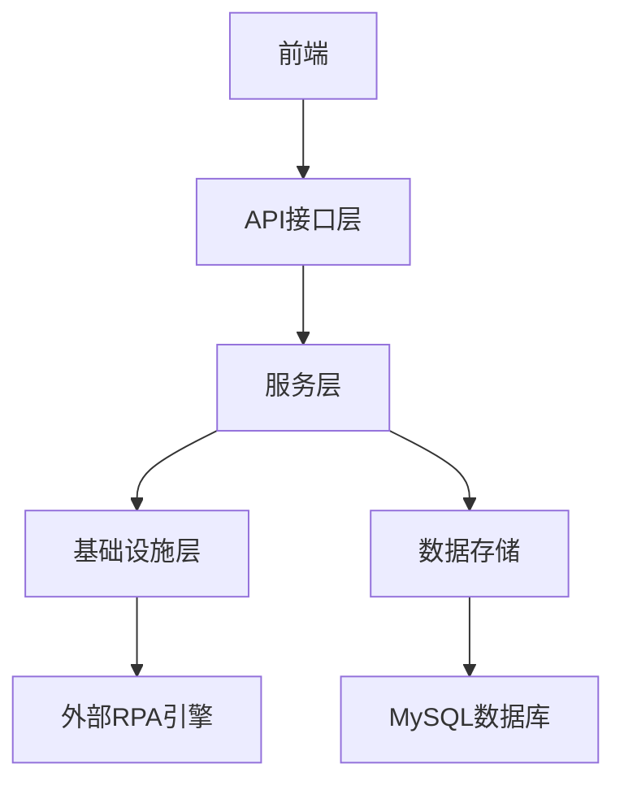
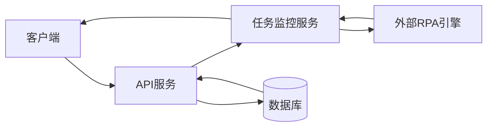
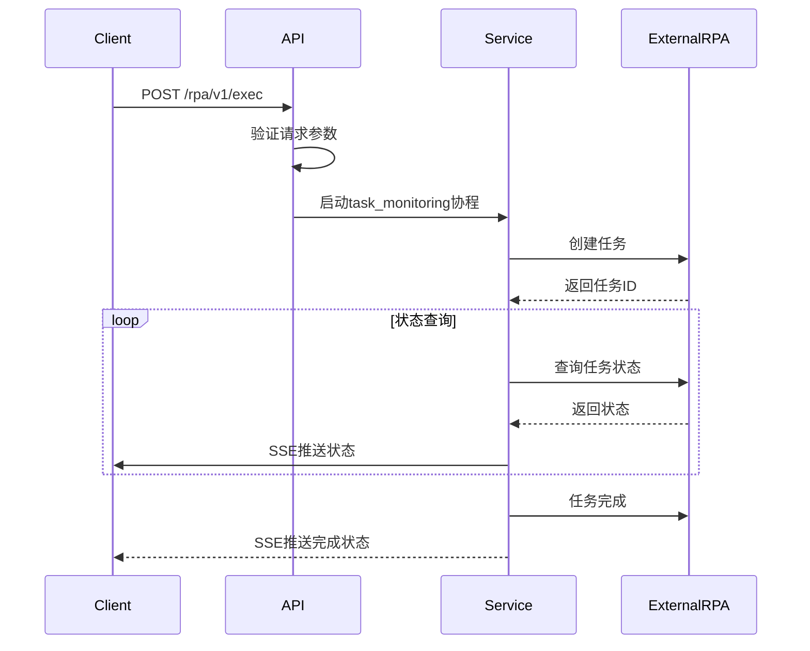
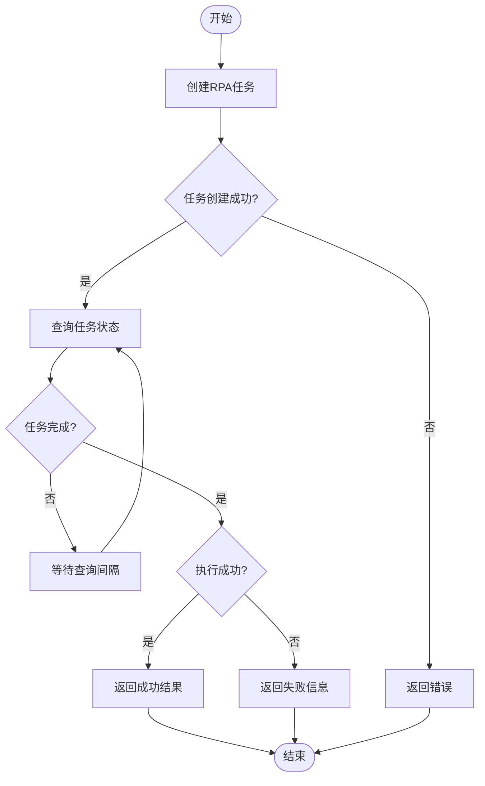
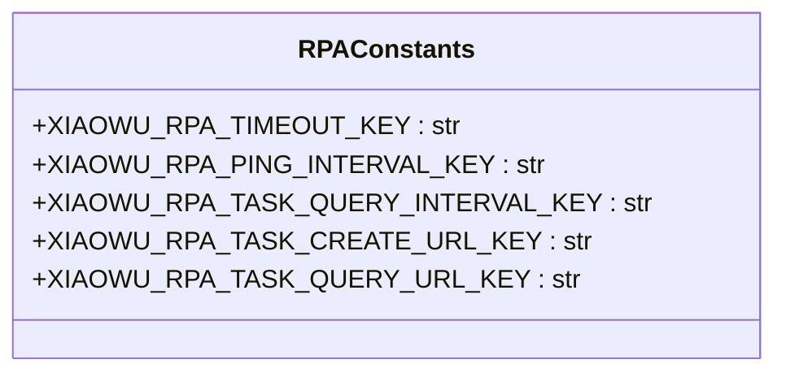
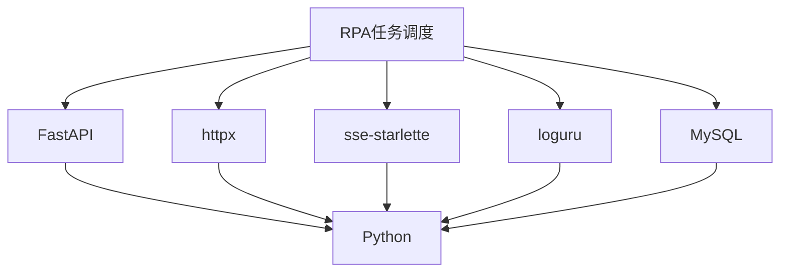

# RPA任务调度

<cite>
**本文档引用的文件**
- [main.py](file://core/plugin/rpa/main.py)
- [app.py](file://core/plugin/rpa/api/app.py)
- [router.py](file://core/plugin/rpa/api/router.py)
- [execution.py](file://core/plugin/rpa/api/v1/execution.py)
- [tasks.py](file://core/plugin/rpa/infra/xiaowu/tasks.py)
- [process.py](file://core/plugin/rpa/service/xiaowu/process.py)
- [rpa_keys.py](file://core/plugin/rpa/consts/rpa/rpa_keys.py)
- [schema.sql](file://docker/astronAgent/astronRPA/volumes/mysql/schema.sql)
</cite>

## 目录
1. [引言](#引言)
2. [项目结构](#项目结构)
3. [核心组件](#核心组件)
4. [架构概述](#架构概述)
5. [详细组件分析](#详细组件分析)
6. [依赖分析](#依赖分析)
7. [性能考虑](#性能考虑)
8. [故障排除指南](#故障排除指南)
9. [结论](#结论)

## 引言
本文档深入解析了RPA任务调度系统的架构和工作机制。系统实现了任务队列管理、执行间隔控制、超时处理等核心机制，通过SSE（Server-Sent Events）流式响应实现任务状态的实时推送。文档详细说明了task_monitoring协程的工作流程，包括关键参数的配置和影响，并提供性能优化建议和典型场景配置示例。

## 项目结构
RPA任务调度系统采用分层架构设计，包含API接口层、服务层、基础设施层和数据存储层。系统通过FastAPI框架提供RESTful API，使用MySQL存储任务调度相关数据，通过异步HTTP客户端与外部RPA执行引擎通信。

**图示来源**
- [main.py](file://core/plugin/rpa/main.py)
- [app.py](file://core/plugin/rpa/api/app.py)

**本节来源**
- [main.py](file://core/plugin/rpa/main.py)
- [app.py](file://core/plugin/rpa/api/app.py)

## 核心组件
系统核心组件包括任务执行API、任务监控服务、任务创建与查询基础设施以及配置常量。这些组件协同工作，实现完整的RPA任务调度功能。

**本节来源**
- [execution.py](file://core/plugin/rpa/api/v1/execution.py)
- [process.py](file://core/plugin/rpa/service/xiaowu/process.py)
- [tasks.py](file://core/plugin/rpa/infra/xiaowu/tasks.py)

## 架构概述
系统采用微服务架构，通过API网关接收任务调度请求，由任务调度服务处理并转发到外部RPA执行引擎。系统使用SSE技术实现服务器到客户端的实时状态推送，确保用户能够及时获取任务执行状态。

**图示来源**
- [app.py](file://core/plugin/rpa/api/app.py)
- [execution.py](file://core/plugin/rpa/api/v1/execution.py)

## 详细组件分析

### 任务执行API分析
任务执行API负责接收任务调度请求，验证参数，并启动任务监控流程。API使用SSE协议建立流式连接，实时推送任务状态更新。

**图示来源**
- [execution.py](file://core/plugin/rpa/api/v1/execution.py)
- [tasks.py](file://core/plugin/rpa/infra/xiaowu/tasks.py)

**本节来源**
- [execution.py](file://core/plugin/rpa/api/v1/execution.py)

### 任务监控服务分析
任务监控服务是RPA调度系统的核心，负责管理任务的整个生命周期。服务通过协程实现异步非阻塞操作，确保高并发场景下的性能表现。

#### 任务监控流程

**图示来源**
- [process.py](file://core/plugin/rpa/service/xiaowu/process.py)
- [tasks.py](file://core/plugin/rpa/infra/xiaowu/tasks.py)

**本节来源**
- [process.py](file://core/plugin/rpa/service/xiaowu/process.py)

### 配置常量分析
系统使用配置常量来管理关键参数，确保配置的一致性和可维护性。这些常量定义了任务调度的核心行为。

**图示来源**
- [rpa_keys.py](file://core/plugin/rpa/consts/rpa/rpa_keys.py)

**本节来源**
- [rpa_keys.py](file://core/plugin/rpa/consts/rpa/rpa_keys.py)

## 依赖分析
系统依赖于多个外部组件和库，包括FastAPI框架、httpx异步HTTP客户端、sse-starlette流式响应支持等。这些依赖共同支撑了RPA任务调度的核心功能。

**图示来源**
- [main.py](file://core/plugin/rpa/main.py)
- [app.py](file://core/plugin/rpa/api/app.py)

**本节来源**
- [main.py](file://core/plugin/rpa/main.py)
- [uv.lock](file://core/plugin/rpa/uv.lock)

## 性能考虑
为优化RPA任务调度性能，建议合理设置查询间隔，避免过于频繁的状态查询导致系统负载过高。同时，应根据实际业务需求配置适当的超时时间，平衡任务执行等待和资源利用率。

- **查询间隔设置**：建议将任务查询间隔设置在3-10秒之间，既能保证状态更新的及时性，又不会对系统造成过大压力
- **资源利用率优化**：通过合理配置并发数和连接池大小，最大化资源利用率
- **并发控制**：使用异步协程处理任务监控，支持高并发场景

**本节来源**
- [process.py](file://core/plugin/rpa/service/xiaowu/process.py)
- [tasks.py](file://core/plugin/rpa/infra/xiaowu/tasks.py)

## 故障排除指南
当遇到RPA任务调度问题时，可按照以下步骤进行排查：

1. 检查环境变量配置是否正确，特别是任务创建和查询的URL
2. 验证访问令牌的有效性
3. 检查外部RPA引擎的可用性
4. 查看日志文件中的错误信息
5. 确认数据库连接正常

**本节来源**
- [app.py](file://core/plugin/rpa/api/app.py)
- [tasks.py](file://core/plugin/rpa/infra/xiaowu/tasks.py)

## 结论
RPA任务调度系统通过精心设计的架构和高效的实现，提供了可靠的任务调度功能。系统支持实时状态推送，具有良好的性能表现和可扩展性。通过合理配置关键参数，可以满足不同业务场景的需求。