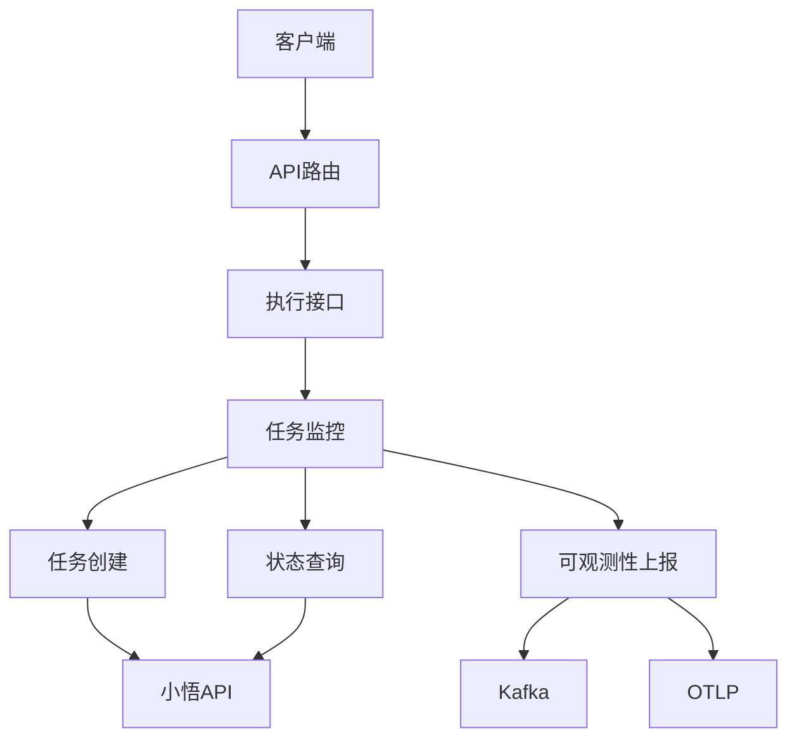
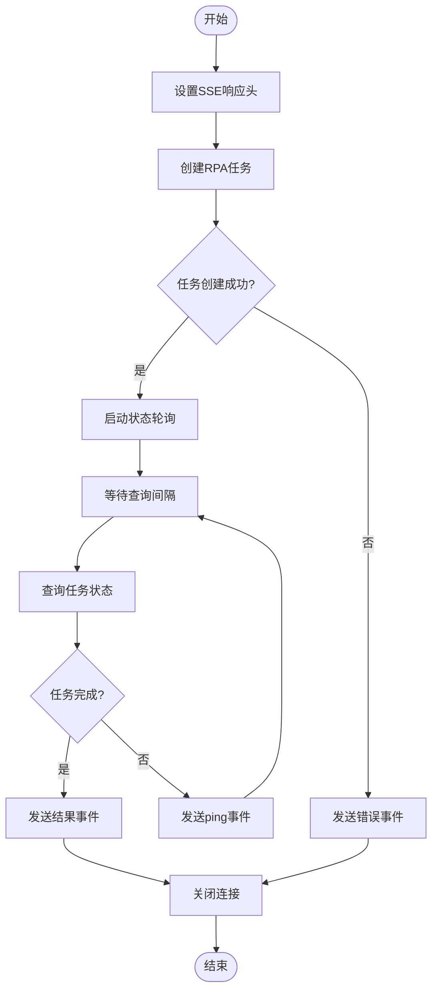
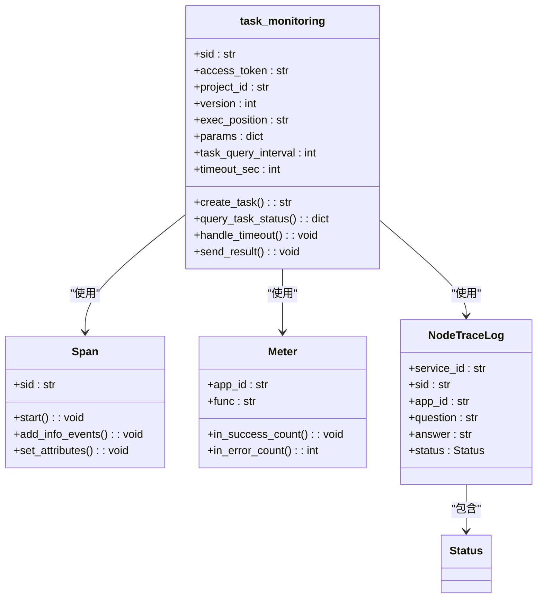
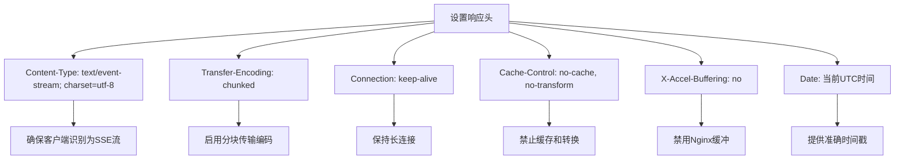
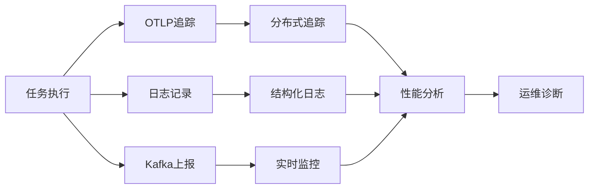
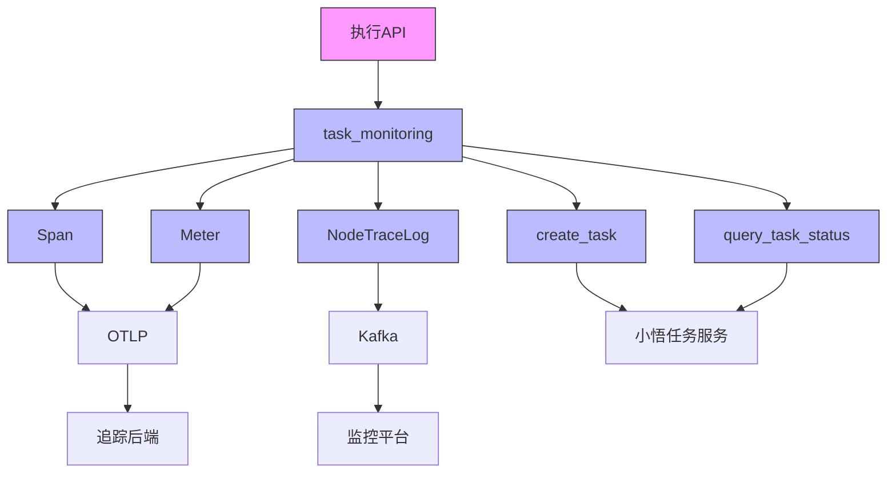

# 执行监控

<cite>
**本文档引用的文件**
- [execution.py](file://core/plugin/rpa/api/v1/execution.py)
- [process.py](file://core/plugin/rpa/service/xiaowu/process.py)
- [app.py](file://core/plugin/rpa/api/app.py)
- [const.py](file://core/plugin/rpa/consts/const.py)
- [execution_schema.py](file://core/plugin/rpa/api/schemas/execution_schema.py)
- [router.py](file://core/plugin/rpa/api/router.py)
</cite>

## 目录
1. [简介](#简介)
2. [项目结构](#项目结构)
3. [核心组件](#核心组件)
4. [架构概述](#架构概述)
5. [详细组件分析](#详细组件分析)
6. [依赖分析](#依赖分析)
7. [性能考虑](#性能考虑)
8. [故障排除指南](#故障排除指南)
9. [结论](#结论)

## 简介
本文档深入解析了RPA执行监控功能的实现机制，重点阐述了基于SSE（Server-Sent Events）的实时监控系统。文档详细说明了EventSourceResponse如何实现从服务端到客户端的流式状态推送，以及task_monitoring协程的生命周期管理，包括任务创建、状态轮询、异常处理和结果返回的完整流程。同时，文档还重点描述了HTTP响应头的配置策略，以确保在Nginx等反向代理环境下流式传输的稳定性，并结合代码示例展示了监控过程中日志记录、OTLP追踪和Kafka消息上报的集成方式。

## 项目结构
RPA执行监控功能主要位于`core/plugin/rpa/`目录下，其核心结构如下：

```
core/plugin/rpa/
├── api/
│   ├── app.py
│   ├── router.py
│   └── v1/
│       └── execution.py
├── service/xiaowu/
│   └── process.py
├── consts/
│   └── const.py
└── api/schemas/
    └── execution_schema.py
```

该结构遵循清晰的分层设计：`api`目录负责HTTP接口的定义和路由，`service`目录包含核心业务逻辑，`consts`目录管理所有配置常量，`schemas`目录定义数据传输对象。



**图表来源**
- [execution.py](file://core/plugin/rpa/api/v1/execution.py#L1-L58)
- [process.py](file://core/plugin/rpa/service/xiaowu/process.py#L1-L232)

## 核心组件
RPA执行监控的核心组件包括：
- **EventSourceResponse**: 基于SSE协议实现服务端到客户端的流式数据推送
- **task_monitoring协程**: 负责任务的全生命周期管理，包括创建、轮询、超时处理和结果返回
- **HTTP响应头配置**: 通过特定的响应头确保流式传输在反向代理环境下的稳定性
- **可观测性集成**: 结合OTLP追踪、日志记录和Kafka消息上报，实现全面的监控和诊断能力

**组件来源**
- [execution.py](file://core/plugin/rpa/api/v1/execution.py#L1-L58)
- [process.py](file://core/plugin/rpa/service/xiaowu/process.py#L1-L232)

## 架构概述
RPA执行监控采用异步流式架构，客户端通过POST请求发起RPA任务执行，服务端返回一个EventSourceResponse流。服务端在后台创建任务后，通过协程持续轮询任务状态，并将状态更新实时推送给客户端。整个流程通过SSE协议实现，确保了低延迟和高效率的实时通信。

```mermaid
sequenceDiagram
participant Client as 客户端
participant API as 执行API
participant Monitor as 任务监控
participant Task as 任务服务
participant Kafka as Kafka
Client->>API : POST /rpa/v1/exec
API->>Monitor : 启动task_monitoring协程
Monitor->>Task : 创建任务
Monitor->>Monitor : 启动状态轮询
loop 每10秒
Monitor->>Task : 查询任务状态
Task-->>Monitor : 返回状态
alt 任务完成
Monitor->>Client : 发送完成事件
Monitor->>Kafka : 上报执行日志
break
end
end
alt 超时
Monitor->>Client : 发送超时事件
end
```

**图表来源**
- [execution.py](file://core/plugin/rpa/api/v1/execution.py#L1-L58)
- [process.py](file://core/plugin/rpa/service/xiaowu/process.py#L1-L232)

## 详细组件分析

### SSE流式监控分析
RPA执行监控采用SSE（Server-Sent Events）协议实现服务端到客户端的实时状态推送。当客户端发起执行请求时，服务端返回一个EventSourceResponse对象，建立持久化的HTTP连接。



**图表来源**
- [execution.py](file://core/plugin/rpa/api/v1/execution.py#L1-L58)
- [process.py](file://core/plugin/rpa/service/xiaowu/process.py#L1-L232)

**组件来源**
- [execution.py](file://core/plugin/rpa/api/v1/execution.py#L1-L58)
- [process.py](file://core/plugin/rpa/service/xiaowu/process.py#L1-L232)

### task_monitoring协程生命周期
task_monitoring协程是RPA执行监控的核心，负责管理任务的整个生命周期。该协程采用异步非阻塞模式，通过定时轮询机制监控任务状态。



**图表来源**
- [process.py](file://core/plugin/rpa/service/xiaowu/process.py#L1-L232)

**组件来源**
- [process.py](file://core/plugin/rpa/service/xiaowu/process.py#L1-L232)

### HTTP响应头配置策略
为了确保SSE流在Nginx等反向代理环境下的稳定性，系统配置了特定的HTTP响应头。这些配置对于防止代理服务器缓存流式数据、确保实时传输至关重要。



**图表来源**
- [execution.py](file://core/plugin/rpa/api/v1/execution.py#L1-L58)

**组件来源**
- [execution.py](file://core/plugin/rpa/api/v1/execution.py#L1-L58)

### 可观测性数据集成
系统集成了全面的可观测性功能，通过OTLP追踪、日志记录和Kafka消息上报，实现了对RPA执行过程的全方位监控和诊断。



**图表来源**
- [process.py](file://core/plugin/rpa/service/xiaowu/process.py#L1-L232)

**组件来源**
- [process.py](file://core/plugin/rpa/service/xiaowu/process.py#L1-L232)

## 依赖分析
RPA执行监控功能依赖于多个核心组件和服务，形成了一个完整的监控生态系统。



**图表来源**
- [execution.py](file://core/plugin/rpa/api/v1/execution.py#L1-L58)
- [process.py](file://core/plugin/rpa/service/xiaowu/process.py#L1-L232)

**组件来源**
- [execution.py](file://core/plugin/rpa/api/v1/execution.py#L1-L58)
- [process.py](file://core/plugin/rpa/service/xiaowu/process.py#L1-L232)

## 性能考虑
RPA执行监控在设计时充分考虑了性能因素：
- 采用异步协程模式，避免阻塞主线程
- 通过可配置的轮询间隔平衡实时性和系统负载
- 使用流式传输减少内存占用，避免一次性加载大量数据
- 通过连接复用和长连接减少网络开销
- 配置适当的超时机制，防止资源泄漏

## 故障排除指南
当遇到RPA执行监控问题时，可以按照以下步骤进行排查：
1. 检查HTTP响应头是否正确配置，特别是`X-Accel-Buffering: no`
2. 验证Nginx配置是否支持SSE流式传输
3. 检查任务创建和查询的API端点是否可达
4. 查看日志中的错误码和详细信息
5. 验证OTLP和Kafka服务是否正常运行
6. 检查超时配置是否合理

**组件来源**
- [execution.py](file://core/plugin/rpa/api/v1/execution.py#L1-L58)
- [process.py](file://core/plugin/rpa/service/xiaowu/process.py#L1-L232)

## 结论
RPA执行监控功能通过SSE协议实现了高效、实时的状态推送，结合异步协程和全面的可观测性集成，构建了一个稳定可靠的监控系统。该系统不仅能够及时反馈任务执行状态，还提供了丰富的诊断信息，为运维和优化提供了有力支持。通过合理的HTTP头配置和反向代理设置，确保了在复杂网络环境下的稳定运行。