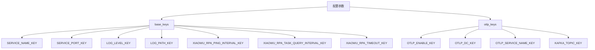
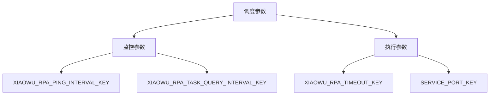
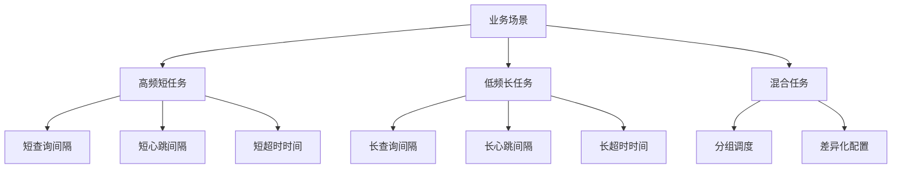
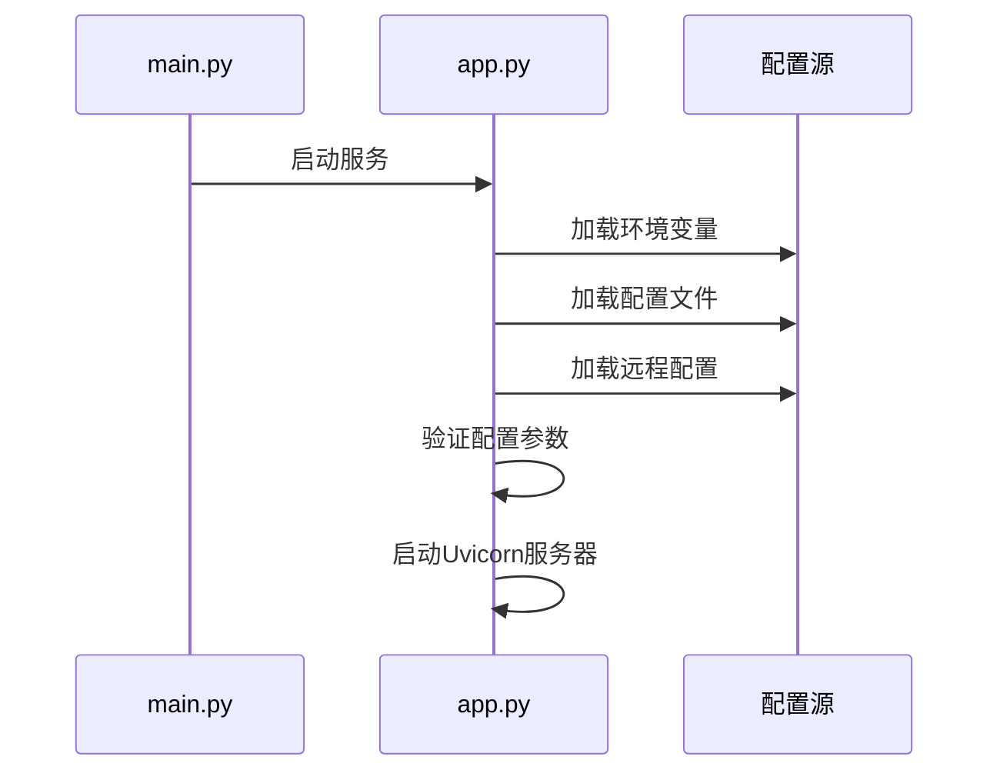

# 调度策略

<cite>
**本文档引用的文件**
- [const.py](file://core/plugin/rpa/consts/const.py)
- [rpa_keys.py](file://core/plugin/rpa/consts/rpa/rpa_keys.py)
- [main.py](file://core/plugin/rpa/main.py)
- [app.py](file://core/plugin/rpa/api/app.py)
- [app_keys.py](file://core/plugin/rpa/consts/app/app_keys.py)
- [logger.py](file://core/plugin/rpa/utils/log/logger.py)
</cite>

## 目录
1. [引言](#引言)
2. [配置参数分层管理](#配置参数分层管理)
3. [关键调度参数详解](#关键调度参数详解)
4. [参数调优指南](#参数调优指南)
5. [实际应用案例](#实际应用案例)
6. [配置加载机制](#配置加载机制)
7. [结论](#结论)

## 引言
本文档详细阐述了RPA（机器人流程自动化）系统的调度策略，重点介绍基于环境变量的动态配置机制。系统通过环境变量实现灵活的调度参数配置，支持在不同业务场景下调整调度行为。文档将深入解析XIAOWU_RPA_PING_INTERVAL_KEY、XIAOWU_RPA_TASK_QUERY_INTERVAL_KEY和XIAOWU_RPA_TIMEOUT_KEY等关键参数的含义、默认值及其对系统性能的影响，并提供不同业务场景下的参数调优指南。

**Section sources**
- [const.py](file://core/plugin/rpa/consts/const.py)
- [rpa_keys.py](file://core/plugin/rpa/consts/rpa/rpa_keys.py)

## 配置参数分层管理
RPA系统的配置参数采用分层管理结构，主要分为base_keys和otlp_keys两类，这种设计实现了配置的模块化和可扩展性。

### base_keys（基础配置）
base_keys包含系统运行所必需的基础配置参数，这些参数是RPA服务启动和运行的前提条件。当系统启动时，会首先检查这些基础参数是否已正确配置。

### otlp_keys（监控配置）
otlp_keys包含与OpenTelemetry协议相关的监控配置参数。这类参数仅在OTLP监控功能启用时才需要配置。系统通过检查OTLP_ENABLE_KEY的值来决定是否需要验证otlp_keys中的参数。

这种分层管理结构的优势在于：
- **灵活性**：可以根据实际需求选择性地启用监控功能
- **安全性**：避免在不需要监控的环境中暴露敏感的监控配置
- **可维护性**：配置参数按功能模块化，便于管理和维护

**Diagram sources**
- [const.py](file://core/plugin/rpa/consts/const.py)

**Section sources**
- [const.py](file://core/plugin/rpa/consts/const.py)

## 关键调度参数详解
本节详细说明RPA系统中的关键调度参数，包括其含义、默认值及对系统性能的影响。

### XIAOWU_RPA_PING_INTERVAL_KEY
**含义**：小悟RPA心跳检测间隔时间，用于监控RPA机器人的在线状态。
**默认值**：未指定（需通过环境变量配置）
**影响**：较短的间隔时间可以更快地检测到机器人离线状态，但会增加网络通信开销和系统负载。

### XIAOWU_RPA_TASK_QUERY_INTERVAL_KEY
**含义**：小悟RPA任务查询间隔时间，决定了系统查询待执行任务的频率。
**默认值**：未指定（需通过环境变量配置）
**影响**：该参数直接影响任务调度的实时性。较短的查询间隔可以更快地获取新任务，提高响应速度，但会增加数据库查询压力和系统资源消耗。

### XIAOWU_RPA_TIMEOUT_KEY
**含义**：小悟RPA任务超时时间，用于控制单个任务的最大执行时长。
**默认值**：9999秒（约2.78小时）
**影响**：合理的超时设置可以防止任务无限期执行，避免资源浪费。过短的超时时间可能导致正常任务被误判为超时，而过长的超时时间则可能影响系统资源的及时释放。

### 其他相关参数
- **SERVICE_PORT_KEY**：服务监听端口，默认值为17198
- **LOG_LEVEL_KEY**：日志级别，控制日志输出的详细程度
- **LOG_PATH_KEY**：日志文件存储路径

**Diagram sources**
- [rpa_keys.py](file://core/plugin/rpa/consts/rpa/rpa_keys.py)

**Section sources**
- [rpa_keys.py](file://core/plugin/rpa/consts/rpa/rpa_keys.py)
- [const.py](file://core/plugin/rpa/consts/const.py)

## 参数调优指南
根据不同的业务场景，需要对调度参数进行针对性的调优，以平衡监控实时性与系统资源消耗。

### 高频短任务场景
对于执行频率高、单次执行时间短的任务，建议采用以下参数配置：
- **XIAOWU_RPA_TASK_QUERY_INTERVAL_KEY**：设置为较短时间（如5-10秒），确保能快速获取新任务
- **XIAOWU_RPA_PING_INTERVAL_KEY**：设置为较短时间（如30秒），及时监控机器人状态
- **XIAOWU_RPA_TIMEOUT_KEY**：设置为合理值（如60-120秒），防止任务异常挂起

这种配置可以确保系统对任务变化的快速响应，适合处理大量短时任务的场景。

### 低频长任务场景
对于执行频率低、单次执行时间长的任务，建议采用以下参数配置：
- **XIAOWU_RPA_TASK_QUERY_INTERVAL_KEY**：设置为较长时间（如300-600秒），减少不必要的查询
- **XIAOWU_RPA_PING_INTERVAL_KEY**：设置为较长时间（如300秒），降低心跳检测开销
- **XIAOWU_RPA_TIMEOUT_KEY**：根据任务实际需求设置较长的超时时间

这种配置可以显著降低系统资源消耗，适合处理少量但耗时较长的任务场景。

### 混合任务场景
对于同时存在高频短任务和低频长任务的混合场景，建议采用分层调度策略：
- 为不同类型的任务配置不同的机器人组
- 对高频任务组采用高频查询策略
- 对低频任务组采用低频查询策略
- 统一使用合理的超时时间设置

**Diagram sources**
- [const.py](file://core/plugin/rpa/consts/const.py)

**Section sources**
- [const.py](file://core/plugin/rpa/consts/const.py)

## 实际应用案例
本节通过具体案例展示如何根据业务需求调整调度参数。

### 案例一：金融数据处理系统
某金融机构使用RPA系统处理每日的金融数据，任务特点为：
- 每天固定时间执行一次
- 单次任务执行时间约2小时
- 任务重要性高，需要确保完成

**参数配置**：
- XIAOWU_RPA_TASK_QUERY_INTERVAL_KEY：600秒（10分钟）
- XIAOWU_RPA_PING_INTERVAL_KEY：300秒（5分钟）
- XIAOWU_RPA_TIMEOUT_KEY：7200秒（2小时）

**分析**：由于任务执行时间较长且频率低，采用较长的查询和心跳间隔，减少系统开销。超时时间设置为略大于预期执行时间，确保任务有足够时间完成。

### 案例二：客户服务自动化系统
某企业使用RPA系统处理客户服务请求，任务特点为：
- 随时可能产生新任务
- 单次任务执行时间约5分钟
- 需要快速响应客户请求

**参数配置**：
- XIAOWU_RPA_TASK_QUERY_INTERVAL_KEY：10秒
- XIAOWU_RPA_PING_INTERVAL_KEY：30秒
- XIAOWU_RPA_TIMEOUT_KEY：600秒（10分钟）

**分析**：为了确保快速响应，采用较短的查询和心跳间隔。超时时间设置为合理值，防止异常任务占用资源。

**Section sources**
- [const.py](file://core/plugin/rpa/consts/const.py)
- [rpa_keys.py](file://core/plugin/rpa/consts/rpa/rpa_keys.py)

## 配置加载机制
RPA系统的配置加载机制采用多层级的配置源，确保配置的灵活性和可靠性。

### 环境变量加载
系统首先从环境变量中加载配置，这是最基本的配置方式。通过环境变量可以方便地在不同部署环境中使用不同的配置。

### 配置文件加载
系统支持从config.env文件中加载配置，这为本地开发和测试提供了便利。配置文件的优先级低于环境变量，允许通过环境变量覆盖配置文件中的设置。

### 远程配置中心
系统支持通过Polaris配置中心加载远程配置，实现配置的集中管理和动态更新。当USE_POLARIS环境变量设置为true时，系统会从远程配置中心拉取配置并覆盖本地配置。

### 配置验证
在服务启动时，系统会验证所有必需的配置参数是否已正确设置。如果发现缺失的必需参数，服务将启动失败并输出详细的错误信息，确保系统在配置不完整的情况下不会运行。

**Diagram sources**
- [main.py](file://core/plugin/rpa/main.py)
- [app.py](file://core/plugin/rpa/api/app.py)

**Section sources**
- [main.py](file://core/plugin/rpa/main.py)
- [app.py](file://core/plugin/rpa/api/app.py)

## 结论
RPA系统的调度策略通过基于环境变量的动态配置机制，实现了高度的灵活性和可配置性。通过对XIAOWU_RPA_PING_INTERVAL_KEY、XIAOWU_RPA_TASK_QUERY_INTERVAL_KEY和XIAOWU_RPA_TIMEOUT_KEY等关键参数的合理配置，可以在不同业务场景下平衡监控实时性与系统资源消耗。

配置参数的分层管理结构（base_keys和otlp_keys）使得系统配置更加清晰和易于管理。在实际应用中，应根据具体的业务需求和任务特点，选择合适的参数配置方案，以达到最佳的系统性能和资源利用率。

未来可以考虑引入更智能的自适应调度策略，根据系统负载和任务执行情况动态调整调度参数，进一步提升系统的自动化和智能化水平。