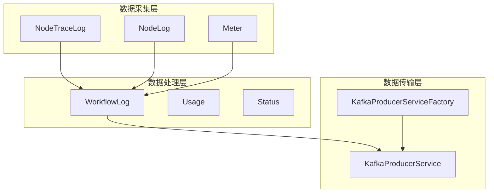
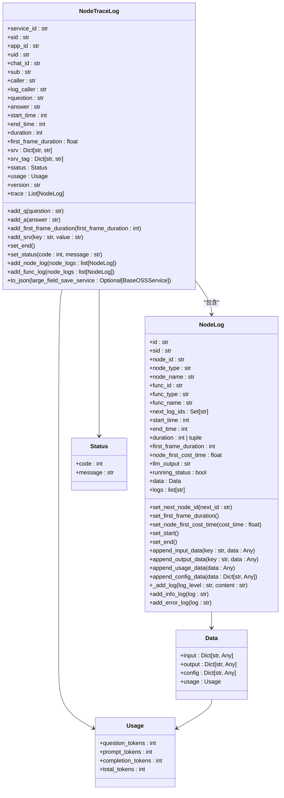
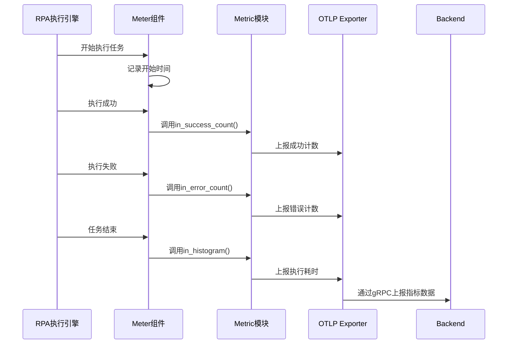
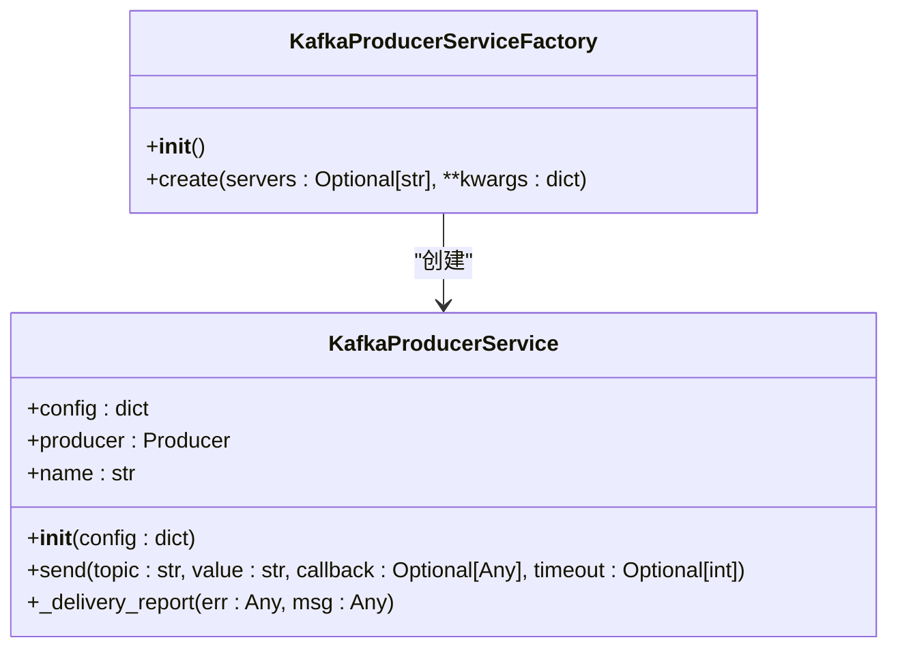
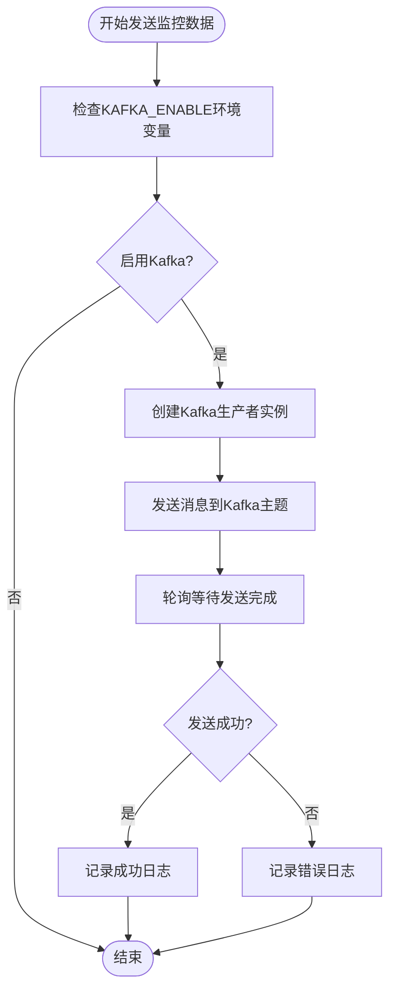
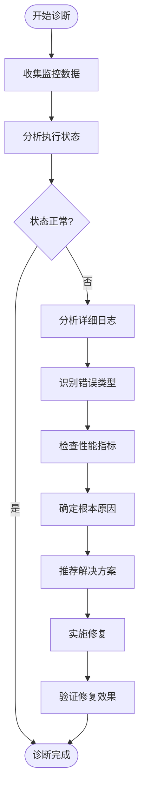

# RPA执行监控

<cite>
**本文档引用的文件**
- [node_trace_log.py](file://core/common/otlp/log_trace/node_trace_log.py)
- [node_log.py](file://core/common/otlp/log_trace/node_log.py)
- [workflow_log.py](file://core/common/otlp/log_trace/workflow_log.py)
- [meter.py](file://core/common/otlp/metrics/meter.py)
- [metric.py](file://core/common/otlp/metrics/metric.py)
- [kafka_service.py](file://core/common/service/kafka/kafka_service.py)
- [factory.py](file://core/common/service/kafka/factory.py)
- [base.py](file://core/common/otlp/log_trace/base.py)
- [consts.py](file://core/common/otlp/metrics/consts.py)
</cite>

## 目录
1. [引言](#引言)
2. [系统架构概述](#系统架构概述)
3. [核心监控组件](#核心监控组件)
4. [OTLP集成实现](#otlp集成实现)
5. [Kafka消息队列在监控数据传输中的作用](#kafka消息队列在监控数据传输中的作用)
6. [监控数据可视化方案](#监控数据可视化方案)
7. [通过监控数据诊断执行问题](#通过监控数据诊断执行问题)
8. [结论](#结论)

## 引言

RPA执行监控系统是确保机器人流程自动化（RPA）任务可靠运行的关键组件。本系统通过集成OpenTelemetry Protocol（OTLP）、Kafka消息队列和丰富的指标收集机制，实现了对RPA执行过程的全面监控。系统能够实时跟踪执行状态、记录详细日志、收集关键性能指标，并通过异步方式将监控数据上报至后端服务，为运维人员提供强大的诊断和分析能力。

## 系统架构概述

RPA执行监控系统采用分层架构设计，主要包括数据采集层、数据处理层和数据传输层。数据采集层负责在RPA执行过程中收集各种监控数据，包括执行状态、日志信息和性能指标。数据处理层对采集到的数据进行格式化和聚合处理。数据传输层则通过Kafka消息队列将处理后的监控数据异步上报至后端服务，确保不影响RPA任务的正常执行。

**图表来源**
- [node_trace_log.py](file://core/common/otlp/log_trace/node_trace_log.py)
- [node_log.py](file://core/common/otlp/log_trace/node_log.py)
- [workflow_log.py](file://core/common/otlp/log_trace/workflow_log.py)
- [meter.py](file://core/common/otlp/metrics/meter.py)
- [kafka_service.py](file://core/common/service/kafka/kafka_service.py)
- [factory.py](file://core/common/service/kafka/factory.py)

## 核心监控组件

### NodeTraceLog组件

NodeTraceLog组件是RPA执行监控的核心数据结构，用于记录单个执行任务的完整跟踪信息。该组件包含服务ID、会话ID、用户ID等基本信息，以及执行开始时间、结束时间和持续时间等时间戳信息。此外，NodeTraceLog还包含状态码、使用情况统计和详细的节点日志列表。

**组件来源**
- [node_trace_log.py](file://core/common/otlp/log_trace/node_trace_log.py#L1-L127)

### NodeLog组件

NodeLog组件用于记录RPA执行过程中每个节点的详细信息。每个NodeLog实例包含节点ID、节点类型、节点名称等标识信息，以及节点的开始时间、结束时间和执行时长。NodeLog还包含输入数据、输出数据、配置信息和使用情况统计，为分析节点执行情况提供了全面的数据支持。

**组件来源**
- [node_log.py](file://core/common/otlp/log_trace/node_log.py#L1-L157)

### Meter组件

Meter组件是RPA执行监控中的指标收集器，用于记录和上报各种性能指标。Meter组件提供了记录错误次数、成功次数和执行耗时的功能。通过Meter组件，系统可以收集到RPA执行的成功率、失败率和平均执行时间等关键性能指标。

**组件来源**
- [meter.py](file://core/common/otlp/metrics/meter.py#L1-L131)

## OTLP集成实现

### OTLP日志跟踪实现

RPA执行监控系统通过集成OpenTelemetry Protocol（OTLP）实现了全面的日志跟踪功能。系统使用NodeTraceLog和NodeLog组件构建了完整的执行跟踪链路。当RPA任务开始执行时，系统创建一个NodeTraceLog实例作为跟踪根节点。在执行过程中，每个节点的执行信息被记录在NodeLog实例中，并添加到NodeTraceLog的跟踪列表中。

**图表来源**
- [node_trace_log.py](file://core/common/otlp/log_trace/node_trace_log.py#L1-L127)
- [node_log.py](file://core/common/otlp/log_trace/node_log.py#L1-L157)
- [base.py](file://core/common/otlp/log_trace/base.py#L1-L8)

**组件来源**
- [node_trace_log.py](file://core/common/otlp/log_trace/node_trace_log.py#L1-L127)
- [node_log.py](file://core/common/otlp/log_trace/node_log.py#L1-L157)

### OTLP指标收集实现

RPA执行监控系统通过Meter组件实现了OTLP指标收集功能。Meter组件使用OpenTelemetry SDK创建计数器（Counter）和直方图（Histogram）来记录和上报指标数据。系统通过调用Meter组件的in_error_count、in_success_count和in_histogram方法来记录错误次数、成功次数和执行耗时等指标。

**图表来源**
- [meter.py](file://core/common/otlp/metrics/meter.py#L1-L131)
- [metric.py](file://core/common/otlp/metrics/metric.py#L1-L82)

**组件来源**
- [meter.py](file://core/common/otlp/metrics/meter.py#L1-L131)
- [metric.py](file://core/common/otlp/metrics/metric.py#L1-L82)

## Kafka消息队列在监控数据传输中的作用

### Kafka生产者服务

RPA执行监控系统使用Kafka消息队列实现监控数据的异步上报。系统通过KafkaProducerService类封装了Kafka生产者的功能。该服务负责将格式化后的监控数据发送到指定的Kafka主题。通过异步上报机制，系统确保了监控数据的传输不会影响RPA任务的正常执行性能。

**图表来源**
- [kafka_service.py](file://core/common/service/kafka/kafka_service.py#L1-L67)
- [factory.py](file://core/common/service/kafka/factory.py#L1-L30)

**组件来源**
- [kafka_service.py](file://core/common/service/kafka/kafka_service.py#L1-L67)
- [factory.py](file://core/common/service/kafka/factory.py#L1-L30)

### Kafka异步上报配置

系统通过kafka_service.send方法实现监控数据的异步上报。该方法首先检查KAFKA_ENABLE环境变量以确定是否启用Kafka功能。如果启用，则使用配置的Kafka服务器地址创建生产者实例，并将监控数据作为JSON字符串发送到指定的主题。系统还实现了消息发送回调函数，用于记录消息发送的成功或失败状态。

**图表来源**
- [kafka_service.py](file://core/common/service/kafka/kafka_service.py#L1-L67)

**组件来源**
- [kafka_service.py](file://core/common/service/kafka/kafka_service.py#L1-L67)

## 监控数据可视化方案

### 关键指标定义

RPA执行监控系统定义了多个关键指标用于评估系统性能和稳定性。这些指标包括：

| 指标名称 | 描述 | 单位 |
|--------|------|------|
| 执行成功次数 | 企业中所有机器人执行成功的总次数 | 次 |
| 执行成功率 | 执行成功次数占总执行次数的比例 | % |
| 累计执行时长 | 机器人成功执行的总时长 | 小时 |
| 累计节省人力 | 成功执行时长换算成的人力节省 | 人/天 |
| 今日执行次数 | 今日机器人执行的总次数 | 次 |
| 今日正在执行 | 今日正在执行的机器人数量 | 个 |

**组件来源**
- [init_his_data_enum_data.sql](file://docker/astronAgent/astronRPA/volumes/mysql/init_his_data_enum_data.sql#L1-L9)

### 状态码含义

系统使用标准化的状态码来表示RPA执行结果。状态码0表示执行成功，非0值表示各种类型的执行失败。通过分析状态码，运维人员可以快速识别和分类执行问题。

| 状态码 | 含义 |
|------|------|
| 0 | 执行成功 |
| 1 | 执行失败 |
| 2 | 执行超时 |
| 3 | 资源不足 |
| 4 | 权限不足 |
| 5 | 配置错误 |

**组件来源**
- [node_trace_log.py](file://core/common/otlp/log_trace/node_trace_log.py#L1-L127)

### 性能瓶颈分析方法

通过收集和分析RPA执行过程中的性能指标，系统可以识别潜在的性能瓶颈。主要分析方法包括：

1. **执行耗时分析**：通过分析in_histogram记录的执行耗时，识别执行时间过长的节点或任务。
2. **错误率分析**：通过分析in_error_count记录的错误次数，识别频繁出错的节点或任务。
3. **资源利用率分析**：通过监控系统资源使用情况，识别资源瓶颈。
4. **并发性能分析**：通过分析系统在高并发情况下的表现，评估系统的扩展能力。

**组件来源**
- [meter.py](file://core/common/otlp/metrics/meter.py#L1-L131)
- [consts.py](file://core/common/otlp/metrics/consts.py#L1-L17)

## 通过监控数据诊断执行问题

### 典型错误场景分析

#### 执行超时场景

当RPA任务执行时间超过预设的超时阈值时，系统会记录执行超时错误。通过分析NodeTraceLog中的duration字段和NodeLog中的各个节点执行时间，可以定位导致超时的具体节点。

**解决方案**：
1. 检查超时节点的业务逻辑，优化执行效率
2. 增加超时阈值
3. 将长时间运行的任务拆分为多个子任务

**组件来源**
- [node_trace_log.py](file://core/common/otlp/log_trace/node_trace_log.py#L1-L127)
- [node_log.py](file://core/common/otlp/log_trace/node_log.py#L1-L157)

#### 资源不足场景

当系统资源（如内存、CPU、网络带宽）不足时，RPA任务可能无法正常执行。通过分析系统监控指标和日志信息，可以识别资源瓶颈。

**解决方案**：
1. 增加系统资源
2. 优化RPA任务的资源使用
3. 调整任务调度策略，避免资源竞争

**组件来源**
- [meter.py](file://core/common/otlp/metrics/meter.py#L1-L131)

#### 权限不足场景

当RPA任务需要访问受保护的资源但缺乏相应权限时，会触发权限不足错误。通过分析日志中的错误信息和调用上下文，可以确定权限问题的具体原因。

**解决方案**：
1. 检查并更新RPA任务的权限配置
2. 申请必要的访问权限
3. 使用具有足够权限的服务账户

**组件来源**
- [node_trace_log.py](file://core/common/otlp/log_trace/node_trace_log.py#L1-L127)

### 监控数据诊断流程

**图表来源**
- [node_trace_log.py](file://core/common/otlp/log_trace/node_trace_log.py#L1-L127)
- [node_log.py](file://core/common/otlp/log_trace/node_log.py#L1-L157)
- [meter.py](file://core/common/otlp/metrics/meter.py#L1-L131)

## 结论

RPA执行监控系统通过集成OTLP协议、Kafka消息队列和全面的指标收集机制，实现了对RPA执行过程的全方位监控。系统能够实时跟踪执行状态、记录详细日志、收集关键性能指标，并通过异步方式将监控数据上报至后端服务。通过丰富的可视化方案和诊断工具，系统为运维人员提供了强大的问题识别和解决能力，有效保障了RPA任务的稳定运行。