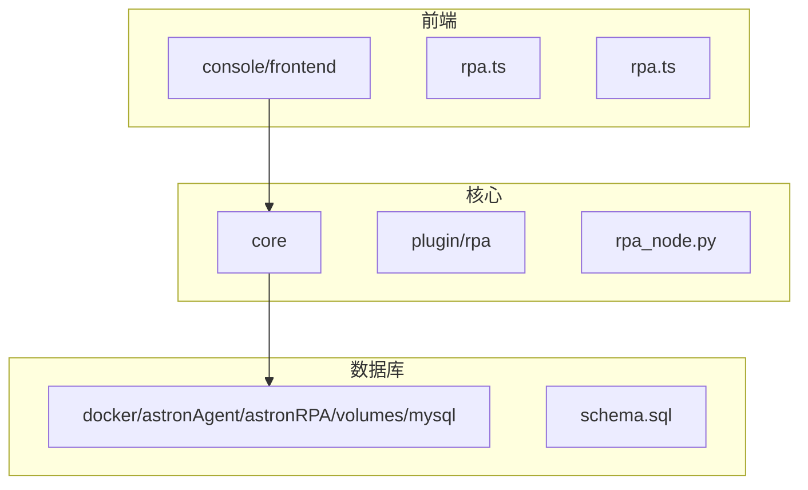
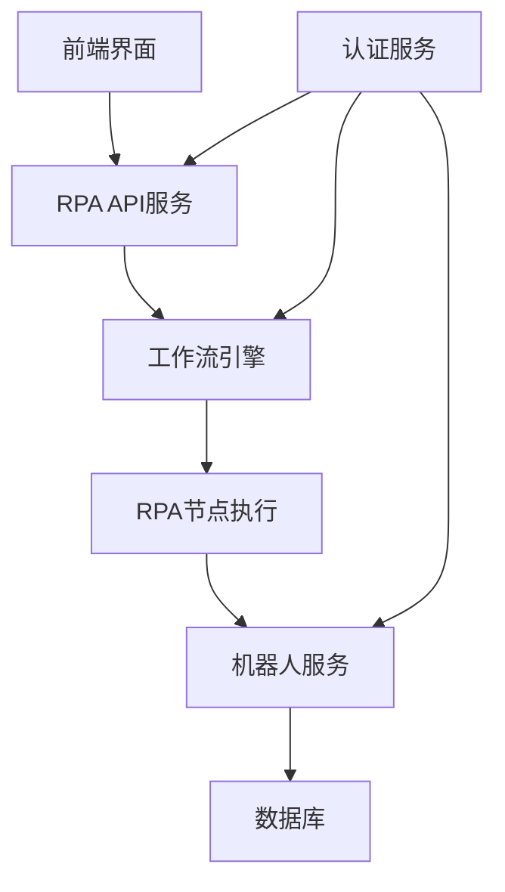
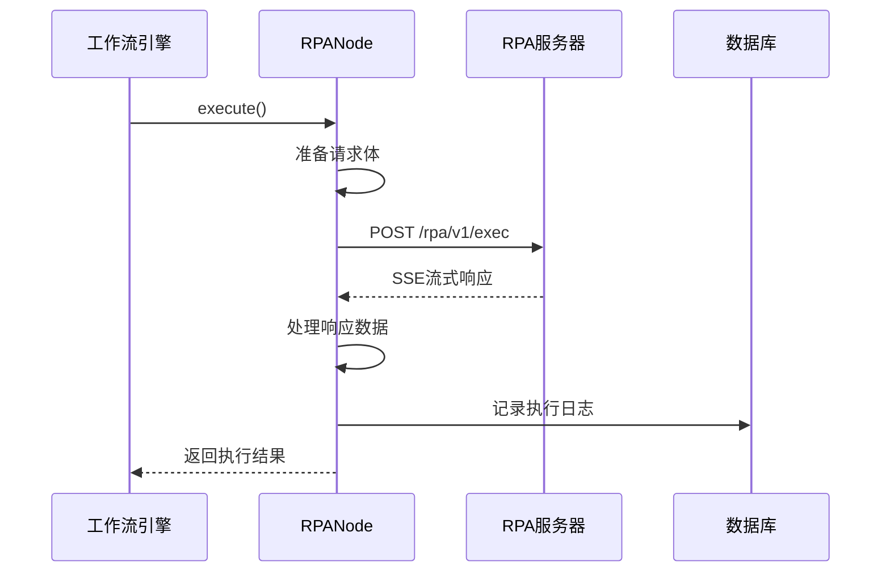
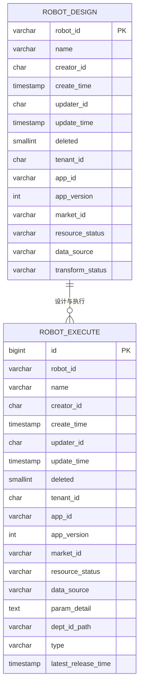
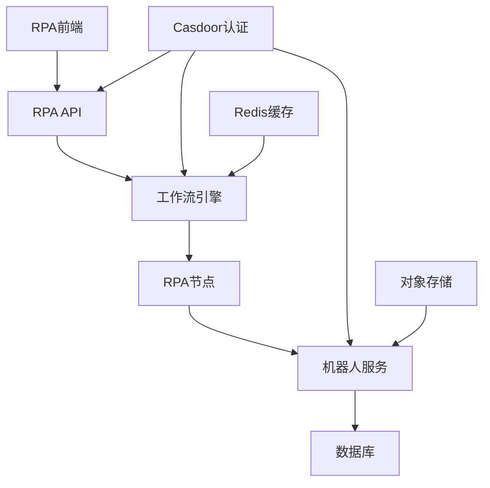

# RPA机器人管理

<cite>
**本文档引用的文件**  
- [rpa.ts](file://console/frontend/src/services/rpa.ts)
- [rpa.ts](file://console/frontend/src/types/rpa.ts)
- [rpa_keys.py](file://core/plugin/rpa/consts/rpa/rpa_keys.py)
- [rpa_node.py](file://core/workflow/engine/nodes/rpa/rpa_node.py)
- [schema.sql](file://docker/astronAgent/astronRPA/volumes/mysql/schema.sql)
- [auth_handler.lua](file://docker/astronAgent/astronRPA/volumes/nginx/lua/auth_handler.lua)
- [casdoor.ts](file://console/frontend/src/config/casdoor.ts)
</cite>

## 目录
1. [简介](#简介)
2. [项目结构](#项目结构)
3. [核心组件](#核心组件)
4. [架构概述](#架构概述)
5. [详细组件分析](#详细组件分析)
6. [依赖分析](#依赖分析)
7. [性能考虑](#性能考虑)
8. [故障排除指南](#故障排除指南)
9. [结论](#结论)

## 简介
本文档全面介绍RPA机器人管理功能，涵盖RPA机器人的创建、配置和生命周期管理流程。文档详细说明机器人配置模型、API设计与实现、权限控制机制以及最佳实践。

## 项目结构
RPA机器人管理功能分布在多个目录中，主要包括前端服务、核心插件和数据库架构。



**Diagram sources**
- [rpa.ts](file://console/frontend/src/services/rpa.ts)
- [rpa_node.py](file://core/workflow/engine/nodes/rpa/rpa_node.py)
- [schema.sql](file://docker/astronAgent/astronRPA/volumes/mysql/schema.sql)

**Section sources**
- [rpa.ts](file://console/frontend/src/services/rpa.ts)
- [rpa_node.py](file://core/workflow/engine/nodes/rpa/rpa_node.py)
- [schema.sql](file://docker/astronAgent/astronRPA/volumes/mysql/schema.sql)

## 核心组件
RPA机器人管理的核心组件包括机器人配置、执行管理和权限控制。

**Section sources**
- [rpa.ts](file://console/frontend/src/services/rpa.ts)
- [rpa_node.py](file://core/workflow/engine/nodes/rpa/rpa_node.py)

## 架构概述
RPA机器人管理系统的架构包括前端界面、API服务、工作流引擎和数据库存储。



**Diagram sources**
- [rpa.ts](file://console/frontend/src/services/rpa.ts)
- [rpa_node.py](file://core/workflow/engine/nodes/rpa/rpa_node.py)
- [auth_handler.lua](file://docker/astronAgent/astronRPA/volumes/nginx/lua/auth_handler.lua)

## 详细组件分析

### RPA机器人配置分析
RPA机器人配置管理包括创建、读取、更新和删除操作，通过REST API提供服务。

```mermaid
classDiagram
class RpaFormInfo {
+platformId : string
+assistantName : string
+icon : string
+fields : {apiKey : string}
+replaceFields : boolean
+remarks : string
}
class RpaDetailInfo {
+id : number
+platformId : number
+assistantName : string
+status : number
+fields : {apiKey : string}
+robots : RpaRobot[]
+createTime : string
+updateTime : string
}
class RpaRobot {
+project_id : string
+name : string
+english_name : string
+description : string
+version : string
+status : number
+parameters : RpaParameter[]
+user_id : string
+created_at : string
+updated_at : string
+icon : string
+apiKey : string
}
RpaDetailInfo --> RpaRobot : "包含"
```

**Diagram sources**
- [rpa.ts](file://console/frontend/src/types/rpa.ts#L20-L114)

**Section sources**
- [rpa.ts](file://console/frontend/src/types/rpa.ts#L20-L114)

### RPA节点执行分析
RPA节点执行是工作流引擎中的关键组件，负责调用外部RPA服务并处理响应。



**Diagram sources**
- [rpa_node.py](file://core/workflow/engine/nodes/rpa/rpa_node.py#L0-L165)

**Section sources**
- [rpa_node.py](file://core/workflow/engine/nodes/rpa/rpa_node.py#L0-L165)

### RPA配置模型分析
RPA配置模型定义了机器人实例的核心参数和属性。



**Diagram sources**
- [schema.sql](file://docker/astronAgent/astronRPA/volumes/mysql/schema.sql#L876-L922)

**Section sources**
- [schema.sql](file://docker/astronAgent/astronRPA/volumes/mysql/schema.sql#L876-L922)

## 依赖分析
RPA机器人管理系统依赖于多个外部服务和内部组件。



**Diagram sources**
- [rpa.ts](file://console/frontend/src/services/rpa.ts)
- [rpa_node.py](file://core/workflow/engine/nodes/rpa/rpa_node.py)
- [auth_handler.lua](file://docker/astronAgent/astronRPA/volumes/nginx/lua/auth_handler.lua)

**Section sources**
- [rpa.ts](file://console/frontend/src/services/rpa.ts)
- [rpa_node.py](file://core/workflow/engine/nodes/rpa/rpa_node.py)
- [auth_handler.lua](file://docker/astronAgent/astronRPA/volumes/nginx/lua/auth_handler.lua)

## 性能考虑
RPA机器人管理系统的性能考虑包括：

1. **超时配置**：通过环境变量设置RPA操作的超时时间
2. **并发处理**：支持多个机器人并行执行
3. **流式响应**：使用SSE协议实现流式数据传输
4. **缓存机制**：利用Redis缓存频繁访问的数据
5. **数据库优化**：对关键字段建立索引以提高查询效率

**Section sources**
- [rpa_keys.py](file://core/plugin/rpa/consts/rpa/rpa_keys.py)
- [rpa_node.py](file://core/workflow/engine/nodes/rpa/rpa_node.py)

## 故障排除指南
### 常见问题及解决方案

1. **认证失败**
   - 检查access_token是否有效
   - 确认Casdoor服务正常运行
   - 验证用户权限配置

2. **机器人执行超时**
   - 检查XIAOWU_RPA_TIMEOUT配置
   - 确认机器人服务可达性
   - 查看网络连接状况

3. **参数传递错误**
   - 验证参数格式是否符合要求
   - 检查projectId和exec_position参数
   - 确认API密钥正确性

4. **数据库连接问题**
   - 检查数据库服务状态
   - 验证连接字符串配置
   - 确认用户权限设置

**Section sources**
- [auth_handler.lua](file://docker/astronAgent/astronRPA/volumes/nginx/lua/auth_handler.lua)
- [rpa_node.py](file://core/workflow/engine/nodes/rpa/rpa_node.py)

## 结论
RPA机器人管理系统提供了一套完整的机器人创建、配置和生命周期管理功能。系统通过清晰的API设计、安全的认证机制和高效的执行流程，实现了对RPA机器人的全面管理。建议在实际使用中遵循最佳实践，合理配置参数，确保系统的稳定性和安全性。