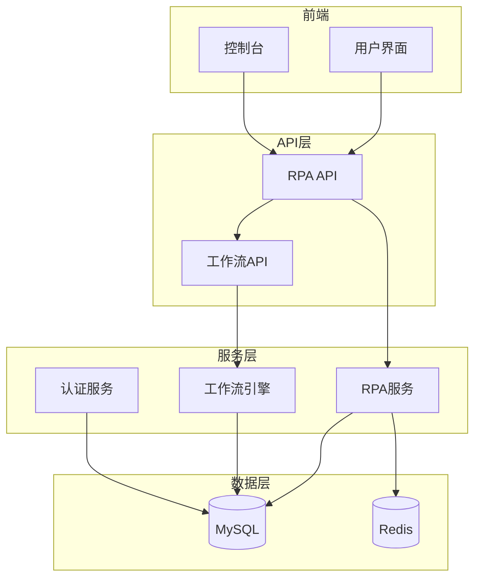

# RPA自动化

<cite>
**本文档引用的文件**  
- [main.py](file://core/plugin/rpa/main.py)
- [app.py](file://core/plugin/rpa/api/app.py)
- [rpa.ts](file://console/frontend/src/services/rpa.ts)
- [rpa.ts](file://console/frontend/src/types/rpa.ts)
- [logger.py](file://core/plugin/rpa/utils/log/logger.py)
- [schema.sql](file://docker/astronAgent/astronRPA/volumes/mysql/schema.sql)
- [process.py](file://core/plugin/rpa/service/xiaowu/process.py)
</cite>

## 目录
1. [简介](#简介)
2. [项目结构](#项目结构)
3. [核心组件](#核心组件)
4. [架构概述](#架构概述)
5. [详细组件分析](#详细组件分析)
6. [依赖分析](#依赖分析)
7. [性能考虑](#性能考虑)
8. [故障排除指南](#故障排除指南)
9. [结论](#结论)

## 简介
本文档全面介绍了RPA（机器人流程自动化）系统的创建和管理流程，包括任务定义、脚本编写、执行调度等环节。详细说明了RPA执行引擎的架构和工作机制，包括任务队列管理、资源分配、错误恢复等。解释了RPA与其他系统组件的集成方式，如在工作流中调用RPA节点、通过API触发RPA任务等。提供了RPA脚本开发指南，包括最佳实践、调试技巧、性能优化建议。展示了典型RPA应用场景，如数据录入、报表生成、系统集成等。包含安全考虑，如权限控制、审计日志、敏感数据处理等。提供监控和告警配置方法，帮助用户及时发现和解决执行问题。

## 项目结构
RPA自动化系统由多个组件构成，包括前端控制台、后端服务、数据库和执行引擎。前端控制台提供用户界面，用于创建和管理RPA机器人。后端服务处理API请求，管理任务调度和执行。数据库存储机器人配置、任务定义和执行记录。执行引擎负责实际执行RPA脚本。

**图表来源**  
- [rpa.ts](file://console/frontend/src/services/rpa.ts)
- [app.py](file://core/plugin/rpa/api/app.py)
- [schema.sql](file://docker/astronAgent/astronRPA/volumes/mysql/schema.sql)

**章节来源**  
- [main.py](file://core/plugin/rpa/main.py)
- [app.py](file://core/plugin/rpa/api/app.py)

## 核心组件
RPA系统的核心组件包括RPA服务、任务调度器、执行引擎和数据库。RPA服务是系统的入口点，负责处理所有API请求。任务调度器管理计划任务的执行，支持定时、循环和自定义调度模式。执行引擎负责实际执行RPA脚本，支持Python脚本和自定义模块。数据库存储所有配置信息、任务定义和执行记录。

**章节来源**  
- [main.py](file://core/plugin/rpa/main.py#L1-L111)
- [app.py](file://core/plugin/rpa/api/app.py#L1-L160)

## 架构概述
RPA系统的架构采用微服务设计，前端控制台通过API与后端服务通信。后端服务包括RPA服务、工作流引擎和数据库服务。RPA服务负责处理RPA相关的API请求，包括机器人创建、任务调度和执行管理。工作流引擎负责执行复杂的工作流，支持在工作流中调用RPA节点。数据库服务存储所有配置信息和执行记录。

**图表来源**  
- [main.py](file://core/plugin/rpa/main.py)
- [app.py](file://core/plugin/rpa/api/app.py)
- [schema.sql](file://docker/astronAgent/astronRPA/volumes/mysql/schema.sql)

## 详细组件分析
### RPA服务分析
RPA服务是系统的入口点，负责处理所有RPA相关的API请求。服务启动时会加载环境变量，检查配置，设置日志，并启动Uvicorn服务器。服务支持远程配置加载，可以从Polaris配置中心获取配置并覆盖环境变量。

**图表来源**  
- [app.py](file://core/plugin/rpa/api/app.py#L1-L160)

**章节来源**  
- [app.py](file://core/plugin/rpa/api/app.py#L1-L160)

### 任务调度分析
任务调度器管理计划任务的执行，支持多种调度模式，包括定时、循环和自定义。调度器使用cron表达式定义执行时间，支持任务排队执行。任务执行记录存储在数据库中，包括执行结果、开始时间、结束时间和执行日志。

**图表来源**  
- [schema.sql](file://docker/astronAgent/astronRPA/volumes/mysql/schema.sql#L977-L995)
- [schema.sql](file://docker/astronAgent/astronRPA/volumes/mysql/schema.sql#L1009-L1029)

**章节来源**  
- [schema.sql](file://docker/astronAgent/astronRPA/volumes/mysql/schema.sql#L977-L1060)

### 执行引擎分析
执行引擎负责实际执行RPA脚本，支持Python脚本和自定义模块。引擎从数据库加载机器人配置和脚本，然后在隔离的环境中执行。执行过程中会记录详细的日志，包括执行时间、资源使用情况和错误信息。

**图表来源**  
- [process.py](file://core/plugin/rpa/service/xiaowu/process.py)
- [schema.sql](file://docker/astronAgent/astronRPA/volumes/mysql/schema.sql#L924-L940)

**章节来源**  
- [process.py](file://core/plugin/rpa/service/xiaowu/process.py)
- [schema.sql](file://docker/astronAgent/astronRPA/volumes/mysql/schema.sql#L924-L940)

## 依赖分析
RPA系统依赖多个外部组件和服务，包括数据库、消息队列、配置中心和认证服务。系统使用MySQL存储配置和执行记录，使用Redis作为缓存。Polaris配置中心用于集中管理配置，Casdoor提供用户认证和权限控制。

**图表来源**  
- [app.py](file://core/plugin/rpa/api/app.py#L1-L160)
- [main.py](file://core/plugin/rpa/main.py#L1-L111)

**章节来源**  
- [app.py](file://core/plugin/rpa/api/app.py#L1-L160)
- [main.py](file://core/plugin/rpa/main.py#L1-L111)

## 性能考虑
RPA系统在设计时考虑了性能优化，包括使用连接池、缓存和异步处理。数据库操作使用连接池减少连接开销，频繁访问的数据使用Redis缓存。任务执行采用异步模式，避免阻塞主线程。日志系统支持按大小轮转，避免日志文件过大影响性能。

**章节来源**  
- [logger.py](file://core/plugin/rpa/utils/log/logger.py#L40-L55)
- [app.py](file://core/plugin/rpa/api/app.py#L1-L160)

## 故障排除指南
当RPA任务执行出现问题时，可以按照以下步骤进行排查：
1. 检查任务调度配置是否正确
2. 查看执行日志，定位错误原因
3. 检查机器人配置和参数是否正确
4. 验证数据库连接是否正常
5. 检查系统资源是否充足

**图表来源**  
- [schema.sql](file://docker/astronAgent/astronRPA/volumes/mysql/schema.sql#L924-L940)
- [logger.py](file://core/plugin/rpa/utils/log/logger.py#L40-L55)

**章节来源**  
- [schema.sql](file://docker/astronAgent/astronRPA/volumes/mysql/schema.sql#L924-L940)
- [logger.py](file://core/plugin/rpa/utils/log/logger.py#L40-L55)

## 结论
RPA自动化系统提供了一套完整的机器人流程自动化解决方案，支持从任务定义到执行调度的完整生命周期管理。系统采用微服务架构，具有良好的可扩展性和可靠性。通过与工作流引擎的集成，RPA可以作为工作流中的一个节点，实现复杂的业务流程自动化。系统的安全机制和监控告警功能确保了自动化任务的安全和可靠执行。