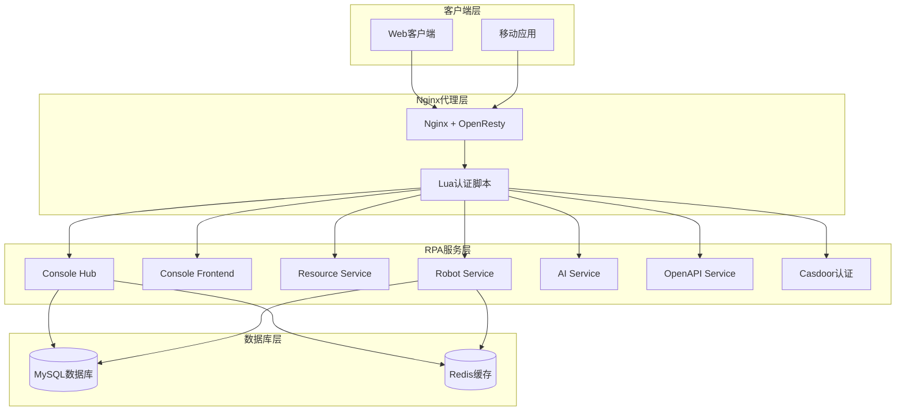
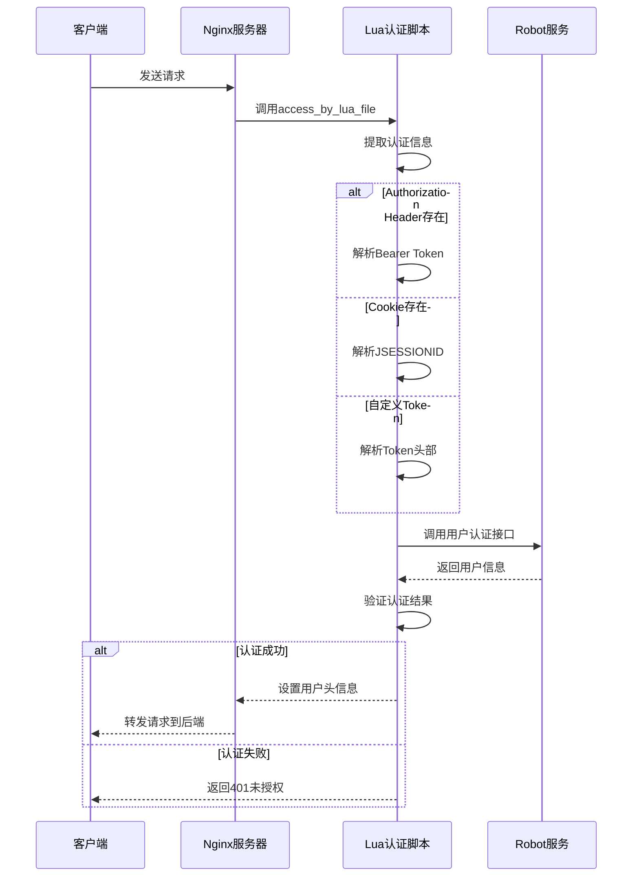
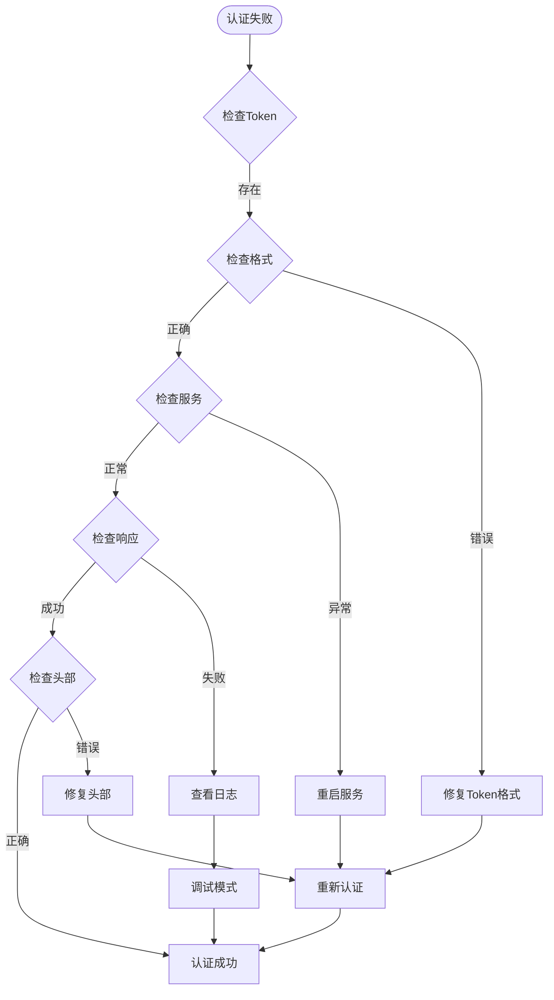

# RPA网络与代理配置

<cite>
**本文档引用的文件**
- [nginx.conf](file://docker/astronAgent/nginx/nginx.conf)
- [default.conf](file://docker/astronAgent/astronRPA/volumes/nginx/default.conf)
- [auth_handler.lua](file://docker/astronAgent/astronRPA/volumes/nginx/lua/auth_handler.lua)
- [proxy.conf](file://docker/ragflow/nginx/proxy.conf)
- [ragflow.https.conf](file://docker/ragflow/nginx/ragflow.https.conf)
- [http.lua](file://docker/astronAgent/astronRPA/volumes/nginx/lua/resty/http.lua)
- [http_connect.lua](file://docker/astronAgent/astronRPA/volumes/nginx/lua/resty/http_connect.lua)
- [docker-compose-with-auth-rpa.yaml](file://docker/astronAgent/docker-compose-with-auth-rpa.yaml)
</cite>

## 目录
1. [概述](#概述)
2. [项目架构](#项目架构)
3. [Nginx反向代理配置](#nginx反向代理配置)
4. [Lua认证逻辑实现](#lua认证逻辑实现)
5. [后端服务通信机制](#后端服务通信机制)
6. [高可用配置](#高可用配置)
7. [性能优化配置](#性能优化配置)
8. [SSL/TLS安全配置](#ssltls安全配置)
9. [故障排除指南](#故障排除指南)
10. [最佳实践](#最佳实践)

## 概述

本文档详细介绍了astron-agent项目中RPA网络与代理配置的完整实现。该系统采用Nginx作为反向代理服务器，结合OpenResty提供的Lua脚本实现高级认证功能，为RPA服务提供安全、高效的网络通信基础设施。

### 核心特性

- **多层认证机制**：支持Bearer Token、自定义Token头部和Cookie JSESSIONID认证
- **实时数据传输**：针对Server-Sent Events(SSE)优化的长连接配置
- **微服务架构支持**：统一的代理路由和负载均衡配置
- **高可用性设计**：连接池管理和健康检查机制
- **安全防护**：SSL/TLS加密和请求头验证

## 项目架构



**图表来源**
- [default.conf](file://docker/astronAgent/astronRPA/volumes/nginx/default.conf#L15-L30)
- [docker-compose-with-auth-rpa.yaml](file://docker/astronAgent/docker-compose-with-auth-rpa.yaml#L1-L35)

**章节来源**
- [default.conf](file://docker/astronAgent/astronRPA/volumes/nginx/default.conf#L1-L151)
- [docker-compose-with-auth-rpa.yaml](file://docker/astronAgent/docker-compose-with-auth-rpa.yaml#L1-L35)

## Nginx反向代理配置

### 基础配置结构

Nginx配置采用模块化设计，包含以下核心组件：

#### 全局配置参数

| 参数 | 值 | 说明 |
|------|-----|------|
| worker_processes | auto | 自动检测CPU核心数 |
| worker_connections | 1024 | 每个工作进程最大连接数 |
| keepalive_timeout | 65s | 连接保持时间 |
| client_max_body_size | 100M | 最大请求体大小 |

#### 日志配置

```nginx
# 日志格式定义
log_format main '$remote_addr - $remote_user [$time_local] "$request" '
                '$status $body_bytes_sent "$http_referer" '
                '"$http_user_agent" "$http_x_forwarded_for"';

# 访问日志
access_log /var/log/nginx/access.log main;
error_log /var/log/nginx/error.log warn;
```

### Server块配置详解

#### 监听端口配置

```nginx
server {
    listen 80;
    server_name localhost;
    
    # 通用配置
    client_max_body_size 100M;
    proxy_connect_timeout 60s;
    proxy_send_timeout 60s;
    proxy_read_timeout 60s;
    proxy_set_header Host $host;
    proxy_set_header X-Real-IP $remote_addr;
    proxy_set_header X-Forwarded-For $proxy_add_x_forwarded_for;
    proxy_set_header X-Forwarded-Proto $scheme;
}
```

#### Location路由规则

##### 静态资源处理

```nginx
location ~* \.(js|css|png|jpg|jpeg|gif|ico|svg|woff|woff2|ttf|eot)$ {
    proxy_pass http://console-frontend:1881;
    proxy_set_header Host $host;
    proxy_set_header X-Real-IP $remote_addr;
    proxy_set_header X-Forwarded-For $proxy_add_x_forwarded_for;
    proxy_set_header X-Forwarded-Proto $scheme;
    
    expires 1y;
    add_header Cache-Control "public, immutable";
}
```

##### SSE实时数据流

```nginx
location /workflow/v1/chat/completions {
    proxy_pass http://core-workflow:7880/workflow/v1/chat/completions;
    
    # SSE特定配置
    proxy_buffering off;
    proxy_cache off;
    proxy_set_header Connection '';
    proxy_http_version 1.1;
    chunked_transfer_encoding on;
    
    # 长连接超时设置
    proxy_connect_timeout 60s;
    proxy_send_timeout 1800s;
    proxy_read_timeout 1800s;
    
    add_header Cache-Control 'no-cache';
    add_header X-Accel-Buffering 'no';
}
```

**章节来源**
- [nginx.conf](file://docker/astronAgent/nginx/nginx.conf#L1-L150)
- [default.conf](file://docker/astronAgent/astronRPA/volumes/nginx/default.conf#L40-L151)

## Lua认证逻辑实现

### 认证流程架构



**图表来源**
- [auth_handler.lua](file://docker/astronAgent/astronRPA/volumes/nginx/lua/auth_handler.lua#L15-L165)

### 认证信息提取逻辑

#### 多源认证信息获取

```lua
-- 1. 尝试从 Authorization header 获取 Bearer Token
local authorization_header = ngx.req.get_headers()["authorization"]
if authorization_header then
    local _, _, token_type, token_value = string.find(authorization_header, "^(%S+)%s+(.+)$")
    if token_type and token_type:lower() == "bearer" then
        session_token = token_value
    end
end

-- 2. 如果 Authorization header 没有，尝试从自定义 'token' header 获取
local custom_token_header = ngx.req.get_headers()["token"]
if custom_token_header then
    session_token = custom_token_header
end

-- 3. 如果还没有token，尝试从Cookie中获取 JSESSIONID
if not session_token then
    local cookie_header = ngx.var.http_cookie
    if cookie_header then
        for cookie_pair in string.gmatch(cookie_header, "[^;]+") do
            local cookie_name, cookie_value = string.match(cookie_pair, "^%s*(.-)%s*=%s*(.-)%s*$")
            if cookie_name == "JSESSIONID" then
                session_token = cookie_value
                break
            end
        end
    end
end
```

#### 认证服务调用

```lua
-- 调用 robot-service 进行认证
local getUserUrl = "http://robot-service:8040/api/robot/user/now/userinfo"
local httpc = http.new()

local headers_to_robot_service = {
    ["Content-Type"] = "application/json",
    ["Cookie"] = "JSESSIONID=" .. session_token
}

local res, err = httpc:request_uri(getUserUrl, {
    method = "GET",
    headers = headers_to_robot_service,
    ssl_verify_host = false,
    ssl_verify_peer = false,
    read_timeout = 5000,
    connect_timeout = 5000
})
```

### 错误处理机制

#### 认证失败处理

```lua
if err then
    ngx_log(ngx_ERR, "Failed to connect to robot-service for " .. ctx_type .. " auth: " .. err)
    ngx.status = ngx_HTTP_INTERNAL_SERVER_ERROR
    ngx.say(json.encode({code = "5000", message = "Internal Server Error: Auth service unavailable"}))
    return ngx.exit(ngx_HTTP_INTERNAL_SERVER_ERROR)
end

if res.status ~= ngx_HTTP_OK then
    ngx_log(ngx_ERR, "robot-service returned unexpected status " .. res.status)
    ngx.status = res.status
    ngx.say(res.body)
    return ngx.exit(res.status)
end
```

#### 响应验证

```lua
local userResponse, json_err = json.decode(res.body)
if json_err then
    ngx_log(ngx_ERR, "Failed to decode robot-service response: " .. json_err)
    ngx.status = ngx_HTTP_INTERNAL_SERVER_ERROR
    ngx.say(json.encode({code = "5000", message = "Internal Server Error: Invalid auth service response"}))
    return ngx.exit(ngx_HTTP_INTERNAL_SERVER_ERROR)
end

if userResponse.code ~= 200 then
    ngx_log(ngx_ERR, "robot-service returned error code: " .. userResponse.code)
    ngx.status = ngx_HTTP_UNAUTHORIZED
    ngx.say(json.encode({
        code = userResponse.code or "U_AUTH_FAIL",
        message = userResponse.message or "Authentication failed by robot-service"
    }))
    return ngx.exit(ngx_HTTP_UNAUTHORIZED)
end
```

**章节来源**
- [auth_handler.lua](file://docker/astronAgent/astronRPA/volumes/nginx/lua/auth_handler.lua#L1-L166)

## 后端服务通信机制

### Upstream服务定义

```nginx
upstream resource-service {
    server resource-service:8030;
    keepalive 32;
}

upstream robot-service {
    server robot-service:8040;
    keepalive 32;
}

upstream ai-service {
    server ai-service:8010;
    keepalive 32;
}

upstream openapi-service {
    server openapi-service:8020;
    keepalive 32;
}
```

### Proxy Pass配置模式

#### 标准API路由

```nginx
location /api/resource/ {
    access_by_lua_file lua/auth_handler.lua;
    proxy_pass http://resource-service;
    proxy_http_version 1.1;
    proxy_set_header Connection "";
    proxy_connect_timeout 10s;
    proxy_send_timeout 10s;
    proxy_read_timeout 10s;
}
```

#### WebSocket专用路由

```nginx
location /api/rpa-openapi/ws {
    set $context_type "WebSocket";
    access_by_lua_file lua/auth_handler.lua;
    
    proxy_set_header Upgrade $http_upgrade;
    proxy_set_header Connection "upgrade";
    proxy_http_version 1.1;
    proxy_read_timeout 60s;
    
    rewrite ^/api/rpa-openapi/(.*)$ /$1 break;
    proxy_pass http://openapi-service;
}
```

### HTTP客户端库集成

#### 连接池管理

```lua
-- 连接池名称生成逻辑
local poolname = (request_scheme or "")
               .. ":" .. request_host
               .. ":" .. tostring(request_port)
               .. ":" .. tostring(ssl)
               .. ":" .. (ssl_server_name or "")
               .. ":" .. tostring(ssl_verify)
               .. ":" .. (proxy_uri or "")
               .. ":" .. (request_scheme == "https" and proxy_authorization or "")
               .. ":" .. (cert_hash or "")

-- TCP连接选项
local tcp_opts = { pool = poolname, pool_size = pool_size, backlog = backlog }
```

#### 超时配置

```lua
-- 连接超时设置
local connect_timeout = 5000  -- 5秒
local send_timeout = 5000     -- 5秒  
local read_timeout = 5000     -- 5秒

-- 不同服务的超时配置
location /api/rpa-ai-service/ {
    proxy_connect_timeout 600s;
    proxy_send_timeout 600s;
    proxy_read_timeout 600s;
}
```

**章节来源**
- [default.conf](file://docker/astronAgent/astronRPA/volumes/nginx/default.conf#L10-L30)
- [http.lua](file://docker/astronAgent/astronRPA/volumes/nginx/lua/resty/http.lua#L200-L260)
- [http_connect.lua](file://docker/astronAgent/astronRPA/volumes/nginx/lua/resty/http_connect.lua#L232-L263)

## 高可用配置

### 负载均衡策略

#### 轮询算法

```nginx
upstream backend_servers {
    server backend1.example.com weight=5;
    server backend2.example.com weight=3;
    server backend3.example.com weight=2;
}
```

#### 健康检查配置

```nginx
upstream backend_servers {
    server backend1.example.com;
    server backend2.example.com;
    
    # 健康检查
    keepalive 32;
    keepalive_requests 100;
    keepalive_timeout 60s;
    
    # 故障转移
    max_fails=3 fail_timeout=30s;
}
```

### 连接池优化

#### 连接池配置表

| 服务类型 | 连接池大小 | 最大请求数 | 保持时间 | 超时设置 |
|----------|------------|------------|----------|----------|
| 资源服务 | 32 | 100 | 60s | 10s |
| 机器人服务 | 32 | 100 | 60s | 60s |
| AI服务 | 32 | 100 | 60s | 600s |
| OpenAPI服务 | 32 | 100 | 60s | 600s |

#### 连接复用策略

```lua
-- 连接复用检查
local reused_times = httpc:get_reused_times()
if reused_times and reused_times > 0 then
    ngx_log(ngx_DEBUG, "Reusing connection. Already reused ", reused_times, " times")
end

-- 设置keepalive
local ok, err = httpc:set_keepalive(60000, 32)
if not ok then
    ngx_log(ngx_ERR, "Failed to set keepalive: ", err)
end
```

### 故障恢复机制

#### 重试策略

```lua
-- 指数退避重试
local function exponential_backoff_retry(func, max_attempts, base_delay)
    for i = 1, max_attempts do
        local success, result = pcall(func)
        if success then
            return result
        end
        
        if i < max_attempts then
            local delay = base_delay * math.pow(2, i - 1)
            ngx.sleep(delay / 1000)
        end
    end
    return nil, "Max retries exceeded"
end
```

**章节来源**
- [default.conf](file://docker/astronAgent/astronRPA/volumes/nginx/default.conf#L10-L30)
- [http_connect.lua](file://docker/astronAgent/astronRPA/volumes/nginx/lua/resty/http_connect.lua#L232-L263)

## 性能优化配置

### 缓冲区优化

#### 大文件传输优化

```nginx
# 大文件传输缓冲区配置
proxy_buffer_size 1024k;
proxy_buffers 16 1024k;
proxy_busy_buffers_size 2048k;
proxy_temp_file_write_size 2048k;
proxy_read_timeout 3600s;
proxy_send_timeout 3600s;
```

#### 实时数据流优化

```nginx
# SSE实时数据流配置
location /workflow/v1/chat/completions {
    proxy_buffering off;
    proxy_cache off;
    proxy_set_header Connection '';
    proxy_http_version 1.1;
    chunked_transfer_encoding on;
    
    proxy_connect_timeout 60s;
    proxy_send_timeout 1800s;
    proxy_read_timeout 1800s;
}
```

### 压缩配置

#### Gzip压缩优化

```nginx
# Gzip压缩配置
gzip on;
gzip_vary on;
gzip_min_length 1000;
gzip_types
    text/plain
    text/css
    text/xml
    text/javascript
    application/xml+rss
    application/javascript
    application/json;
```

### 并发控制

#### 限流配置

```nginx
# 速率限制
limit_req_zone $binary_remote_addr zone=api:10m rate=10r/s;
limit_req_zone $binary_remote_addr zone=login:10m rate=5r/m;

server {
    limit_req zone=api burst=20 nodelay;
    limit_req zone=login burst=5 nodelay;
}
```

**章节来源**
- [proxy.conf](file://docker/ragflow/nginx/proxy.conf#L1-L11)
- [nginx.conf](file://docker/astronAgent/nginx/nginx.conf#L30-L50)

## SSL/TLS安全配置

### HTTPS配置

#### SSL证书配置

```nginx
server {
    listen 443 ssl;
    server_name your-domain.com;
    
    ssl_certificate /etc/nginx/ssl/fullchain.pem;
    ssl_certificate_key /etc/nginx/ssl/privkey.pem;
    
    # SSL协议版本
    ssl_protocols TLSv1.2 TLSv1.3;
    ssl_prefer_server_ciphers on;
    
    # 密码套件
    ssl_ciphers ECDHE-RSA-AES256-GCM-SHA512:DHE-RSA-AES256-GCM-SHA512;
}
```

#### 强制HTTPS重定向

```nginx
server {
    listen 80;
    server_name your-domain.com;
    return 301 https://$host$request_uri;
}
```

### 证书管理

#### Let's Encrypt集成

```bash
# 获取证书
sudo certbot certonly --standalone -d your-domain.com

# 证书位置
# 证书: /etc/letsencrypt/live/your-domain.com/fullchain.pem
# 私钥: /etc/letsencrypt/live/your-domain.com/privkey.pem
```

#### 自动续期配置

```bash
# 添加自动续期任务
echo "0 12 * * * /usr/bin/certbot renew --quiet" | crontab -
```

**章节来源**
- [ragflow.https.conf](file://docker/ragflow/nginx/ragflow.https.conf#L1-L40)

## 故障排除指南

### 常见问题诊断

#### 认证失败排查



**图表来源**
- [auth_handler.lua](file://docker/astronAgent/astronRPA/volumes/nginx/lua/auth_handler.lua#L104-L128)

#### 网络连接问题

##### 连接超时诊断

```bash
# 检查Nginx连接状态
curl -I http://localhost/nginx-status

# 检查上游服务状态
curl -I http://robot-service:8040/health

# 查看连接池状态
tail -f /var/log/nginx/error.log | grep "keepalive"
```

##### 代理配置验证

```bash
# 验证代理配置
nginx -t

# 检查upstream状态
curl -I http://localhost/upstream_status

# 测试具体路由
curl -H "Authorization: Bearer token" http://localhost/api/resource/
```

### 日志分析

#### 关键日志位置

| 日志类型 | 文件路径 | 用途 |
|----------|----------|------|
| 错误日志 | /var/log/nginx/error.log | 错误诊断 |
| 访问日志 | /var/log/nginx/access.log | 访问统计 |
| Lua调试日志 | /usr/local/openresty/nginx/logs/error.log | Lua脚本调试 |
| 健康检查日志 | /var/log/nginx/health.log | 服务健康状态 |

#### 日志级别配置

```nginx
# 生产环境日志级别
error_log /var/log/nginx/error.log warn;

# 开发环境日志级别
error_log /var/log/nginx/error.log debug;
```

### 性能监控

#### 关键指标监控

```bash
# 连接数监控
netstat -an | grep :80 | wc -l

# CPU使用率
top -p $(pgrep nginx)

# 内存使用
ps aux | grep nginx

# 网络IO
iftop -i eth0
```

#### 性能基准测试

```bash
# Apache Bench压力测试
ab -n 1000 -c 10 http://localhost/

# Siege并发测试
siege -c 10 -t 30s http://localhost/

# wrk性能测试
wrk -t12 -c400 -d30s http://localhost/
```

**章节来源**
- [auth_handler.lua](file://docker/astronAgent/astronRPA/volumes/nginx/lua/auth_handler.lua#L104-L128)
- [nginx.conf](file://docker/astronAgent/nginx/nginx.conf#L10-L15)

## 最佳实践

### 安全配置建议

#### 请求头安全

```nginx
# 安全头配置
add_header X-Frame-Options "SAMEORIGIN" always;
add_header X-XSS-Protection "1; mode=block" always;
add_header X-Content-Type-Options "nosniff" always;
add_header Referrer-Policy "strict-origin-when-cross-origin" always;
```

#### 防护配置

```nginx
# 防止目录遍历
location ~ \.\.\/ {
    deny all;
}

# 防止敏感文件访问
location ~ \.(env|git|svn|htaccess)$ {
    deny all;
}

# 限制请求大小
client_max_body_size 10M;
```

### 配置管理

#### 版本控制

```bash
# 配置文件版本控制
git add docker/astronAgent/nginx/
git commit -m "Update Nginx configuration"
git push origin master
```

#### 环境分离

```bash
# 开发环境配置
ln -sf nginx.dev.conf nginx.conf

# 生产环境配置  
ln -sf nginx.prod.conf nginx.conf

# 测试环境配置
ln -sf nginx.test.conf nginx.conf
```

### 监控告警

#### 健康检查配置

```nginx
location /health {
    access_log off;
    return 200 "healthy\n";
    add_header Content-Type text/plain;
}

location /status {
    access_log off;
    allow 127.0.0.1;
    deny all;
    
    # 暴露内部状态
    stub_status on;
}
```

#### 告警规则

```yaml
# Prometheus告警规则
groups:
- name: nginx_rules
  rules:
  - alert: NginxDown
    expr: up{job="nginx"} == 0
    for: 1m
    
  - alert: NginxHighResponseTime
    expr: histogram_quantile(0.95, nginx_http_request_duration_seconds) > 1
    for: 5m
```

### 运维自动化

#### 部署脚本

```bash
#!/bin/bash
# Nginx部署脚本

# 验证配置
nginx -t

# 备份当前配置
cp /etc/nginx/nginx.conf /etc/nginx/nginx.conf.bak.$(date +%Y%m%d)

# 复制新配置
cp nginx.conf /etc/nginx/nginx.conf

# 重新加载配置
nginx -s reload

# 检查状态
systemctl status nginx
```

#### 监控脚本

```bash
#!/bin/bash
# Nginx监控脚本

# 检查进程
if ! pgrep -f nginx > /dev/null; then
    echo "Nginx process is down"
    systemctl restart nginx
fi

# 检查连接数
connections=$(netstat -an | grep :80 | wc -l)
if [ $connections -gt 1000 ]; then
    echo "High connection count: $connections"
fi
```

**章节来源**
- [nginx.conf](file://docker/astronAgent/nginx/nginx.conf#L25-L35)
- [default.conf](file://docker/astronAgent/astronRPA/volumes/nginx/default.conf#L130-L151)