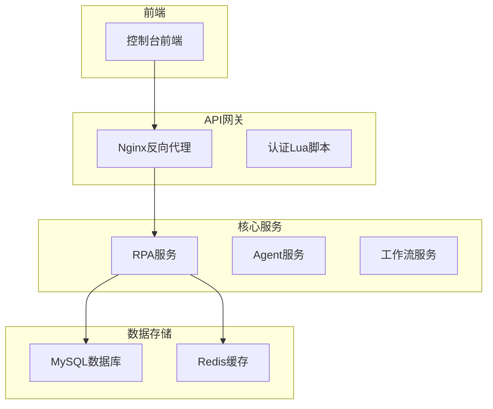
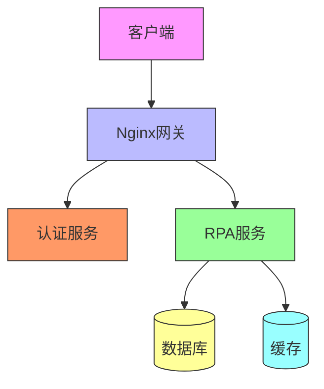
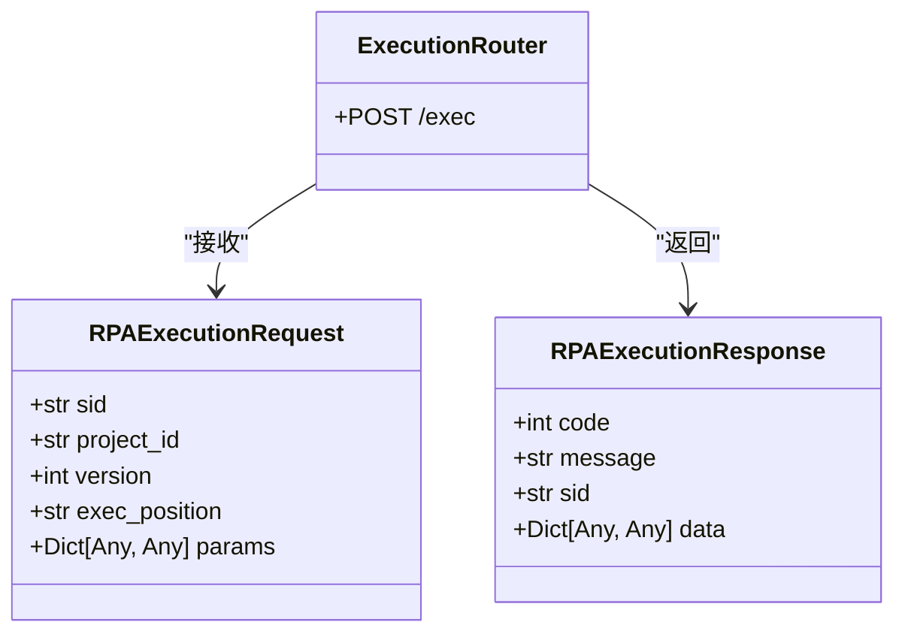
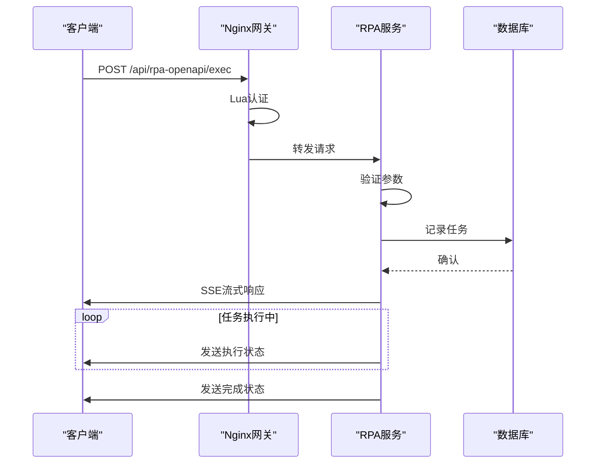
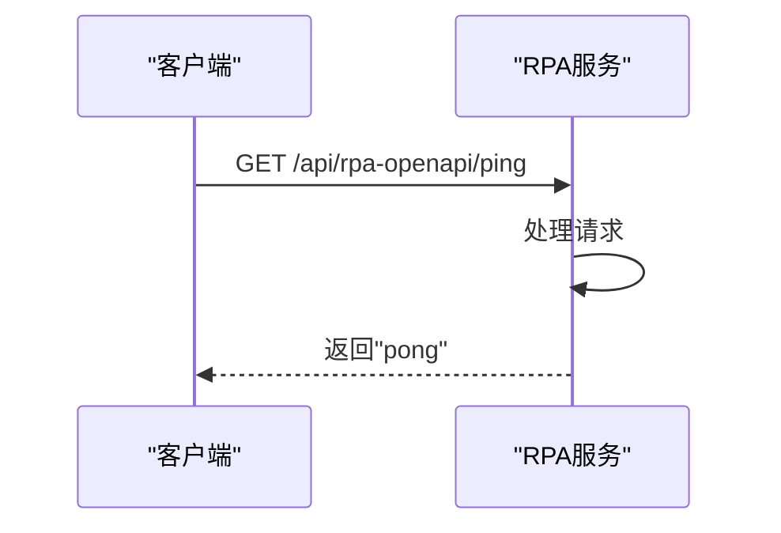
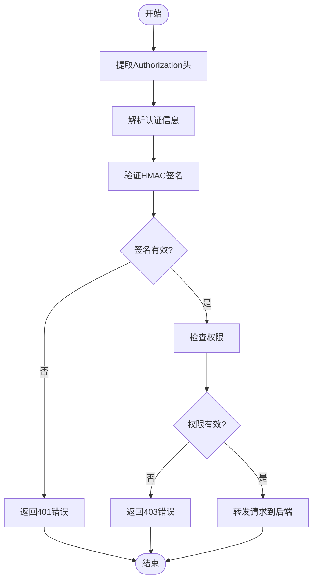
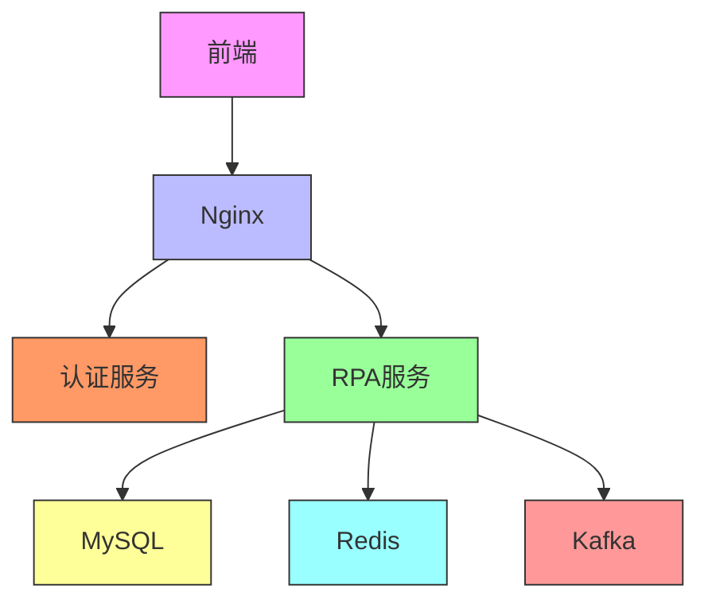

# API集成

<cite>
**本文档引用的文件**  
- [router.py](file://core/plugin/rpa/api/router.py)
- [execution.py](file://core/plugin/rpa/api/v1/execution.py)
- [health_check.py](file://core/plugin/rpa/api/v1/health_check.py)
- [execution_schema.py](file://core/plugin/rpa/api/schemas/execution_schema.py)
- [const.py](file://core/plugin/rpa/consts/const.py)
- [hmac_auth.py](file://core/common/utils/hmac_auth.py)
- [rpa.ts](file://console/frontend/src/services/rpa.ts)
- [rpa.sql](file://docker/astronAgent/astronRPA/volumes/mysql/schema.sql)
- [default.conf](file://docker/astronAgent/astronRPA/volumes/nginx/default.conf)
- [auth_handler.lua](file://docker/astronAgent/astronRPA/volumes/nginx/lua/auth_handler.lua)
</cite>

## 目录
1. [简介](#简介)
2. [项目结构](#项目结构)
3. [核心组件](#核心组件)
4. [架构概述](#架构概述)
5. [详细组件分析](#详细组件分析)
6. [依赖分析](#依赖分析)
7. [性能考虑](#性能考虑)
8. [故障排除指南](#故障排除指南)
9. [结论](#结论)

## 简介
本文档全面介绍了RPA服务提供的RESTful API接口，包括任务执行、状态查询、结果获取等端点。文档详细说明了API的认证机制（如HMAC签名）、请求/响应格式、错误码定义和速率限制策略。同时解释了后端服务如何处理API请求，包括任务队列管理、执行调度、结果存储等实现细节。提供了多种编程语言的客户端调用示例，展示了如何从外部系统触发RPA任务。文档还包含了安全最佳实践，如密钥管理、敏感数据加密、访问控制等，并阐述了API集成的典型应用场景。

## 项目结构
项目采用微服务架构，主要分为前端控制台、核心服务和基础设施三大部分。RPA API服务位于核心服务的plugin/rpa目录下，通过FastAPI框架实现RESTful接口。前端控制台使用React框架构建，通过API与后端服务通信。基础设施部分包括Nginx反向代理、MySQL数据库和Redis缓存等。

**图源**  
- [default.conf](file://docker/astronAgent/astronRPA/volumes/nginx/default.conf)
- [router.py](file://core/plugin/rpa/api/router.py)

**本节来源**  
- [router.py](file://core/plugin/rpa/api/router.py)
- [default.conf](file://docker/astronAgent/astronRPA/volumes/nginx/default.conf)

## 核心组件
RPA API的核心组件包括执行API、健康检查API和认证机制。执行API负责处理RPA任务的创建和执行，支持流式响应。健康检查API提供服务状态检测功能。认证机制采用HMAC签名方式，确保API调用的安全性。

**本节来源**  
- [execution.py](file://core/plugin/rpa/api/v1/execution.py)
- [health_check.py](file://core/plugin/rpa/api/v1/health_check.py)
- [hmac_auth.py](file://core/common/utils/hmac_auth.py)

## 架构概述
系统采用分层架构设计，前端通过Nginx反向代理访问后端API服务。Nginx负责请求路由和认证处理，后端服务实现具体的业务逻辑。数据库用于持久化存储任务信息、执行记录等数据。

**图源**  
- [default.conf](file://docker/astronAgent/astronRPA/volumes/nginx/default.conf)
- [router.py](file://core/plugin/rpa/api/router.py)

## 详细组件分析

### RPA执行API分析
RPA执行API提供任务执行功能，支持流式响应。API通过POST请求接收执行参数，返回SSE（Server-Sent Events）流式响应。

#### 执行API类图

**图源**  
- [execution_schema.py](file://core/plugin/rpa/api/schemas/execution_schema.py)
- [execution.py](file://core/plugin/rpa/api/v1/execution.py)

#### 执行API序列图

**图源**  
- [execution.py](file://core/plugin/rpa/api/v1/execution.py)
- [default.conf](file://docker/astronAgent/astronRPA/volumes/nginx/default.conf)

**本节来源**  
- [execution.py](file://core/plugin/rpa/api/v1/execution.py)
- [execution_schema.py](file://core/plugin/rpa/api/schemas/execution_schema.py)

### 健康检查API分析
健康检查API提供服务状态检测功能，通过简单的ping-pong机制验证服务可用性。

#### 健康检查API序列图

**图源**  
- [health_check.py](file://core/plugin/rpa/api/v1/health_check.py)

**本节来源**  
- [health_check.py](file://core/plugin/rpa/api/v1/health_check.py)

### 认证机制分析
系统采用HMAC签名认证机制，确保API调用的安全性。Nginx通过Lua脚本调用认证服务进行权限验证。

#### 认证流程图

**图源**  
- [auth_handler.lua](file://docker/astronAgent/astronRPA/volumes/nginx/lua/auth_handler.lua)
- [hmac_auth.py](file://core/common/utils/hmac_auth.py)

**本节来源**  
- [auth_handler.lua](file://docker/astronAgent/astronRPA/volumes/nginx/lua/auth_handler.lua)
- [hmac_auth.py](file://core/common/utils/hmac_auth.py)

## 依赖分析
系统各组件之间存在明确的依赖关系。前端依赖API网关，API网关依赖认证服务和RPA服务，RPA服务依赖数据库和缓存服务。

**图源**  
- [default.conf](file://docker/astronAgent/astronRPA/volumes/nginx/default.conf)
- [const.py](file://core/plugin/rpa/consts/const.py)

**本节来源**  
- [default.conf](file://docker/astronAgent/astronRPA/volumes/nginx/default.conf)
- [const.py](file://core/plugin/rpa/consts/const.py)

## 性能考虑
系统在设计时考虑了性能优化，包括使用Redis缓存频繁访问的数据、通过Kafka实现异步任务处理、采用SSE流式响应减少连接开销等。数据库查询经过优化，关键字段建立了适当的索引。

## 故障排除指南
当API调用出现问题时，可以按照以下步骤进行排查：
1. 检查请求的认证信息是否正确
2. 验证请求参数是否符合API规范
3. 查看Nginx日志和应用日志获取详细错误信息
4. 检查数据库连接是否正常
5. 验证Redis缓存服务是否可用

**本节来源**  
- [auth_handler.lua](file://docker/astronAgent/astronRPA/volumes/nginx/lua/auth_handler.lua)
- [execution.py](file://core/plugin/rpa/api/v1/execution.py)

## 结论
本文档详细介绍了RPA API集成的各个方面，包括接口定义、认证机制、架构设计和安全实践。通过遵循本文档的指导，开发者可以快速集成RPA服务，实现自动化任务的远程调用和管理。系统设计考虑了安全性、性能和可扩展性，能够满足企业级应用的需求。