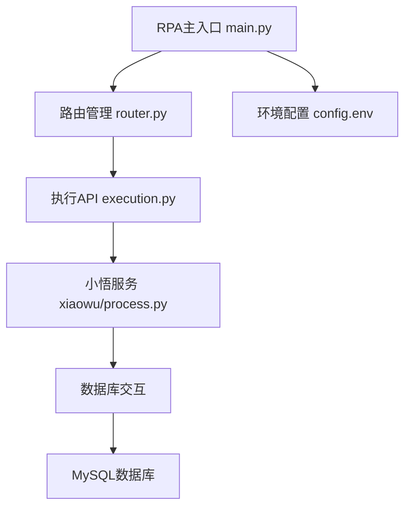
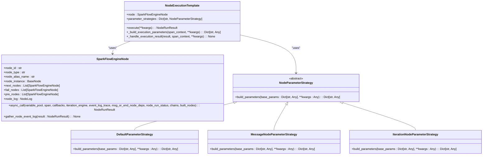
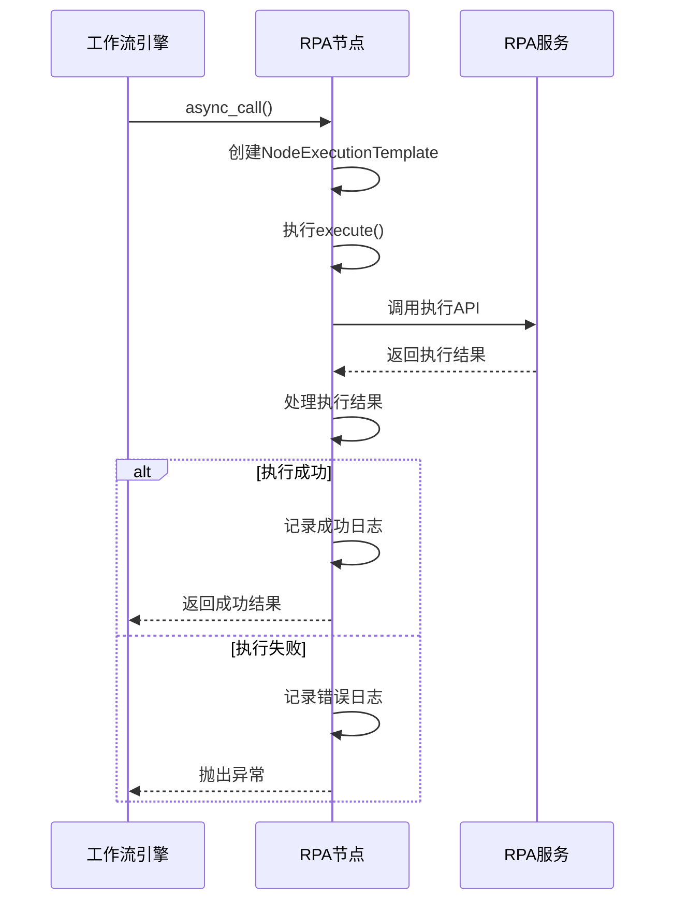
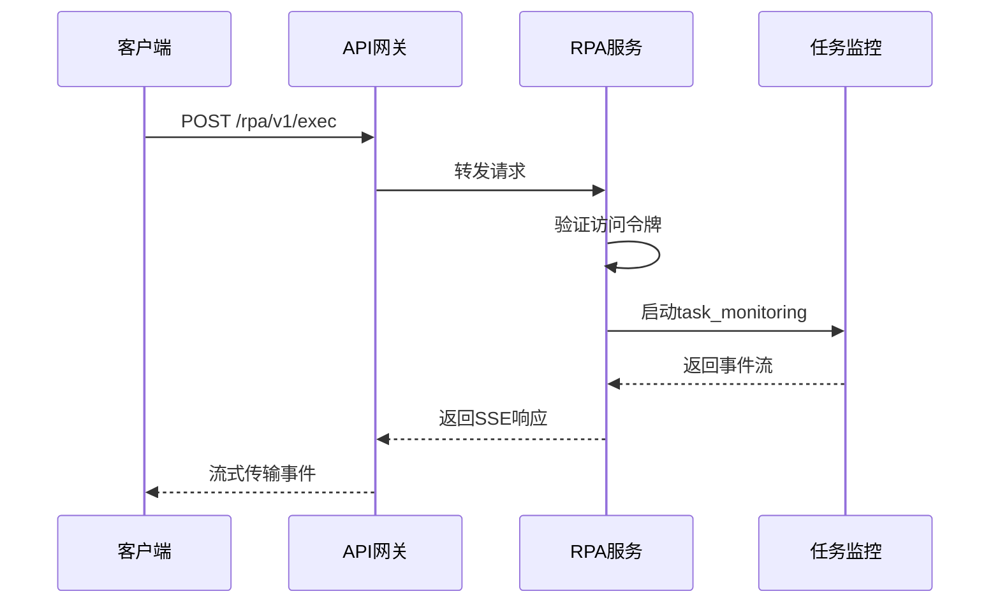
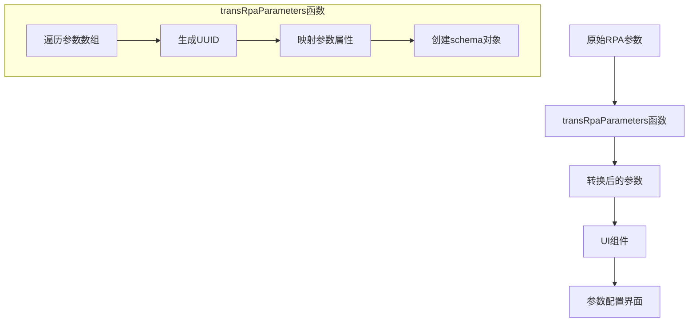
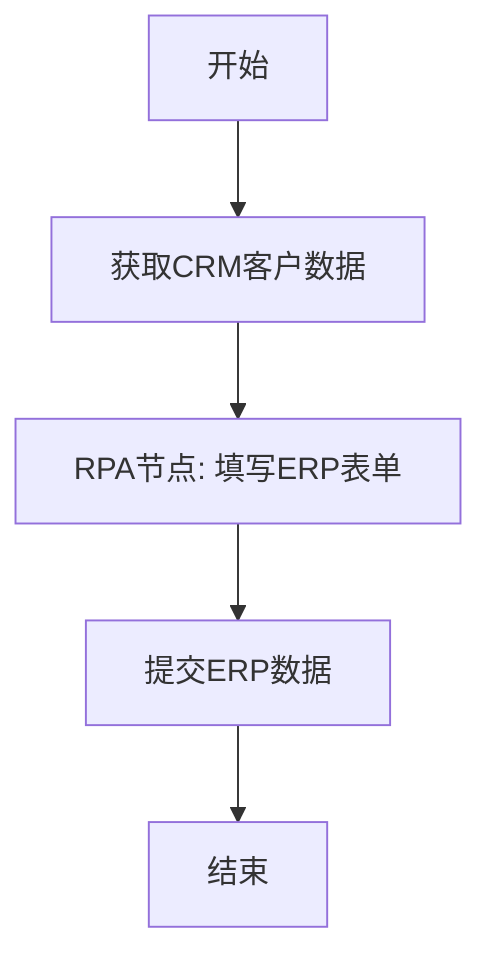
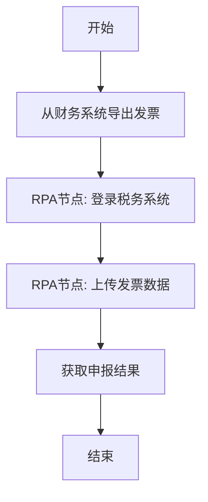
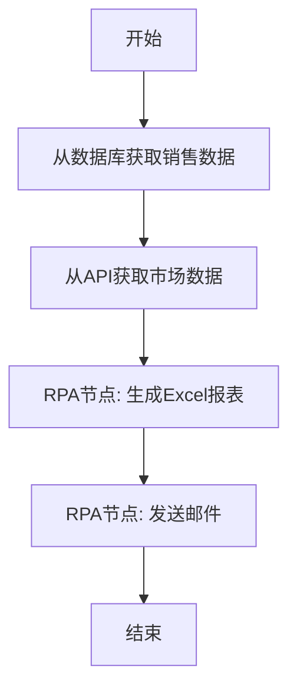

# RPA集成模式

<cite>
**本文档引用的文件**
- [rpa.ts](file://console/frontend/src/services/rpa.ts)
- [rpa.py](file://core/plugin/rpa/main.py)
- [router.py](file://core/plugin/rpa/api/router.py)
- [execution.py](file://core/plugin/rpa/api/v1/execution.py)
- [node.py](file://core/workflow/engine/node.py)
- [rpa.ts](file://console/frontend/src/types/rpa.ts)
- [rpa.ts](file://console/frontend/src/utils/rpa.ts)
- [schema.sql](file://docker/astronAgent/astronRPA/volumes/mysql/schema.sql)
</cite>

## 目录
1. [引言](#引言)
2. [RPA服务架构](#rpa服务架构)
3. [工作流中的RPA节点集成](#工作流中的rpa节点集成)
4. [REST API触发RPA任务](#rest-api触发rpa任务)
5. [前端工作流编辑器与RPA服务交互](#前端工作流编辑器与rpa服务交互)
6. [RPA集成场景示例](#rpa集成场景示例)
7. [安全考虑与最佳实践](#安全考虑与最佳实践)
8. [结论](#结论)

## 引言
本文档全面介绍RPA（机器人流程自动化）服务与其他系统组件的集成模式。文档详细说明了RPA节点在工作流引擎中的实现机制，包括参数传递、状态同步、错误传播等交互模式。同时，文档解释了前端工作流编辑器如何与RPA服务交互，包括节点配置、执行预览、结果展示等功能实现。通过多种集成场景的实战示例，如自动化数据录入、跨系统集成、报表生成等，展示了RPA集成的灵活性和强大功能。最后，文档包含了安全考虑，如API调用的认证授权、敏感数据处理、执行权限控制等最佳实践。

## RPA服务架构
RPA服务采用模块化设计，通过FastAPI框架提供RESTful API接口。服务的核心组件包括主入口、路由管理、执行引擎和数据库交互。主入口文件`main.py`负责初始化Python路径、加载环境变量并启动FastAPI服务。路由管理通过`router.py`文件实现，定义了统一的API前缀`/rpa/v1`，并将执行相关的路由注册到主路由器。



**Diagram sources**
- [main.py](file://core/plugin/rpa/main.py)
- [router.py](file://core/plugin/rpa/api/router.py)
- [execution.py](file://core/plugin/rpa/api/v1/execution.py)

**Section sources**
- [main.py](file://core/plugin/rpa/main.py#L1-L111)
- [router.py](file://core/plugin/rpa/api/router.py#L1-L17)

## 工作流中的RPA节点集成
在工作流引擎中，RPA节点作为特殊类型的节点被集成。当工作流执行到RPA节点时，工作流引擎会调用RPA服务的执行API，传递必要的参数并接收执行结果。RPA节点的实现机制基于模板方法模式和策略模式，确保了执行过程的灵活性和可扩展性。

### 参数传递机制
RPA节点的参数传递通过`NodeExecutionTemplate`类实现。该类在执行节点时，会根据节点类型选择合适的参数构建策略。对于RPA节点，参数包括变量池、追踪跨度、回调处理器等。参数构建完成后，通过`async_execute`方法异步执行RPA任务。



**Diagram sources**
- [node.py](file://core/workflow/engine/node.py#L1-L960)

**Section sources**
- [node.py](file://core/workflow/engine/node.py#L1-L960)

### 状态同步与错误传播
RPA节点的状态同步通过`NodeLog`类实现。在节点执行开始时，设置开始时间；在执行结束时，设置结束时间，并记录输入输出数据和令牌消耗。如果执行失败，`_handle_failed_result`方法会记录错误信息并抛出异常，确保错误能够传播到工作流的其他部分。



**Diagram sources**
- [node.py](file://core/workflow/engine/node.py#L1-L960)

**Section sources**
- [node.py](file://core/workflow/engine/node.py#L1-L960)

## REST API触发RPA任务
RPA服务通过REST API提供任务触发功能。客户端可以通过POST请求调用`/rpa/v1/exec`端点来执行RPA任务。API要求提供访问令牌、会话ID、项目ID、版本、执行位置和参数等信息。

### API调用流程
1. 客户端构造包含必要参数的请求体
2. 在请求头中添加访问令牌
3. 发送POST请求到`/rpa/v1/exec`端点
4. 服务端验证令牌并启动RPA任务监控
5. 返回SSE（Server-Sent Events）流式响应



**Diagram sources**
- [execution.py](file://core/plugin/rpa/api/v1/execution.py#L1-L58)

**Section sources**
- [execution.py](file://core/plugin/rpa/api/v1/execution.py#L1-L58)

### 请求参数说明
| 参数 | 类型 | 必填 | 描述 |
|------|------|------|------|
| Authorization | string | 是 | 访问令牌，格式为"Bearer {token}" |
| sid | string | 是 | 会话ID，用于追踪执行过程 |
| project_id | string | 是 | 项目ID，标识要执行的RPA项目 |
| version | string | 是 | 项目版本号 |
| exec_position | string | 否 | 执行位置，指定从哪个节点开始执行 |
| params | object | 否 | 传递给RPA任务的参数 |

## 前端工作流编辑器与RPA服务交互
前端工作流编辑器通过React Flow库实现可视化工作流设计。编辑器与RPA服务的交互主要体现在RPA节点的配置、执行预览和结果展示等方面。

### 节点配置
前端通过`rpa.ts`服务文件提供的API与RPA服务交互。主要的API包括：
- `getRpaSourceList()`: 获取RPA源列表
- `createRpa(params)`: 创建RPA配置
- `getRpaDetail(id)`: 获取RPA详细信息
- `updateRpa(id, params)`: 更新RPA配置
- `deleteRpa(id)`: 删除RPA配置
- `getRpaList(params)`: 获取RPA列表

```mermaid
classDiagram
class RpaInfo {
+id : number
+category : string
+name : string
+value : string
+isDeleted : number
+remarks : string | null
+icon : string | null
+createTime : string
+updateTime : string
+assistantName? : string
+status? : number
+userName? : string
+robotCount? : number
+path? : string
}
class RpaParameter {
+id : string
+varDirection : number
+varName : string
+varType : string
+type : string
+varValue : string
+varDescribe : string
+processId : string
+required? : boolean
+editable? : boolean
}
class RpaRobot {
+project_id : string
+name : string
+english_name : string
+description : string
+version : string
+status : number
+parameters : RpaParameter[]
+user_id : string
+created_at : string
+updated_at : string
+icon : string
+apiKey? : string
}
class RpaDetailInfo {
+id : number
+platformId : number
+assistantName : string
+status : number
+fields : {apiKey : string, [key : string] : string}
+robots : RpaRobot[]
+createTime : string
+icon? : string
+replaceFields? : boolean
+userName? : string
+remarks? : string
+platform? : string
+updateTime : string
}
class RpaFormInfo {
+platformId : string
+assistantName? : string
+icon? : string
+fields : {apiKey : string}
+replaceFields? : boolean
+remarks? : string
}
class RpaNode {
+nodeType : string
+data : {nodeParam : {projectId : string}}
}
class RpaNodeParam {
+fields : RpaDetailInfo['fields']
+platform? : string
+rpaId? : number
}
RpaNode --> RpaNodeParam : "extends"
RpaDetailInfo --> RpaRobot : "contains"
RpaRobot --> RpaParameter : "contains"
```

**Diagram sources**
- [rpa.ts](file://console/frontend/src/types/rpa.ts#L1-L114)

**Section sources**
- [rpa.ts](file://console/frontend/src/services/rpa.ts#L1-L34)
- [rpa.ts](file://console/frontend/src/types/rpa.ts#L1-L114)

### 执行预览与结果展示
前端工作流编辑器通过`transRpaParameters`工具函数将RPA参数转换为适合UI展示的格式。该函数使用`uuid`生成唯一ID，并将参数信息映射到标准的输入配置对象。



**Diagram sources**
- [rpa.ts](file://console/frontend/src/utils/rpa.ts#L1-L19)

**Section sources**
- [rpa.ts](file://console/frontend/src/utils/rpa.ts#L1-L19)

## RPA集成场景示例
### 自动化数据录入
在自动化数据录入场景中，RPA节点可以连接到外部系统，自动填写表单并提交数据。例如，从CRM系统获取客户信息，然后自动填写到ERP系统中。



### 跨系统集成
RPA节点可以作为不同系统之间的桥梁，实现数据的自动同步。例如，将财务系统中的发票数据同步到税务申报系统。



### 报表生成
RPA节点可以定期从多个数据源收集数据，生成综合报表并发送给相关人员。



## 安全考虑与最佳实践
### API调用的认证授权
RPA服务的API调用需要通过访问令牌进行认证。令牌通过请求头中的`Authorization`字段传递，格式为"Bearer {token}"。服务端会验证令牌的有效性，确保只有授权用户才能执行RPA任务。

### 敏感数据处理
在处理敏感数据时，应遵循以下最佳实践：
1. 使用加密存储敏感信息，如API密钥
2. 在日志中避免记录敏感数据
3. 使用安全的传输协议（HTTPS）
4. 定期轮换访问令牌

### 执行权限控制
RPA任务的执行应受到严格的权限控制：
1. 基于角色的访问控制（RBAC），确保用户只能执行其权限范围内的任务
2. 任务执行前的审批流程
3. 详细的审计日志，记录所有RPA任务的执行情况

## 结论
本文档详细介绍了RPA服务与其他系统组件的集成模式。通过工作流中的RPA节点集成和REST API触发RPA任务，系统实现了灵活的自动化能力。前端工作流编辑器提供了直观的配置界面，使用户能够轻松设计和管理RPA流程。多种集成场景的示例展示了RPA在实际应用中的强大功能。最后，通过实施严格的安全措施，确保了RPA集成的安全性和可靠性。