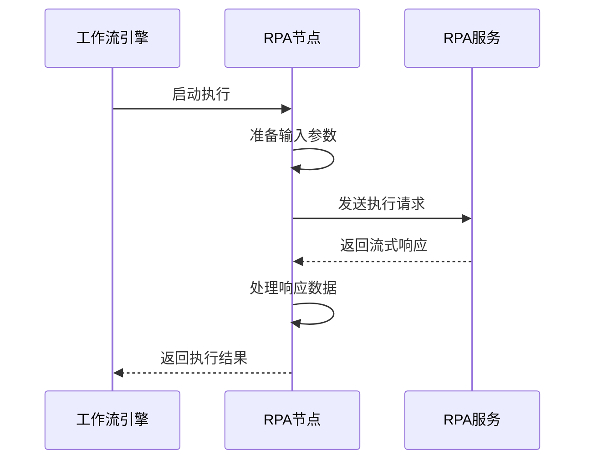
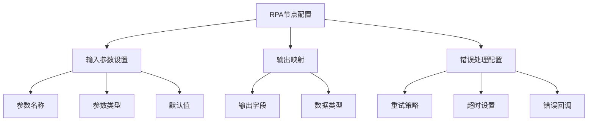
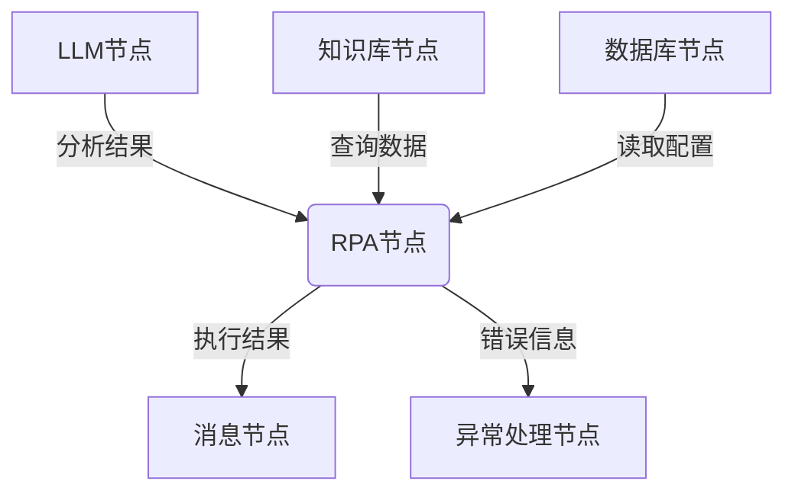
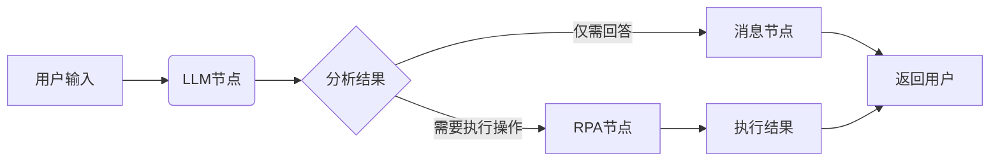
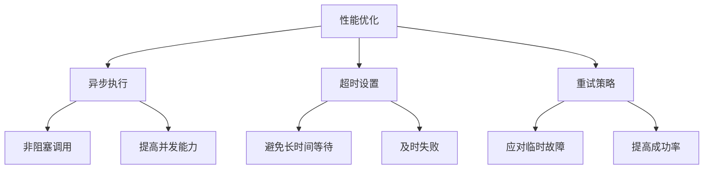

# 工作流集成

<cite>
**本文档引用的文件**
- [rpa_node.py](file://core/workflow/engine/nodes/rpa/rpa_node.py)
- [rpa_keys.py](file://core/plugin/rpa/consts/rpa/rpa_keys.py)
- [rpa.ts](file://console/frontend/src/services/rpa.ts)
- [rpa.ts](file://console/frontend/src/types/rpa.ts)
- [rpa.ts](file://console/frontend/src/utils/rpa.ts)
- [node.py](file://core/workflow/engine/node.py)
- [fixed-inputs/index.tsx](file://console/frontend/src/components/workflow/nodes/components/fixed-inputs/index.tsx)
- [fixed-outputs/index.tsx](file://console/frontend/src/components/workflow/nodes/components/fixed-outputs/index.tsx)
- [exception-handling.tsx](file://console/frontend/src/components/workflow/nodes/components/exception-handling.tsx)
</cite>

## 目录
1. [引言](#引言)
2. [RPA节点实现机制](#rpa节点实现机制)
3. [前端工作流编辑器](#前端工作流编辑器)
4. [协同工作模式](#协同工作模式)
5. [实际案例](#实际案例)
6. [性能优化建议](#性能优化建议)
7. [结论](#结论)

## 引言
本文档详细阐述了在开发工作流中RPA（机器人流程自动化）的集成机制。重点介绍RPA节点在工作流引擎中的实现方式，包括节点配置、参数映射、执行流程和结果处理。同时，详细说明RPA节点如何与LLM（大语言模型）、知识库、数据库等其他工作流节点协同工作，以及前端工作流编辑器如何支持RPA节点的可视化配置。

## RPA节点实现机制

RPA节点的实现基于工作流引擎的核心架构，通过定义清晰的输入输出接口和执行逻辑来集成外部RPA服务。节点的执行过程包括参数准备、服务调用、结果处理和错误管理。

**图表来源**
- [rpa_node.py](file://core/workflow/engine/nodes/rpa/rpa_node.py#L1-L166)

**本节来源**
- [rpa_node.py](file://core/workflow/engine/nodes/rpa/rpa_node.py#L1-L166)

## 前端工作流编辑器

前端工作流编辑器提供了RPA节点的可视化配置界面，支持输入参数设置、输出映射和错误处理配置。编辑器通过组件化设计实现了配置功能的模块化和复用。

**图表来源**
- [fixed-inputs/index.tsx](file://console/frontend/src/components/workflow/nodes/components/fixed-inputs/index.tsx#L0-L85)
- [fixed-outputs/index.tsx](file://console/frontend/src/components/workflow/nodes/components/fixed-outputs/index.tsx#L0-L45)
- [exception-handling.tsx](file://console/frontend/src/components/workflow/nodes/components/exception-handling.tsx)

**本节来源**
- [fixed-inputs/index.tsx](file://console/frontend/src/components/workflow/nodes/components/fixed-inputs/index.tsx#L0-L85)
- [fixed-outputs/index.tsx](file://console/frontend/src/components/workflow/nodes/components/fixed-outputs/index.tsx#L0-L45)
- [exception-handling.tsx](file://console/frontend/src/components/workflow/nodes/components/exception-handling.tsx)

## 协同工作模式

RPA节点与其他工作流节点的协同工作模式体现了工作流引擎的灵活性和扩展性。通过标准化的接口定义，RPA节点可以无缝集成到复杂的工作流中，与其他节点形成完整的业务流程。

**图表来源**
- [rpa_node.py](file://core/workflow/engine/nodes/rpa/rpa_node.py#L1-L166)
- [node.py](file://core/workflow/engine/node.py#L0-L799)

**本节来源**
- [rpa_node.py](file://core/workflow/engine/nodes/rpa/rpa_node.py#L1-L166)
- [node.py](file://core/workflow/engine/node.py#L0-L799)

## 实际案例

以下是一个复杂工作流的编排示例，展示了如何通过LLM分析文本后调用RPA执行相应操作。该案例体现了RPA节点在实际业务场景中的应用价值。

**图表来源**
- [rpa_node.py](file://core/workflow/engine/nodes/rpa/rpa_node.py#L1-L166)

**本节来源**
- [rpa_node.py](file://core/workflow/engine/nodes/rpa/rpa_node.py#L1-L166)

## 性能优化建议

为了确保RPA节点在工作流中的高效运行，建议采用以下最佳实践：异步执行、合理的超时设置和重试策略。这些优化措施可以显著提升工作流的稳定性和响应速度。

**图表来源**
- [rpa_keys.py](file://core/plugin/rpa/consts/rpa/rpa_keys.py#L0-L7)
- [rpa_node.py](file://core/workflow/engine/nodes/rpa/rpa_node.py#L1-L166)

**本节来源**
- [rpa_keys.py](file://core/plugin/rpa/consts/rpa/rpa_keys.py#L0-L7)
- [rpa_node.py](file://core/workflow/engine/nodes/rpa/rpa_node.py#L1-L166)

## 结论
RPA节点的集成为工作流引擎提供了强大的自动化能力。通过清晰的实现机制、友好的前端配置界面和灵活的协同工作模式，RPA节点能够有效支持复杂的业务流程自动化需求。结合性能优化建议，可以构建高效、稳定的工作流系统，为企业数字化转型提供有力支持。