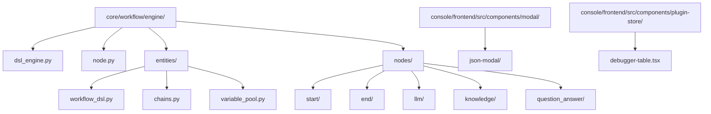
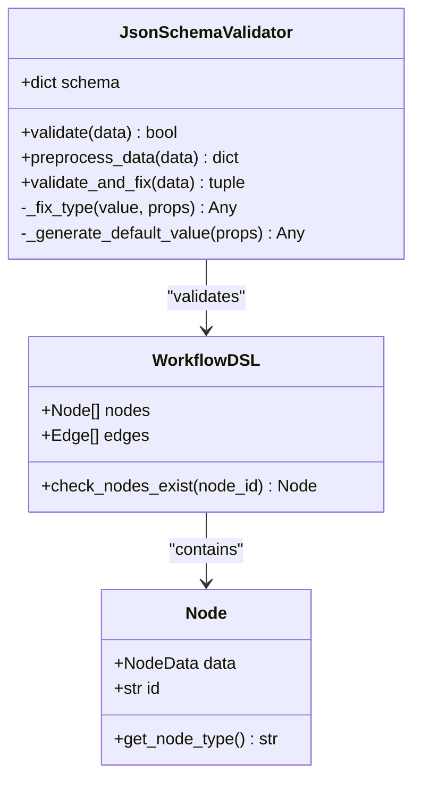
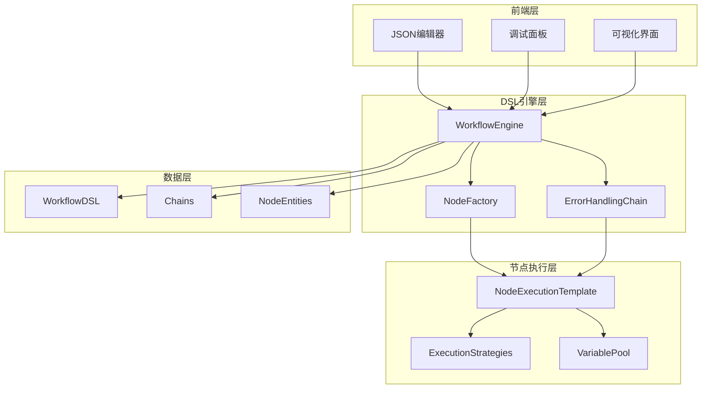
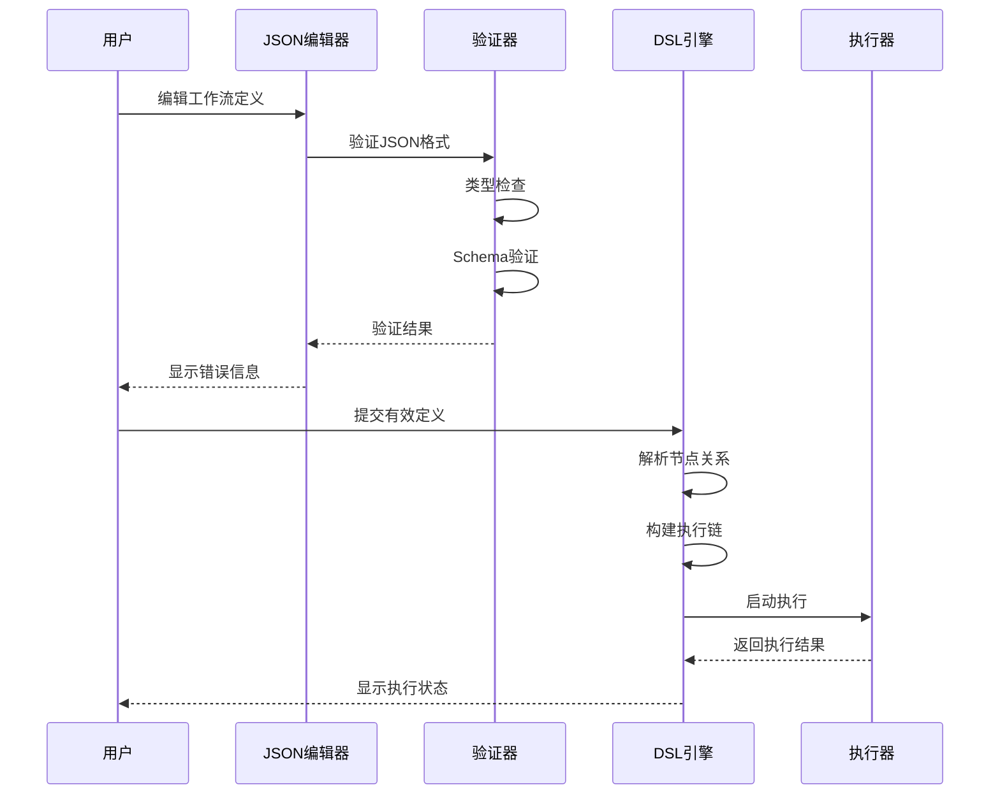
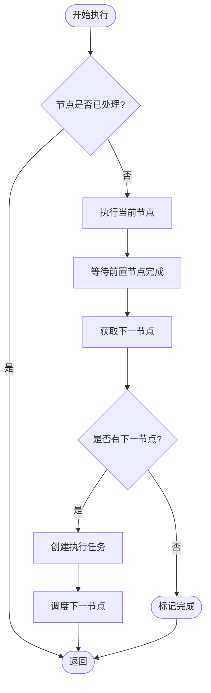
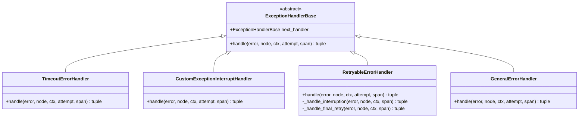
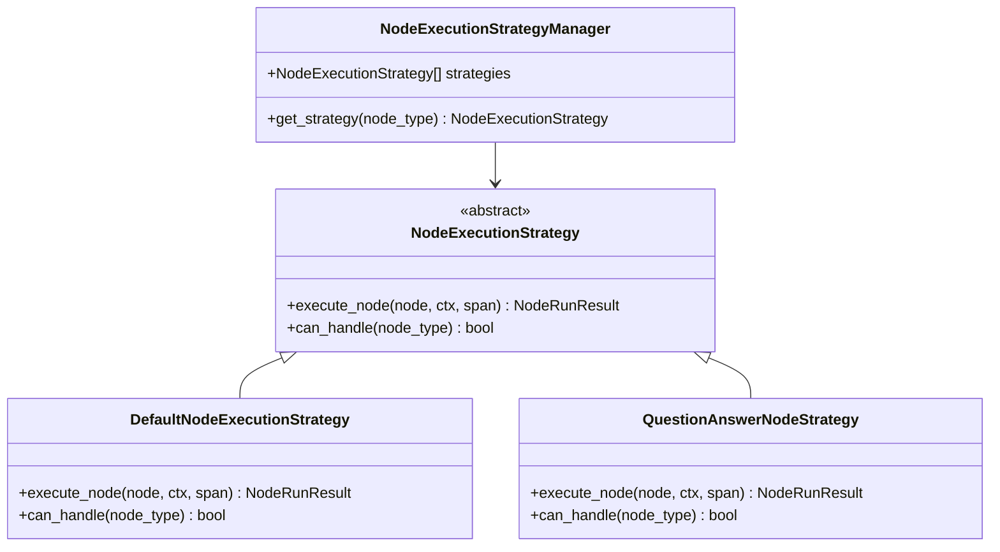
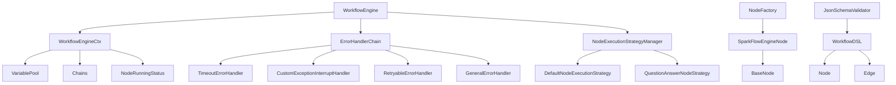
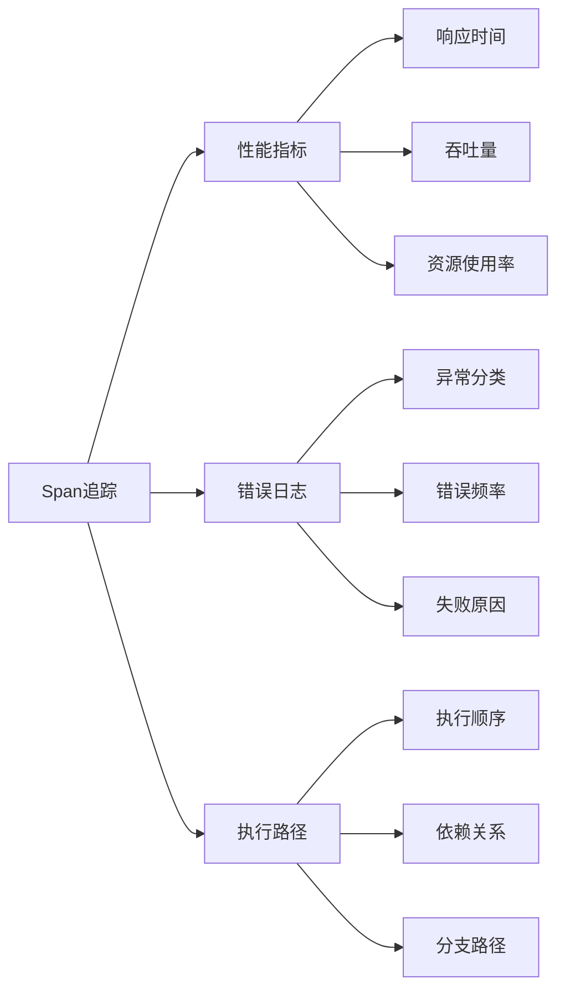
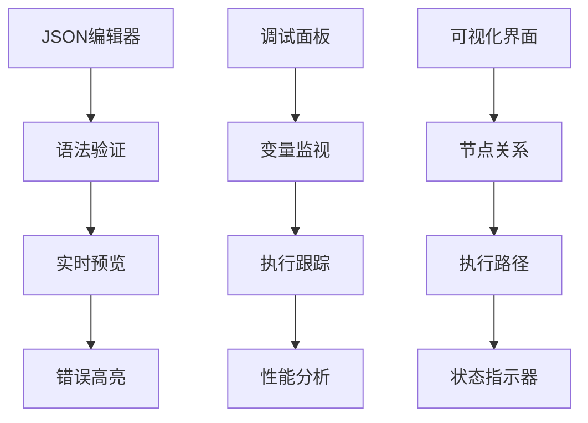

# DSL引擎技术文档

<cite>
**本文档引用的文件**
- [dsl_engine.py](file://core/workflow/engine/dsl_engine.py)
- [workflow_dsl.py](file://core/workflow/engine/entities/workflow_dsl.py)
- [node.py](file://core/workflow/engine/node.py)
- [json_schema_validator.py](file://core/common/utils/json_schema/json_schema_validator.py)
- [chains.py](file://core/workflow/engine/entities/chains.py)
- [index.tsx](file://console/frontend/src/components/modal/json-modal/index.tsx)
- [debugger-table.tsx](file://console/frontend/src/components/plugin-store/debugger-table.tsx)
</cite>

## 目录
1. [概述](#概述)
2. [项目结构](#项目结构)
3. [核心组件](#核心组件)
4. [架构概览](#架构概览)
5. [详细组件分析](#详细组件分析)
6. [依赖关系分析](#依赖关系分析)
7. [性能考虑](#性能考虑)
8. [故障排除指南](#故障排除指南)
9. [结论](#结论)

## 概述

DSL引擎是astron-agent项目中的核心工作流处理系统，负责解析、验证和执行基于领域特定语言（DSL）的工作流定义。该引擎采用深度优先搜索算法，支持复杂的节点拓扑排序、依赖关系解析和执行序列生成，为整个系统提供了强大的工作流编排能力。

DSL引擎的主要特性包括：
- 基于JSON Schema的严格验证机制
- 支持多种节点类型的执行策略
- 完善的错误处理和重试机制
- 实时监控和调试功能
- 高性能的异步执行架构

## 项目结构

DSL引擎的核心文件组织结构如下：

**图表来源**
- [dsl_engine.py](file://core/workflow/engine/dsl_engine.py#L1-L50)
- [workflow_dsl.py](file://core/workflow/engine/entities/workflow_dsl.py#L1-L30)

**章节来源**
- [dsl_engine.py](file://core/workflow/engine/dsl_engine.py#L1-L100)
- [workflow_dsl.py](file://core/workflow/engine/entities/workflow_dsl.py#L1-L50)

## 核心组件

### DSL引擎核心类

DSL引擎由以下核心类组成：

1. **WorkflowEngine** - 主执行引擎，负责整体工作流的调度和执行
2. **WorkflowEngineCtx** - 执行上下文，管理变量池、节点状态和依赖关系
3. **SparkFlowEngineNode** - 单个节点的封装，包含节点实例和关系管理
4. **NodeExecutionTemplate** - 节点执行模板，使用模板方法模式统一执行逻辑

### JSON Schema验证系统

引擎集成了强大的JSON Schema验证系统，确保工作流定义的正确性：

**图表来源**
- [json_schema_validator.py](file://core/common/utils/json_schema/json_schema_validator.py#L15-L50)
- [workflow_dsl.py](file://core/workflow/engine/entities/workflow_dsl.py#L80-L120)

**章节来源**
- [json_schema_validator.py](file://core/common/utils/json_schema/json_schema_validator.py#L1-L150)
- [workflow_dsl.py](file://core/workflow/engine/entities/workflow_dsl.py#L1-L162)

## 架构概览

DSL引擎采用分层架构设计，从上到下分为表示层、业务逻辑层和数据访问层：

**图表来源**
- [dsl_engine.py](file://core/workflow/engine/dsl_engine.py#L800-L900)
- [node.py](file://core/workflow/engine/node.py#L1-L100)

## 详细组件分析

### DSL到执行计划的转换

DSL引擎的核心功能是从JSON格式的工作流定义转换为可执行的执行计划：

**图表来源**
- [dsl_engine.py](file://core/workflow/engine/dsl_engine.py#L800-L900)
- [json_schema_validator.py](file://core/common/utils/json_schema/json_schema_validator.py#L20-L60)

### 节点拓扑排序和依赖关系解析

引擎使用深度优先搜索算法进行节点拓扑排序：

**图表来源**
- [dsl_engine.py](file://core/workflow/engine/dsl_engine.py#L1300-L1400)

### 错误处理和重试机制

DSL引擎实现了完善的错误处理链：

**图表来源**
- [dsl_engine.py](file://core/workflow/engine/dsl_engine.py#L80-L200)

**章节来源**
- [dsl_engine.py](file://core/workflow/engine/dsl_engine.py#L80-L400)

### 执行策略管理

引擎支持多种节点执行策略：

**图表来源**
- [dsl_engine.py](file://core/workflow/engine/dsl_engine.py#L500-L650)

**章节来源**
- [dsl_engine.py](file://core/workflow/engine/dsl_engine.py#L500-L700)

## 依赖关系分析

DSL引擎的依赖关系复杂且层次分明：

**图表来源**
- [dsl_engine.py](file://core/workflow/engine/dsl_engine.py#L1-L100)
- [node.py](file://core/workflow/engine/node.py#L1-L50)

**章节来源**
- [dsl_engine.py](file://core/workflow/engine/dsl_engine.py#L1-L200)
- [node.py](file://core/workflow/engine/node.py#L1-L100)

## 性能考虑

### 异步执行优化

DSL引擎采用异步编程模型，通过以下方式提升性能：

1. **并发执行**：支持多个独立节点的并发执行
2. **流式处理**：对流式节点采用特殊的执行策略
3. **资源池化**：使用连接池和缓存减少资源消耗
4. **延迟加载**：按需创建和初始化节点实例

### 内存管理

引擎实现了智能的内存管理策略：

- **变量池优化**：高效的变量存储和检索机制
- **对象复用**：重用节点实例和执行上下文
- **垃圾回收**：及时释放不再需要的对象引用

### 监控和追踪

引擎内置了完整的监控和追踪系统：

**章节来源**
- [dsl_engine.py](file://core/workflow/engine/dsl_engine.py#L1200-L1400)

## 故障排除指南

### 常见错误类型

DSL引擎定义了多种错误类型及其处理策略：

| 错误类型 | 描述 | 处理策略 |
|---------|------|----------|
| NODE_RUN_ERROR | 节点执行错误 | 重试机制或中断执行 |
| PROTOCOL_VALIDATION_ERROR | 协议验证错误 | 返回自定义输出 |
| START_NODE_SCHEMA_ERROR | 起始节点模式错误 | 终止执行流程 |
| ENG_RUN_ERROR | 引擎运行错误 | 记录日志并终止 |

### 调试工具使用

前端提供了丰富的调试工具：

**图表来源**
- [index.tsx](file://console/frontend/src/components/modal/json-modal/index.tsx#L35-L89)
- [debugger-table.tsx](file://console/frontend/src/components/plugin-store/debugger-table.tsx#L1-L50)

### 错误诊断流程

当工作流执行出现问题时，可以按照以下流程进行诊断：

1. **检查JSON格式**：使用内置验证器检查语法错误
2. **验证节点类型**：确认节点类型是否受支持
3. **检查依赖关系**：验证节点间的连接是否正确
4. **查看执行日志**：分析详细的执行轨迹
5. **监控资源使用**：检查内存和CPU使用情况

**章节来源**
- [json_schema_validator.py](file://core/common/utils/json_schema/json_schema_validator.py#L20-L80)
- [index.tsx](file://console/frontend/src/components/modal/json-modal/index.tsx#L85-L106)

## 结论

DSL引擎作为astron-agent项目的核心组件，展现了现代工作流引擎的设计精髓。它不仅提供了强大的工作流编排能力，还通过完善的错误处理、性能优化和调试工具，确保了系统的稳定性和可维护性。

### 主要优势

1. **高度模块化**：清晰的职责分离和接口设计
2. **强大的扩展性**：支持自定义节点类型和执行策略
3. **完善的监控**：内置的追踪和日志系统
4. **高性能执行**：异步并发和智能资源管理
5. **易用性**：直观的调试工具和错误诊断

### 发展方向

未来DSL引擎可以在以下方面进一步优化：

- **分布式执行**：支持跨节点的工作流执行
- **动态编排**：运行时修改工作流结构
- **机器学习集成**：基于历史数据优化执行策略
- **云原生支持**：容器化和微服务架构适配

通过持续的优化和改进，DSL引擎将继续为astron-agent项目提供强大而可靠的工作流处理能力。