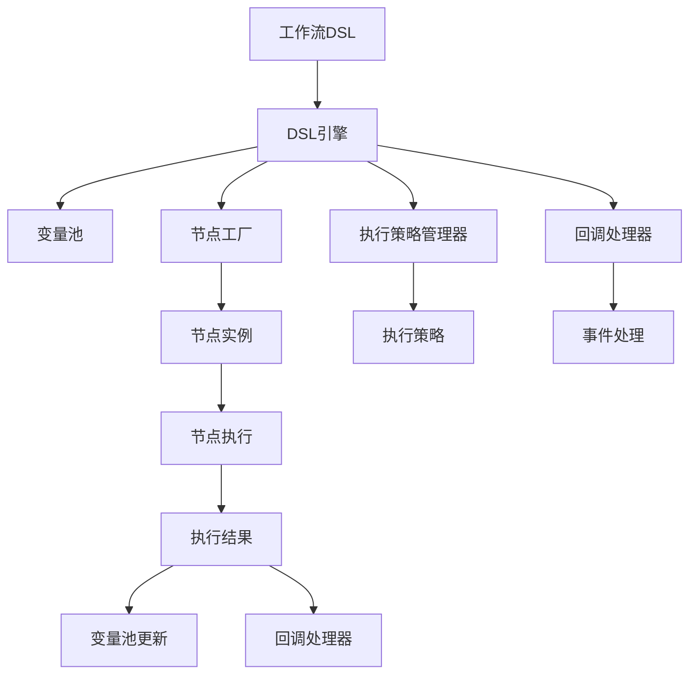
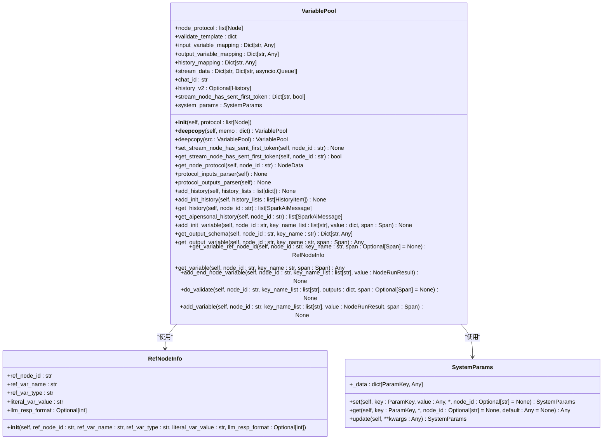
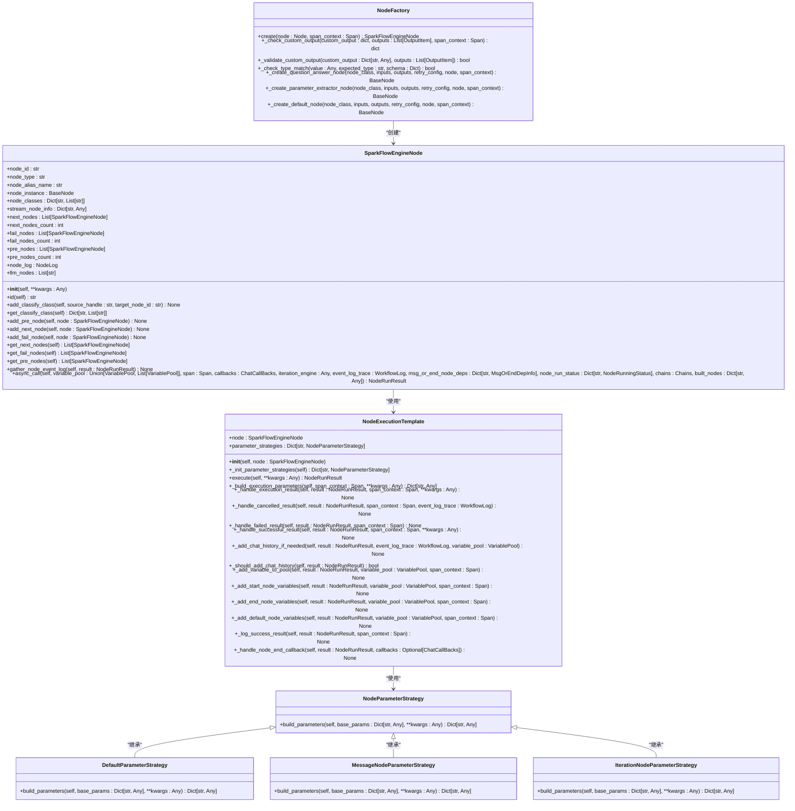
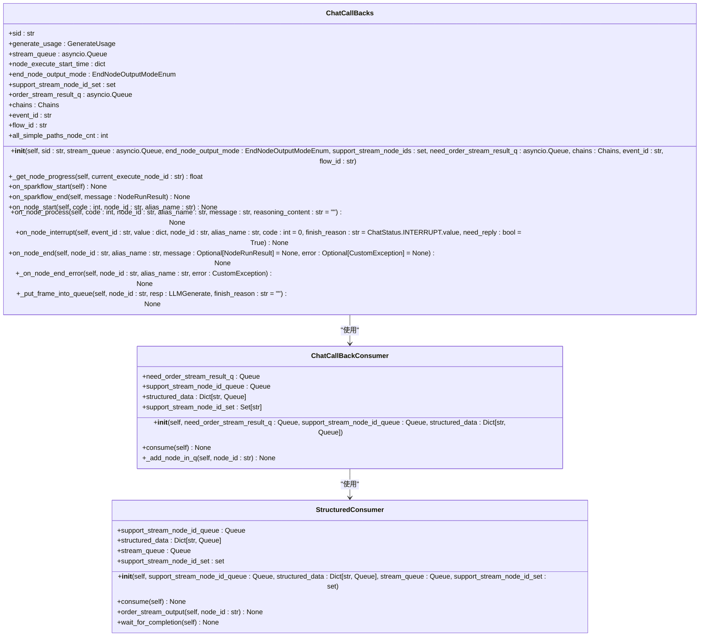
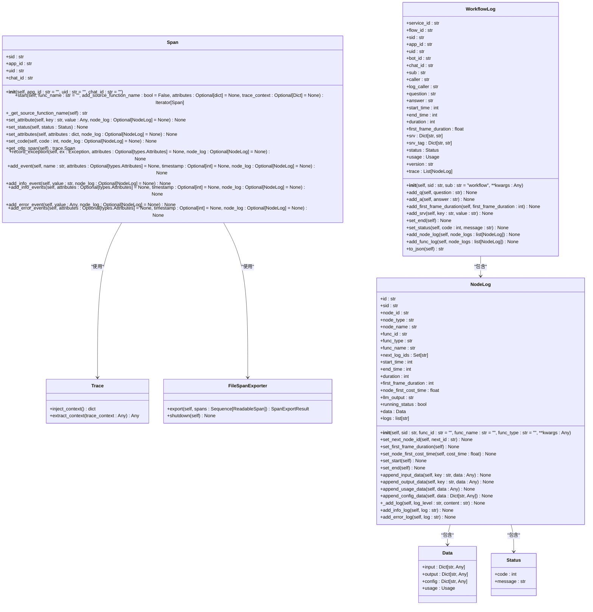
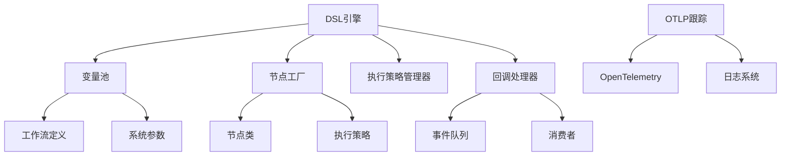

# 工作流执行引擎

<cite>
**本文档引用的文件**   
- [dsl_engine.py](file://core/workflow/engine/dsl_engine.py)
- [node.py](file://core/workflow/engine/node.py)
- [variable_pool.py](file://core/workflow/engine/entities/variable_pool.py)
- [workflow_dsl.py](file://core/workflow/engine/entities/workflow_dsl.py)
- [base_node.py](file://core/workflow/engine/nodes/base_node.py)
- [callback_handler.py](file://core/workflow/engine/callbacks/callback_handler.py)
- [span.py](file://core/workflow/extensions/otlp/trace/span.py)
- [trace.py](file://core/workflow/extensions/otlp/trace/trace.py)
- [workflow_log.py](file://core/workflow/extensions/otlp/log_trace/workflow_log.py)
- [node_log.py](file://core/workflow/extensions/otlp/log_trace/node_log.py)
</cite>

## 目录
1. [引言](#引言)
2. [项目结构](#项目结构)
3. [核心组件](#核心组件)
4. [架构概述](#架构概述)
5. [详细组件分析](#详细组件分析)
6. [依赖分析](#依赖分析)
7. [性能考虑](#性能考虑)
8. [故障排除指南](#故障排除指南)
9. [结论](#结论)

## 引言
本文档详细描述了工作流执行引擎的架构设计，包括DSL引擎的设计原理和解析流程、执行上下文管理机制、节点调度器工作原理、错误处理和重试机制、性能监控和日志追踪集成方式，以及为开发者提供的引擎扩展点使用指南。

## 项目结构
工作流执行引擎位于`core/workflow`目录下，主要包含以下模块：
- `api/`: 提供工作流相关的API接口
- `cache/`: 缓存相关功能
- `configs/`: 配置文件
- `consts/`: 常量定义
- `domain/`: 领域模型
- `engine/`: 核心执行引擎，包含DSL解析、节点执行等核心功能
- `exception/`: 异常处理
- `extensions/`: 扩展功能，如OTLP跟踪
- `infra/`: 基础设施
- `repository/`: 数据访问层
- `service/`: 业务服务
- `utils/`: 工具函数

**Section sources**
- [dsl_engine.py](file://core/workflow/engine/dsl_engine.py)
- [node.py](file://core/workflow/engine/node.py)

## 核心组件
工作流执行引擎的核心组件包括DSL引擎、变量池、节点工厂、执行策略管理器和回调处理器。DSL引擎负责解析工作流定义并执行节点；变量池管理执行过程中的变量；节点工厂创建具体的节点实例；执行策略管理器根据节点类型选择合适的执行策略；回调处理器处理执行过程中的事件。

**Section sources**
- [dsl_engine.py](file://core/workflow/engine/dsl_engine.py#L0-L2379)
- [variable_pool.py](file://core/workflow/engine/entities/variable_pool.py#L0-L806)
- [node.py](file://core/workflow/engine/node.py#L0-L960)

## 架构概述
工作流执行引擎采用模块化设计，各组件协同工作完成工作流的执行。引擎接收工作流DSL定义，通过DSL引擎解析并构建执行计划，利用变量池管理执行上下文，通过节点工厂创建节点实例，使用执行策略管理器选择合适的执行策略执行节点，并通过回调处理器处理执行过程中的事件。

**Diagram sources**
- [dsl_engine.py](file://core/workflow/engine/dsl_engine.py#L0-L2379)
- [variable_pool.py](file://core/workflow/engine/entities/variable_pool.py#L0-L806)

## 详细组件分析

### DSL引擎分析
DSL引擎是工作流执行的核心，负责解析工作流定义并执行节点。它使用深度优先搜索算法遍历工作流图，根据节点类型选择合适的执行策略执行节点，并处理执行过程中的异常。

#### DSL引擎类图

```mermaid
classDiagram
class WorkflowEngine {
+engine_ctx : WorkflowEngineCtx
+sparkflow_engine_node : SparkFlowEngineNode
+support_stream_node_ids : set
+node_max_token : dict
+workflow_dsl : WorkflowDSL
+__init__(self, workflow_dsl : WorkflowDSL)
+_depth_first_search_execution(self, node : SparkFlowEngineNode, engine_ctx : WorkflowEngineCtx, span : Span) asyncio.Task[NodeRunResult]
+_execute_message_node(self, node : SparkFlowEngineNode, engine_ctx : WorkflowEngineCtx, span : Span) NodeRunResult
}
class WorkflowEngineCtx {
+variable_pool : VariablePool
+iteration_engine : Dict[str, WorkflowEngine]
+msg_or_end_node_deps : Dict[str, MsgOrEndDepInfo]
+node_run_status : Dict[str, NodeRunningStatus]
+built_nodes : Dict[str, SparkFlowEngineNode]
+chains : Chains
+build_timestamp : int
+callback : ChatCallBacks
+event_log_trace : WorkflowLog
+qa_node_lock : asyncio.Lock
+end_complete : asyncio.Event
+responses : list[NodeRunResult]
+dfs_tasks : list[Task]
}
class ExceptionHandlerBase {
+next_handler : Optional[ExceptionHandlerBase]
+set_next(self, handler : ExceptionHandlerBase) ExceptionHandlerBase
+handle(self, error : Exception, node : SparkFlowEngineNode, workflow_engine_ctx : WorkflowEngineCtx, attempt : int, span : Span) Tuple[Optional[NodeRunResult], bool]
}
class TimeoutErrorHandler {
+handle(self, error : Exception, node : SparkFlowEngineNode, workflow_engine_ctx : WorkflowEngineCtx, attempt : int, span : Span) Tuple[Optional[NodeRunResult], bool]
}
class CustomExceptionInterruptHandler {
+handle(self, error : Exception, node : SparkFlowEngineNode, workflow_engine_ctx : WorkflowEngineCtx, attempt : int, span : Span) Tuple[Optional[NodeRunResult], bool]
}
class RetryableErrorHandler {
+handle(self, error : Exception, node : SparkFlowEngineNode, workflow_engine_ctx : WorkflowEngineCtx, attempt : int, span : Span) Tuple[Optional[NodeRunResult], bool]
}
class GeneralErrorHandler {
+handle(self, error : Exception, node : SparkFlowEngineNode, workflow_engine_ctx : WorkflowEngineCtx, attempt : int, span : Span) Tuple[Optional[NodeRunResult], bool]
}
class ErrorHandlerChain {
+chain : ExceptionHandlerBase
+_build_chain(self) ExceptionHandlerBase
+handle_error(self, error : Exception, node : SparkFlowEngineNode, workflow_engine_ctx : WorkflowEngineCtx, attempt : int, span : Span) Tuple[Optional[NodeRunResult], bool]
}
class NodeExecutionStrategy {
+execute_node(self, node : SparkFlowEngineNode, engine_ctx : WorkflowEngineCtx, span : Span) NodeRunResult
+can_handle(self, node_type : str) bool
}
class DefaultNodeExecutionStrategy {
+execute_node(self, node : SparkFlowEngineNode, engine_ctx : WorkflowEngineCtx, span : Span) NodeRunResult
+can_handle(self, node_type : str) bool
}
class QuestionAnswerNodeStrategy {
+execute_node(self, node : SparkFlowEngineNode, engine_ctx : WorkflowEngineCtx, span : Span) NodeRunResult
+can_handle(self, node_type : str) bool
}
class NodeExecutionStrategyManager {
+strategies : List[NodeExecutionStrategy]
+get_strategy(self, node_type : str) NodeExecutionStrategy
}
WorkflowEngine --> WorkflowEngineCtx : "使用"
WorkflowEngine --> ErrorHandlerChain : "使用"
WorkflowEngine --> NodeExecutionStrategyManager : "使用"
ExceptionHandlerBase <|-- TimeoutErrorHandler : "继承"
ExceptionHandlerBase <|-- CustomExceptionInterruptHandler : "继承"
ExceptionHandlerBase <|-- RetryableErrorHandler : "继承"
ExceptionHandlerBase <|-- GeneralErrorHandler : "继承"
ErrorHandlerChain --> ExceptionHandlerBase : "组合"
NodeExecutionStrategy <|-- DefaultNodeExecutionStrategy : "继承"
NodeExecutionStrategy <|-- QuestionAnswerNodeStrategy : "继承"
NodeExecutionStrategyManager --> NodeExecutionStrategy : "组合"
```

**Diagram sources**
- [dsl_engine.py](file://core/workflow/engine/dsl_engine.py#L0-L2379)

### 变量池分析
变量池是工作流执行过程中变量的管理中心，负责存储和传递变量值。它根据工作流定义中的输入输出配置，解析并管理变量的值，支持变量的引用和嵌套访问。

#### 变量池类图

**Diagram sources**
- [variable_pool.py](file://core/workflow/engine/entities/variable_pool.py#L0-L806)

### 节点工厂分析
节点工厂负责根据工作流定义创建具体的节点实例。它使用工厂模式，根据节点类型选择合适的节点类创建实例，并配置节点的输入输出和重试策略。

#### 节点工厂类图

**Diagram sources**
- [node.py](file://core/workflow/engine/node.py#L0-L960)

### 回调处理器分析
回调处理器负责处理工作流执行过程中的事件，如节点开始、节点处理、节点结束等。它通过队列将事件传递给外部消费者，实现事件的异步处理。

#### 回调处理器类图

**Diagram sources**
- [callback_handler.py](file://core/workflow/engine/callbacks/callback_handler.py#L0-L598)

### OTLP跟踪分析
OTLP跟踪模块负责工作流执行过程中的性能监控和日志追踪。它使用OpenTelemetry标准，将执行过程中的性能数据和日志信息导出到外部系统。

#### OTLP跟踪类图

**Diagram sources**
- [span.py](file://core/workflow/extensions/otlp/trace/span.py#L0-L339)
- [trace.py](file://core/workflow/extensions/otlp/trace/trace.py#L0-L174)
- [workflow_log.py](file://core/workflow/extensions/otlp/log_trace/workflow_log.py#L0-L253)
- [node_log.py](file://core/workflow/extensions/otlp/log_trace/node_log.py#L0-L219)

## 依赖分析
工作流执行引擎的组件之间存在紧密的依赖关系。DSL引擎依赖于变量池、节点工厂、执行策略管理器和回调处理器；变量池依赖于工作流定义和系统参数；节点工厂依赖于节点类和执行策略；回调处理器依赖于事件队列和消费者；OTLP跟踪模块依赖于OpenTelemetry库和日志系统。

**Diagram sources**
- [dsl_engine.py](file://core/workflow/engine/dsl_engine.py#L0-L2379)
- [variable_pool.py](file://core/workflow/engine/entities/variable_pool.py#L0-L806)
- [node.py](file://core/workflow/engine/node.py#L0-L960)
- [callback_handler.py](file://core/workflow/engine/callbacks/callback_handler.py#L0-L598)
- [span.py](file://core/workflow/extensions/otlp/trace/span.py#L0-L339)

## 性能考虑
工作流执行引擎在设计时考虑了性能优化。通过使用异步执行和并发控制，引擎能够高效地处理大量节点的执行。变量池的设计避免了重复的变量解析和计算。OTLP跟踪模块通过批量导出和异步处理，减少了对主执行流程的影响。

## 故障排除指南
当工作流执行出现问题时，可以通过以下步骤进行排查：
1. 检查工作流定义是否正确，特别是节点的输入输出配置。
2. 查看OTLP跟踪日志，定位执行过程中的异常。
3. 检查变量池中的变量值，确认数据传递是否正确。
4. 查看节点执行日志，了解节点执行的详细过程。

**Section sources**
- [workflow_log.py](file://core/workflow/extensions/otlp/log_trace/workflow_log.py#L0-L253)
- [node_log.py](file://core/workflow/extensions/otlp/log_trace/node_log.py#L0-L219)

## 结论
工作流执行引擎通过模块化设计和异步执行，实现了高效、可靠的工作流执行。DSL引擎、变量池、节点工厂、执行策略管理器和回调处理器等组件协同工作，提供了完整的执行环境。OTLP跟踪模块为性能监控和故障排查提供了有力支持。开发者可以通过扩展点定制引擎行为，满足特定需求。