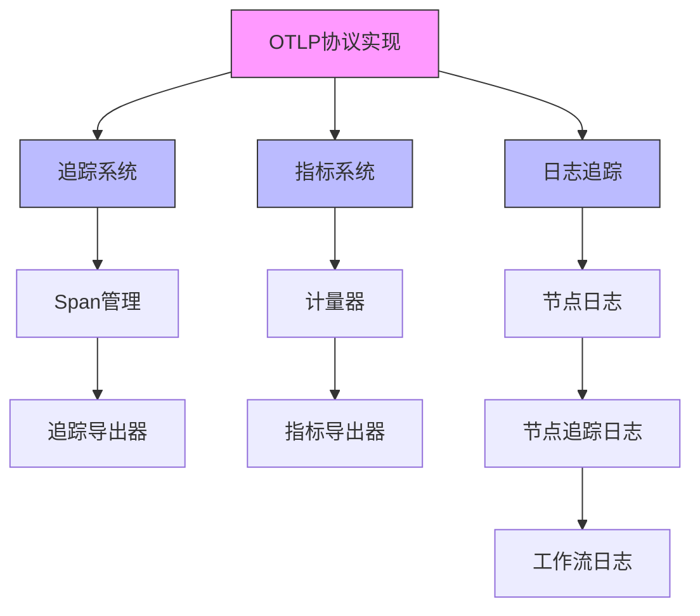
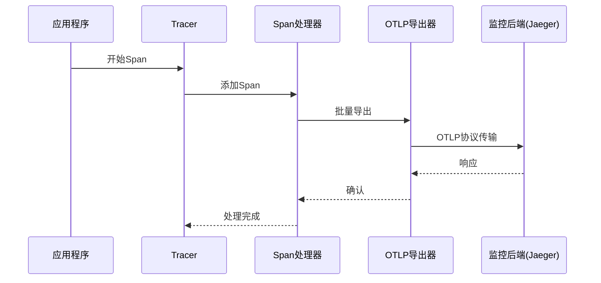
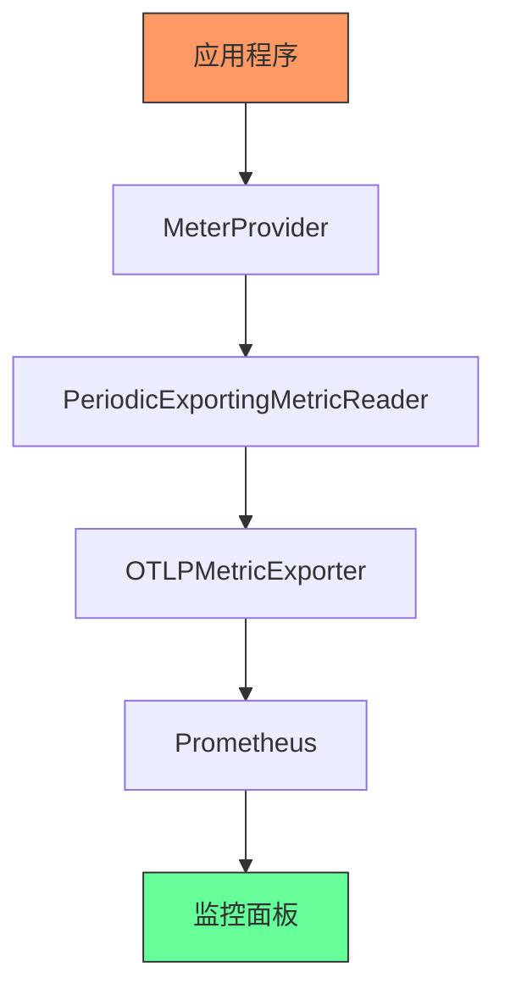
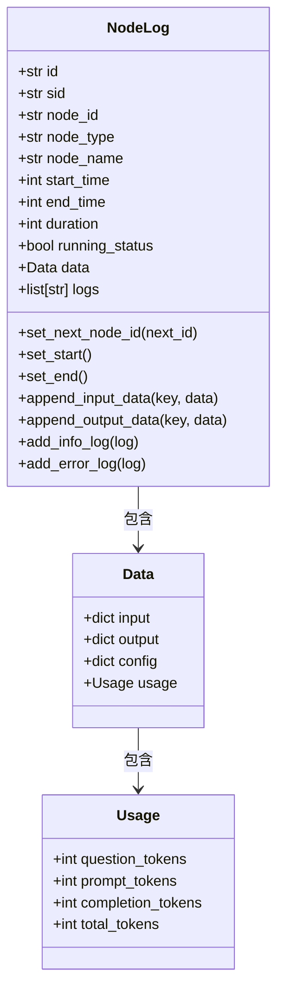
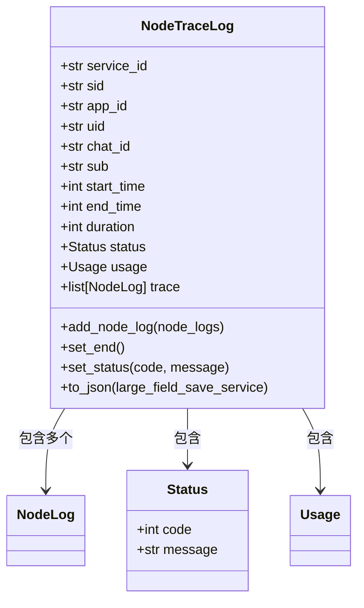
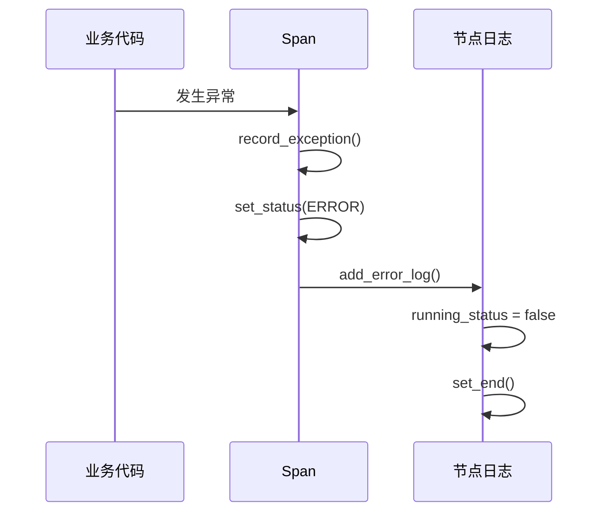
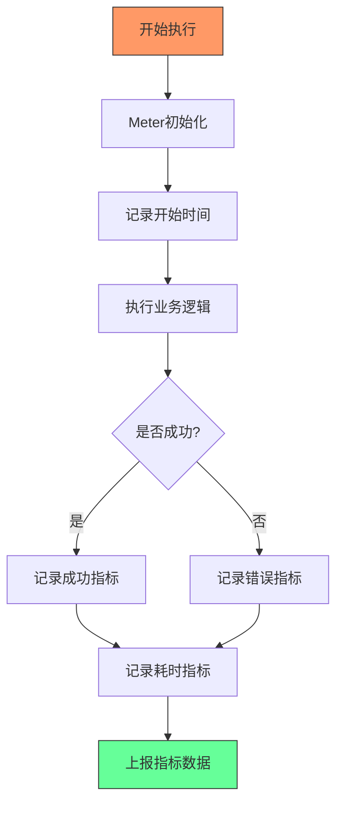
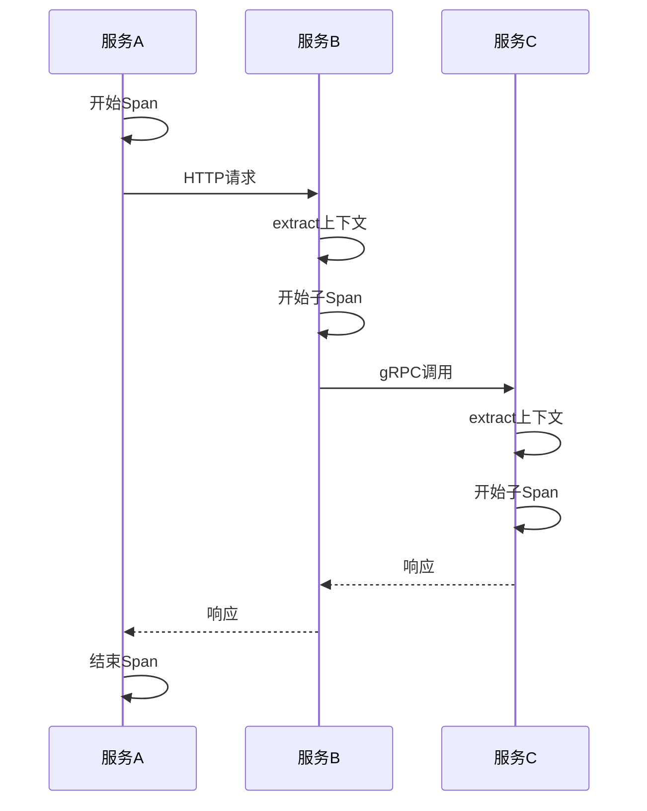

# 性能监控与链路追踪

<cite>
**本文档引用的文件**
- [sid.py](file://core/common/otlp/sid.py)
- [span.py](file://core/common/otlp/trace/span.py)
- [trace.py](file://core/common/otlp/trace/trace.py)
- [meter.py](file://core/common/otlp/metrics/meter.py)
- [metric.py](file://core/common/otlp/metrics/metric.py)
- [node_log.py](file://core/common/otlp/log_trace/node_log.py)
- [node_trace_log.py](file://core/common/otlp/log_trace/node_trace_log.py)
- [workflow_log.py](file://core/common/otlp/log_trace/workflow_log.py)
- [args/trace.py](file://core/common/otlp/args/trace.py)
</cite>

## 目录
1. [引言](#引言)
2. [OTLP协议实现](#otlp协议实现)
3. [监控系统集成](#监控系统集成)
4. [工作流执行埋点设计](#工作流执行埋点设计)
5. [性能指标采集与上报](#性能指标采集与上报)
6. [监控面板与告警配置](#监控面板与告警配置)
7. [分布式追踪上下文传递](#分布式追踪上下文传递)
8. [性能瓶颈分析与优化建议](#性能瓶颈分析与优化建议)

## 引言
本文档详细说明了astron-agent项目中性能监控与链路追踪系统的实现机制。系统基于OpenTelemetry协议(OTLP)，实现了对工作流执行全过程的全面监控和追踪，为运维人员提供了完整的性能分析和故障排查能力。

## OTLP协议实现
系统通过OpenTelemetry SDK实现了OTLP协议的完整功能，包括追踪、指标和日志的采集与导出。核心实现位于`core/common/otlp`目录下，主要包含追踪、指标和日志追踪三个模块。



**Diagram sources**
- [trace.py](file://core/common/otlp/trace/trace.py)
- [metric.py](file://core/common/otlp/metrics/metric.py)
- [node_trace_log.py](file://core/common/otlp/log_trace/node_trace_log.py)

**Section sources**
- [trace.py](file://core/common/otlp/trace/trace.py)
- [metric.py](file://core/common/otlp/metrics/metric.py)

## 监控系统集成
系统通过OTLP协议与Prometheus、Jaeger等主流监控系统集成，实现了性能数据的统一采集和可视化展示。

### 追踪系统集成
追踪系统通过`OTLPSpanExporter`将追踪数据导出到Jaeger等后端系统。系统支持gRPC和HTTP两种传输协议，配置灵活。



**Diagram sources**
- [trace.py](file://core/common/otlp/trace/trace.py)
- [span.py](file://core/common/otlp/trace/span.py)

### 指标系统集成
指标系统通过`OTLPMetricExporter`将性能指标数据导出到Prometheus等监控系统。系统支持周期性导出，确保数据的实时性。



**Diagram sources**
- [metric.py](file://core/common/otlp/metrics/metric.py)
- [meter.py](file://core/common/otlp/metrics/meter.py)

**Section sources**
- [metric.py](file://core/common/otlp/metrics/metric.py)
- [meter.py](file://core/common/otlp/metrics/meter.py)

## 工作流执行埋点设计
系统对工作流执行全过程进行了精细化的埋点设计，覆盖了节点开始/结束、数据传输、异常发生等关键事件。

### 节点执行埋点
每个工作流节点的执行都被记录为一个Span，包含详细的执行信息：



**Diagram sources**
- [node_log.py](file://core/common/otlp/log_trace/node_log.py)
- [base.py](file://core/common/otlp/log_trace/base.py)

### 工作流追踪埋点
整个工作流的执行被记录为一个`NodeTraceLog`，包含所有节点的执行日志：



**Diagram sources**
- [node_trace_log.py](file://core/common/otlp/log_trace/node_trace_log.py)
- [node_log.py](file://core/common/otlp/log_trace/node_log.py)

### 异常事件追踪
系统对异常事件进行了专门的追踪处理，确保所有错误都能被准确记录：



**Diagram sources**
- [span.py](file://core/common/otlp/trace/span.py)
- [node_log.py](file://core/common/otlp/log_trace/node_log.py)

**Section sources**
- [span.py](file://core/common/otlp/trace/span.py)
- [node_log.py](file://core/common/otlp/log_trace/node_log.py)

## 性能指标采集与上报
系统实现了全面的性能指标采集机制，包括执行时长、资源消耗、吞吐量等关键指标。

### 指标类型
系统采集的主要性能指标包括：

| 指标类型 | 指标名称 | 描述 | 数据类型 |
|---------|--------|------|--------|
| 计数器 | server_request_total | 服务请求总数 | Counter |
| 直方图 | server_request_time_microseconds | 服务请求耗时 | Histogram |
| 自定义 | 节点执行次数 | 各节点执行次数 | Counter |
| 自定义 | 节点执行耗时 | 各节点执行耗时 | Histogram |

### 指标采集流程


**Diagram sources**
- [meter.py](file://core/common/otlp/metrics/meter.py)
- [metric.py](file://core/common/otlp/metrics/metric.py)

### 指标上报机制
系统通过`PeriodicExportingMetricReader`实现周期性指标上报，确保数据的实时性和可靠性：

```python
# 伪代码示例
metric_reader = PeriodicExportingMetricReader(
    exporter=OTLPMetricExporter(
        insecure=True,
        endpoint="http://localhost:4317",
        timeout=5000
    ),
    export_interval_millis=1000,  # 每秒上报一次
    export_timeout_millis=5000
)
```

**Section sources**
- [metric.py](file://core/common/otlp/metrics/metric.py)
- [meter.py](file://core/common/otlp/metrics/meter.py)

## 监控面板与告警配置
系统支持与Grafana等监控面板集成，提供直观的性能可视化展示，并支持灵活的告警规则配置。

### 监控面板配置
监控面板主要包含以下视图：

1. **系统概览**：显示整体请求量、成功率、平均响应时间等关键指标
2. **服务性能**：按服务维度展示各服务的性能指标
3. **工作流分析**：展示工作流执行的详细追踪信息
4. **节点性能**：按节点类型分析各节点的执行性能
5. **错误分析**：统计和分析各类错误的发生情况

### 告警规则设置
推荐的告警规则配置：

```yaml
# Prometheus告警规则示例
groups:
  - name: workflow-alerts
    rules:
      - alert: HighErrorRate
        expr: rate(server_request_total{status="error"}[5m]) / rate(server_request_total[5m]) > 0.05
        for: 10m
        labels:
          severity: critical
        annotations:
          summary: "高错误率"
          description: "工作流错误率超过5%，当前值: {{ $value }}"

      - alert: HighLatency
        expr: histogram_quantile(0.95, sum(rate(server_request_time_microseconds_bucket[5m])) by (le)) > 5000
        for: 10m
        labels:
          severity: warning
        annotations:
          summary: "高延迟"
          description: "95%请求延迟超过5秒，当前值: {{ $value }}ms"

      - alert: LowThroughput
        expr: rate(server_request_total[5m]) < 10
        for: 15m
        labels:
          severity: warning
        annotations:
          summary: "低吞吐量"
          description: "请求量低于10次/分钟，当前值: {{ $value }}"
```

**Section sources**
- [metric.py](file://core/common/otlp/metrics/metric.py)

## 分布式追踪上下文传递
系统实现了完整的分布式追踪上下文传递机制，确保跨服务调用的链路能够正确关联。

### 上下文传递机制
系统使用OpenTelemetry的上下文传播机制，通过`inject`和`extract`方法实现追踪上下文的传递：



**Diagram sources**
- [trace.py](file://core/common/otlp/trace/trace.py)
- [span.py](file://core/common/otlp/trace/span.py)

### SID生成机制
系统使用独特的SID(服务实例标识)生成机制，确保每个请求都有唯一的标识：

```python
class SidGenerator2:
    def gen(self) -> str:
        pid = os.getpid() & 0xFF
        self.index = (self.sid_info.index + 1) & 0xFFFF
        tm_int = int(time.time() * 1000)
        tm = format(tm_int, "011x")
        sid = f"{self.sid_info.sub}{pid:04x}{self.sid_info.index:04x}@{self.sid_info.location}{tm[-11:]}{self.short_local_ip}{self.sid_info.local_port[:2]}{self.sid2}"
        return sid
```

SID格式包含以下信息：
- `sub`: 子系统标识
- `pid`: 进程ID
- `index`: 请求序号
- `location`: 位置信息
- `tm`: 时间戳
- `short_local_ip`: 简化IP地址
- `local_port`: 本地端口
- `sid2`: 固定标识

**Section sources**
- [sid.py](file://core/common/otlp/sid.py)

## 性能瓶颈分析与优化建议
基于监控数据，为运维人员提供性能瓶颈分析和优化建议。

### 常见性能瓶颈
1. **高延迟节点**：某些节点执行时间过长，影响整体工作流性能
2. **频繁错误**：某些节点错误率较高，影响系统稳定性
3. **资源竞争**：多实例并发执行时出现资源竞争
4. **数据传输瓶颈**：节点间数据传输量过大，影响性能

### 分析方法
1. **追踪分析**：通过Jaeger等工具分析完整调用链路，定位耗时最长的节点
2. **指标分析**：通过Prometheus分析各节点的执行次数、成功率、响应时间等指标
3. **日志分析**：结合日志信息分析错误发生的原因和上下文
4. **对比分析**：对比不同时间段、不同环境下的性能表现

### 优化建议
1. **缓存优化**：对频繁访问的数据添加缓存，减少重复计算
2. **异步处理**：将耗时操作改为异步处理，提高响应速度
3. **批量处理**：将小批量请求合并为大批量处理，提高吞吐量
4. **资源隔离**：为关键节点分配专用资源，避免资源竞争
5. **参数调优**：根据实际负载调整线程池大小、连接池大小等参数
6. **代码优化**：优化算法复杂度，减少不必要的计算和IO操作

**Section sources**
- [span.py](file://core/common/otlp/trace/span.py)
- [meter.py](file://core/common/otlp/metrics/meter.py)
- [node_log.py](file://core/common/otlp/log_trace/node_log.py)