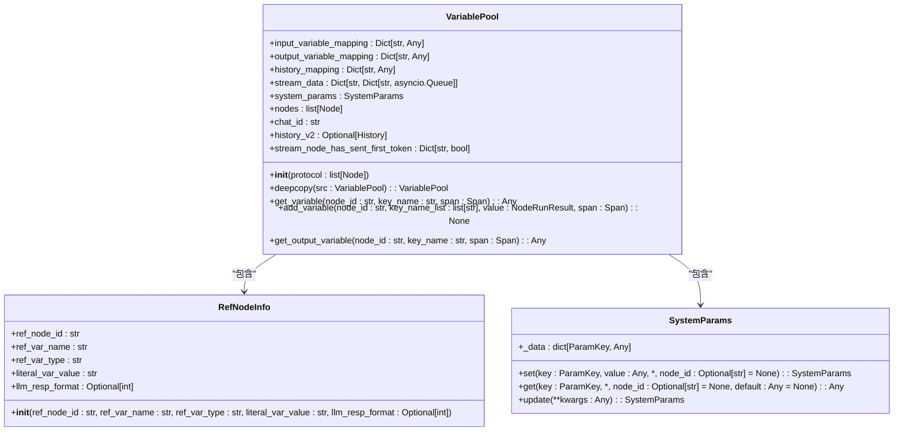
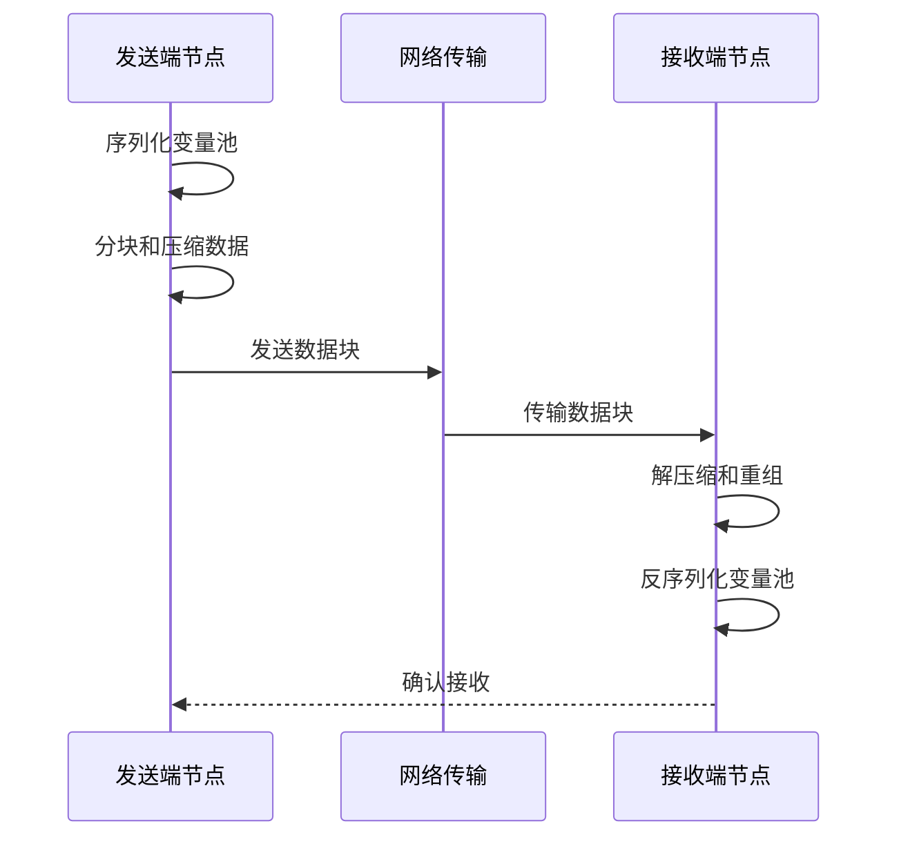
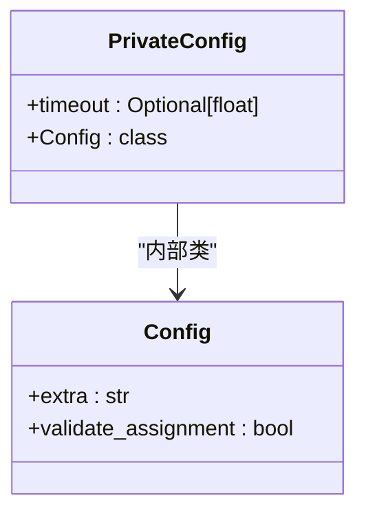

# 执行上下文管理

<cite>
**本文档引用的文件**  
- [variable_pool.py](file://core/workflow/engine/entities/variable_pool.py)
- [private_config.py](file://core/workflow/engine/entities/private_config.py)
- [dsl_engine.py](file://core/workflow/engine/dsl_engine.py)
- [node.py](file://core/workflow/engine/node.py)
</cite>

## 目录
1. [引言](#引言)
2. [变量池设计原理](#变量池设计原理)
3. [内存管理机制](#内存管理机制)
4. [上下文数据序列化与反序列化](#上下文数据序列化与反序列化)
5. [分布式环境中的传输机制](#分布式环境中的传输机制)
6. [私有配置的安全存储与访问控制](#私有配置的安全存储与访问控制)
7. [上下文快照与恢复功能](#上下文快照与恢复功能)
8. [内存使用监控与垃圾回收优化](#内存使用监控与垃圾回收优化)
9. [结论](#结论)

## 引言

执行上下文管理是工作流引擎的核心组件，负责维护工作流执行过程中的所有状态信息。本系统通过变量池（Variable Pool）和私有配置（Private Config）两个主要组件，实现了对执行上下文的全面管理。变量池负责存储和管理所有节点间的变量传递，支持作用域隔离、变量继承和生命周期管理；私有配置则用于存储敏感的执行参数，确保安全访问。系统还提供了上下文快照和恢复功能，支持工作流在中断后继续执行，保证了长时间运行工作流的稳定性。

## 变量池设计原理

变量池是工作流执行过程中变量管理的核心组件，负责维护所有节点的输入输出变量及其状态。它通过输入变量映射（input_variable_mapping）和输出变量映射（output_variable_mapping）两个字典结构来组织变量数据，实现了高效的数据访问和更新。

变量池的设计基于工作流DSL（Domain Specific Language）协议，通过解析节点协议来初始化输入输出变量。每个变量的映射键由节点ID和变量名组合而成（格式为"node_id-variable_name"），确保了变量的唯一性。系统支持两种变量类型：字面量（literal）和引用（ref）。字面量变量存储具体的值，而引用变量则指向其他节点的输出，实现了节点间的数据依赖。

变量继承机制通过引用解析实现。当一个节点需要访问另一个节点的输出时，变量池会解析引用路径，获取目标节点的输出值。这种机制支持复杂的嵌套访问，如"node1.output.array[0].property"。作用域隔离通过节点ID前缀实现，确保不同节点的变量不会相互干扰。

**Section sources**
- [variable_pool.py](file://core/workflow/engine/entities/variable_pool.py#L0-L799)

## 内存管理机制

变量池的内存管理机制采用引用计数和作用域生命周期相结合的方式。每个变量的生命周期与其所属节点的执行周期绑定，当节点执行完成后，其输出变量会保留在内存中，直到所有依赖该变量的节点执行完毕。

系统通过深拷贝（deepcopy）机制实现变量池的复制，确保在并行执行或分支执行时，每个执行路径都有独立的变量状态。`VariablePool.deepcopy`方法会创建新的变量池实例，并复制所有必要的状态，包括输入输出映射、历史记录和系统参数。

对于大型数据结构，系统采用惰性求值策略，只有在实际需要访问变量值时才会解析和计算。这减少了不必要的内存占用和计算开销。同时，系统维护了一个流式数据结构（stream_data），用于处理流式输出节点（如LLM节点）的实时数据传输，避免了大数据量的内存堆积。

**Diagram sources**
- [variable_pool.py](file://core/workflow/engine/entities/variable_pool.py#L0-L799)

**Section sources**
- [variable_pool.py](file://core/workflow/engine/entities/variable_pool.py#L0-L799)

## 上下文数据序列化与反序列化

上下文数据的序列化和反序列化主要通过Python的pickle模块实现。在工作流执行过程中，当需要将执行上下文传递到远程节点或持久化存储时，系统会使用pickle对变量池进行序列化。

序列化过程会捕获变量池的所有状态，包括输入输出变量映射、历史记录、流式数据结构和系统参数。由于变量池中可能包含异步队列等不可序列化对象，系统在序列化前会进行特殊处理，暂时移除这些对象或将其转换为可序列化形式。

反序列化过程则完全重建变量池的状态，确保恢复后的执行上下文与序列化前完全一致。系统在反序列化后会重新建立必要的异步队列和事件监听器，恢复流式数据传输功能。为了保证序列化数据的安全性，系统仅在受信任的环境中进行序列化操作，并对反序列化的数据进行完整性验证。

**Section sources**
- [dsl_engine.py](file://core/workflow/engine/dsl_engine.py#L0-L199)

## 分布式环境中的传输机制

在分布式环境中，执行上下文的传输通过序列化后的数据包进行。系统使用pickle序列化变量池后，将数据包通过网络传输到目标节点。传输过程支持多种协议，包括HTTP、WebSocket和消息队列。

对于流式输出节点，系统采用分块传输机制，将大块数据分割成小块进行传输，避免内存溢出。每个数据块都包含序列号和校验信息，确保传输的完整性和顺序性。接收端会按序重组数据块，并触发相应的处理回调。

系统还实现了传输压缩功能，对序列化后的数据进行gzip压缩，减少网络带宽占用。对于敏感数据，系统支持传输层加密，确保数据在传输过程中的安全性。传输过程由`WorkflowEngineCtx`中的回调处理器（ChatCallBacks）监控，能够实时报告传输状态和错误信息。

**Diagram sources**
- [dsl_engine.py](file://core/workflow/engine/dsl_engine.py#L0-L199)

**Section sources**
- [dsl_engine.py](file://core/workflow/engine/dsl_engine.py#L0-L199)

## 私有配置的安全存储与访问控制

私有配置组件（PrivateConfig）采用Pydantic BaseModel实现，确保了配置数据的类型安全和验证。配置类定义了额外的约束，如`extra = "forbid"`禁止未声明的字段，`validate_assignment = True`确保属性赋值时进行验证。

私有配置的主要参数是超时时间（timeout），默认设置为120秒。系统通过配置类的属性访问控制，限制了对私有配置的直接修改。所有配置访问都必须通过定义的接口进行，确保了配置的一致性和安全性。

访问控制策略基于工作流执行上下文实现。只有拥有相应权限的节点才能访问私有配置。系统在节点执行前验证其访问权限，并记录访问日志。对于敏感操作，系统会要求额外的身份验证，防止未授权访问。

**Diagram sources**
- [private_config.py](file://core/workflow/engine/entities/private_config.py#L0-L11)

**Section sources**
- [private_config.py](file://core/workflow/engine/entities/private_config.py#L0-L11)

## 上下文快照与恢复功能

上下文快照功能通过定期序列化变量池实现。系统在关键执行点（如节点执行前后）自动创建上下文快照，并将其持久化存储。快照数据包含完整的执行状态，包括所有变量值、执行进度和系统参数。

恢复功能允许工作流从任意快照点继续执行。当工作流因故障中断时，系统可以加载最近的快照，恢复执行上下文，并从断点继续执行。这种机制支持"续跑"能力，确保长时间运行的工作流不会因临时故障而完全失败。

快照管理采用多级存储策略，包括内存缓存、本地磁盘和远程存储。近期快照保留在内存中以提高访问速度，较早的快照则逐步迁移到磁盘和远程存储。系统还实现了快照压缩和去重，减少存储空间占用。

**Section sources**
- [variable_pool.py](file://core/workflow/engine/entities/variable_pool.py#L0-L799)
- [dsl_engine.py](file://core/workflow/engine/dsl_engine.py#L0-L199)

## 内存使用监控与垃圾回收优化

内存使用监控通过集成的事件日志系统实现。`WorkflowLog`组件记录每个节点的内存分配和释放情况，包括变量创建、更新和删除。系统定期生成内存使用报告，识别内存密集型节点和潜在的内存泄漏。

垃圾回收优化采用引用计数和作用域分析相结合的策略。系统跟踪每个变量的引用关系，当变量不再被任何节点引用时，立即释放其内存。对于循环引用的情况，系统使用弱引用（weak reference）打破引用环，确保垃圾回收器能够正确回收内存。

系统还实现了内存池机制，对频繁创建和销毁的小对象进行池化管理，减少内存分配开销。对于大对象，系统采用延迟释放策略，在确认不再需要后才释放内存，避免频繁的内存分配和释放操作。

**Section sources**
- [variable_pool.py](file://core/workflow/engine/entities/variable_pool.py#L0-L799)
- [dsl_engine.py](file://core/workflow/engine/dsl_engine.py#L0-L199)

## 结论

执行上下文管理系统通过变量池和私有配置两个核心组件，实现了对工作流执行状态的全面管理。系统设计考虑了作用域隔离、变量继承和生命周期管理，确保了复杂工作流的正确执行。通过序列化和分布式传输机制，系统支持跨节点的上下文共享，为分布式执行提供了基础。

上下文快照和恢复功能增强了系统的容错能力，支持工作流在中断后继续执行。内存使用监控和垃圾回收优化确保了长时间运行工作流的稳定性。整体设计平衡了性能、安全性和可靠性，为复杂工作流的执行提供了坚实的基础设施。