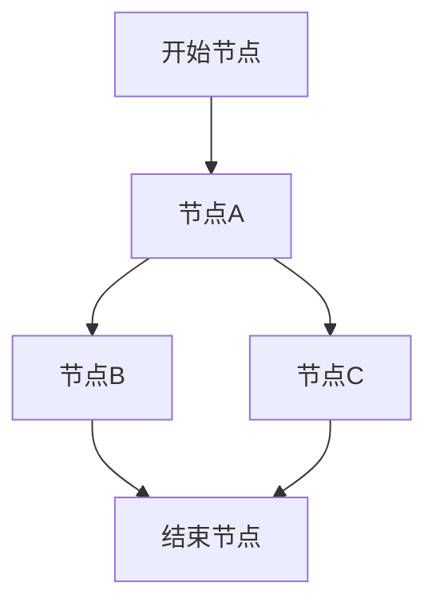
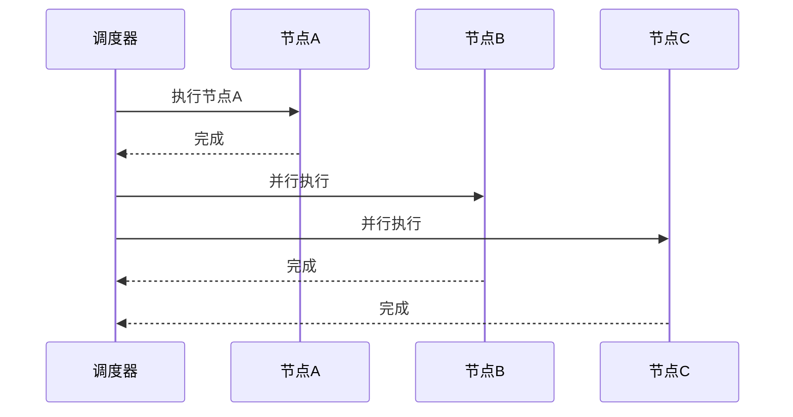
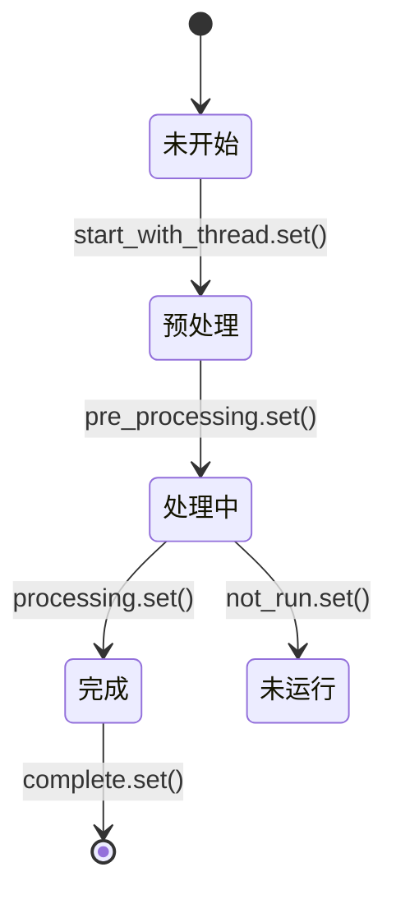
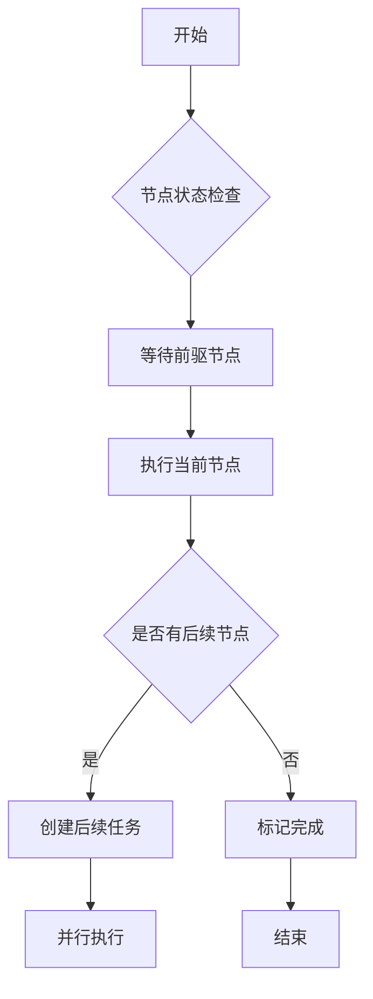

# 节点调度器

<cite>
**本文档引用的文件**
- [node.py](file://core/workflow/engine/node.py)
- [dsl_engine.py](file://core/workflow/engine/dsl_engine.py)
- [node_running_status.py](file://core/workflow/engine/entities/node_running_status.py)
- [base_node.py](file://core/workflow/engine/nodes/base_node.py)
</cite>

## 目录
1. [引言](#引言)
2. [核心调度算法](#核心调度算法)
3. [节点状态管理](#节点状态管理)
4. [并发控制与资源隔离](#并发控制与资源隔离)
5. [超时控制与死锁检测](#超时控制与死锁检测)
6. [节点依赖解析与执行顺序优化](#节点依赖解析与执行顺序优化)
7. [自定义调度策略扩展接口](#自定义调度策略扩展接口)
8. [结论](#结论)

## 引言

节点调度器是工作流引擎的核心组件，负责协调和管理工作流中各个节点的执行。该调度器实现了复杂的调度策略，包括串行执行、并行执行和条件分支处理，确保工作流能够按照预定义的逻辑正确执行。调度器通过异步编程模型和深度优先搜索算法来处理节点间的依赖关系，同时提供了完善的错误处理和重试机制。

**Section sources**
- [node.py](file://core/workflow/engine/node.py#L1-L50)
- [dsl_engine.py](file://core/workflow/engine/dsl_engine.py#L1-L50)

## 核心调度算法

### 串行执行与并行执行机制

节点调度器采用深度优先搜索（DFS）算法来实现节点的执行调度。每个节点的执行通过`_depth_first_search_execution`方法启动，该方法会递归地执行节点及其后续节点。



**Diagram sources**
- [dsl_engine.py](file://core/workflow/engine/dsl_engine.py#L1000-L1050)

对于串行执行，调度器通过`_execute_single_node`方法按顺序执行节点。该方法会等待前驱节点完成后再执行当前节点，确保执行顺序的正确性。

对于并行执行，当一个节点有多个后续节点时，调度器会为每个后续节点创建独立的异步任务，实现并行处理。这些任务通过`asyncio.create_task`创建，并添加到`dfs_tasks`列表中统一管理。



**Diagram sources**
- [dsl_engine.py](file://core/workflow/engine/dsl_engine.py#L1200-L1250)

### 条件分支处理机制

条件分支处理通过`_get_next_nodes`方法实现。该方法根据节点类型和执行结果来决定下一个要执行的节点。对于分支节点（如决策节点、条件判断节点），调度器会根据执行结果中的`edge_source_handle`来选择相应的分支路径。

```python
async def _get_next_nodes(
    self,
    node: SparkFlowEngineNode,
    run_result: Optional[NodeRunResult],
    fail_branch: bool,
) -> Tuple[List[SparkFlowEngineNode], List[SparkFlowEngineNode]]:
    # ... 实现细节
```

当`fail_branch`为True时，调度器会执行失败分支；否则根据节点类型和结果选择相应的执行路径。这种机制支持复杂的条件逻辑，如if-else、switch-case等。

**Section sources**
- [dsl_engine.py](file://core/workflow/engine/dsl_engine.py#L1500-L1550)

## 节点状态管理

### 节点生命周期控制

节点调度器通过`NodeRunningStatus`类来管理节点的生命周期状态。该类使用`asyncio.Event`来表示节点的不同状态：



**Diagram sources**
- [node_running_status.py](file://core/workflow/engine/entities/node_running_status.py#L1-L35)

这些状态包括：
- `start_with_thread`: 线程已启动
- `pre_processing`: 预处理阶段
- `processing`: 正在处理
- `complete`: 执行完成
- `not_run`: 不执行（逻辑上运行但实际不执行）

### 状态转换机制

节点状态的转换通过一系列方法来控制。例如，`_wait_predecessor_nodes`方法会等待前驱节点完成，确保依赖关系的正确性：

```python
async def _wait_predecessor_nodes(self, node: SparkFlowEngineNode) -> None:
    """等待前驱节点完成"""
    for pre_node in node.get_pre_nodes():
        await self.engine_ctx.node_run_status[pre_node.node_id].complete.wait()
```

当节点开始执行时，会设置`processing`事件；执行完成后，会设置`complete`事件。这种基于事件的状态管理机制确保了节点执行的同步性和正确性。

**Section sources**
- [node_running_status.py](file://core/workflow/engine/entities/node_running_status.py#L1-L35)
- [dsl_engine.py](file://core/workflow/engine/dsl_engine.py#L1300-L1350)

## 并发控制与资源隔离

### 线程池与异步任务管理

节点调度器采用异步编程模型，利用`asyncio`库来管理并发任务。每个工作流实例都有一个`qa_node_lock`，用于确保问题回答节点的串行执行：

```python
class QuestionAnswerNodeStrategy(NodeExecutionStrategy):
    """问题回答节点执行策略"""
    
    async def execute_node(
        self,
        node: SparkFlowEngineNode,
        engine_ctx: WorkflowEngineCtx,
        span: Span,
    ) -> NodeRunResult:
        qa_node_lock = engine_ctx.qa_node_lock
        async with qa_node_lock:
            return await DefaultNodeExecutionStrategy().execute_node(
                node, engine_ctx, span
            )
```

对于普通节点，调度器使用`DefaultNodeExecutionStrategy`策略，允许并行执行。这种策略模式的设计使得不同类型的节点可以有不同的执行方式，实现了灵活的并发控制。

### 资源隔离机制

资源隔离通过`WorkflowEngineCtx`类实现，该类为每个工作流实例维护独立的上下文：

```python
class WorkflowEngineCtx(BaseModel):
    """工作流引擎执行上下文"""
    
    variable_pool: VariablePool  # 变量池
    iteration_engine: Dict[str, "WorkflowEngine"] = Field(default_factory=dict)
    msg_or_end_node_deps: Dict[str, MsgOrEndDepInfo] = Field(default_factory=dict)
    node_run_status: Dict[str, NodeRunningStatus] = Field(default_factory=dict)
    built_nodes: Dict[str, SparkFlowEngineNode] = Field(default_factory=dict)
    chains: Chains
    # ... 其他字段
```

每个工作流实例都有独立的变量池、节点状态等资源，避免了不同工作流之间的资源竞争和干扰。

**Section sources**
- [dsl_engine.py](file://core/workflow/engine/dsl_engine.py#L500-L600)
- [node.py](file://core/workflow/engine/node.py#L500-L550)

## 超时控制与死锁检测

### 超时控制配置

超时控制通过`RetryConfig`类实现，支持为每个节点配置超时时间：

```python
async def _execute_without_error_handling(
    self,
    node: SparkFlowEngineNode,
    span_context: Span,
) -> Tuple[NodeRunResult, bool]:
    try:
        strategy = self.strategy_manager.get_strategy(node.node_id.split("::")[0])
        run_result = await asyncio.wait_for(
            strategy.execute_node(node, self.engine_ctx, span_context),
            timeout=node.node_instance._private_config.timeout,
        )
        return run_result, False
    except asyncio.TimeoutError as e:
        raise CustomException(
            CodeEnum.NODE_RUN_ERROR,
            err_msg="节点执行超时",
            cause_error="节点执行超时",
        ) from e
```

超时时间可以从节点的私有配置中获取，通过`asyncio.wait_for`实现超时控制。当执行时间超过设定值时，会抛出`asyncio.TimeoutError`异常，并转换为自定义异常。

### 死锁检测机制

死锁检测通过任务取消机制实现。当一个节点执行超时或发生错误时，调度器会取消所有相关的异步任务：

```python
async def _cancel_pending_task(self, tasks: Set[Task]) -> None:
    """取消所有待处理任务"""
    if not tasks:
        return
    for task in tasks:
        task.cancel()
    await asyncio.gather(*tasks, return_exceptions=True)
```

在`_wait_all_tasks_completion`方法中，调度器会等待所有任务完成，并处理可能的异常。如果发现任务被取消或发生异常，会进行相应的错误处理，避免死锁的发生。

**Section sources**
- [dsl_engine.py](file://core/workflow/engine/dsl_engine.py#L1800-L1850)

## 节点依赖解析与执行顺序优化

### 依赖解析算法

节点依赖解析通过`_handle_message_node_dependencies`方法实现：

```python
async def _handle_message_node_dependencies(
    self,
    node: SparkFlowEngineNode,
    span_context: Span,
) -> None:
    """处理消息节点依赖"""
    node_type = node.node_id.split("::")[0]
    if node_type in [NodeType.START.value, NodeType.ITERATION_START.value]:
        return

    for msg_node_id, dep in self.engine_ctx.msg_or_end_node_deps.items():
        data_dep_path_info = (
            dep.data_dep_path_info.get(node.node_id, False)
            if hasattr(dep, "data_dep_path_info")
            else True
        )

        should_execute_message_node = (
            node.node_id in dep.data_dep
            and not self.engine_ctx.node_run_status[
                msg_node_id
            ].pre_processing.is_set()
            and data_dep_path_info
        )

        if should_execute_message_node:
            self.engine_ctx.node_run_status[msg_node_id].pre_processing.set()
            task = asyncio.create_task(
                self._execute_message_node(msg_node_id, span_context)
            )
            self.engine_ctx.dfs_tasks.append(task)
```

该方法会检查当前节点是否依赖于其他消息节点，如果依赖且尚未处理，则启动相应的消息节点执行任务。

### 执行顺序优化

执行顺序优化通过深度优先搜索算法实现，同时结合了任务调度策略：



**Diagram sources**
- [dsl_engine.py](file://core/workflow/engine/dsl_engine.py#L1200-L1300)

调度器会优先执行没有前驱依赖的节点，对于有依赖的节点则等待依赖完成后再执行。这种优化策略确保了工作流的高效执行，同时保证了逻辑的正确性。

**Section sources**
- [dsl_engine.py](file://core/workflow/engine/dsl_engine.py#L1400-L1450)

## 自定义调度策略扩展接口

### 扩展接口设计

节点调度器提供了灵活的扩展接口，允许开发者自定义调度策略。主要通过策略模式实现：

```python
class NodeExecutionStrategy(ABC):
    """节点执行策略抽象基类"""
    
    @abstractmethod
    async def execute_node(
        self,
        node: SparkFlowEngineNode,
        engine_ctx: WorkflowEngineCtx,
        span: Span,
    ) -> NodeRunResult:
        pass

    @abstractmethod
    def can_handle(self, node_type: str) -> bool:
        pass
```

开发者可以通过继承`NodeExecutionStrategy`类来实现自定义的执行策略。

### 实现示例

以下是一个自定义调度策略的实现示例：

```python
class CustomNodeStrategy(NodeExecutionStrategy):
    """自定义节点执行策略"""
    
    def can_handle(self, node_type: str) -> bool:
        return node_type == "custom_node"
    
    async def execute_node(
        self,
        node: SparkFlowEngineNode,
        engine_ctx: WorkflowEngineCtx,
        span: Span,
    ) -> NodeRunResult:
        # 自定义执行逻辑
        with span.start(f"custom_execute:{node.node_id}") as span_context:
            # 执行前处理
            await self._pre_process(node, engine_ctx, span_context)
            
            # 执行节点
            result = await node.async_call(
                variable_pool=engine_ctx.variable_pool,
                callbacks=engine_ctx.callback,
                span=span_context,
                iteration_engine=engine_ctx.iteration_engine,
                event_log_trace=engine_ctx.event_log_trace,
            )
            
            # 执行后处理
            await self._post_process(result, engine_ctx, span_context)
            
            return result
    
    async def _pre_process(self, node, engine_ctx, span):
        """执行前处理"""
        # 自定义预处理逻辑
        pass
    
    async def _post_process(self, result, engine_ctx, span):
        """执行后处理"""
        # 自定义后处理逻辑
        pass
```

要使用自定义策略，需要将其注册到`NodeExecutionStrategyManager`中：

```python
class NodeExecutionStrategyManager:
    """节点执行策略管理器"""
    
    def __init__(self) -> None:
        self.strategies = [
            QuestionAnswerNodeStrategy(),
            CustomNodeStrategy(),  # 注册自定义策略
            DefaultNodeExecutionStrategy(),
        ]
```

这种设计模式使得调度器具有良好的扩展性，开发者可以根据业务需求实现各种复杂的调度策略。

**Section sources**
- [dsl_engine.py](file://core/workflow/engine/dsl_engine.py#L800-L900)
- [node.py](file://core/workflow/engine/node.py#L300-L350)

## 结论

节点调度器通过深度优先搜索算法、异步编程模型和策略模式，实现了复杂的工作流调度功能。它支持串行执行、并行执行和条件分支处理，确保了工作流的正确性和高效性。通过`NodeRunningStatus`类实现了精细的节点状态管理，利用`asyncio`库实现了并发控制和资源隔离。超时控制和死锁检测机制保证了系统的稳定性。节点依赖解析和执行顺序优化算法确保了工作流的逻辑正确性。通过策略模式提供的扩展接口，使得调度器具有良好的可扩展性，开发者可以根据具体需求实现自定义的调度策略。