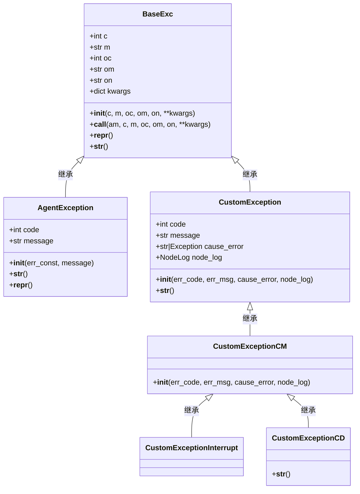
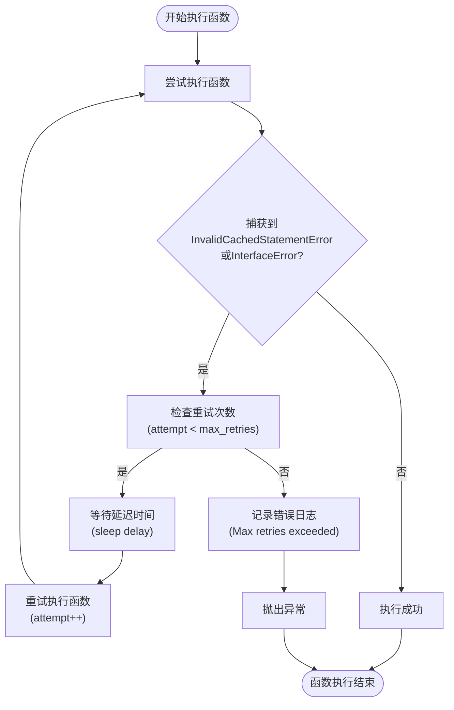
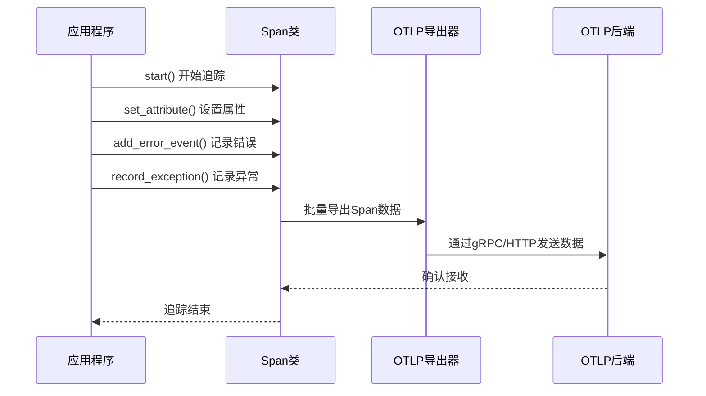

# 错误处理与重试机制

<cite>
**本文档引用文件**   
- [retry.py](file://core/memory/database/utils/retry.py)
- [exception_util.py](file://core/memory/database/utils/exception_util.py)
- [base.py](file://core/common/exceptions/base.py)
- [codes.py](file://core/common/exceptions/codes.py)
- [errs.py](file://core/common/exceptions/errs.py)
- [base.py](file://core/agent/exceptions/base.py)
- [codes.py](file://core/agent/exceptions/codes.py)
- [agent_exc.py](file://core/agent/exceptions/agent_exc.py)
- [e.py](file://core/workflow/exception/e.py)
- [node_log.py](file://core/common/otlp/log_trace/node_log.py)
- [workflow_log.py](file://core/common/otlp/log_trace/workflow_log.py)
- [span.py](file://core/common/otlp/trace/span.py)
- [trace.py](file://core/common/otlp/trace/trace.py)
</cite>

## 目录
1. [引言](#引言)
2. [异常分类体系与错误码设计](#异常分类体系与错误码设计)
3. [重试机制与退避算法](#重试机制与退避算法)
4. [异常传播与补偿事务](#异常传播与补偿事务)
5. [错误日志记录与监控告警](#错误日志记录与监控告警)
6. [故障恢复与断点续跑](#故障恢复与断点续跑)
7. [自定义错误处理器开发指南](#自定义错误处理器开发指南)
8. [结论](#结论)

## 引言

本系统构建了一套完整的错误处理与重试机制，旨在确保工作流的可靠执行。系统通过分层的异常分类体系、灵活的重试配置、完善的日志追踪以及故障恢复能力，为开发者提供了强大的错误管理工具。本文档将详细阐述该机制的设计原则与实现细节。

## 异常分类体系与错误码设计

系统采用分层的异常分类体系，从基础异常类到具体业务异常，形成了清晰的继承结构。错误码设计遵循统一规范，便于错误的识别与处理。

### 异常分类体系

系统定义了多个层次的异常类，以满足不同场景的需求：



**Diagram sources**
- [base.py](file://core/common/exceptions/base.py#L0-L109)
- [base.py](file://core/agent/exceptions/base.py#L0-L19)
- [e.py](file://core/workflow/exception/e.py#L0-L166)

**Section sources**
- [base.py](file://core/common/exceptions/base.py#L0-L109)
- [base.py](file://core/agent/exceptions/base.py#L0-L19)
- [e.py](file://core/workflow/exception/e.py#L0-L166)

### 错误码设计原则

系统的错误码设计遵循以下原则：

1.  **分层编码**：错误码采用分层结构，如 `10000` 系列表示WebSocket相关错误，`40000` 系列表示配置或请求错误。
2.  **语义明确**：每个错误码都配有清晰的描述信息，便于快速定位问题。
3.  **可扩展性**：通过定义基础异常类，可以轻松扩展新的业务异常类型。
4.  **上下文传递**：`BaseExc` 类支持传递原始错误码（oc）、原始消息（om）和来源系统（on），便于在分布式系统中追踪错误源头。

**Section sources**
- [codes.py](file://core/common/exceptions/codes.py#L0-L9)
- [codes.py](file://core/agent/exceptions/codes.py#L0-L177)

## 重试机制与退避算法

系统在多个层面实现了重试机制，以应对临时性故障。重试配置灵活，支持自定义最大重试次数和延迟时间。

### 重试配置与实现

`retry_on_invalid_cached_statement` 装饰器是系统重试机制的核心实现。它通过捕获特定异常（如 `InvalidCachedStatementError`）并进行自动重试，提高了数据库操作的健壮性。



**Diagram sources**
- [retry.py](file://core/memory/database/utils/retry.py#L0-L42)

**Section sources**
- [retry.py](file://core/memory/database/utils/retry.py#L0-L42)

### 退避算法

系统采用简单的固定延迟退避算法。每次重试前，通过 `await asyncio.sleep(delay)` 进行固定时间的等待。该算法实现简单，适用于大多数场景。对于需要更复杂退避策略（如指数退避）的场景，可以通过修改 `delay` 参数或扩展装饰器来实现。

## 异常传播与补偿事务

系统通过异常类的继承和封装，实现了清晰的异常传播机制。当发生错误时，异常会携带完整的上下文信息向上传播，直至被适当的处理器捕获。

### 异常传播机制

异常传播机制确保了错误信息的完整传递。例如，`CustomException` 类在初始化时会记录错误码、消息、根本原因（cause_error）和节点日志（node_log）。当异常被打印或记录时，这些信息会被一并输出，便于问题排查。

**Section sources**
- [e.py](file://core/workflow/exception/e.py#L0-L166)

### 补偿事务

虽然当前代码中未直接体现补偿事务的实现，但系统架构为补偿事务提供了良好的基础。通过 `NodeLog` 和 `WorkflowLog` 记录了每个节点的输入、输出和执行状态，可以基于这些日志信息设计补偿逻辑。例如，在某个节点执行失败后，可以根据其 `node_log` 中的 `input` 数据，调用一个反向操作来撤销已产生的副作用。

## 错误日志记录与监控告警

系统集成了 OpenTelemetry (OTLP) 日志系统，实现了全面的错误日志记录和监控能力。

### OTLP日志系统集成

系统通过 `Span` 类与 OTLP 系统对接，实现了分布式追踪。`Span` 类提供了丰富的日志记录方法，如 `add_info_event`、`add_error_event` 和 `record_exception`，可以将错误信息以结构化的方式发送到 OTLP 后端。



**Diagram sources**
- [span.py](file://core/common/otlp/trace/span.py#L0-L276)
- [trace.py](file://core/common/otlp/trace/trace.py#L0-L126)

**Section sources**
- [span.py](file://core/common/otlp/trace/span.py#L0-L276)
- [trace.py](file://core/common/otlp/trace/trace.py#L0-L126)

### 日志记录与告警

`FileSpanExporter` 类实现了将追踪数据导出到本地日志文件的功能。它会根据Span的名称或状态码，将不同级别的日志（INFO, WARN, ERROR）输出到对应的日志级别中。结合外部监控系统（如Prometheus、Grafana），可以基于这些日志设置告警规则，实现对系统异常的实时监控。

## 故障恢复与断点续跑

系统通过详细的执行日志和状态记录，为故障恢复和断点续跑提供了可能。

### 故障恢复

`NodeLog` 类记录了每个节点的完整执行上下文，包括输入、输出、配置、执行时长和状态。当工作流因故障中断时，运维人员可以分析 `WorkflowLog` 中的 `trace` 列表，定位到失败的节点，并根据其 `node_log` 中的信息判断失败原因。

### 断点续跑

虽然当前代码未直接提供断点续跑的功能，但 `NodeLog` 和 `WorkflowLog` 的设计为此功能奠定了基础。理论上，可以通过以下步骤实现断点续跑：
1.  从持久化存储中加载失败工作流的 `WorkflowLog`。
2.  遍历 `trace` 列表，找到第一个 `running_status` 为 `False` 的 `NodeLog`。
3.  从该节点开始，使用其 `input` 数据重新执行后续节点。

**Section sources**
- [node_log.py](file://core/common/otlp/log_trace/node_log.py#L0-L157)
- [workflow_log.py](file://core/common/otlp/log_trace/workflow_log.py#L0-L28)

## 自定义错误处理器开发指南

开发者可以基于系统提供的异常基类和日志工具，开发自定义的错误处理器。

### 创建自定义异常

1.  **继承基础异常类**：根据业务需求，继承 `BaseExc` 或 `CustomException`。
2.  **定义错误码**：在 `codes.py` 文件中定义新的错误码常量。
3.  **创建异常实例**：在 `errs.py` 或相应模块中创建具体的异常类。

```python
# 示例：创建一个自定义的数据库连接异常
from common.exceptions.base import BaseExc
from common.exceptions.codes import c_9000

class DatabaseConnectionExc(BaseExc):
    pass

# 使用
db_error = DatabaseConnectionExc(*c_9000)
```

### 集成日志与追踪

在自定义处理器中，应充分利用 `Span` 和 `NodeLog` 类来记录上下文信息。

```python
# 示例：在自定义处理器中记录错误
async def my_custom_handler(span: Span, node_log: NodeLog):
    try:
        # 执行业务逻辑
        pass
    except Exception as e:
        # 记录到OTLP
        span.record_exception(e, node_log=node_log)
        # 或者记录为错误事件
        span.add_error_event(str(e), node_log=node_log)
        # 抛出或处理异常
        raise e
```

**Section sources**
- [base.py](file://core/common/exceptions/base.py#L0-L109)
- [codes.py](file://core/common/exceptions/codes.py#L0-L9)
- [span.py](file://core/common/otlp/trace/span.py#L0-L276)
- [node_log.py](file://core/common/otlp/log_trace/node_log.py#L0-L157)

## 结论

本系统的错误处理与重试机制设计周密，功能完备。通过分层的异常体系、灵活的重试策略、与OTLP的深度集成以及详细的执行日志，为工作流的可靠执行提供了强有力的保障。开发者可以在此基础上，根据具体业务需求，开发出更加健壮和智能的错误处理逻辑。