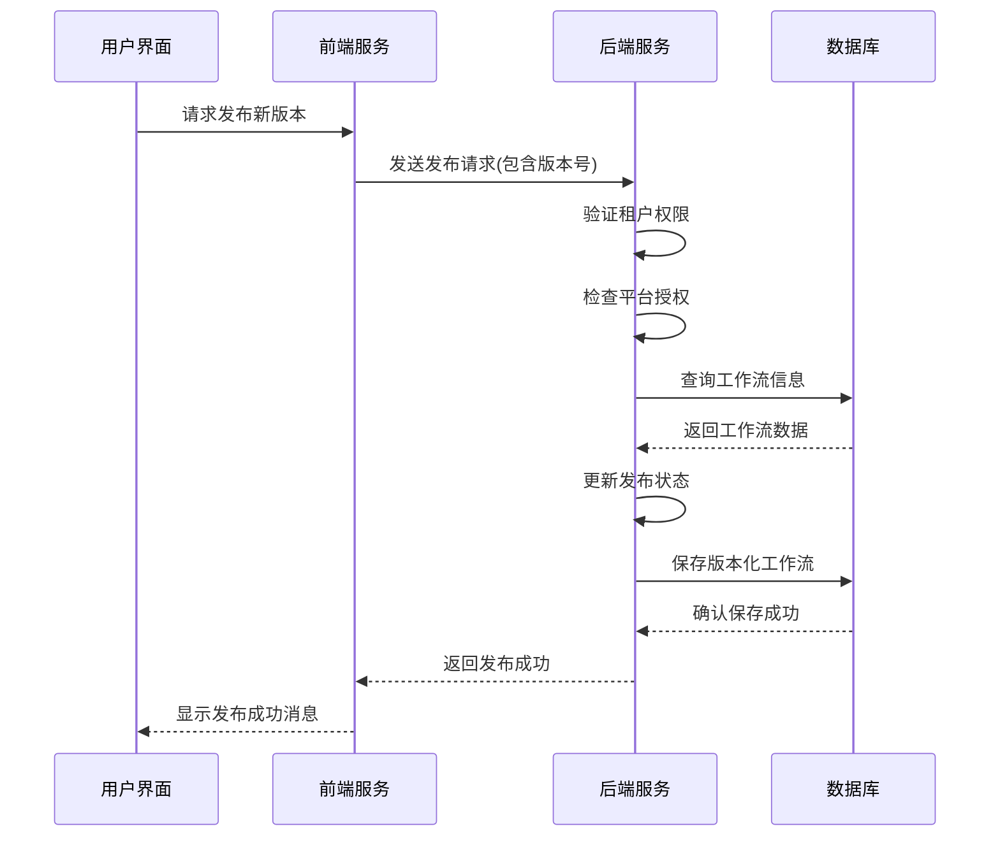
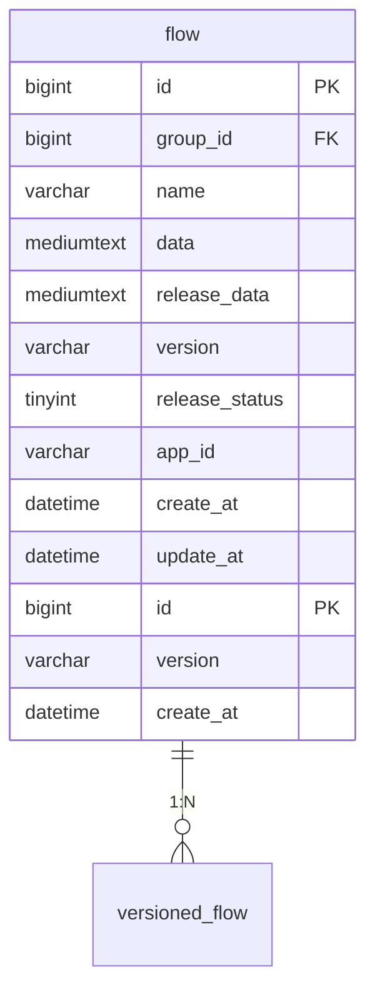
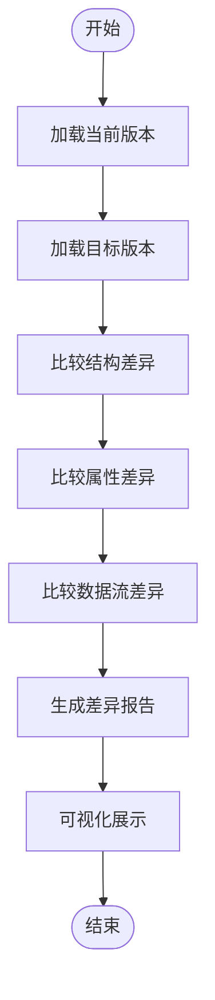
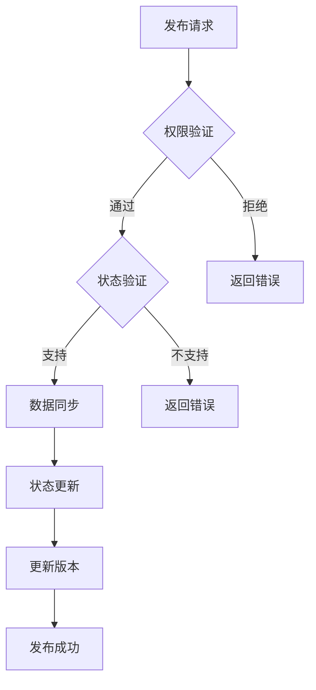
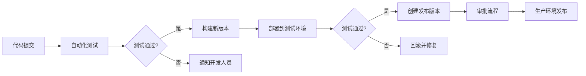

# 工作流版本管理

<cite>
**本文档引用文件**  
- [workflow.sql](file://docker/astronAgent/mysql/workflow.sql)
- [history_service.py](file://core/workflow/service/history_service.py)
- [publish_service.py](file://core/workflow/service/publish_service.py)
- [flow_dao.py](file://core/workflow/repository/flow_dao.py)
- [version-management/index.tsx](file://console/frontend/src/components/drawer/plugin/version-management/index.tsx)
- [flow.py](file://core/workflow/domain/entities/flow.py)
- [tenant_publish_matrix.py](file://core/workflow/consts/tenant_publish_matrix.py)
</cite>

## 目录
1. [简介](#简介)
2. [版本创建与发布流程](#版本创建与发布流程)
3. [版本存储机制与数据库设计](#版本存储机制与数据库设计)
4. [版本差异比较与可视化](#版本差异比较与可视化)
5. [版本发布与审批流程](#版本发布与审批流程)
6. [版本兼容性与迁移策略](#版本兼容性与迁移策略)
7. [自动化版本管理最佳实践](#自动化版本管理最佳实践)
8. [故障排除指南](#故障排除指南)

## 简介
本文档全面介绍工作流版本管理系统的使用方法和实现原理。系统提供完整的版本控制功能，包括版本创建、比较、回滚等操作，支持多平台发布和审批流程。通过详细的数据库表结构设计和版本管理算法，确保工作流的稳定性和可追溯性。

## 版本创建与发布流程
工作流版本管理系统支持通过API或前端界面创建和发布新版本。用户可以为工作流指定版本号（符合v3.x.x格式），系统会自动处理版本的创建和发布流程。

当发布新版本时，系统会检查租户权限和平台授权，确保只有授权用户才能发布到指定平台。发布操作包括将当前工作流数据保存为发布版本，并更新版本状态。

**Diagram sources**
- [publish_service.py](file://core/workflow/service/publish_service.py#L1-L295)
- [version-management/index.tsx](file://console/frontend/src/components/drawer/plugin/version-management/index.tsx#L1-L177)

**Section sources**
- [publish_service.py](file://core/workflow/service/publish_service.py#L1-L295)
- [flow.py](file://core/workflow/domain/entities/flow.py#L1-L128)

## 版本存储机制与数据库设计
系统使用MySQL数据库存储工作流版本信息，核心表为`flow`表，其设计支持版本控制和发布管理。

### flow表结构
| 字段名 | 数据类型 | 描述 |
|--------|---------|------|
| id | bigint(20) | 主键，工作流唯一标识 |
| group_id | bigint(20) | 工作流组ID，用于版本分组 |
| name | varchar(128) | 工作流名称 |
| data | mediumtext | 编排标准协议（当前版本） |
| release_data | mediumtext | 发布后的数据 |
| description | varchar(1024) | 描述信息 |
| version | varchar(128) | 协议版本 |
| release_status | tinyint(4) | 发布状态（位运算标识） |
| app_id | varchar(255) | 应用ID |
| source | tinyint(4) | 来源平台 |
| create_by | bigint(20) | 创建人 |
| update_by | bigint(20) | 更新人 |
| create_at | datetime | 创建时间 |
| update_at | datetime | 更新时间 |

### 版本存储策略
系统采用基于`group_id`和`version`的复合唯一键设计，确保同一工作流组内版本号的唯一性。当发布新版本时，系统会：
1. 检查是否存在相同`group_id`和`version`的记录
2. 如果不存在，创建新的版本化工作流备份
3. 如果存在，更新现有版本的数据
4. 将原始工作流的版本标记为"-1"（非版本化）

**Diagram sources**
- [workflow.sql](file://docker/astronAgent/mysql/workflow.sql#L0-L113)
- [publish_service.py](file://core/workflow/service/publish_service.py#L1-L295)

**Section sources**
- [workflow.sql](file://docker/astronAgent/mysql/workflow.sql#L0-L113)
- [flow_dao.py](file://core/workflow/repository/flow_dao.py#L1-L73)

## 版本差异比较与可视化
系统提供版本差异比较功能，帮助用户识别不同版本之间的变化。前端界面通过时间轴展示版本历史，支持可视化比较。

### 版本历史展示
前端使用Ant Design的Timeline组件展示版本历史，包括：
- 草稿版本（未发布）
- 已发布版本（按时间倒序排列）
- 版本创建时间
- 版本号标识

用户可以通过点击不同版本进行切换，系统会加载对应版本的工作流配置。

### 差异比较算法
系统通过比较`data`字段的JSON结构来识别版本差异。虽然具体差异比较算法未在代码中直接体现，但系统设计支持以下比较方式：
1. 结构比较：比较节点和边的增删改
2. 属性比较：比较节点配置参数的变化
3. 数据流比较：比较工作流数据流向的变化

**Diagram sources**
- [version-management/index.tsx](file://console/frontend/src/components/drawer/plugin/version-management/index.tsx#L1-L177)
- [history_service.py](file://core/workflow/service/history_service.py#L1-L185)

**Section sources**
- [version-management/index.tsx](file://console/frontend/src/components/drawer/plugin/version-management/index.tsx#L1-L177)

## 版本发布与审批流程
系统实现多平台版本发布和审批流程，支持不同平台的发布策略和权限控制。

### 发布状态管理
系统使用位运算标识发布状态，支持多种发布类型：
- 发布到星辰平台 (值: 1)
- 发布到开放平台 (值: 4)
- 发布到AIUI平台 (值: 32)
- 下架 (值: 2, 16, 64)

### 审批流程
发布流程包含以下审批步骤：
1. 权限验证：检查租户是否有权限发布到目标平台
2. 状态验证：检查目标平台是否支持请求的发布操作
3. 数据同步：将当前数据同步到发布数据字段
4. 状态更新：更新工作流的发布状态

**Diagram sources**
- [tenant_publish_matrix.py](file://core/workflow/consts/tenant_publish_matrix.py#L1-L117)
- [publish_service.py](file://core/workflow/service/publish_service.py#L1-L295)

**Section sources**
- [tenant_publish_matrix.py](file://core/workflow/consts/tenant_publish_matrix.py#L1-L117)
- [publish_service.py](file://core/workflow/service/publish_service.py#L1-L295)

## 版本兼容性与迁移策略
系统设计考虑了版本兼容性和迁移策略，确保不同版本之间能够平滑过渡。

### 兼容性设计
1. **语义化版本控制**：版本号遵循v3.x.x格式，便于识别重大变更
2. **数据向后兼容**：新版本系统能够读取旧版本工作流数据
3. **字段扩展性**：使用mediumtext存储工作流数据，支持未来扩展

### 迁移策略
1. **自动迁移**：系统在启动时自动执行数据库迁移脚本
2. **备份机制**：在执行迁移前自动创建数据备份
3. **回滚支持**：保留旧版本数据，支持快速回滚

## 自动化版本管理最佳实践
### 与CI/CD系统集成
建议将工作流版本管理与CI/CD系统集成，实现自动化发布流程：

### 最佳实践建议
1. **版本命名规范**：遵循语义化版本控制规范
2. **定期备份**：定期备份工作流版本数据
3. **灰度发布**：先在小范围用户中发布新版本
4. **监控告警**：监控版本发布状态，设置异常告警
5. **文档同步**：版本更新时同步更新相关文档

## 故障排除指南
### 常见问题及解决方案
| 问题现象 | 可能原因 | 解决方案 |
|---------|---------|---------|
| 无法发布新版本 | 权限不足 | 检查租户平台发布权限 |
| 版本号冲突 | 版本号已存在 | 使用新的版本号或更新现有版本 |
| 发布状态异常 | 位运算状态冲突 | 检查发布状态位的正确性 |
| 数据同步失败 | 数据过大 | 检查数据大小是否超过限制 |

**Section sources**
- [publish_service.py](file://core/workflow/service/publish_service.py#L1-L295)
- [history_service.py](file://core/workflow/service/history_service.py#L1-L185)