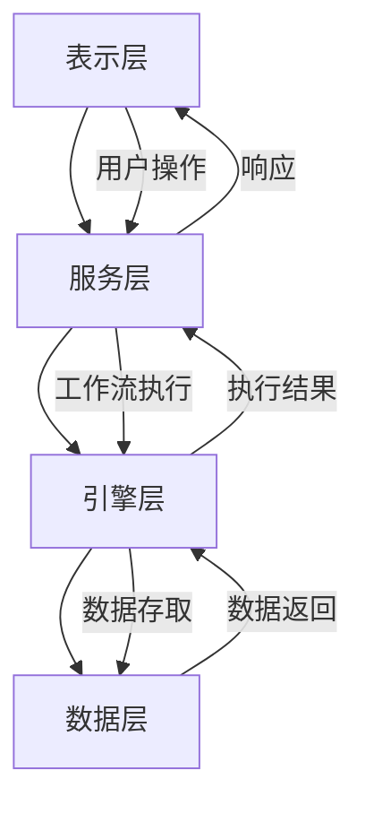
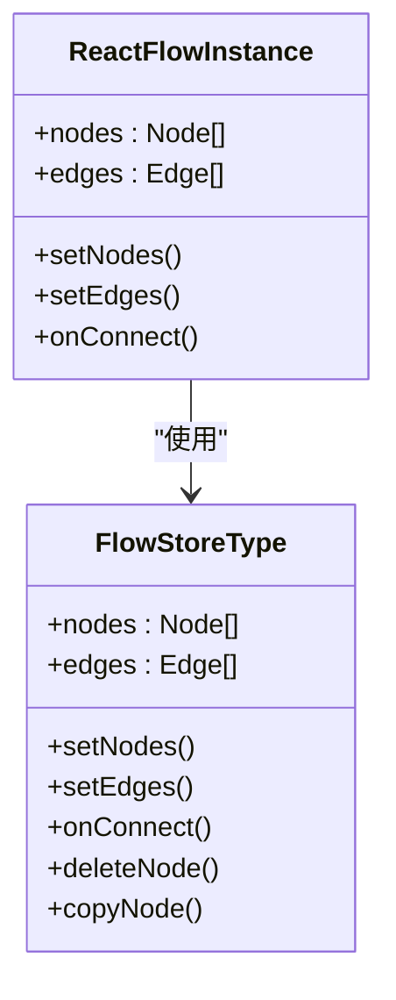
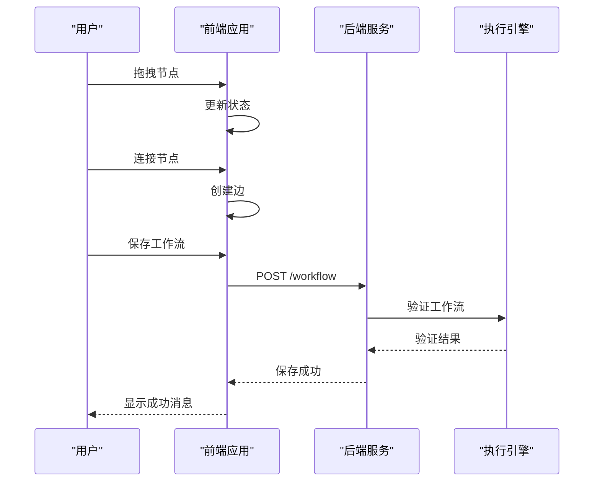
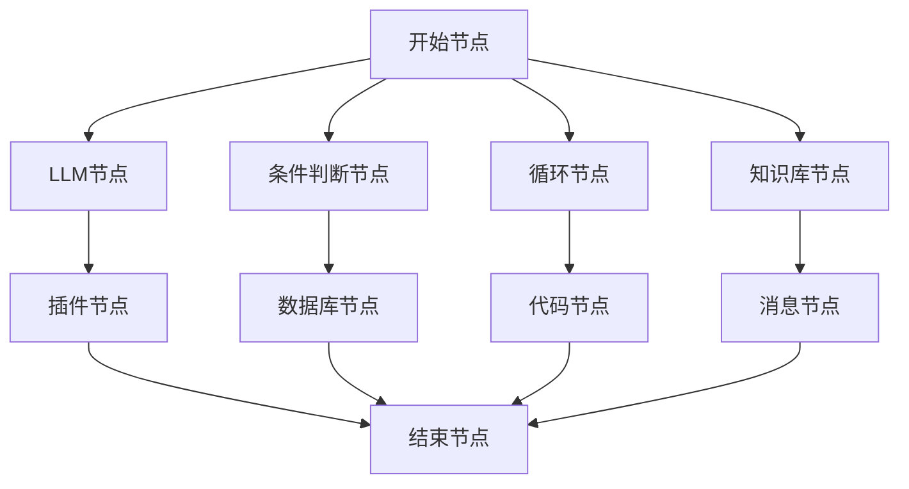
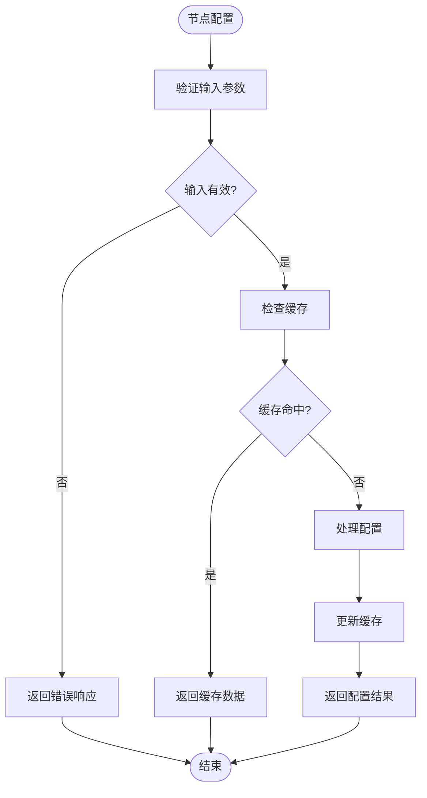
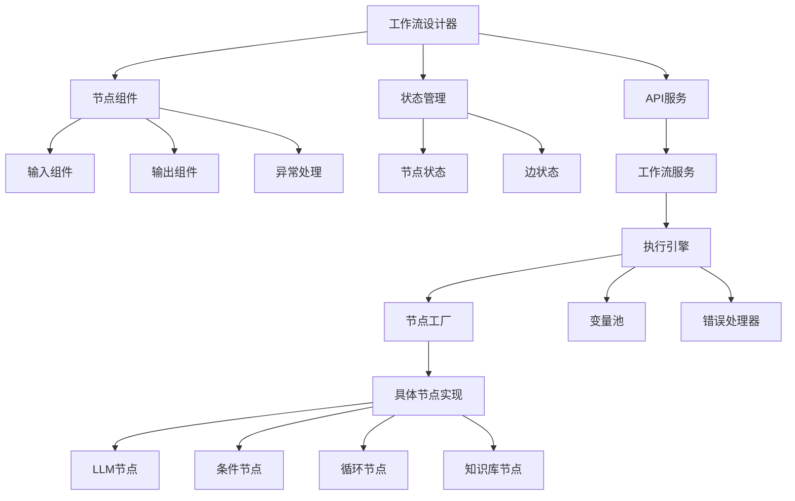

# 工作流编排

<cite>
**本文档引用的文件**
- [node.py](file://core/workflow/engine/node.py)
- [flow.py](file://core/workflow/domain/entities/flow.py)
- [dsl_engine.py](file://core/workflow/engine/dsl_engine.py)
- [flow_service.py](file://core/workflow/service/flow_service.py)
- [node_entities.py](file://core/workflow/engine/entities/node_entities.py)
- [flow.ts](file://console/frontend/src/services/flow.ts)
- [index.tsx](file://console/frontend/src/components/workflow/types/zustand/flow/index.ts)
</cite>

## 目录
1. [简介](#简介)
2. [项目结构](#项目结构)
3. [核心组件](#核心组件)
4. [架构概述](#架构概述)
5. [详细组件分析](#详细组件分析)
6. [依赖分析](#依赖分析)
7. [性能考虑](#性能考虑)
8. [故障排除指南](#故障排除指南)
9. [结论](#结论)
10. [附录](#附录)（如有必要）

## 简介
本文档全面介绍了astron-agent项目中的工作流编排功能。该功能允许用户通过可视化设计器创建复杂的工作流，支持多种节点类型和执行模式。系统采用前后端分离架构，前端使用React和ReactFlow库实现可视化工作流设计，后端使用Python实现工作流执行引擎。工作流系统支持节点调度、数据流管理、错误处理等核心功能，并提供了JSON Schema定义来描述工作流的底层数据结构。

## 项目结构
工作流功能分布在项目的多个目录中，主要包括前端组件、后端服务和核心引擎。前端部分位于console/frontend/src/components/workflow目录，包含可视化设计器、节点组件和状态管理。后端服务位于core/workflow目录，包含工作流引擎、节点实现和数据访问层。

```mermaid
graph TD
subgraph "前端"
A[console/frontend/src/components/workflow]
A --> B[节点组件]
A --> C[状态管理]
A --> D[服务调用]
end
subgraph "后端"
E[core/workflow]
E --> F[引擎]
E --> G[服务]
E --> H[领域实体]
E --> I[节点实现]
end
A < --> |API调用| E
```

**图表来源**
- [flow.ts](file://console/frontend/src/services/flow.ts)
- [dsl_engine.py](file://core/workflow/engine/dsl_engine.py)

**章节来源**
- [flow.ts](file://console/frontend/src/services/flow.ts)
- [dsl_engine.py](file://core/workflow/engine/dsl_engine.py)

## 核心组件
工作流系统的核心组件包括工作流设计器、执行引擎、节点管理器和状态存储。设计器提供用户友好的界面来创建和编辑工作流，执行引擎负责解析和运行工作流，节点管理器处理各种节点类型的实现，状态存储管理工作流执行过程中的变量和状态。

**章节来源**
- [node.py](file://core/workflow/engine/node.py)
- [dsl_engine.py](file://core/workflow/engine/dsl_engine.py)

## 架构概述
工作流系统采用分层架构设计，包括表示层、服务层、引擎层和数据层。表示层负责用户交互和可视化展示，服务层处理业务逻辑和API请求，引擎层执行工作流的核心逻辑，数据层管理持久化存储。



**图表来源**
- [flow_service.py](file://core/workflow/service/flow_service.py)
- [dsl_engine.py](file://core/workflow/engine/dsl_engine.py)

## 详细组件分析
### 工作流设计器分析
工作流设计器基于ReactFlow库构建，提供拖拽式界面来创建和编辑工作流。用户可以通过拖拽节点到画布上，然后连接节点来定义执行流程。

#### 对象导向组件：


**图表来源**
- [index.tsx](file://console/frontend/src/components/workflow/types/zustand/flow/index.ts)

#### API/服务组件：


**图表来源**
- [flow.ts](file://console/frontend/src/services/flow.ts)
- [flow_service.py](file://core/workflow/service/flow_service.py)

### 节点类型分析
系统支持多种节点类型，每种节点都有特定的功能和配置选项。

#### 支持的节点类型：


**图表来源**
- [node_entities.py](file://core/workflow/engine/entities/node_entities.py)

#### 节点配置分析：


**图表来源**
- [node.py](file://core/workflow/engine/node.py)

**章节来源**
- [node.py](file://core/workflow/engine/node.py)
- [node_entities.py](file://core/workflow/engine/entities/node_entities.py)

## 依赖分析
工作流系统各组件之间存在复杂的依赖关系，这些关系确保了系统的正常运行和功能完整性。



**图表来源**
- [flow_service.py](file://core/workflow/service/flow_service.py)
- [dsl_engine.py](file://core/workflow/engine/dsl_engine.py)

**章节来源**
- [flow_service.py](file://core/workflow/service/flow_service.py)
- [dsl_engine.py](file://core/workflow/engine/dsl_engine.py)

## 性能考虑
在设计和执行工作流时，需要考虑以下性能优化建议：

1. **减少不必要的LLM调用**：通过缓存机制避免重复的LLM调用，特别是在处理相同输入时。
2. **合理设置超时**：为每个节点设置合理的超时时间，防止长时间运行影响整体性能。
3. **批量处理**：对于循环节点，考虑批量处理数据而不是逐条处理。
4. **资源限制**：对计算密集型节点（如代码节点）设置资源使用限制。
5. **异步执行**：尽可能使用异步执行模式，提高并发处理能力。

这些建议有助于提高工作流的执行效率和响应速度。

## 故障排除指南
当工作流执行出现问题时，可以参考以下常见问题和解决方案：

**章节来源**
- [node.py](file://core/workflow/engine/node.py)
- [dsl_engine.py](file://core/workflow/engine/dsl_engine.py)

## 结论
本文档详细介绍了astron-agent项目中的工作流编排功能。该系统提供了一个完整的解决方案，从可视化设计到执行引擎，支持多种节点类型和复杂的业务流程。通过合理的架构设计和组件划分，系统具有良好的可扩展性和维护性。未来可以进一步优化性能，增加更多节点类型，并提供更强大的调试和监控功能。