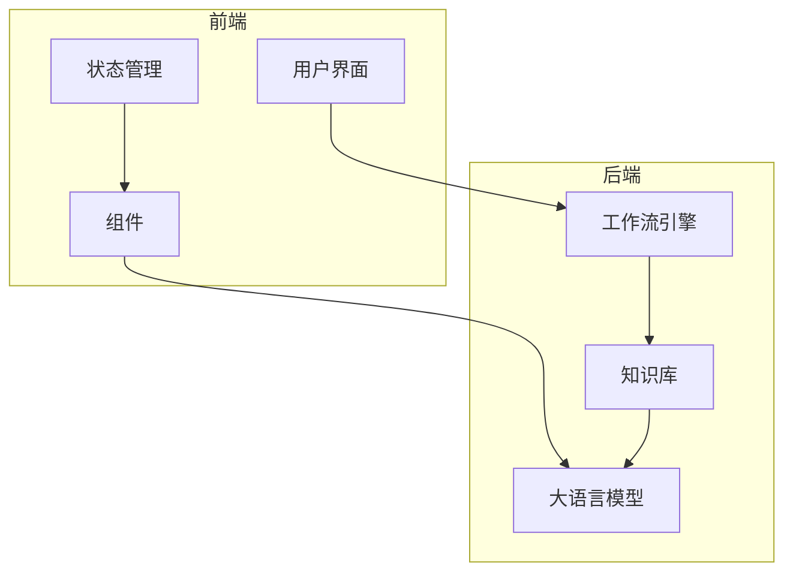
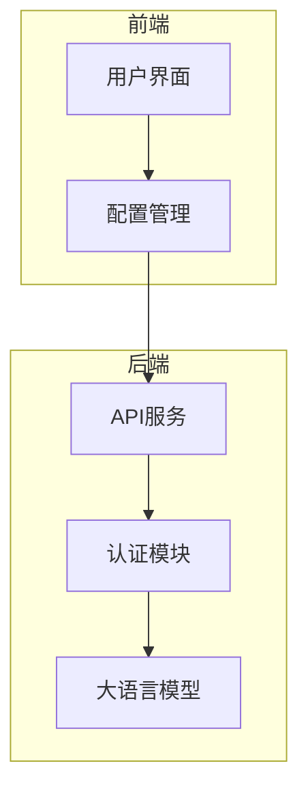
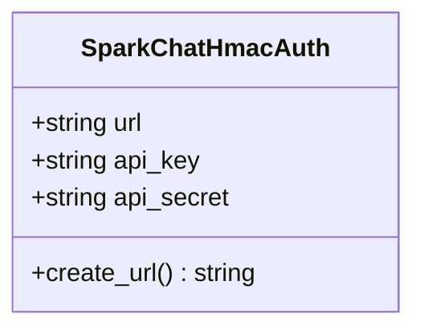
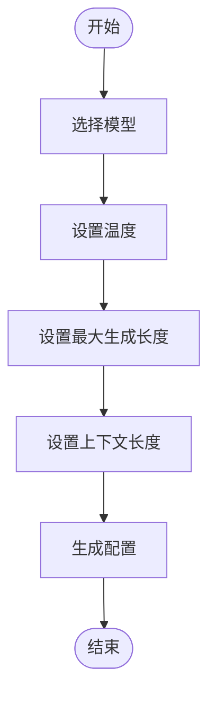
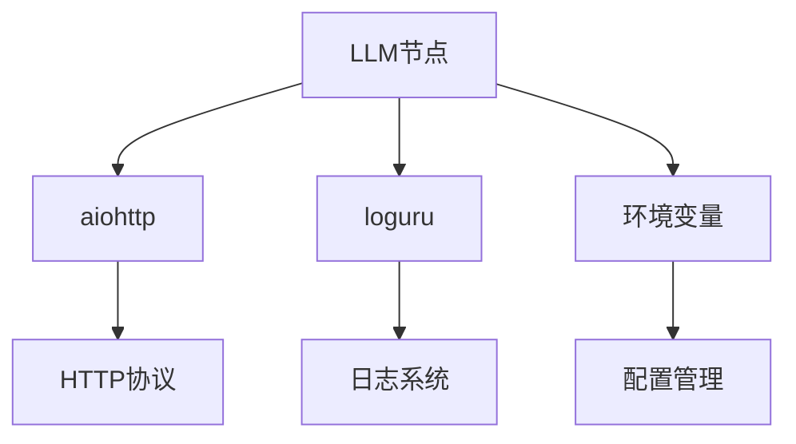

# LLM节点

<cite>
**本文档中引用的文件**   
- [spark_chat_auth.py](file://core/workflow/infra/providers/llm/iflytek_spark/spark_chat_auth.py)
- [xinghuo.py](file://core/knowledge/infra/xinghuo/xinghuo.py)
- [sparkdesk.py](file://core/knowledge/infra/desk/sparkdesk.py)
- [index.tsx](file://console/frontend/src/components/workflow/nodes/components/model-params/index.tsx)
- [model-detail/index.tsx](file://console/frontend/src/pages/model-management/model-detail/index.tsx)
</cite>

## 目录
1. [介绍](#介绍)
2. [项目结构](#项目结构)
3. [核心组件](#核心组件)
4. [架构概述](#架构概述)
5. [详细组件分析](#详细组件分析)
6. [依赖分析](#依赖分析)
7. [性能考虑](#性能考虑)
8. [故障排除指南](#故障排除指南)
9. [结论](#结论)
10. [附录](#附录)（如有必要）

## 介绍
本文档深入解释了Spark LLM节点的实现机制，包括与讯飞星火大模型的集成方式、认证流程和API调用细节。详细描述了节点配置参数，如模型选择、温度设置、最大生成长度等。说明了前端组件如何构建LLM节点的配置界面，以及如何将用户输入转换为后端可处理的请求格式。提供了节点输入输出数据结构的完整示例，包括提示词模板、上下文管理和响应解析。包含错误处理机制和重试策略的实现细节，以及性能优化建议。

## 项目结构
该项目包含前端和后端两个主要部分。前端位于console/frontend目录下，使用React和TypeScript构建用户界面。后端位于core目录下，使用Python实现核心功能。LLM节点相关的代码分布在多个模块中，包括workflow、knowledge和frontend组件。

**Diagram sources**
- [index.tsx](file://console/frontend/src/components/workflow/nodes/components/model-params/index.tsx)
- [spark_chat_auth.py](file://core/workflow/infra/providers/llm/iflytek_spark/spark_chat_auth.py)

**Section sources**
- [spark_chat_auth.py](file://core/workflow/infra/providers/llm/iflytek_spark/spark_chat_auth.py)
- [index.tsx](file://console/frontend/src/components/workflow/nodes/components/model-params/index.tsx)

## 核心组件
LLM节点的核心组件包括认证模块、API调用模块和前端配置界面。认证模块实现了HMAC-SHA256认证机制，用于访问讯飞星火大模型API。API调用模块负责与大模型进行通信，发送请求并处理响应。前端配置界面允许用户设置模型参数，如温度、最大生成长度等。

**Section sources**
- [spark_chat_auth.py](file://core/workflow/infra/providers/llm/iflytek_spark/spark_chat_auth.py)
- [index.tsx](file://console/frontend/src/components/workflow/nodes/components/model-params/index.tsx)

## 架构概述
LLM节点的架构分为前端和后端两部分。前端负责用户交互和配置管理，后端负责与大模型API的通信和数据处理。前端通过REST API与后端通信，后端使用HMAC-SHA256认证机制与讯飞星火大模型API进行安全通信。

**Diagram sources**
- [spark_chat_auth.py](file://core/workflow/infra/providers/llm/iflytek_spark/spark_chat_auth.py)
- [index.tsx](file://console/frontend/src/components/workflow/nodes/components/model-params/index.tsx)

## 详细组件分析

### 认证模块分析
认证模块实现了HMAC-SHA256认证机制，用于安全地访问讯飞星火大模型API。该模块生成包含时间戳和签名的认证URL，确保请求的安全性。

**Diagram sources**
- [spark_chat_auth.py](file://core/workflow/infra/providers/llm/iflytek_spark/spark_chat_auth.py#L16-L86)

### 前端配置界面分析
前端配置界面允许用户设置LLM节点的各种参数，包括模型选择、温度、最大生成长度等。界面使用React组件构建，通过状态管理实现参数的动态更新。

**Diagram sources**
- [index.tsx](file://console/frontend/src/components/workflow/nodes/components/model-params/index.tsx)
- [model-detail/index.tsx](file://console/frontend/src/pages/model-management/model-detail/index.tsx)

## 依赖分析
LLM节点依赖于多个外部服务和库。主要依赖包括aiohttp用于异步HTTP请求，loguru用于日志记录，以及各种环境变量用于配置API端点和认证信息。

**Diagram sources**
- [spark_chat_auth.py](file://core/workflow/infra/providers/llm/iflytek_spark/spark_chat_auth.py)
- [xinghuo.py](file://core/knowledge/infra/xinghuo/xinghuo.py)

**Section sources**
- [spark_chat_auth.py](file://core/workflow/infra/providers/llm/iflytek_spark/spark_chat_auth.py)
- [xinghuo.py](file://core/knowledge/infra/xinghuo/xinghuo.py)

## 性能考虑
在实现LLM节点时，需要考虑性能优化。建议使用异步请求以提高响应速度，合理设置超时时间以避免长时间等待，并使用缓存机制减少重复请求。

## 故障排除指南
当LLM节点出现问题时，可以检查以下方面：认证信息是否正确、API端点是否可达、网络连接是否正常、请求参数是否符合要求。查看日志文件可以帮助定位具体问题。

**Section sources**
- [spark_chat_auth.py](file://core/workflow/infra/providers/llm/iflytek_spark/spark_chat_auth.py)
- [xinghuo.py](file://core/knowledge/infra/xinghuo/xinghuo.py)

## 结论
LLM节点通过集成讯飞星火大模型，为用户提供强大的语言处理能力。通过合理的架构设计和实现，确保了系统的安全性和性能。前端友好的配置界面使得用户可以轻松地定制模型行为。

## 附录
无