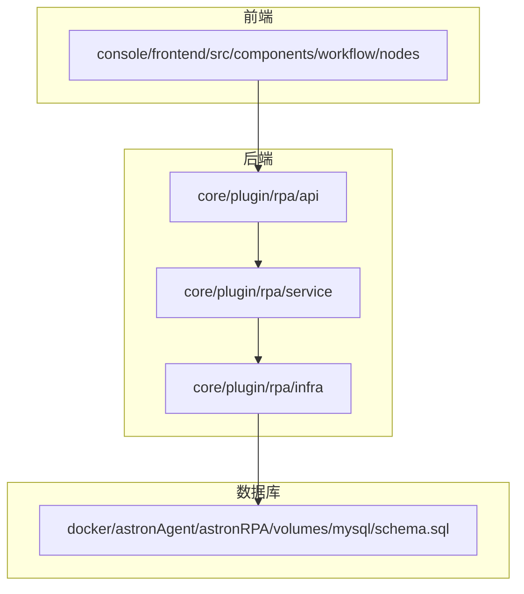
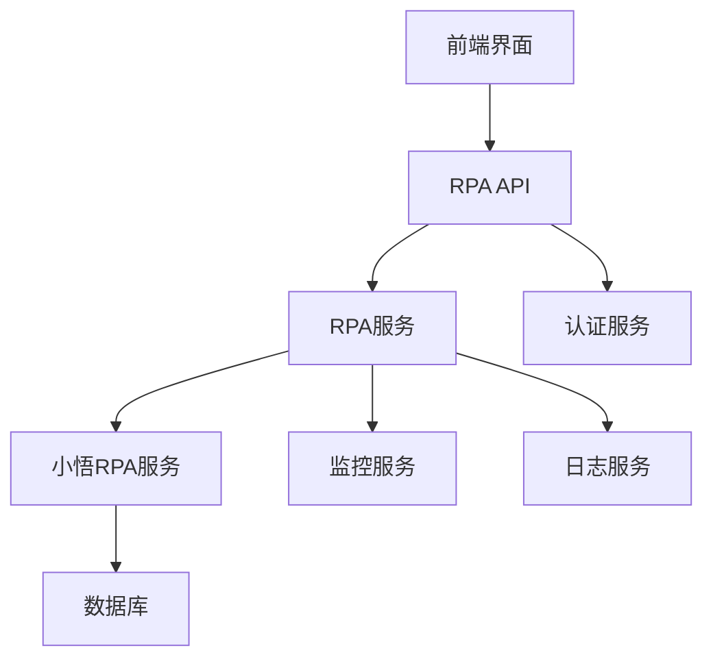
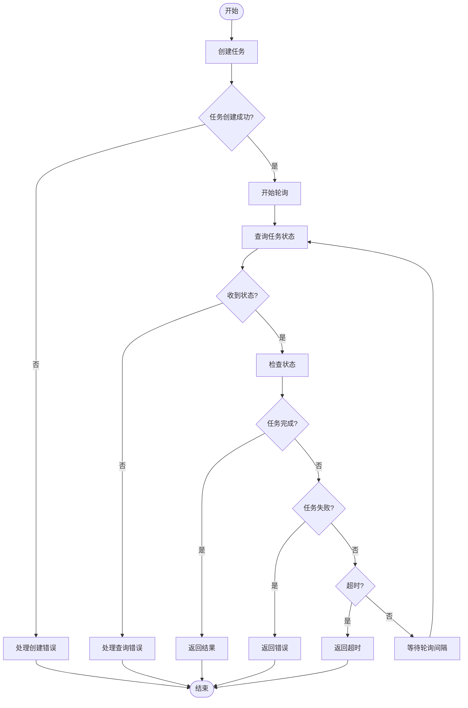
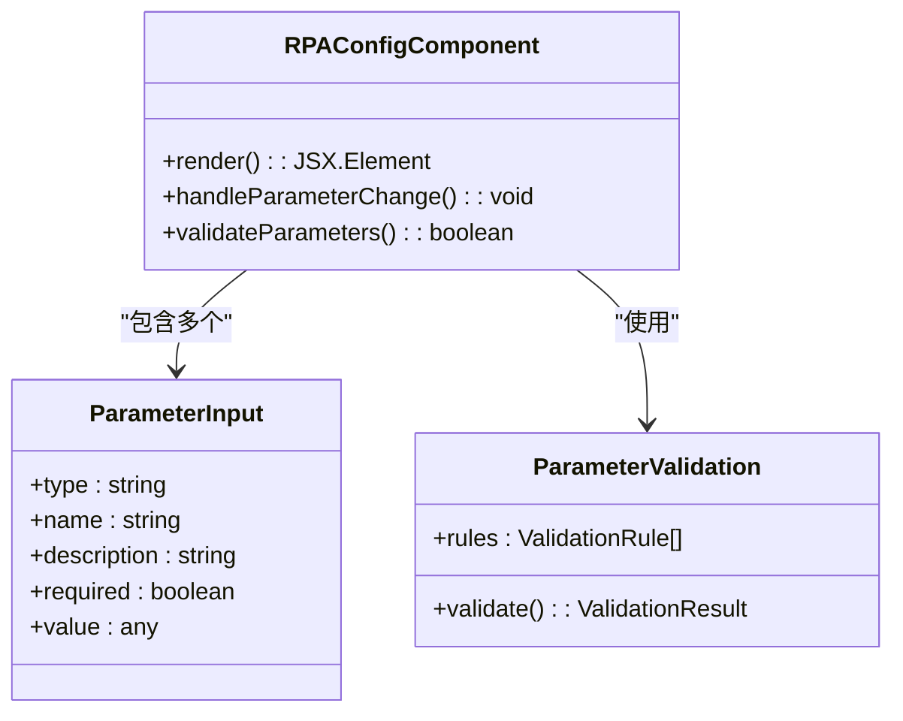
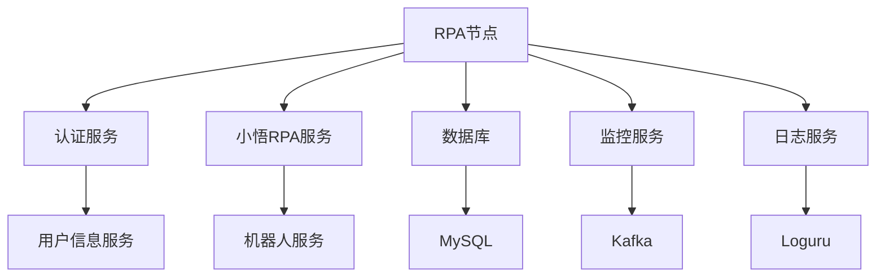

# RPA节点

<cite>
**本文档引用的文件**  
- [main.py](file://core/plugin/rpa/main.py)
- [app.py](file://core/plugin/rpa/api/app.py)
- [router.py](file://core/plugin/rpa/api/router.py)
- [execution.py](file://core/plugin/rpa/api/v1/execution.py)
- [execution_schema.py](file://core/plugin/rpa/api/schemas/execution_schema.py)
- [process.py](file://core/plugin/rpa/service/xiaowu/process.py)
- [tasks.py](file://core/plugin/rpa/infra/xiaowu/tasks.py)
- [const.py](file://core/plugin/rpa/consts/const.py)
- [auth_handler.lua](file://docker/astronAgent/astronRPA/volumes/nginx/lua/auth_handler.lua)
- [default.conf](file://docker/astronAgent/astronRPA/volumes/nginx/default.conf)
- [schema.sql](file://docker/astronAgent/astronRPA/volumes/mysql/schema.sql)
- [rpa.ts](file://console/frontend/src/services/rpa.ts)
- [rpa.ts](file://console/frontend/src/types/rpa.ts)
- [use-columns.tsx](file://console/frontend/src/components/table/tool-output-parameters/hooks/use-columns.tsx)
</cite>

## 目录
1. [介绍](#介绍)
2. [项目结构](#项目结构)
3. [核心组件](#核心组件)
4. [架构概述](#架构概述)
5. [详细组件分析](#详细组件分析)
6. [依赖分析](#依赖分析)
7. [性能考虑](#性能考虑)
8. [故障排除指南](#故障排除指南)
9. [结论](#结论)

## 介绍
本文档全面介绍了RPA节点如何与RPA插件服务（core/plugin/rpa/）集成。文档详细描述了任务执行请求的构建、状态轮询机制和结果获取流程，以及RPA节点的配置参数如RPA流程ID、输入参数映射、超时设置等。同时解释了前端组件如何实现RPA流程的选择和参数配置界面，以及如何处理异步执行的用户体验。文档还提供了RPA任务从触发到完成的完整生命周期示例，包括成功执行、失败处理和超时场景，并包含了RPA服务的认证机制和安全考虑。

## 项目结构
RPA节点的实现分布在多个目录中，主要包括后端服务、前端组件和数据库结构。后端服务位于core/plugin/rpa/目录下，包含API接口、服务逻辑和基础设施代码。前端组件位于console/frontend/src/components/workflow/nodes/目录下，提供用户界面。数据库结构定义在docker/astronAgent/astronRPA/volumes/mysql/schema.sql文件中。



**图表来源**
- [schema.sql](file://docker/astronAgent/astronRPA/volumes/mysql/schema.sql)
- [main.py](file://core/plugin/rpa/main.py)

**章节来源**
- [main.py](file://core/plugin/rpa/main.py)
- [schema.sql](file://docker/astronAgent/astronRPA/volumes/mysql/schema.sql)

## 核心组件
RPA节点的核心组件包括任务执行API、任务监控服务、任务创建和查询基础设施，以及相关的常量和错误码定义。这些组件共同实现了RPA任务的完整生命周期管理。

**章节来源**
- [main.py](file://core/plugin/rpa/main.py)
- [app.py](file://core/plugin/rpa/api/app.py)
- [process.py](file://core/plugin/rpa/service/xiaowu/process.py)

## 架构概述
RPA节点的架构采用分层设计，包括API层、服务层和基础设施层。API层负责接收和响应HTTP请求，服务层处理业务逻辑，基础设施层与外部系统交互。



**图表来源**
- [app.py](file://core/plugin/rpa/api/app.py)
- [process.py](file://core/plugin/rpa/service/xiaowu/process.py)

## 详细组件分析
### RPA执行API分析
RPA执行API负责接收任务执行请求并返回流式响应。API使用SSE（Server-Sent Events）技术实现流式通信，允许客户端实时接收任务执行状态。

#### API请求处理
```mermaid
sequenceDiagram
participant Client as "客户端"
participant API as "RPA API"
participant Service as "RPA服务"
participant External as "小悟RPA服务"
Client->>API : POST /rpa/v1/exec
API->>API : 验证Authorization头
API->>API : 解析请求体
API->>Service : 调用task_monitoring
Service->>External : 创建任务
External-->>Service : 返回任务ID
Service->>Service : 启动状态轮询
loop 每10秒轮询一次
Service->>External : 查询任务状态
External-->>Service : 返回状态
alt 任务完成
Service->>API : 发送完成事件
API->>Client : 发送SSE事件
break 循环
else 任务进行中
Service->>API : 发送ping事件
API->>Client : 发送SSE ping
end
end
```

**图表来源**
- [execution.py](file://core/plugin/rpa/api/v1/execution.py)
- [process.py](file://core/plugin/rpa/service/xiaowu/process.py)

### 任务监控服务分析
任务监控服务是RPA节点的核心，负责管理任务的整个生命周期，包括任务创建、状态轮询、结果获取和超时处理。

#### 任务监控流程


**图表来源**
- [process.py](file://core/plugin/rpa/service/xiaowu/process.py)
- [tasks.py](file://core/plugin/rpa/infra/xiaowu/tasks.py)

### 前端组件分析
前端组件实现了RPA流程的选择和参数配置界面，以及异步执行的用户体验。

#### 参数配置界面


**图表来源**
- [use-columns.tsx](file://console/frontend/src/components/table/tool-output-parameters/hooks/use-columns.tsx)
- [rpa.ts](file://console/frontend/src/types/rpa.ts)

**章节来源**
- [use-columns.tsx](file://console/frontend/src/components/table/tool-output-parameters/hooks/use-columns.tsx)

## 依赖分析
RPA节点依赖于多个内部和外部服务，包括认证服务、小悟RPA服务、数据库和监控服务。



**图表来源**
- [auth_handler.lua](file://docker/astronAgent/astronRPA/volumes/nginx/lua/auth_handler.lua)
- [process.py](file://core/plugin/rpa/service/xiaowu/process.py)

**章节来源**
- [auth_handler.lua](file://docker/astronAgent/astronRPA/volumes/nginx/lua/auth_handler.lua)
- [process.py](file://core/plugin/rpa/service/xiaowu/process.py)

## 性能考虑
RPA节点在设计时考虑了多项性能因素，包括异步处理、流式响应、超时控制和资源管理。

- **异步处理**：使用async/await模式处理I/O操作，避免阻塞主线程
- **流式响应**：采用SSE技术，减少客户端等待时间
- **超时控制**：可配置的超时设置，防止任务无限期运行
- **轮询间隔**：可配置的轮询间隔，平衡实时性和系统负载
- **连接池**：使用HTTP连接池，减少连接建立开销

## 故障排除指南
### 常见问题及解决方案
1. **任务创建失败**
   - 检查认证令牌是否有效
   - 验证RPA流程ID是否正确
   - 确认输入参数格式是否符合要求

2. **任务状态查询超时**
   - 检查网络连接是否正常
   - 验证小悟RPA服务是否可用
   - 检查防火墙设置

3. **参数验证错误**
   - 确认所有必填参数都已提供
   - 检查参数类型是否匹配
   - 验证参数值是否在允许范围内

4. **认证失败**
   - 检查Authorization头格式是否正确
   - 确认令牌未过期
   - 验证用户权限

**章节来源**
- [execution.py](file://core/plugin/rpa/api/v1/execution.py)
- [tasks.py](file://core/plugin/rpa/infra/xiaowu/tasks.py)

## 结论
RPA节点通过与RPA插件服务的紧密集成，实现了完整的自动化任务执行能力。系统采用分层架构，将API接口、业务逻辑和基础设施分离，提高了代码的可维护性和可扩展性。通过SSE流式响应和异步处理机制，系统能够高效地管理长时间运行的RPA任务。前端组件提供了直观的用户界面，使用户能够轻松配置和监控RPA流程。系统的认证机制和安全考虑确保了RPA任务执行的安全性。整体设计充分考虑了性能、可靠性和用户体验，为自动化任务执行提供了一个强大而灵活的平台。