# 工作流节点类型

<cite>
**本文档引用的文件**   
- [base_node.py](file://core/workflow/engine/nodes/base_node.py)
- [spark_llm_node.py](file://core/workflow/engine/nodes/llm/spark_llm_node.py)
- [knowledge_node.py](file://core/workflow/engine/nodes/knowledge/knowledge_node.py)
- [rpa_node.py](file://core/workflow/engine/nodes/rpa/rpa_node.py)
- [if_else_node.py](file://core/workflow/engine/nodes/if_else/if_else_node.py)
- [start_node.py](file://core/workflow/engine/nodes/start/start_node.py)
- [end_node.py](file://core/workflow/engine/nodes/end/end_node.py)
- [message_node.py](file://core/workflow/engine/nodes/message/message_node.py)
- [iteration_node.py](file://core/workflow/engine/nodes/iteration/iteration_node.py)
- [text_joiner_node.py](file://core/workflow/engine/nodes/text_joiner/text_joiner_node.py)
- [index.tsx](file://console/frontend/src/components/workflow/nodes/llm/index.tsx)
- [knowledge/index.tsx](file://console/frontend/src/components/workflow/nodes/knowledge/index.tsx)
- [rpa/index.tsx](file://console/frontend/src/components/workflow/nodes/rpa/index.tsx)
- [if-else/index.tsx](file://console/frontend/src/components/workflow/nodes/if-else/index.tsx)
</cite>

## 目录
1. [简介](#简介)
2. [节点基类设计](#节点基类设计)
3. [核心节点类型](#核心节点类型)
4. [前端节点组件](#前端节点组件)
5. [节点间数据传递](#节点间数据传递)
6. [自定义节点开发](#自定义节点开发)
7. [总结](#总结)

## 简介

工作流节点是astron-agent系统的核心构建块，它们定义了工作流中各个步骤的行为和逻辑。每个节点代表一个特定的功能单元，可以是调用大语言模型、查询知识库、执行RPA任务或进行条件判断等。节点通过输入输出参数相互通信，形成复杂的工作流逻辑。

**节点来源**
- [base_node.py](file://core/workflow/engine/nodes/base_node.py#L0-L1385)
- [spark_llm_node.py](file://core/workflow/engine/nodes/llm/spark_llm_node.py#L0-L339)

## 节点基类设计

工作流节点系统基于面向对象的设计原则，通过基类提供通用功能，子类实现特定行为。`BaseNode`是所有节点的基类，定义了节点的基本结构和执行契约。

### 基类结构

`BaseNode`类定义了所有节点共享的属性和方法：

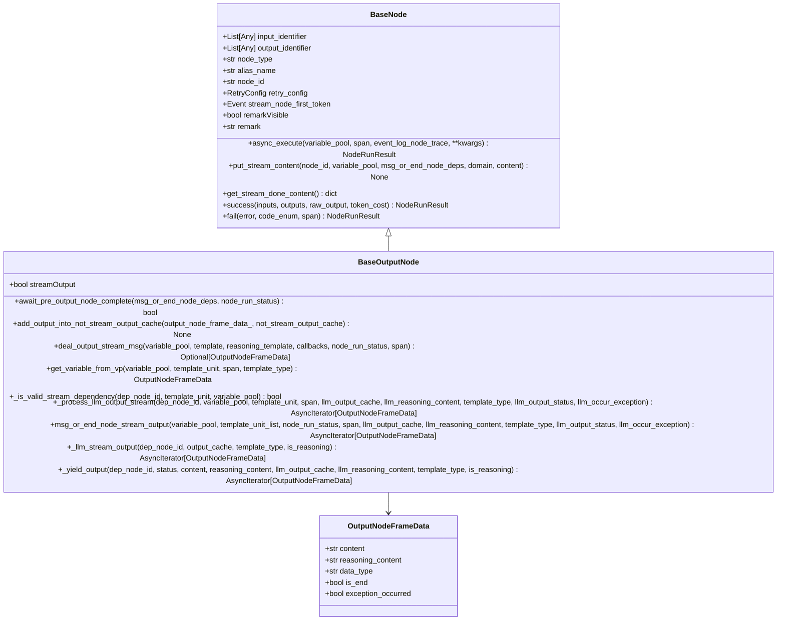

**Diagram sources **
- [base_node.py](file://core/workflow/engine/nodes/base_node.py#L0-L799)

**节点来源**
- [base_node.py](file://core/workflow/engine/nodes/base_node.py#L0-L1385)

## 核心节点类型

### LLM节点

LLM节点负责与大语言模型交互，执行提示词生成和响应处理。`SparkLLMNode`是LLM节点的具体实现，继承自`BaseLLMNode`。

#### 输入输出参数
- **输入参数**: 通过`input_identifier`定义，通常包括用户输入、上下文变量等
- **输出参数**: 通过`output_identifier`定义，可以是文本、JSON或推理内容

#### 配置选项
- `template`: 用户提示词模板
- `systemTemplate`: 系统提示词模板
- `respFormat`: 响应格式（文本、JSON、Markdown）
- `enableChatHistory`: 是否启用对话历史
- `domain`: 模型领域（如"xaipersonality"）

#### 执行逻辑
1. 处理提示词模板，替换变量
2. 管理对话历史（普通历史或V2历史）
3. 调用LLM服务进行推理
4. 解析响应并根据格式要求返回结果

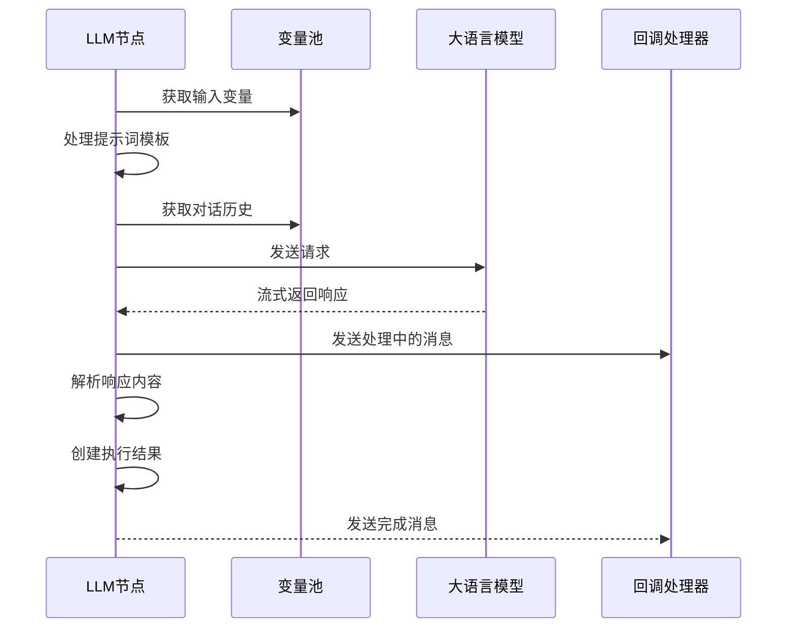

**Diagram sources **
- [spark_llm_node.py](file://core/workflow/engine/nodes/llm/spark_llm_node.py#L0-L339)

**节点来源**
- [spark_llm_node.py](file://core/workflow/engine/nodes/llm/spark_llm_node.py#L0-L339)

### 知识库节点

知识库节点用于从配置的知识库中检索相关信息，支持语义搜索和结果过滤。

#### 输入输出参数
- **输入参数**: 查询文本（通常来自`input_identifier`中的第一个标识符）
- **输出参数**: 检索到的结果列表

#### 配置选项
- `topN`: 返回的前N个结果
- `ragType`: RAG类型（如"AIUI-RAG2"）
- `repoId`: 知识库ID列表
- `docIds`: 特定文档ID列表
- `score`: 相似度阈值
- `enableChatHistoryV2`: 是否启用V2对话历史

#### 执行逻辑
1. 从变量池获取查询文本
2. 构建知识库搜索请求
3. 调用知识库服务进行检索
4. 处理搜索结果并返回

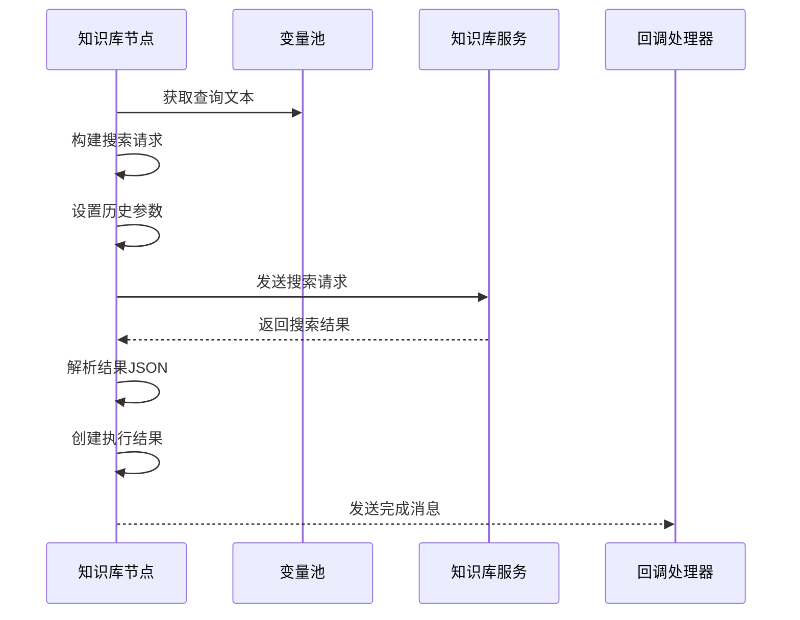

**Diagram sources **
- [knowledge_node.py](file://core/workflow/engine/nodes/knowledge/knowledge_node.py#L0-L176)

**节点来源**
- [knowledge_node.py](file://core/workflow/engine/nodes/knowledge/knowledge_node.py#L0-L176)

### RPA节点

RPA节点用于执行自动化流程任务，通过调用RPA服务来完成特定的业务流程。

#### 输入输出参数
- **输入参数**: 传递给RPA流程的参数
- **输出参数**: RPA执行结果中的指定字段

#### 配置选项
- `projectId`: RPA项目ID
- `header`: 请求头信息
- `source`: 来源标识
- `rpaParams`: RPA参数配置

#### 执行逻辑
1. 从变量池获取输入参数
2. 构建RPA执行请求
3. 调用RPA服务执行流程
4. 处理流式返回的数据
5. 提取指定输出字段

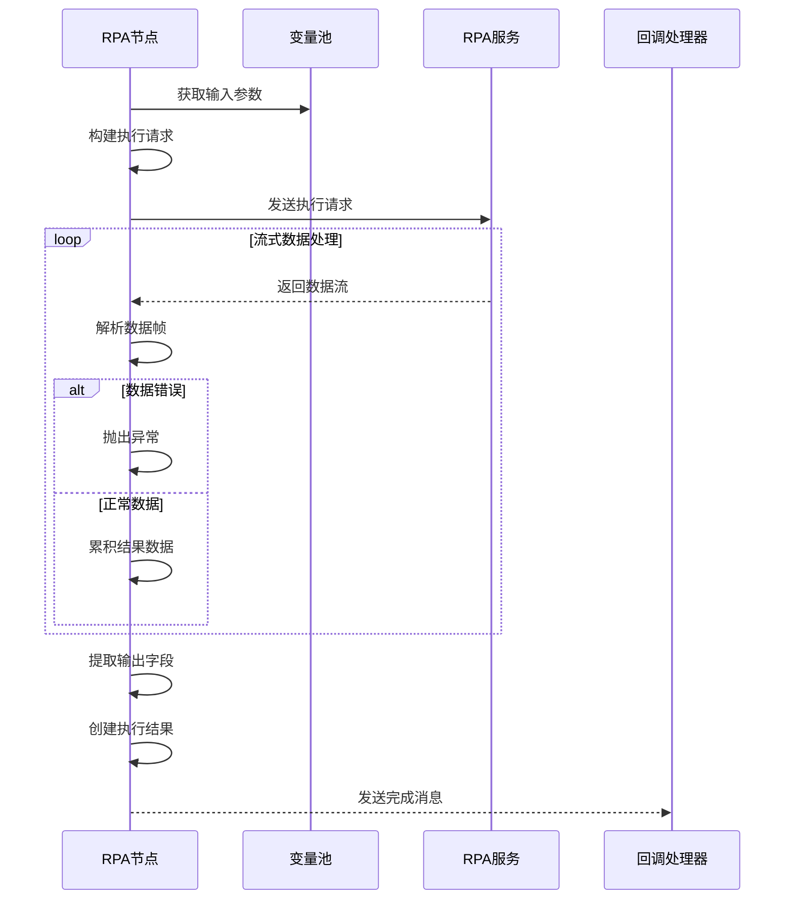

**Diagram sources **
- [rpa_node.py](file://core/workflow/engine/nodes/rpa/rpa_node.py#L0-L166)

**节点来源**
- [rpa_node.py](file://core/workflow/engine/nodes/rpa/rpa_node.py#L0-L166)

### 条件判断节点

条件判断节点（If-Else节点）用于实现分支逻辑，根据条件表达式的真假决定执行路径。

#### 输入输出参数
- **输入参数**: 条件判断所需的变量
- **输出参数**: 条件判断结果（布尔值）

#### 配置选项
- `cases`: 条件分支列表，每个分支包含：
  - `id`: 分支ID
  - `level`: 优先级级别
  - `logicalOperator`: 逻辑操作符（and/or）
  - `conditions`: 条件列表

#### 执行逻辑
1. 按优先级顺序评估每个分支
2. 对每个分支的条件应用逻辑操作符
3. 返回第一个满足条件的分支结果
4. 如果没有分支满足条件，返回默认分支结果

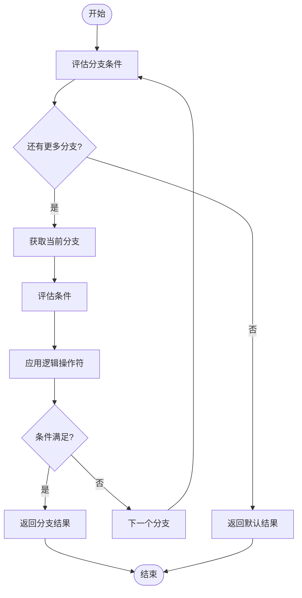

**Diagram sources **
- [if_else_node.py](file://core/workflow/engine/nodes/if_else/if_else_node.py#L0-L700)

**节点来源**
- [if_else_node.py](file://core/workflow/engine/nodes/if_else/if_else_node.py#L0-L700)

### 循环节点

循环节点（Iteration节点）用于对批量数据进行迭代处理，为每个数据项执行相同的工作流。

#### 输入输出参数
- **输入参数**: 批量数据列表
- **输出参数**: 处理结果列表

#### 配置选项
- `IterationStartNodeId`: 迭代工作流的起始节点ID

#### 执行逻辑
1. 从变量池获取批量数据
2. 为每个数据项创建独立的执行环境
3. 执行完整的迭代工作流
4. 收集并聚合所有迭代结果

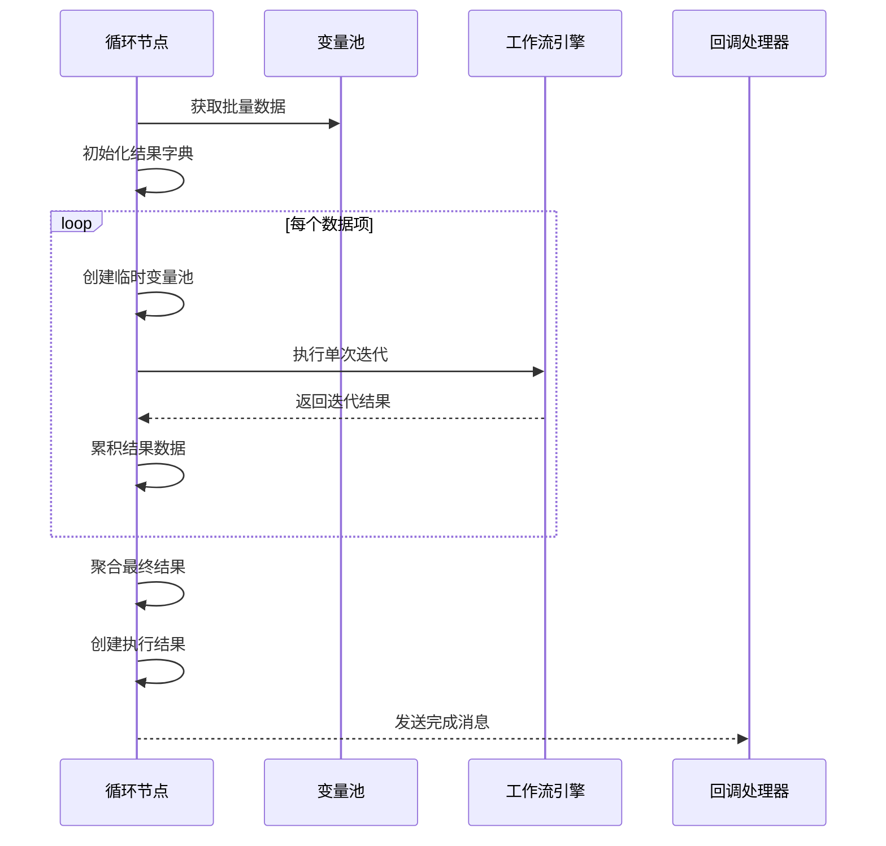

**Diagram sources **
- [iteration_node.py](file://core/workflow/engine/nodes/iteration/iteration_node.py#L0-L373)

**节点来源**
- [iteration_node.py](file://core/workflow/engine/nodes/iteration/iteration_node.py#L0-L373)

### 其他核心节点

#### 开始节点
- **功能**: 工作流的入口点
- **执行逻辑**: 初始化工作流，收集输入变量

#### 结束节点
- **功能**: 工作流的出口点
- **执行逻辑**: 处理输出模板，返回最终结果

#### 消息节点
- **功能**: 中间过程消息输出
- **执行逻辑**: 处理消息模板，支持流式输出

#### 文本拼接节点
- **功能**: 文本处理操作
- **执行逻辑**: 根据模式进行文本连接或分离

**节点来源**
- [start_node.py](file://core/workflow/engine/nodes/start/start_node.py#L0-L80)
- [end_node.py](file://core/workflow/engine/nodes/end/end_node.py#L0-L188)
- [message_node.py](file://core/workflow/engine/nodes/message/message_node.py#L0-L177)
- [text_joiner_node.py](file://core/workflow/engine/nodes/text_joiner/text_joiner_node.py#L0-L151)

## 前端节点组件

前端节点组件实现了用户界面与后端节点处理器的对应关系，提供了配置和交互界面。

### LLM节点前端组件

LLM节点前端组件`LargeModelDetail`提供了完整的配置界面：

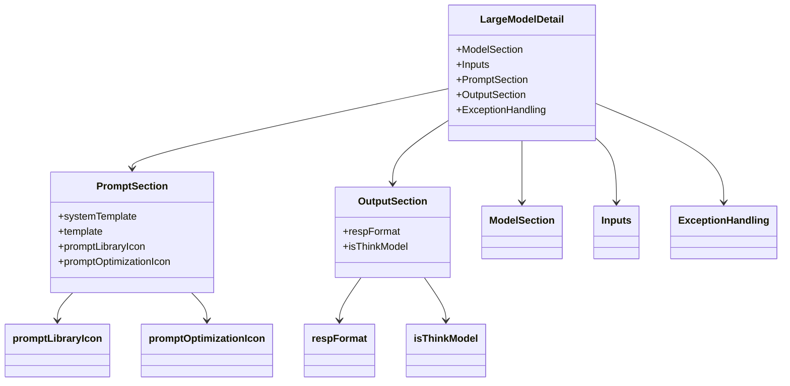

**Diagram sources **
- [index.tsx](file://console/frontend/src/components/workflow/nodes/llm/index.tsx#L0-L291)

**节点来源**
- [index.tsx](file://console/frontend/src/components/workflow/nodes/llm/index.tsx#L0-L291)

### 知识库节点前端组件

知识库节点前端组件`KnowledgeDetail`提供了知识库配置界面：

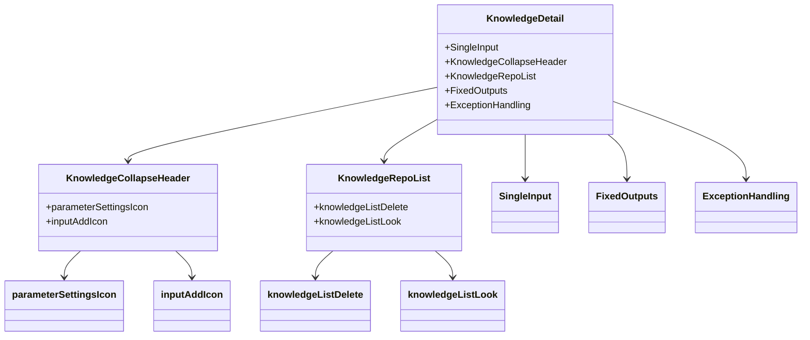

**Diagram sources **
- [knowledge/index.tsx](file://console/frontend/src/components/workflow/nodes/knowledge/index.tsx#L0-L224)

**节点来源**
- [knowledge/index.tsx](file://console/frontend/src/components/workflow/nodes/knowledge/index.tsx#L0-L224)

### RPA节点前端组件

RPA节点前端组件`RpaDetail`提供了简洁的配置界面：

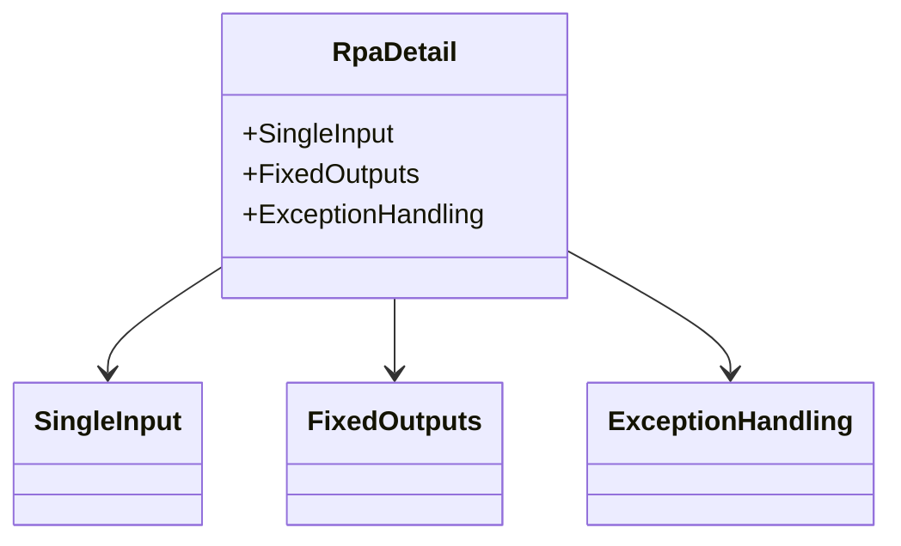

**Diagram sources **
- [rpa/index.tsx](file://console/frontend/src/components/workflow/nodes/rpa/index.tsx#L0-L18)

**节点来源**
- [rpa/index.tsx](file://console/frontend/src/components/workflow/nodes/rpa/index.tsx#L0-L18)

### 条件判断节点前端组件

条件判断节点前端组件`IfElseDetail`提供了复杂的条件配置界面：

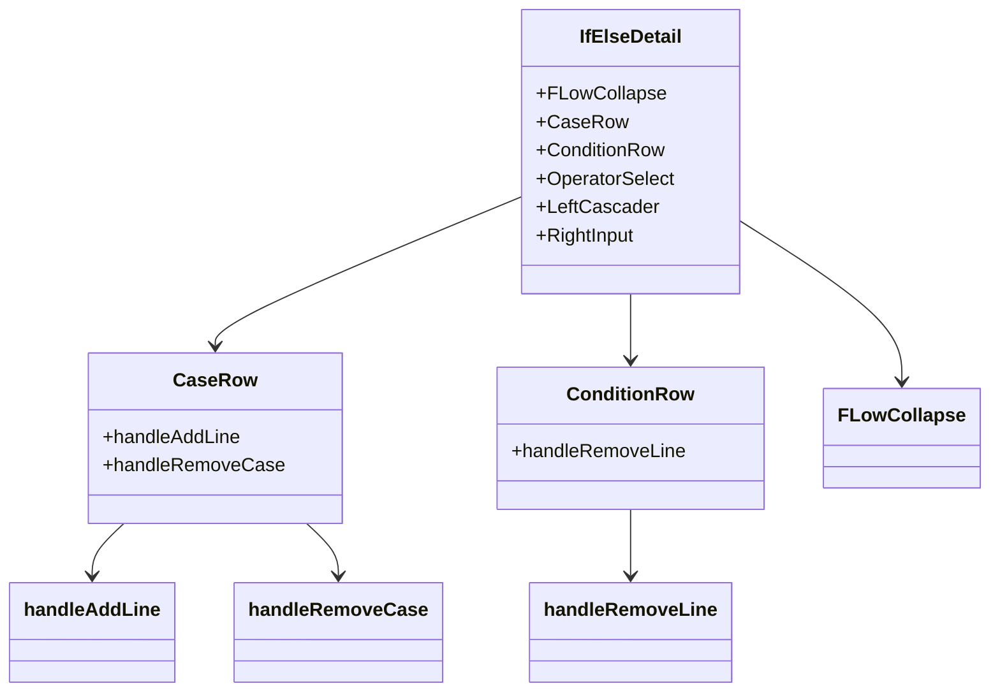

**Diagram sources **
- [if-else/index.tsx](file://console/frontend/src/components/workflow/nodes/if-else/index.tsx#L0-L898)

**节点来源**
- [if-else/index.tsx](file://console/frontend/src/components/workflow/nodes/if-else/index.tsx#L0-L898)

## 节点间数据传递

### 数据格式

节点间通过`VariablePool`进行数据传递，数据格式遵循以下规则：

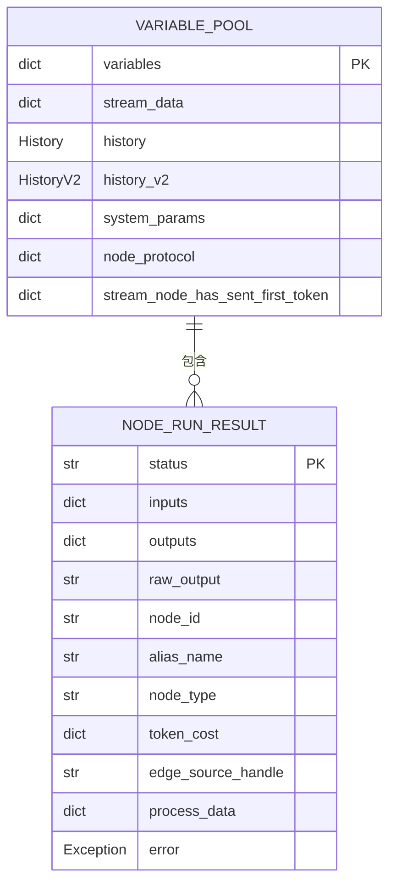

### 数据转换规则

1. **变量获取**: 使用`get_variable`方法从变量池获取变量值
2. **模板处理**: 使用`prompt_template_replace`方法处理模板中的变量
3. **流式数据**: 通过`stream_data`队列传递流式输出
4. **异常处理**: 通过`NodeRunResult`的`error`字段传递错误信息

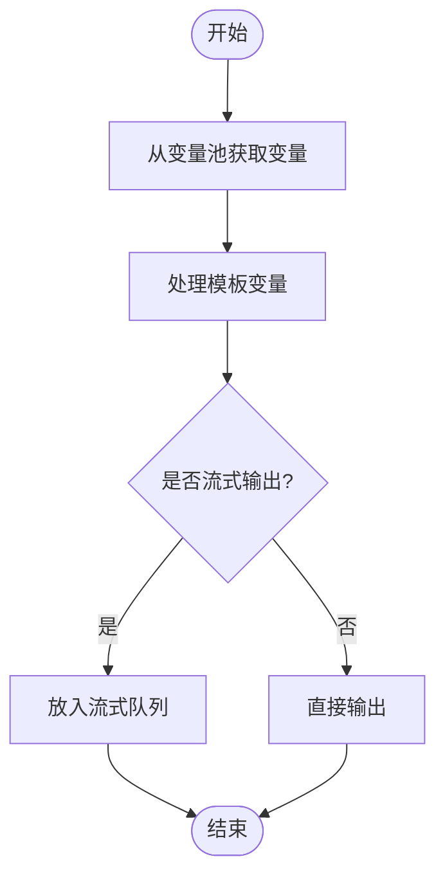

**节点来源**
- [base_node.py](file://core/workflow/engine/nodes/base_node.py#L0-L1385)

## 自定义节点开发

### 接口定义

自定义节点需要继承`BaseNode`并实现`async_execute`方法：

```python
from workflow.engine.nodes.base_node import BaseNode
from workflow.engine.entities.variable_pool import VariablePool
from workflow.extensions.otlp.trace.span import Span
from workflow.engine.nodes.entities.node_run_result import NodeRunResult

class CustomNode(BaseNode):
    """
    自定义节点示例
    """
    # 自定义配置参数
    custom_param: str = ""
    
    async def async_execute(
        self,
        variable_pool: VariablePool,
        span: Span,
        event_log_node_trace=None,
        **kwargs
    ) -> NodeRunResult:
        """
        异步执行节点逻辑
        """
        try:
            # 获取输入变量
            inputs = {}
            for key in self.input_identifier:
                inputs[key] = variable_pool.get_variable(
                    node_id=self.node_id, 
                    key_name=key, 
                    span=span
                )
            
            # 执行自定义逻辑
            # ...
            
            # 返回成功结果
            return self.success(
                inputs=inputs,
                outputs={"result": "custom_result"}
            )
        except Exception as e:
            # 返回失败结果
            return self.fail(
                error=e, 
                code_enum=CodeEnum.CUSTOM_NODE_ERROR, 
                span=span
            )
```

### 实现步骤

1. **创建节点类**: 继承`BaseNode`或适当的基类
2. **定义配置参数**: 添加节点特定的配置字段
3. **实现执行逻辑**: 重写`async_execute`方法
4. **处理输入输出**: 使用`input_identifier`和`output_identifier`
5. **错误处理**: 使用`success`和`fail`方法返回结果

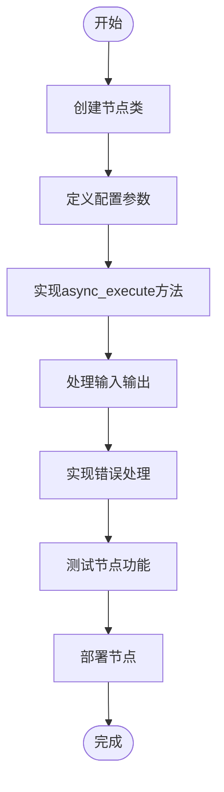

**节点来源**
- [base_node.py](file://core/workflow/engine/nodes/base_node.py#L0-L1385)

## 总结

工作流节点系统通过清晰的基类设计和丰富的节点类型，提供了强大的工作流编排能力。节点基类`BaseNode`定义了通用的执行契约，各种具体节点类型在此基础上实现了特定功能。前端组件与后端处理器紧密配合，提供了友好的用户界面。节点间通过标准化的数据格式和转换规则进行通信，确保了系统的稳定性和可扩展性。自定义节点开发框架使得系统能够轻松扩展以满足新的业务需求。

**节点来源**
- [base_node.py](file://core/workflow/engine/nodes/base_node.py#L0-L1385)
- [spark_llm_node.py](file://core/workflow/engine/nodes/llm/spark_llm_node.py#L0-L339)
- [knowledge_node.py](file://core/workflow/engine/nodes/knowledge/knowledge_node.py#L0-L176)
- [rpa_node.py](file://core/workflow/engine/nodes/rpa/rpa_node.py#L0-L166)
- [if_else_node.py](file://core/workflow/engine/nodes/if_else/if_else_node.py#L0-L700)