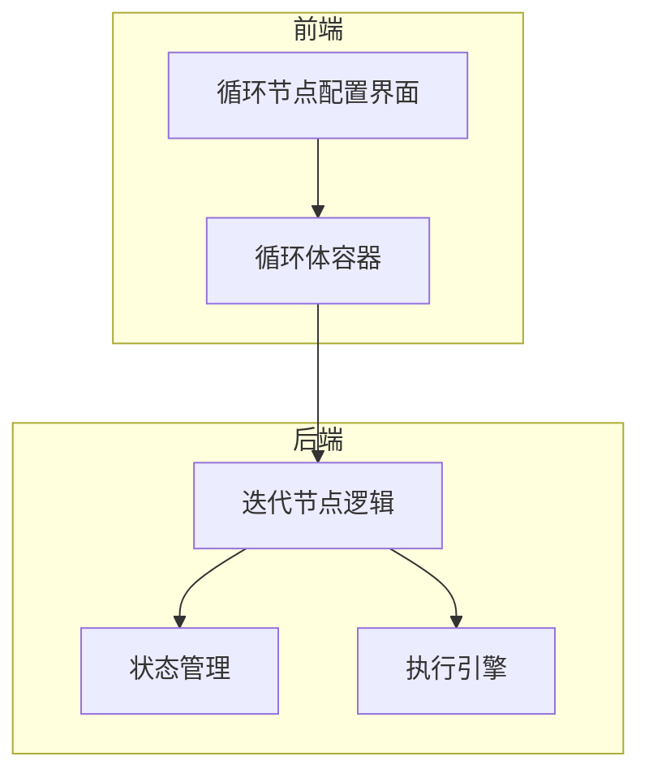
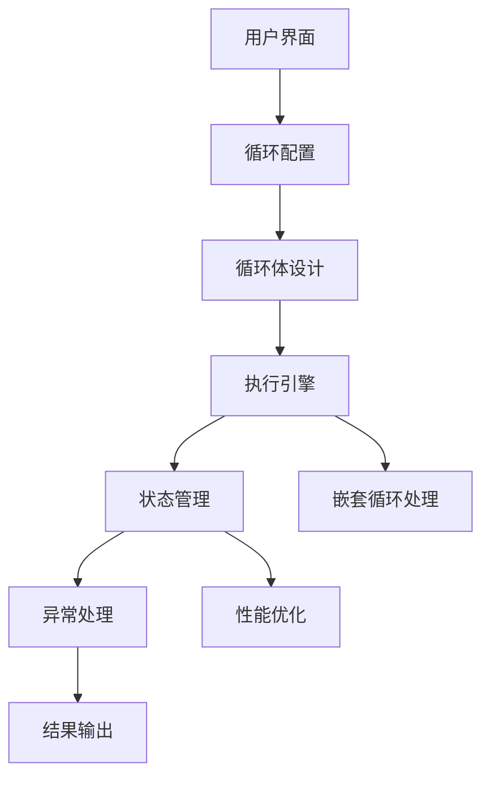
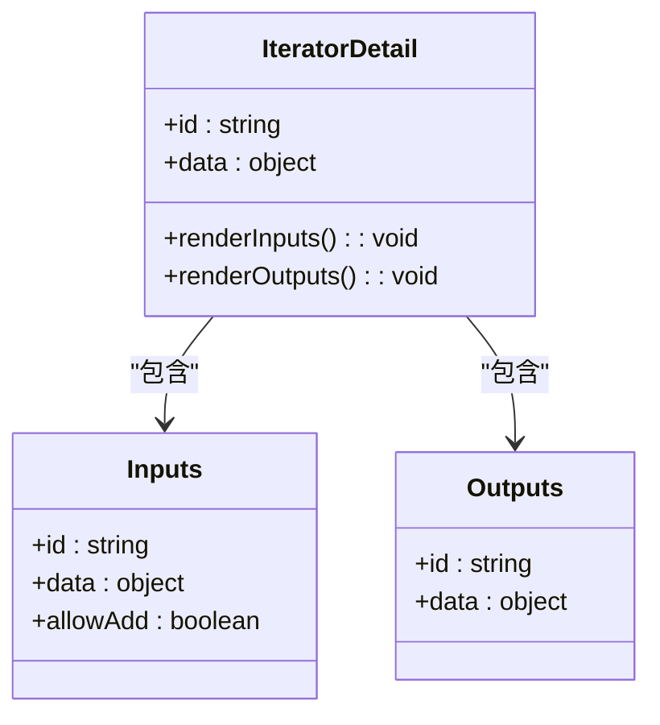
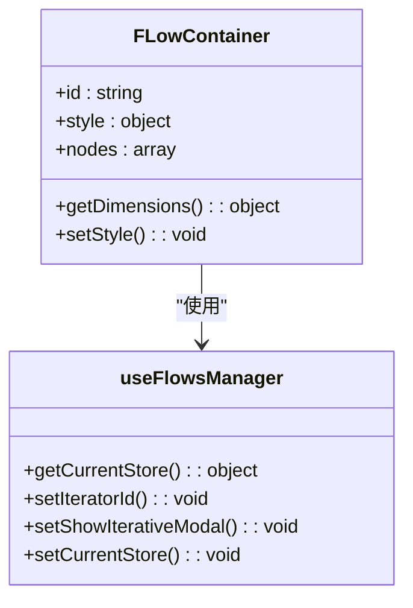
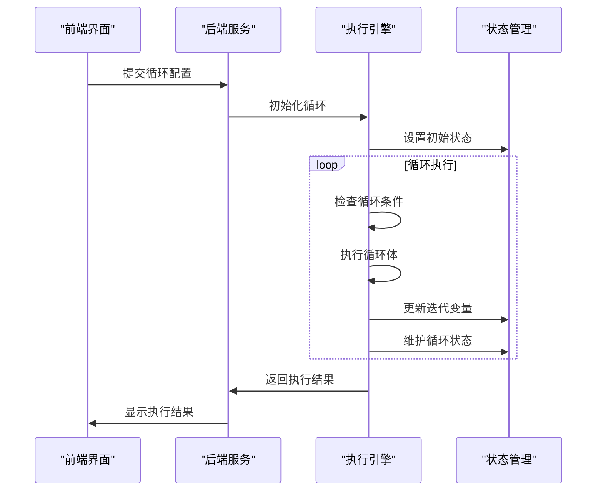
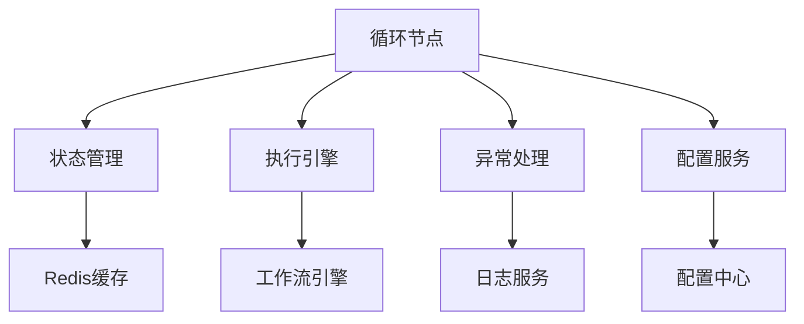

# 循环节点

<cite>
**本文档引用的文件**
- [iteration_node.py](file://core/workflow/engine/nodes/iteration/iteration_node.py)
- [index.tsx](file://console/frontend/src/components/workflow/nodes/iterator/index.tsx)
- [flow-container/index.tsx](file://console/frontend/src/components/workflow/nodes/iterator/components/flow-container/index.tsx)
- [schema.sql](file://docker/astronAgent/astronRPA/volumes/mysql/schema.sql)
</cite>

## 目录
1. [简介](#简介)
2. [项目结构](#项目结构)
3. [核心组件](#核心组件)
4. [架构概述](#架构概述)
5. [详细组件分析](#详细组件分析)
6. [依赖分析](#依赖分析)
7. [性能考虑](#性能考虑)
8. [故障排除指南](#故障排除指南)
9. [结论](#结论)

## 简介
循环节点是工作流系统中的关键组件，用于实现重复执行特定任务的功能。该节点支持两种主要模式：固定次数循环和基于数据集的迭代循环。通过灵活的配置参数和强大的执行机制，循环节点能够满足各种复杂的业务需求。

## 项目结构
循环节点的实现分布在前端和后端两个主要部分。前端负责用户界面和交互逻辑，后端负责执行逻辑和状态管理。

**图示来源**
- [index.tsx](file://console/frontend/src/components/workflow/nodes/iterator/index.tsx#L1-L38)
- [flow-container/index.tsx](file://console/frontend/src/components/workflow/nodes/iterator/components/flow-container/index.tsx#L1-L102)
- [iteration_node.py](file://core/workflow/engine/nodes/iteration/iteration_node.py#L1-L200)

**章节来源**
- [index.tsx](file://console/frontend/src/components/workflow/nodes/iterator/index.tsx#L1-L38)
- [flow-container/index.tsx](file://console/frontend/src/components/workflow/nodes/iterator/components/flow-container/index.tsx#L1-L102)

## 核心组件
循环节点的核心功能由前端组件和后端节点类共同实现。前端组件负责提供用户友好的配置界面，后端节点类负责执行循环逻辑和状态维护。

**章节来源**
- [index.tsx](file://console/frontend/src/components/workflow/nodes/iterator/index.tsx#L1-L38)
- [iteration_node.py](file://core/workflow/engine/nodes/iteration/iteration_node.py#L1-L200)

## 架构概述
循环节点采用前后端分离的架构设计，前端负责用户交互和界面展示，后端负责业务逻辑和执行控制。

**图示来源**
- [index.tsx](file://console/frontend/src/components/workflow/nodes/iterator/index.tsx#L1-L38)
- [iteration_node.py](file://core/workflow/engine/nodes/iteration/iteration_node.py#L1-L200)

## 详细组件分析

### 前端组件分析
前端组件主要负责循环节点的配置界面和循环体容器的实现。

#### 循环节点配置界面

**图示来源**
- [index.tsx](file://console/frontend/src/components/workflow/nodes/iterator/index.tsx#L1-L38)

#### 循环体容器

**图示来源**
- [flow-container/index.tsx](file://console/frontend/src/components/workflow/nodes/iterator/components/flow-container/index.tsx#L1-L102)

**章节来源**
- [flow-container/index.tsx](file://console/frontend/src/components/workflow/nodes/iterator/components/flow-container/index.tsx#L1-L102)

### 后端组件分析
后端组件主要负责循环节点的执行逻辑和状态管理。

#### 迭代节点执行逻辑

**图示来源**
- [iteration_node.py](file://core/workflow/engine/nodes/iteration/iteration_node.py#L1-L200)

**章节来源**
- [iteration_node.py](file://core/workflow/engine/nodes/iteration/iteration_node.py#L1-L200)

## 依赖分析
循环节点依赖于多个核心组件和服务，包括状态管理、执行引擎和异常处理系统。

**图示来源**
- [iteration_node.py](file://core/workflow/engine/nodes/iteration/iteration_node.py#L1-L200)
- [schema.sql](file://docker/astronAgent/astronRPA/volumes/mysql/schema.sql#L570-L585)

**章节来源**
- [iteration_node.py](file://core/workflow/engine/nodes/iteration/iteration_node.py#L1-L200)
- [schema.sql](file://docker/astronAgent/astronRPA/volumes/mysql/schema.sql#L570-L585)

## 性能考虑
在处理大数据集迭代时，需要考虑性能优化和内存管理。

### 分批处理
对于大数据集，建议采用分批处理策略，避免一次性加载过多数据导致内存溢出。

### 内存管理
循环执行过程中需要及时释放不再使用的内存，特别是在处理大量数据时。

### 超时控制
设置合理的超时时间，防止循环执行时间过长影响系统性能。

**章节来源**
- [iteration_node.py](file://core/workflow/engine/nodes/iteration/iteration_node.py#L1-L200)
- [schema.sql](file://docker/astronAgent/astronRPA/volumes/mysql/schema.sql#L570-L585)

## 故障排除指南
### 异常处理
循环节点内置了完善的异常处理机制，能够捕获和处理各种运行时异常。

### 超时处理
当循环执行超过预设时间时，系统会自动中断执行并记录超时日志。

### 状态恢复
在系统异常中断后，能够根据保存的状态信息恢复循环执行。

**章节来源**
- [iteration_node.py](file://core/workflow/engine/nodes/iteration/iteration_node.py#L1-L200)
- [schema.sql](file://docker/astronAgent/astronRPA/volumes/mysql/schema.sql#L570-L585)

## 结论
循环节点通过前后端协同工作，实现了灵活的循环执行功能。前端提供直观的配置界面，后端确保可靠的执行逻辑。通过合理的架构设计和性能优化，循环节点能够满足各种复杂的业务需求。