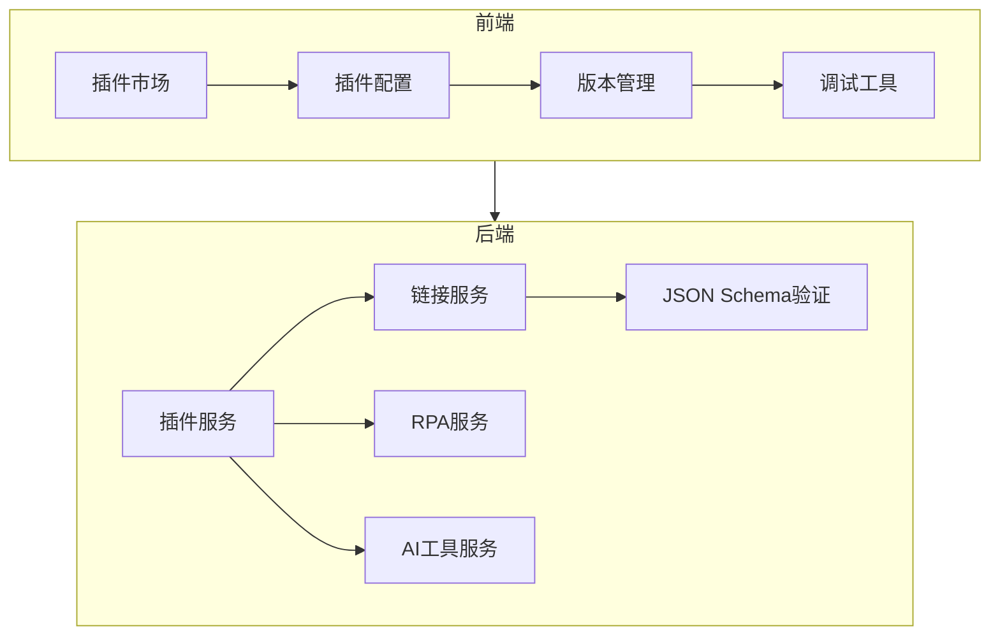
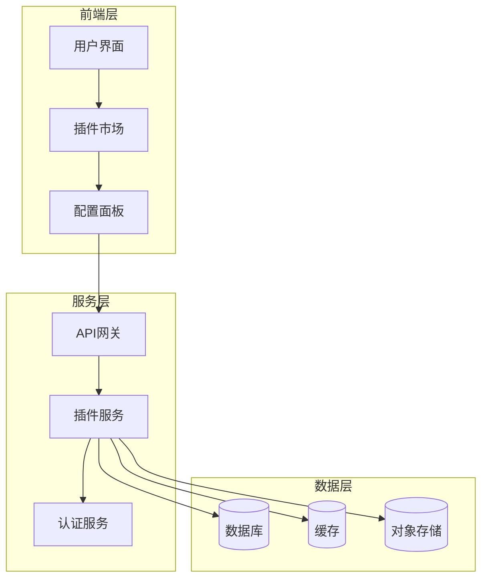
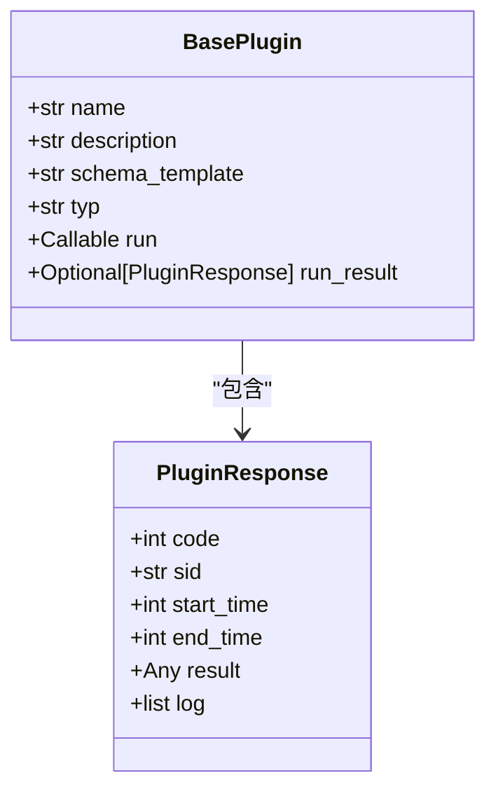
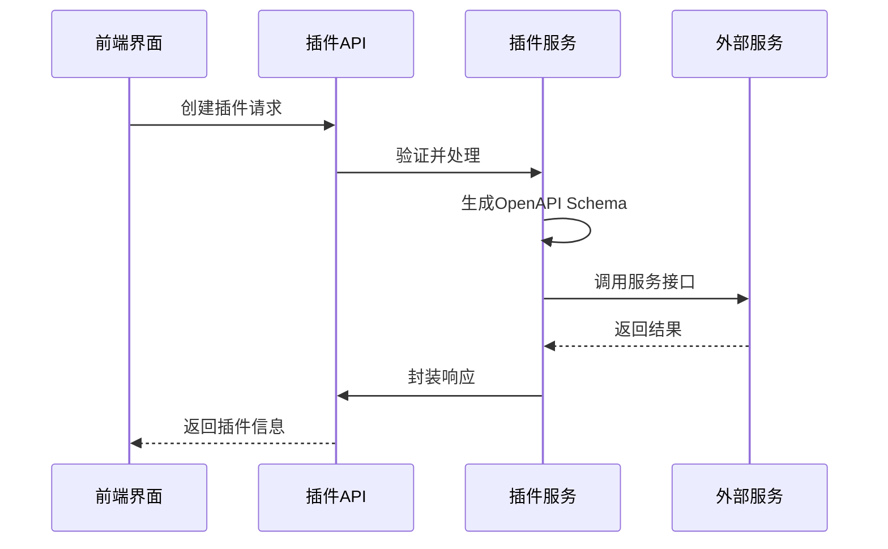
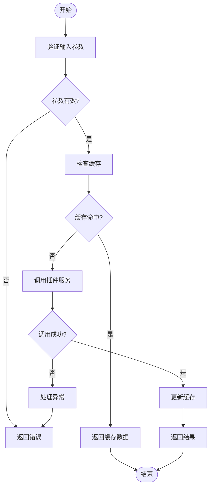
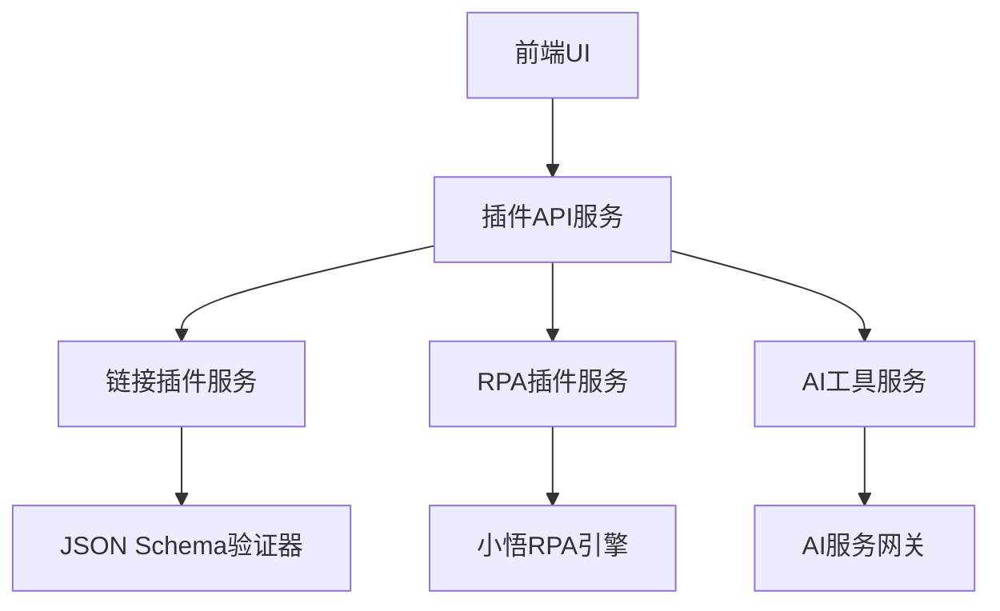

# 插件节点

<cite>
**本文档引用的文件**  
- [base.py](file://core/agent/service/plugin/base.py)
- [plugin.ts](file://console/frontend/src/services/plugin.ts)
- [plugin-store.ts](file://console/frontend/src/types/plugin-store.ts)
- [resource.ts](file://console/frontend/src/types/resource.ts)
- [index.tsx](file://console/frontend/src/components/workflow/nodes/plugin/index.tsx)
- [create_tools_schema.json](file://core/plugin/link/utils/json_schemas/schema_files/create_tools_schema.json)
- [http_run_schema.json](file://core/plugin/link/utils/json_schemas/schema_files/http_run_schema.json)
</cite>

## 目录
1. [引言](#引言)
2. [项目结构](#项目结构)
3. [核心组件](#核心组件)
4. [架构概述](#架构概述)
5. [详细组件分析](#详细组件分析)
6. [依赖分析](#依赖分析)
7. [性能考虑](#性能考虑)
8. [故障排除指南](#故障排除指南)
9. [结论](#结论)

## 引言
插件节点是astron-agent系统中的核心扩展机制，作为通用集成点支持AI工具、链接服务等多种插件的接入。该系统通过标准化接口实现了插件的发现、认证、执行和结果处理全流程管理。前端组件提供了插件市场的集成界面，支持浏览、搜索和配置功能。系统还包含版本管理、兼容性检查和安全沙箱等机制，确保插件生态的安全性和稳定性。开发者可以基于定义的接口规范开发自定义插件并部署上线。

## 项目结构
系统采用前后端分离架构，插件相关功能分布在多个模块中。后端核心逻辑位于`core/plugin`目录，前端界面组件集中在`console/frontend/src/components/plugin`路径下。

**图源**  
- [plugin-store.ts](file://console/frontend/src/types/plugin-store.ts)
- [create_tools_schema.json](file://core/plugin/link/utils/json_schemas/schema_files/create_tools_schema.json)

## 核心组件
插件节点系统由前端UI组件、后端服务接口和数据模型三大部分构成。前端提供插件选择、参数映射和输出提取的可视化配置界面；后端实现插件调用的完整流程，包括发现、认证、执行和结果处理；数据模型定义了插件的元信息、输入输出参数和配置规范。

**节源**  
- [resource.ts](file://console/frontend/src/types/resource.ts)
- [base.py](file://core/agent/service/plugin/base.py)

## 架构概述
系统采用分层架构设计，从前端到后端形成完整的插件集成链条。用户通过前端界面操作插件，请求经由API网关转发至相应的插件服务，服务层负责具体的业务逻辑处理和外部系统交互。

**图源**  
- [plugin.ts](file://console/frontend/src/services/plugin.ts)
- [base.py](file://core/agent/service/plugin/base.py)

## 详细组件分析

### 插件节点分析
插件节点作为工作流中的基本执行单元，封装了插件调用的核心逻辑。节点配置包括插件选择、输入参数映射和输出参数提取等功能。

#### 对于对象导向组件：

**图源**  
- [base.py](file://core/agent/service/plugin/base.py)

#### 对于API/服务组件：

**图源**  
- [plugin.ts](file://console/frontend/src/services/plugin.ts)
- [create_tools_schema.json](file://core/plugin/link/utils/json_schemas/schema_files/create_tools_schema.json)

#### 对于复杂逻辑组件：

**图源**  
- [http_run_schema.json](file://core/plugin/link/utils/json_schemas/schema_files/http_run_schema.json)

**节源**  
- [index.tsx](file://console/frontend/src/components/workflow/nodes/plugin/index.tsx)
- [plugin-store.ts](file://console/frontend/src/types/plugin-store.ts)

### 概念概述
插件系统采用模块化设计，各组件职责分明。前端负责用户体验和界面交互，后端处理业务逻辑和数据持久化。通过标准化接口实现前后端解耦，便于系统的扩展和维护。

## 依赖分析
系统内部组件之间存在明确的依赖关系，前端组件依赖于后端提供的RESTful API接口，后端服务之间通过定义良好的接口进行通信。

**图源**  
- [plugin.ts](file://console/frontend/src/services/plugin.ts)
- [base.py](file://core/agent/service/plugin/base.py)

**节源**  
- [plugin-store.ts](file://console/frontend/src/types/plugin-store.ts)
- [resource.ts](file://console/frontend/src/types/resource.ts)

## 性能考虑
系统在设计时充分考虑了性能因素，通过缓存机制减少重复计算，使用异步处理提高响应速度。对于高并发场景，系统支持水平扩展以满足性能需求。建议合理配置插件调用超时时间，避免长时间等待影响整体性能。

## 故障排除指南
当遇到插件调用失败时，应首先检查网络连接和认证信息。确认插件配置正确无误，特别是输入参数映射和输出提取规则。查看系统日志获取详细的错误信息，根据错误码定位问题根源。对于版本兼容性问题，建议更新到最新稳定版本。

**节源**  
- [use-tool-debugger.ts](file://console/frontend/src/components/modal/plugin/hooks/use-tool-debugger.ts)
- [base.py](file://core/agent/service/plugin/base.py)

## 结论
插件节点系统为astron-agent提供了强大的扩展能力，通过标准化的接口规范和完善的管理机制，实现了各类服务的无缝集成。系统架构清晰，组件职责明确，既保证了功能的灵活性，又确保了运行的稳定性。未来可通过增加更多类型的插件支持，进一步丰富系统的应用场景。