# 条件判断节点

<cite>
**本文档引用的文件**
- [decision_node.py](file://core/workflow/engine/nodes/decision/decision_node.py)
- [if_else_node.py](file://core/workflow/engine/nodes/if_else/if_else_node.py)
- [dsl_engine.py](file://core/workflow/engine/dsl_engine.py)
- [index.tsx](file://console/frontend/src/components/workflow/nodes/if-else/index.tsx)
- [index.tsx](file://console/frontend/src/components/workflow/nodes/decision-making/index.tsx)
</cite>

## 目录
1. [引言](#引言)
2. [条件判断节点类型](#条件判断节点类型)
3. [基于LLM的路由决策机制](#基于llm的路由决策机制)
4. [规则引擎模式](#规则引擎模式)
5. [节点配置](#节点配置)
6. [前端组件实现](#前端组件实现)
7. [条件评估流程](#条件评估流程)
8. [复杂条件组合处理](#复杂条件组合处理)
9. [性能优化建议](#性能优化建议)
10. [结论](#结论)

## 引言

条件判断节点是工作流系统中的核心控制节点，用于根据输入数据和预定义条件决定工作流的执行路径。本系统提供了两种主要的条件判断模式：基于大语言模型（LLM）的智能路由决策和基于规则引擎的传统条件判断。这些节点在工作流中起到分支控制的作用，能够根据不同的条件将流程导向不同的后续节点。

## 条件判断节点类型

系统中存在两种主要的条件判断节点：

1. **决策节点（Decision Node）**：基于LLM的智能路由决策，利用大语言模型进行意图识别和分类
2. **条件分支节点（If-Else Node）**：基于规则引擎的传统条件判断，使用预定义的比较规则进行判断

这两种节点类型分别适用于不同的场景，决策节点适合处理自然语言输入和复杂意图识别，而条件分支节点适合处理结构化数据和确定性条件判断。

**Section sources**
- [decision_node.py](file://core/workflow/engine/nodes/decision/decision_node.py#L1-L647)
- [if_else_node.py](file://core/workflow/engine/nodes/if_else/if_else_node.py#L1-L700)

## 基于LLM的路由决策机制

### 实现原理

基于LLM的路由决策机制通过大语言模型对输入内容进行意图识别和分类，从而决定工作流的执行路径。该机制主要在`DecisionNode`类中实现，支持三种执行模式：

1. **函数调用模式（Function Call Mode）**：利用LLM的函数调用能力进行意图分类
2. **提示词模式（Prompt-based Mode）**：使用结构化提示词引导LLM输出特定格式的分类结果
3. **普通模式（Normal Mode）**：直接通过提示词让LLM返回分类结果

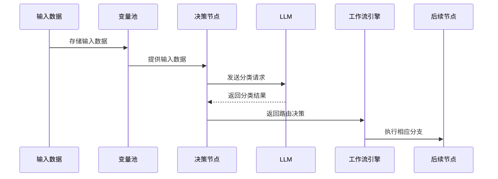
```mermaid
sequenceDiagram
participant 输入数据
participant 变量池
participant 决策节点
participant LLM
participant 工作流引擎
输入数据->>变量池 : 存储输入数据
变量池->>决策节点 : 提供输入数据
决策节点->>LLM : 发送分类请求
LLM-->>决策节点 : 返回分类结果
决策节点->>工作流引擎 : 返回路由决策
工作流引擎->>后续节点 : 执行相应分支
```

**Diagram sources**
- [decision_node.py](file://core/workflow/engine/nodes/decision/decision_node.py#L1-L647)

### 函数调用模式

函数调用模式是基于LLM的路由决策中最精确的模式。该模式通过定义函数签名，让LLM识别输入内容最匹配的函数，从而实现意图分类。

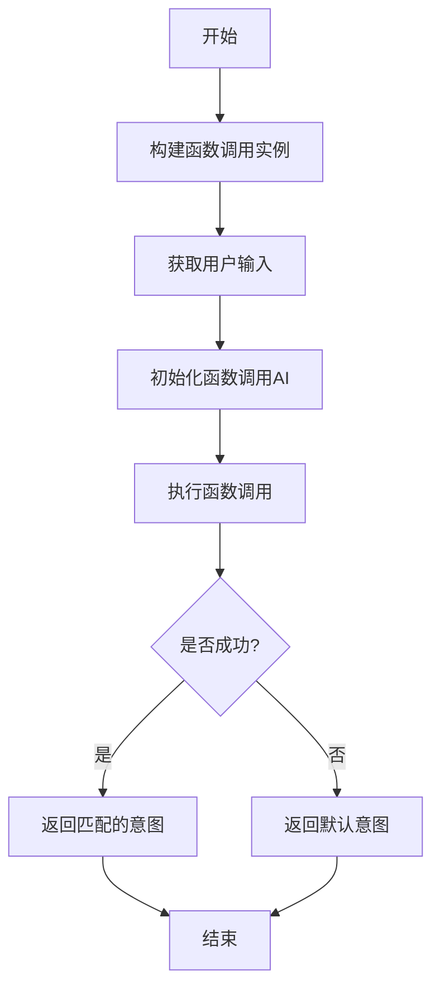
```mermaid
flowchart TD
A[开始] --> B[构建函数调用实例]
B --> C[获取用户输入]
C --> D[初始化函数调用AI]
D --> E[执行函数调用]
E --> F{是否成功?}
F --> |是| G[返回匹配的意图]
F --> |否| H[返回默认意图]
G --> I[结束]
H --> I
```

**Diagram sources**
- [decision_node.py](file://core/workflow/engine/nodes/decision/decision_node.py#L100-L250)

### 提示词模式

提示词模式使用结构化的提示词模板，引导LLM按照预定义的JSON格式输出分类结果。这种模式提供了更好的可控性和可预测性。

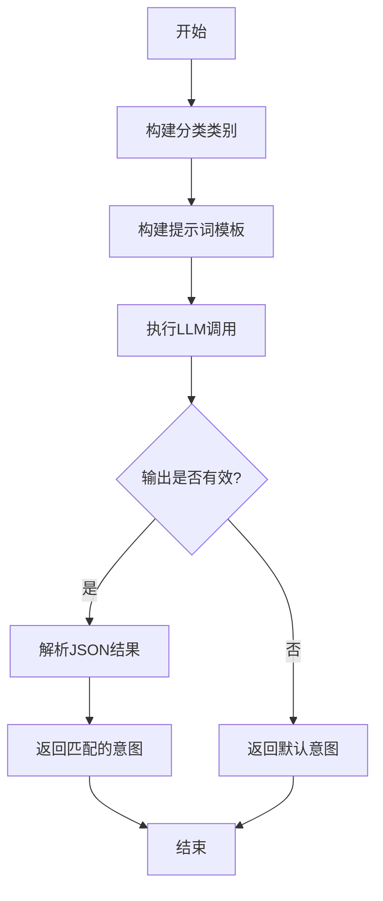
```mermaid
flowchart TD
A[开始] --> B[构建分类类别]
B --> C[构建提示词模板]
C --> D[执行LLM调用]
D --> E{输出是否有效?}
E --> |是| F[解析JSON结果]
E --> |否| G[返回默认意图]
F --> H[返回匹配的意图]
H --> I[结束]
G --> I
```

**Diagram sources**
- [decision_node.py](file://core/workflow/engine/nodes/decision/decision_node.py#L250-L450)

**Section sources**
- [decision_node.py](file://core/workflow/engine/nodes/decision/decision_node.py#L1-L647)

## 规则引擎模式

### 实现原理

规则引擎模式基于传统的条件判断逻辑，通过比较操作符对输入数据进行判断。该模式在`IFElseNode`类中实现，支持多种比较操作符和逻辑运算符。

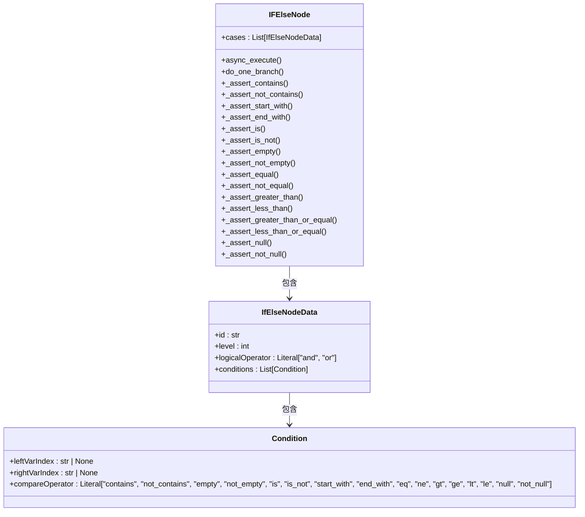
```mermaid
classDiagram
class IFElseNode {
+cases : List[IfElseNodeData]
+async_execute()
+do_one_branch()
+_assert_contains()
+_assert_not_contains()
+_assert_start_with()
+_assert_end_with()
+_assert_is()
+_assert_is_not()
+_assert_empty()
+_assert_not_empty()
+_assert_equal()
+_assert_not_equal()
+_assert_greater_than()
+_assert_less_than()
+_assert_greater_than_or_equal()
+_assert_less_than_or_equal()
+_assert_null()
+_assert_not_null()
}
class IfElseNodeData {
+id : str
+level : int
+logicalOperator : Literal["and", "or"]
+conditions : List[Condition]
}
class Condition {
+leftVarIndex : str | None
+rightVarIndex : str | None
+compareOperator : Literal["contains", "not_contains", "empty", "not_empty", "is", "is_not", "start_with", "end_with", "eq", "ne", "gt", "ge", "lt", "le", "null", "not_null"]
}
IFElseNode --> IfElseNodeData : 包含
IfElseNodeData --> Condition : 包含
```

**Diagram sources**
- [if_else_node.py](file://core/workflow/engine/nodes/if_else/if_else_node.py#L1-L700)

### 比较操作符

规则引擎支持以下比较操作符：

- **字符串比较**：包含、不包含、以...开头、以...结尾
- **相等性比较**：等于、不等于
- **数值比较**：大于、小于、大于等于、小于等于
- **空值检查**：为空、不为空、为null、不为null

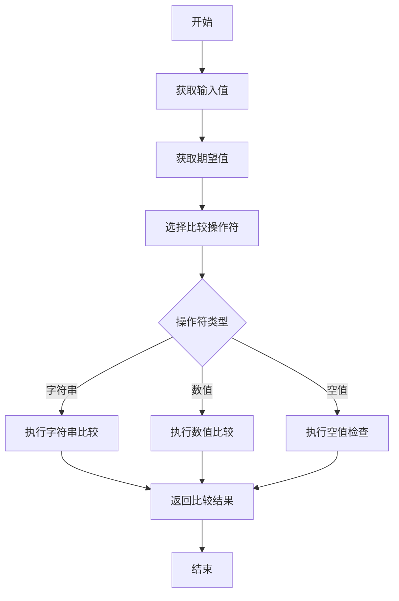
```mermaid
flowchart TD
A[开始] --> B[获取输入值]
B --> C[获取期望值]
C --> D[选择比较操作符]
D --> E{操作符类型}
E --> |字符串| F[执行字符串比较]
E --> |数值| G[执行数值比较]
E --> |空值| H[执行空值检查]
F --> I[返回比较结果]
G --> I
H --> I
I --> J[结束]
```

**Diagram sources**
- [if_else_node.py](file://core/workflow/engine/nodes/if_else/if_else_node.py#L500-L700)

### 逻辑运算符

规则引擎支持两种逻辑运算符：

1. **AND（与）**：所有条件都必须满足
2. **OR（或）**：至少一个条件满足即可

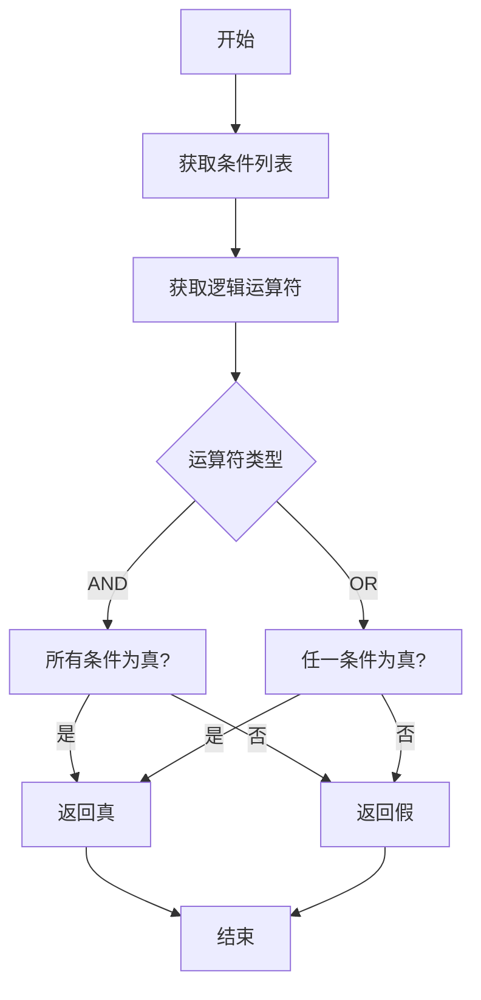
```mermaid
flowchart TD
A[开始] --> B[获取条件列表]
B --> C[获取逻辑运算符]
C --> D{运算符类型}
D --> |AND| E[所有条件为真?]
D --> |OR| F[任一条件为真?]
E --> |是| G[返回真]
E --> |否| H[返回假]
F --> |是| G
F --> |否| H
G --> I[结束]
H --> I
```

**Diagram sources**
- [if_else_node.py](file://core/workflow/engine/nodes/if_else/if_else_node.py#L300-L400)

**Section sources**
- [if_else_node.py](file://core/workflow/engine/nodes/if_else/if_else_node.py#L1-L700)

## 节点配置

### 条件表达式定义

条件表达式定义是条件判断节点的核心配置，决定了节点如何评估输入数据。

#### 决策节点配置

决策节点的配置主要包括：

- **promptPrefix**：自定义提示词前缀
- **reasonMode**：推理模式（0: 普通, 1: 提示词）
- **useFunctionCall**：是否使用函数调用模式
- **intentChains**：意图链配置列表

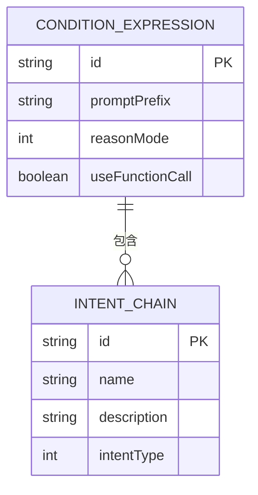
```mermaid
erDiagram
INTENT_CHAIN {
string id PK
string name
string description
int intentType
}
CONDITION_EXPRESSION {
string id PK
string promptPrefix
int reasonMode
boolean useFunctionCall
}
CONDITION_EXPRESSION ||--o{ INTENT_CHAIN : 包含
```

**Diagram sources**
- [decision_node.py](file://core/workflow/engine/nodes/decision/decision_node.py#L80-L90)

#### 条件分支节点配置

条件分支节点的配置主要包括：

- **cases**：分支条件列表
- **conditions**：具体条件定义
- **logicalOperator**：逻辑运算符（and/or）

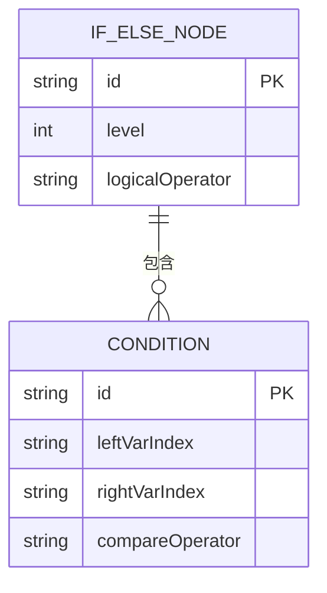
```mermaid
erDiagram
IF_ELSE_NODE {
string id PK
int level
string logicalOperator
}
CONDITION {
string id PK
string leftVarIndex
string rightVarIndex
string compareOperator
}
IF_ELSE_NODE ||--o{ CONDITION : 包含
```

**Diagram sources**
- [if_else_node.py](file://core/workflow/engine/nodes/if_else/if_else_node.py#L50-L70)

### 分支创建

分支创建允许用户定义多个执行路径，每个路径对应不同的条件组合。

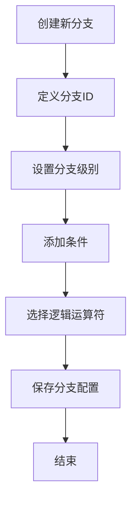
```mermaid
flowchart TD
A[创建新分支] --> B[定义分支ID]
B --> C[设置分支级别]
C --> D[添加条件]
D --> E[选择逻辑运算符]
E --> F[保存分支配置]
F --> G[结束]
```

**Diagram sources**
- [if_else_node.py](file://core/workflow/engine/nodes/if_else/if_else_node.py#L1-L700)

### 默认分支设置

默认分支在所有条件都不满足时执行，确保工作流总有可执行的路径。

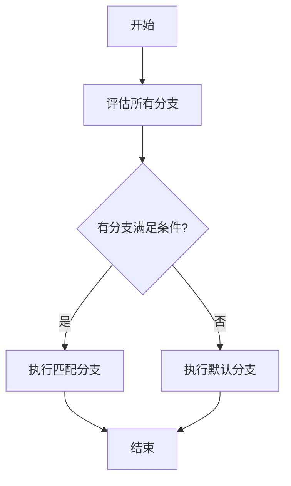
```mermaid
flowchart TD
A[开始] --> B[评估所有分支]
B --> C{有分支满足条件?}
C --> |是| D[执行匹配分支]
C --> |否| E[执行默认分支]
D --> F[结束]
E --> F
```

**Diagram sources**
- [if_else_node.py](file://core/workflow/engine/nodes/if_else/if_else_node.py#L400-L450)

**Section sources**
- [decision_node.py](file://core/workflow/engine/nodes/decision/decision_node.py#L1-L647)
- [if_else_node.py](file://core/workflow/engine/nodes/if_else/if_else_node.py#L1-L700)

## 前端组件实现

### 条件编辑器

前端条件编辑器提供可视化界面，支持用户创建和编辑条件判断规则。

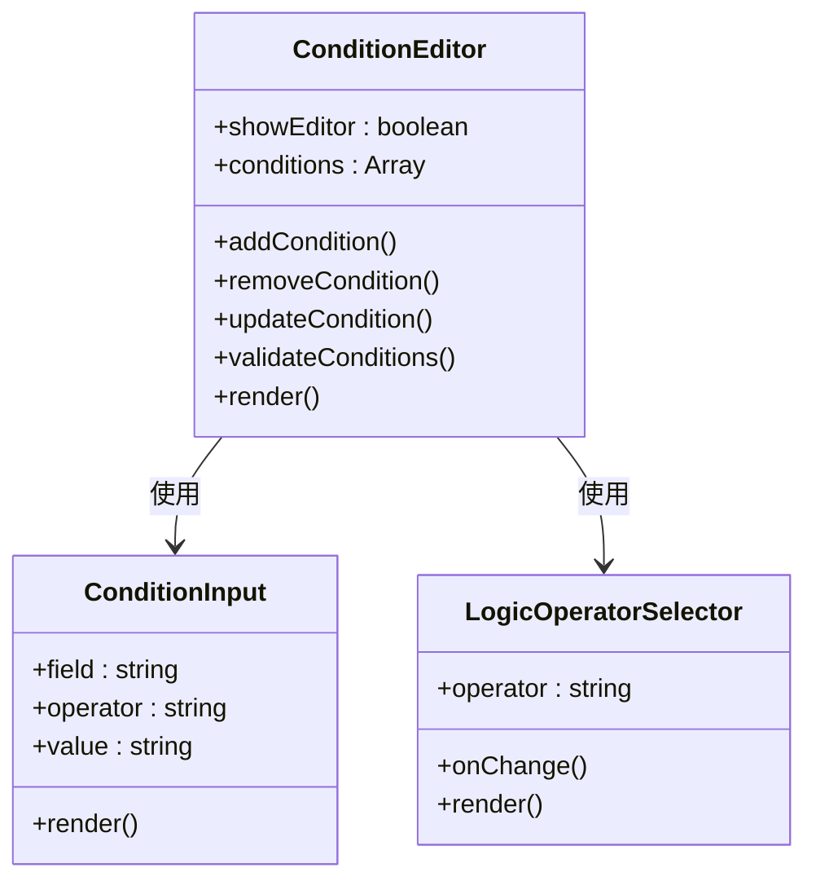
```mermaid
classDiagram
class ConditionEditor {
+showEditor : boolean
+conditions : Array
+addCondition()
+removeCondition()
+updateCondition()
+validateConditions()
+render()
}
class ConditionInput {
+field : string
+operator : string
+value : string
+render()
}
class LogicOperatorSelector {
+operator : string
+onChange()
+render()
}
ConditionEditor --> ConditionInput : 使用
ConditionEditor --> LogicOperatorSelector : 使用
```

**Diagram sources**
- [index.tsx](file://console/frontend/src/components/workflow/nodes/if-else/index.tsx#L1-L100)

### 可视化条件构建

可视化条件构建界面允许用户通过拖拽和选择的方式创建复杂的条件组合。

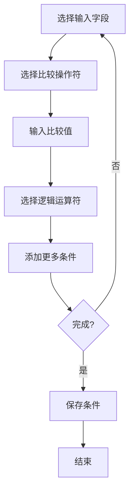
```mermaid
flowchart TD
A[选择输入字段] --> B[选择比较操作符]
B --> C[输入比较值]
C --> D[选择逻辑运算符]
D --> E[添加更多条件]
E --> F{完成?}
F --> |否| A
F --> |是| G[保存条件]
G --> H[结束]
```

**Diagram sources**
- [index.tsx](file://console/frontend/src/components/workflow/nodes/if-else/index.tsx#L1-L100)

### 表达式输入

对于高级用户，系统还支持直接输入表达式。

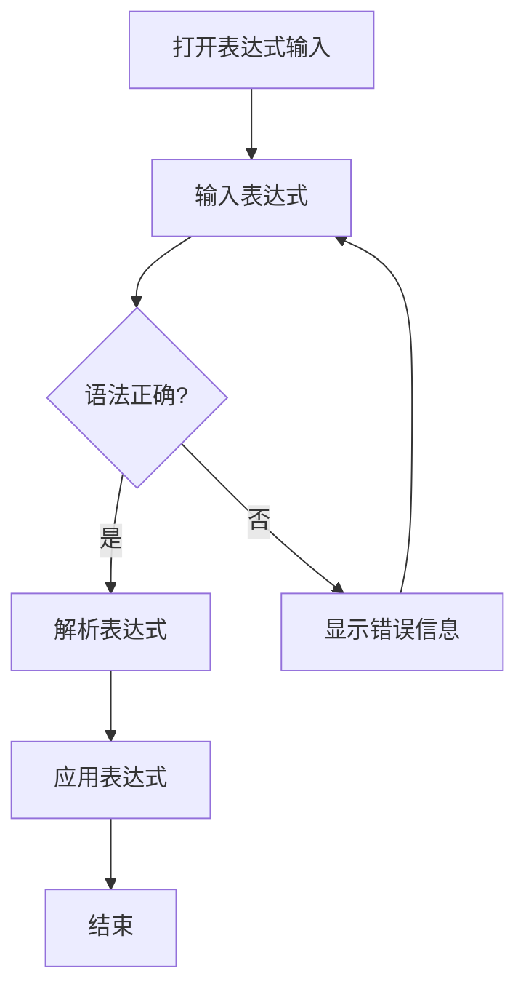
```mermaid
flowchart TD
A[打开表达式输入] --> B[输入表达式]
B --> C{语法正确?}
C --> |是| D[解析表达式]
C --> |否| E[显示错误信息]
D --> F[应用表达式]
E --> B
F --> G[结束]
```

**Diagram sources**
- [index.tsx](file://console/frontend/src/components/workflow/nodes/decision-making/index.tsx#L1-L100)

**Section sources**
- [index.tsx](file://console/frontend/src/components/workflow/nodes/if-else/index.tsx#L1-L100)
- [index.tsx](file://console/frontend/src/components/workflow/nodes/decision-making/index.tsx#L1-L100)

## 条件评估流程

### 输入数据提取

条件评估的第一步是从变量池中提取所需的输入数据。

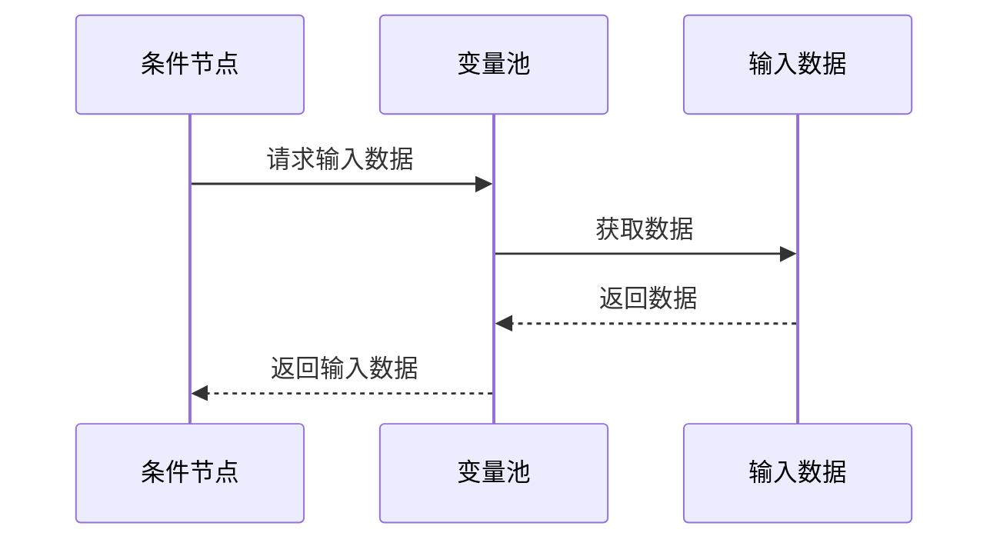
```mermaid
sequenceDiagram
participant 条件节点
participant 变量池
participant 输入数据
条件节点->>变量池 : 请求输入数据
变量池->>输入数据 : 获取数据
输入数据-->>变量池 : 返回数据
变量池-->>条件节点 : 返回输入数据
```

**Diagram sources**
- [if_else_node.py](file://core/workflow/engine/nodes/if_else/if_else_node.py#L200-L250)

### 条件求值

条件求值过程对每个条件进行评估，并根据逻辑运算符组合结果。

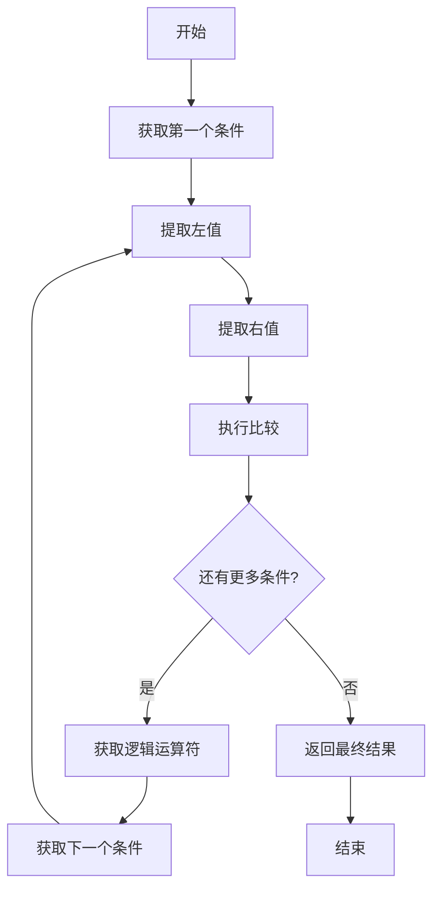
```mermaid
flowchart TD
A[开始] --> B[获取第一个条件]
B --> C[提取左值]
C --> D[提取右值]
D --> E[执行比较]
E --> F{还有更多条件?}
F --> |是| G[获取逻辑运算符]
G --> H[获取下一个条件]
H --> C
F --> |否| I[返回最终结果]
I --> J[结束]
```

**Diagram sources**
- [if_else_node.py](file://core/workflow/engine/nodes/if_else/if_else_node.py#L300-L400)

### 分支选择逻辑

分支选择逻辑按照优先级顺序评估各个分支，选择第一个满足条件的分支执行。

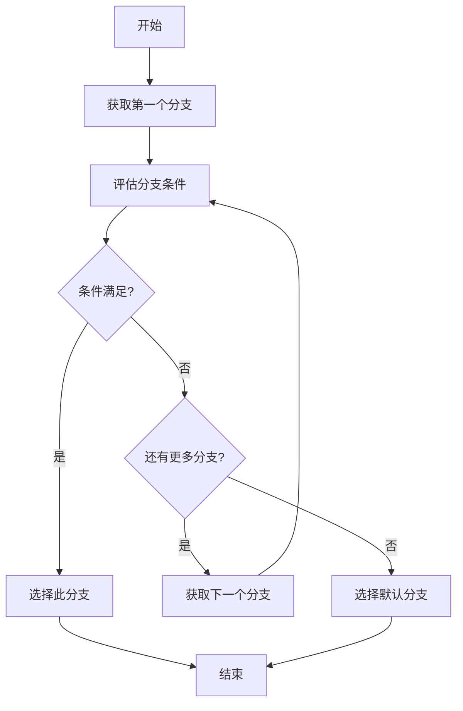
```mermaid
flowchart TD
A[开始] --> B[获取第一个分支]
B --> C[评估分支条件]
C --> D{条件满足?}
D --> |是| E[选择此分支]
D --> |否| F{还有更多分支?}
F --> |是| G[获取下一个分支]
G --> C
F --> |否| H[选择默认分支]
E --> I[结束]
H --> I
```

**Diagram sources**
- [if_else_node.py](file://core/workflow/engine/nodes/if_else/if_else_node.py#L400-L500)

**Section sources**
- [if_else_node.py](file://core/workflow/engine/nodes/if_else/if_else_node.py#L1-L700)

## 复杂条件组合处理

### 嵌套条件

系统支持嵌套条件组合，允许创建复杂的决策逻辑。

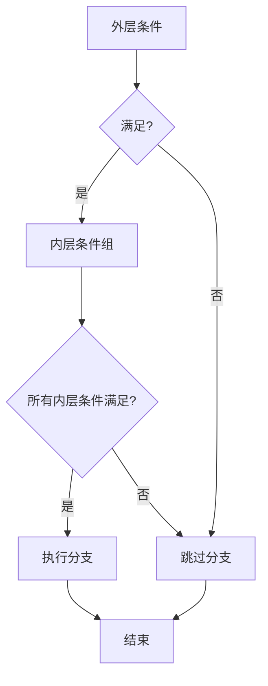
```mermaid
flowchart TD
A[外层条件] --> B{满足?}
B --> |是| C[内层条件组]
C --> D{所有内层条件满足?}
D --> |是| E[执行分支]
D --> |否| F[跳过分支]
B --> |否| F
E --> G[结束]
F --> G
```

**Diagram sources**
- [if_else_node.py](file://core/workflow/engine/nodes/if_else/if_else_node.py#L1-L700)

### 多条件组合

多条件组合支持使用AND和OR运算符创建复杂的布尔逻辑。

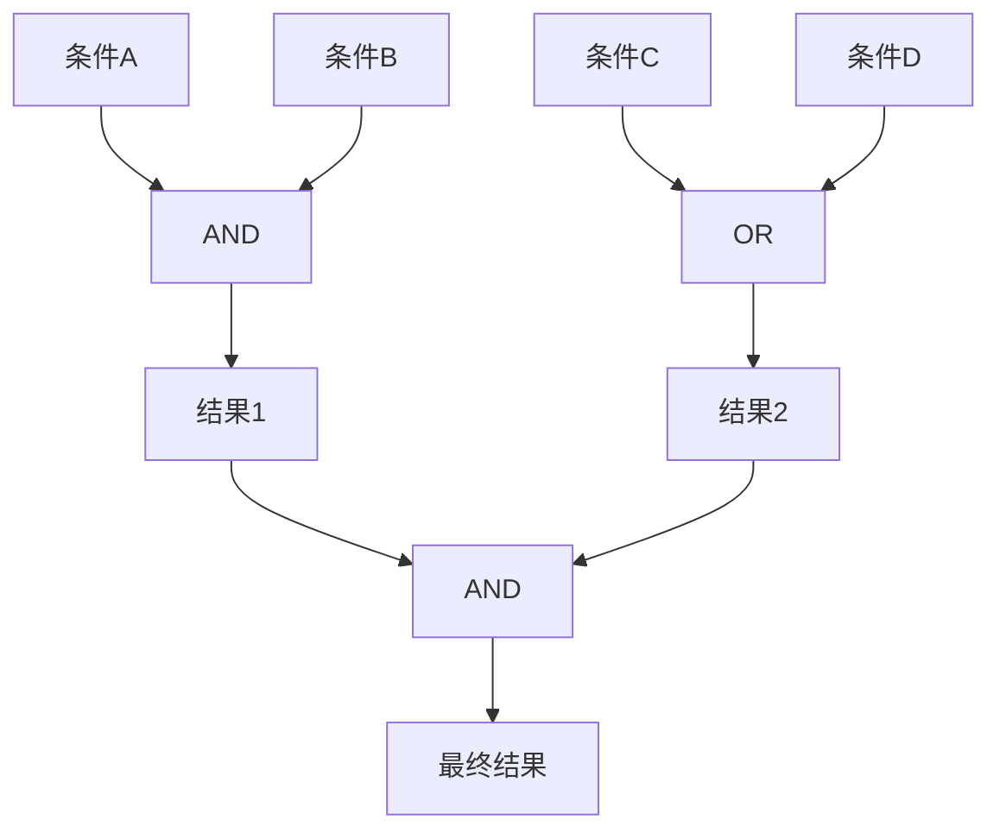
```mermaid
flowchart TD
A[条件A] --> B[AND]
C[条件B] --> B
B --> D[结果1]
E[条件C] --> F[OR]
G[条件D] --> F
F --> H[结果2]
D --> I[AND]
H --> I
I --> J[最终结果]
```

**Diagram sources**
- [if_else_node.py](file://core/workflow/engine/nodes/if_else/if_else_node.py#L300-L400)

**Section sources**
- [if_else_node.py](file://core/workflow/engine/nodes/if_else/if_else_node.py#L1-L700)

## 性能优化建议

### 条件缓存

对频繁使用的条件评估结果进行缓存，避免重复计算。

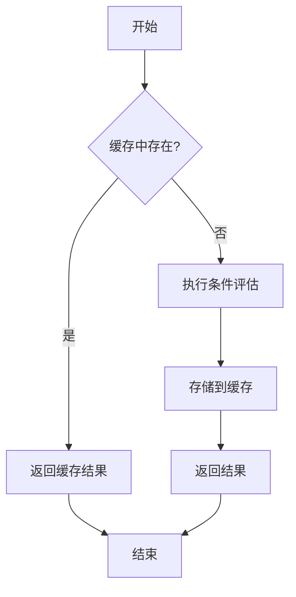
```mermaid
flowchart TD
A[开始] --> B{缓存中存在?}
B --> |是| C[返回缓存结果]
B --> |否| D[执行条件评估]
D --> E[存储到缓存]
E --> F[返回结果]
C --> G[结束]
F --> G
```

**Diagram sources**
- [dsl_engine.py](file://core/workflow/engine/dsl_engine.py#L1-L2379)

### 短路求值

实现短路求值机制，提高条件评估效率。

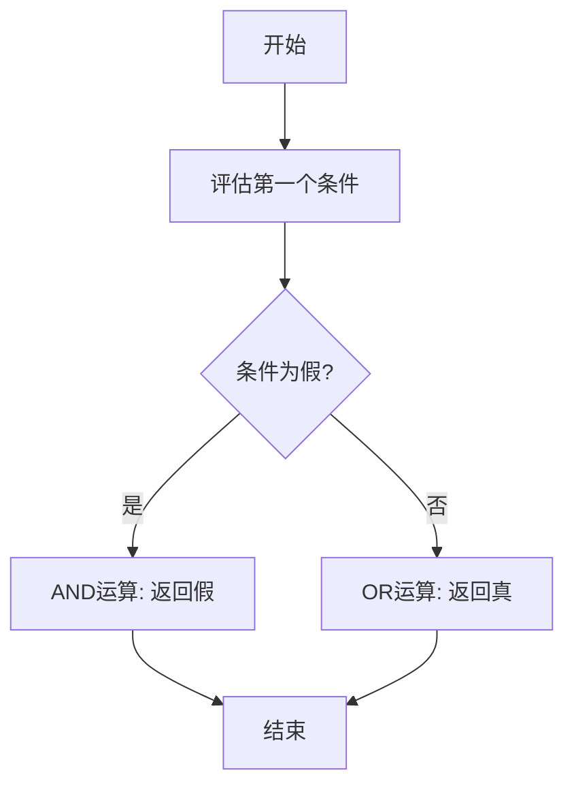
```mermaid
flowchart TD
A[开始] --> B[评估第一个条件]
B --> C{条件为假?}
C --> |是| D[AND运算: 返回假]
C --> |否| E[OR运算: 返回真]
D --> F[结束]
E --> F
```

**Diagram sources**
- [if_else_node.py](file://core/workflow/engine/nodes/if_else/if_else_node.py#L350-L400)

### 评估顺序优化

根据条件的复杂度和满足概率优化评估顺序。

```mermaid
flowchart TD
A[分析条件复杂度] --> B[分析满足概率]
B --> C[排序条件]
C --> D[按优化顺序评估]
D --> E[结束]
```

**Diagram sources**
- [if_else_node.py](file://core/workflow/engine/nodes/if_else/if_else_node.py#L400-L500)

**Section sources**
- [if_else_node.py](file://core/workflow/engine/nodes/if_else/if_else_node.py#L1-L700)
- [dsl_engine.py](file://core/workflow/engine/dsl_engine.py#L1-L2379)

## 结论

条件判断节点是工作流系统中的关键组件，提供了灵活的流程控制能力。系统实现了两种主要的条件判断模式：基于LLM的智能路由决策和基于规则引擎的传统条件判断。这两种模式各有优势，可以根据具体场景选择合适的模式。

基于LLM的路由决策适合处理自然语言输入和复杂意图识别，能够理解用户的语义并做出智能判断。而规则引擎模式适合处理结构化数据和确定性条件判断，提供了精确的控制能力和可预测的行为。

在性能方面，通过条件缓存和短路求值等优化技术，系统能够高效地处理复杂的条件组合。前端组件提供了直观的可视化编辑界面，降低了用户的使用门槛。

未来可以进一步优化条件判断节点的性能，增加更多的比较操作符和逻辑运算符，以及提供更强大的条件表达式语言支持。