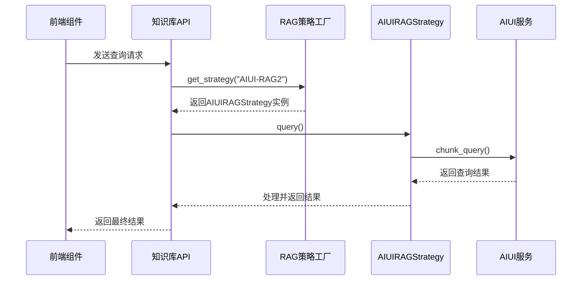
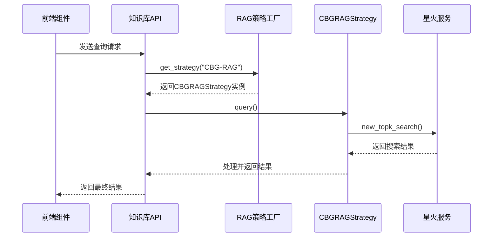
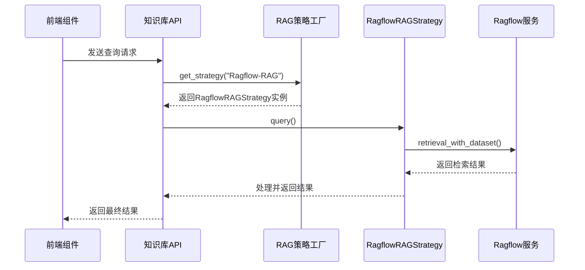
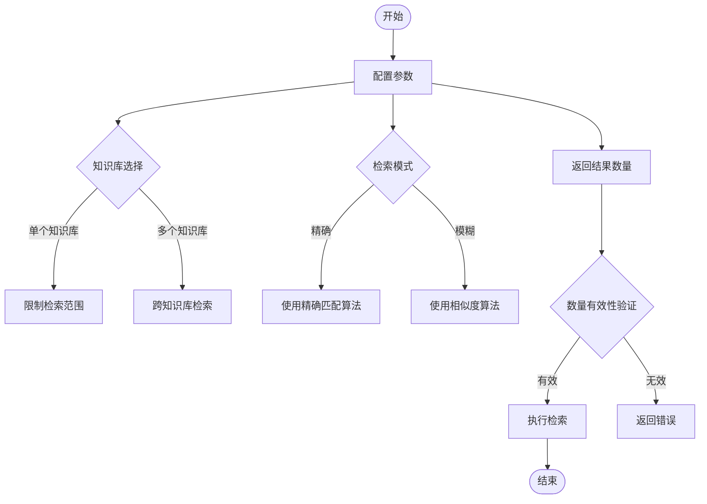
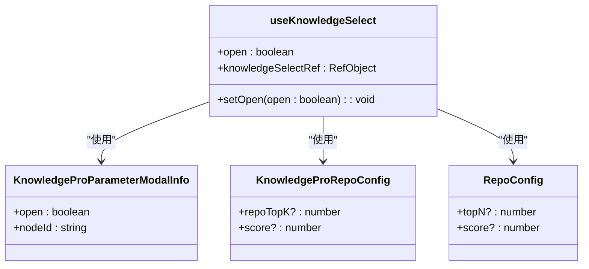
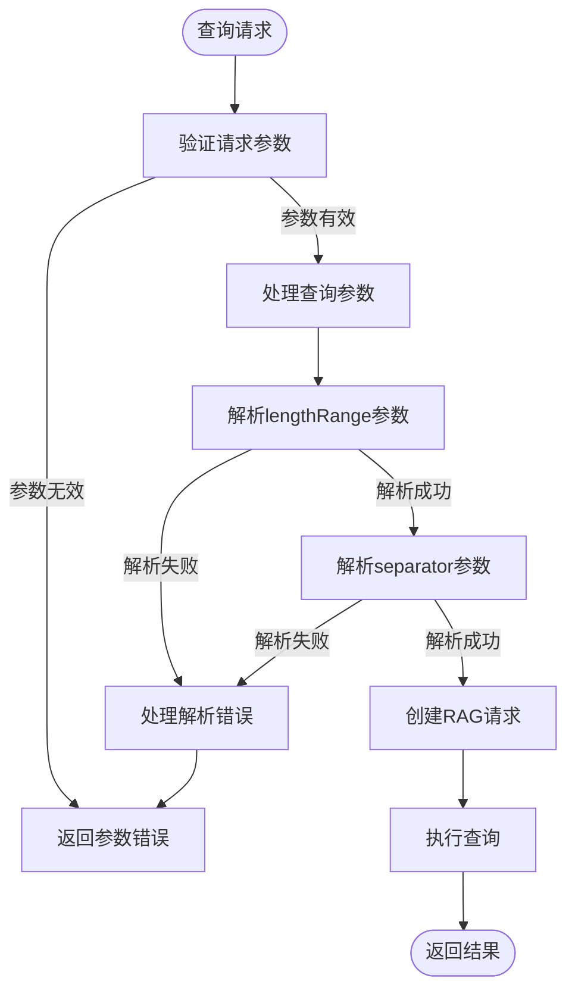
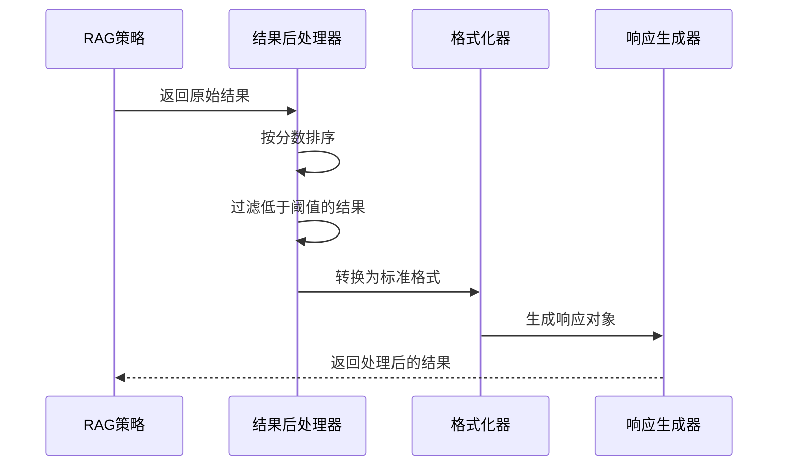
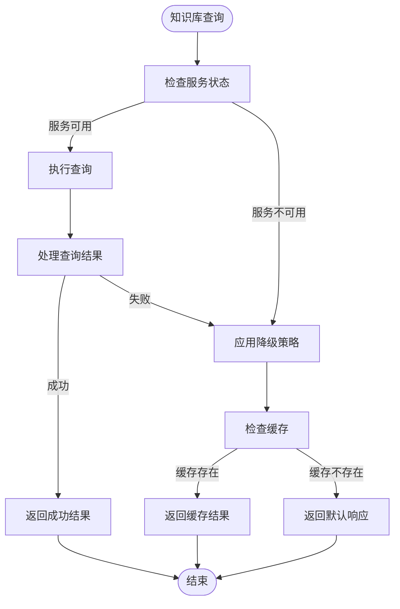
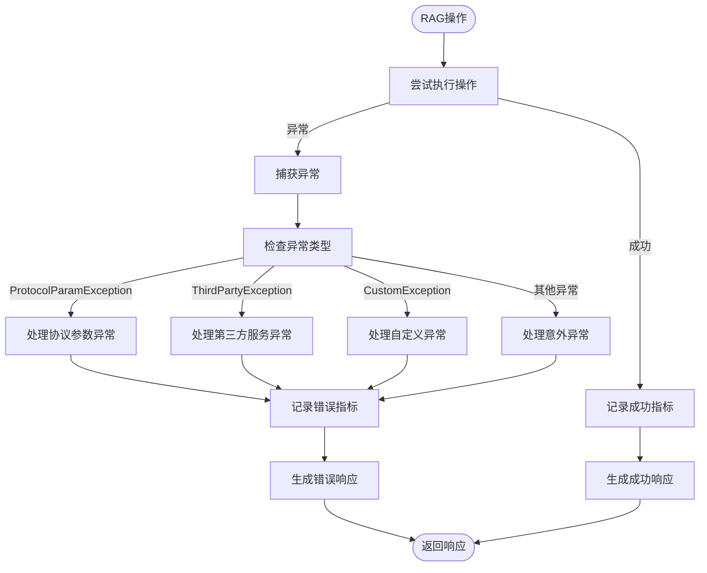

# 知识库节点

<cite>
**本文档引用的文件**
- [rag_strategy_factory.py](file://core/knowledge/service/rag_strategy_factory.py)
- [aiui_strategy.py](file://core/knowledge/service/impl/aiui_strategy.py)
- [cbg_strategy.py](file://core/knowledge/service/impl/cbg_strategy.py)
- [ragflow_strategy.py](file://core/knowledge/service/impl/ragflow_strategy.py)
- [sparkdesk_strategy.py](file://core/knowledge/service/impl/sparkdesk_strategy.py)
- [rag_strategy.py](file://core/knowledge/service/rag_strategy.py)
- [api.py](file://core/knowledge/api/v1/api.py)
- [knowledge-pro-parameter.ts](file://console/frontend/src/components/workflow/types/modal/knowledge-pro-parameter.ts)
- [knowledge-parameter.ts](file://console/frontend/src/components/workflow/types/modal/knowledge-parameter.ts)
</cite>

## 目录
1. [引言](#引言)
2. [知识库节点与核心知识服务集成](#知识库节点与核心知识服务集成)
3. [AIUI、CBG和Ragflow策略调用机制](#aiui、cbg和ragflow策略调用机制)
4. [节点配置参数详解](#节点配置参数详解)
5. [前端组件实现](#前端组件实现)
6. [知识库查询请求/响应示例](#知识库查询请求/响应示例)
7. [降级策略与错误处理](#降级策略与错误处理)
8. [结论](#结论)

## 引言

知识库节点是工作流中的关键组件，用于实现基于知识库的检索增强生成（RAG）功能。该节点通过集成核心知识服务（core/knowledge/）提供强大的知识检索能力，支持AIUI、CBG和Ragflow三种不同的策略。本文档详细说明了知识库节点的架构、配置参数、前端实现以及错误处理机制。

**Section sources**
- [rag_strategy.py](file://core/knowledge/service/rag_strategy.py#L1-L87)

## 知识库节点与核心知识服务集成

知识库节点通过策略模式与核心知识服务进行集成。系统采用工厂模式（RAGStrategyFactory）根据配置的ragType创建相应的策略实例，实现了不同知识库服务的无缝切换。

```mermaid
classDiagram
class RAGStrategy {
<<abstract>>
+query(query, doc_ids, repo_ids, top_k, threshold, **kwargs) Dict[str, Any]
+split(fileUrl, lengthRange, overlap, resourceType, separator, titleSplit, cutOff, **kwargs) List[Dict[str, Any]]
+chunks_save(docId, group, uid, chunks, **kwargs) Any
+chunks_update(docId, group, uid, chunks, **kwargs) Any
+chunks_delete(docId, chunkIds, **kwargs) Any
+query_doc(docId, **kwargs) List[dict]
+query_doc_name(docId, **kwargs) Optional[dict]
}
class RAGStrategyFactory {
-_strategies : Dict[str, Type[RAGStrategy]]
+get_strategy(ragType : str) RAGStrategy
+register_strategy(ragType : str, strategy_class : Type[RAGStrategy]) None
}
class AIUIRAGStrategy {
+query(query, doc_ids, repo_ids, top_k, threshold, **kwargs) Dict[str, Any]
+split(fileUrl, lengthRange, overlap, resourceType, separator, titleSplit, cutOff, **kwargs) List[Dict[str, Any]]
+chunks_save(docId, group, uid, chunks, **kwargs) Any
+chunks_update(docId, group, uid, chunks, **kwargs) Any
+chunks_delete(docId, chunkIds, **kwargs) Any
+query_doc(docId, **kwargs) List[dict]
+query_doc_name(docId, **kwargs) Optional[dict]
}
class CBGRAGStrategy {
+query(query, doc_ids, repo_ids, top_k, threshold, **kwargs) Dict[str, Any]
+split(fileUrl, lengthRange, overlap, resourceType, separator, titleSplit, cutOff, **kwargs) List[Dict[str, Any]]
+chunks_save(docId, group, uid, chunks, **kwargs) Any
+chunks_update(docId, group, uid, chunks, **kwargs) Any
+chunks_delete(docId, chunkIds, **kwargs) Any
+query_doc(docId, **kwargs) List[dict]
+query_doc_name(docId, **kwargs) Optional[dict]
}
class RagflowRAGStrategy {
+query(query, doc_ids, repo_ids, top_k, threshold, **kwargs) Dict[str, Any]
+split(fileUrl, lengthRange, overlap, resourceType, separator, titleSplit, cutOff, **kwargs) List[Dict[str, Any]]
+chunks_save(docId, group, uid, chunks, **kwargs) Any
+chunks_update(docId, group, uid, chunks, **kwargs) Any
+chunks_delete(docId, chunkIds, **kwargs) Any
+query_doc(docId, **kwargs) List[dict]
+query_doc_name(docId, **kwargs) Optional[dict]
}
class SparkDeskRAGStrategy {
+query(query, doc_ids, repo_ids, top_k, threshold, **kwargs) Dict[str, Any]
+split(fileUrl, lengthRange, overlap, resourceType, separator, titleSplit, cutOff, **kwargs) List[Dict[str, Any]]
+chunks_save(docId, group, uid, chunks, **kwargs) Any
+chunks_update(docId, group, uid, chunks, **kwargs) Any
+chunks_delete(docId, chunkIds, **kwargs) Any
+query_doc(docId, **kwargs) List[dict]
+query_doc_name(docId, **kwargs) Optional[dict]
}
RAGStrategyFactory --> RAGStrategy : "创建"
RAGStrategy <|-- AIUIRAGStrategy : "实现"
RAGStrategy <|-- CBGRAGStrategy : "实现"
RAGStrategy <|-- RagflowRAGStrategy : "实现"
RAGStrategy <|-- SparkDeskRAGStrategy : "实现"
```

**Diagram sources**
- [rag_strategy.py](file://core/knowledge/service/rag_strategy.py#L1-L87)
- [rag_strategy_factory.py](file://core/knowledge/service/rag_strategy_factory.py#L1-L95)

**Section sources**
- [rag_strategy_factory.py](file://core/knowledge/service/rag_strategy_factory.py#L1-L95)

## AIUI、CBG和Ragflow策略调用机制

### AIUI策略调用机制

AIUI策略通过AIUI接口实现知识检索功能。该策略支持完整的知识库操作，包括查询、分块、保存、更新和删除等。

**Diagram sources**
- [aiui_strategy.py](file://core/knowledge/service/impl/aiui_strategy.py#L1-L270)
- [api.py](file://core/knowledge/api/v1/api.py#L1-L479)

### CBG策略调用机制

CBG策略基于星火大模型实现知识检索功能。该策略通过星火接口进行文档分块和检索，支持top-k搜索和相似度阈值过滤。

**Diagram sources**
- [cbg_strategy.py](file://core/knowledge/service/impl/cbg_strategy.py#L1-L375)
- [api.py](file://core/knowledge/api/v1/api.py#L1-L479)

### Ragflow策略调用机制

Ragflow策略通过Ragflow服务实现知识管理功能。该策略支持完整的文档处理流程，包括上传、解析、分块和检索。

**Diagram sources**
- [ragflow_strategy.py](file://core/knowledge/service/impl/ragflow_strategy.py#L1-L1016)
- [api.py](file://core/knowledge/api/v1/api.py#L1-L479)

**Section sources**
- [aiui_strategy.py](file://core/knowledge/service/impl/aiui_strategy.py#L1-L270)
- [cbg_strategy.py](file://core/knowledge/service/impl/cbg_strategy.py#L1-L375)
- [ragflow_strategy.py](file://core/knowledge/service/impl/ragflow_strategy.py#L1-L1016)

## 节点配置参数详解

知识库节点提供了丰富的配置参数，用于控制检索行为和结果。

### 知识库选择

知识库选择参数用于指定要检索的知识库。用户可以从已创建的知识库列表中选择一个或多个知识库进行检索。

### 检索模式

系统支持两种检索模式：

- **精确检索**：使用严格的匹配算法，返回与查询内容高度相关的知识片段
- **模糊检索**：使用相似度算法，返回与查询内容语义相关的知识片段

### 返回结果数量

返回结果数量（Top K）参数控制返回的知识片段数量。该参数在不同策略中有不同的默认值：

- AIUI策略：默认返回6个结果
- CBG策略：可配置，无默认值
- Ragflow策略：默认返回6个结果

**Diagram sources**
- [knowledge-pro-parameter.ts](file://console/frontend/src/components/workflow/types/modal/knowledge-pro-parameter.ts#L1-L12)
- [knowledge-parameter.ts](file://console/frontend/src/components/workflow/types/modal/knowledge-parameter.ts#L1-L6)

**Section sources**
- [knowledge-pro-parameter.ts](file://console/frontend/src/components/workflow/types/modal/knowledge-pro-parameter.ts#L1-L12)
- [knowledge-parameter.ts](file://console/frontend/src/components/workflow/types/modal/knowledge-parameter.ts#L1-L6)

## 前端组件实现

前端组件实现了知识库的搜索、选择和参数配置功能。

### 知识库搜索与选择

前端通过`useKnowledgeSelect` Hook实现知识库的选择功能，支持点击外部区域关闭选择框的交互。

**Diagram sources**
- [knowledge-pro-parameter.ts](file://console/frontend/src/components/workflow/types/modal/knowledge-pro-parameter.ts#L1-L12)
- [knowledge-parameter.ts](file://console/frontend/src/components/workflow/types/modal/knowledge-parameter.ts#L1-L6)
- [use-knowledge-select.ts](file://console/frontend/src/pages/resource-management/upload-page/components/hooks/use-knowledge-select.ts#L1-L32)

### 检索参数配置

前端提供了参数配置模态框，允许用户配置Top K、相似度阈值等检索参数。

**Section sources**
- [knowledge-pro-parameter.ts](file://console/frontend/src/components/workflow/types/modal/knowledge-pro-parameter.ts#L1-L12)
- [knowledge-parameter.ts](file://console/frontend/src/components/workflow/types/modal/knowledge-parameter.ts#L1-L6)

## 知识库查询请求/响应示例

### 查询预处理

在执行查询之前，系统会对查询参数进行预处理和验证。

**Diagram sources**
- [api.py](file://core/knowledge/api/v1/api.py#L1-L479)

### 结果排序与后处理

查询结果会根据相似度分数进行排序，并进行后处理以符合标准格式。

**Diagram sources**
- [aiui_strategy.py](file://core/knowledge/service/impl/aiui_strategy.py#L1-L270)
- [cbg_strategy.py](file://core/knowledge/service/impl/cbg_strategy.py#L1-L375)
- [ragflow_strategy.py](file://core/knowledge/service/impl/ragflow_strategy.py#L1-L1016)

**Section sources**
- [api.py](file://core/knowledge/api/v1/api.py#L1-L479)

## 降级策略与错误处理

### 服务不可用时的降级策略

当知识库服务不可用时，系统会执行降级策略，确保系统的基本功能可用。

**Diagram sources**
- [api.py](file://core/knowledge/api/v1/api.py#L1-L479)

### 错误处理方案

系统实现了统一的错误处理机制，通过`handle_rag_operation`函数处理各种异常情况。

**Diagram sources**
- [api.py](file://core/knowledge/api/v1/api.py#L1-L479)

**Section sources**
- [api.py](file://core/knowledge/api/v1/api.py#L1-L479)

## 结论

知识库节点通过灵活的策略模式与核心知识服务集成，支持AIUI、CBG和Ragflow三种不同的检索策略。系统提供了丰富的配置参数，允许用户根据具体需求调整检索行为。前端组件实现了直观的知识库选择和参数配置界面，后端实现了完整的查询预处理、结果排序和后处理逻辑。当知识库服务不可用时，系统能够通过降级策略保证基本功能的可用性，并通过统一的错误处理机制确保系统的稳定性。