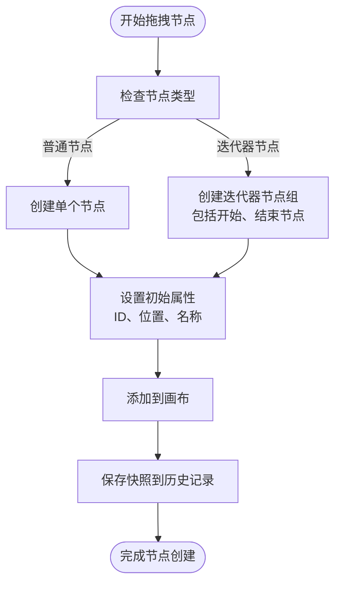
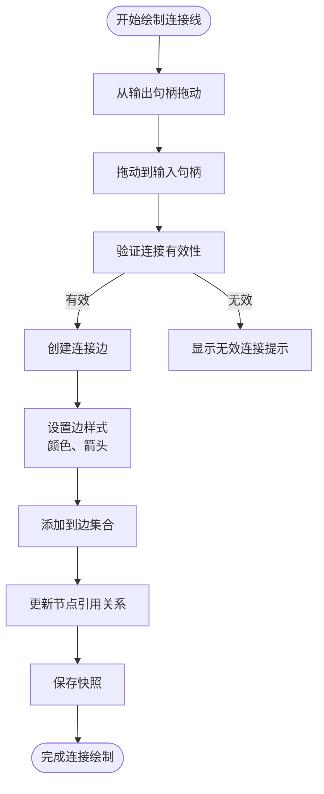
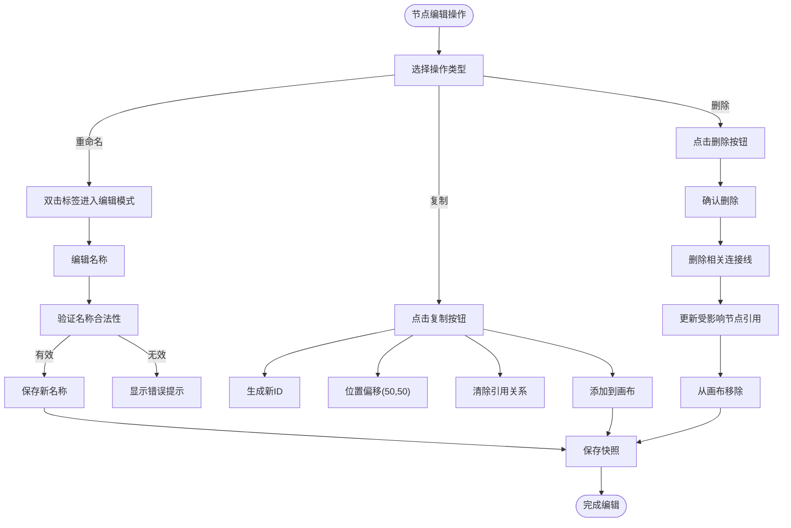
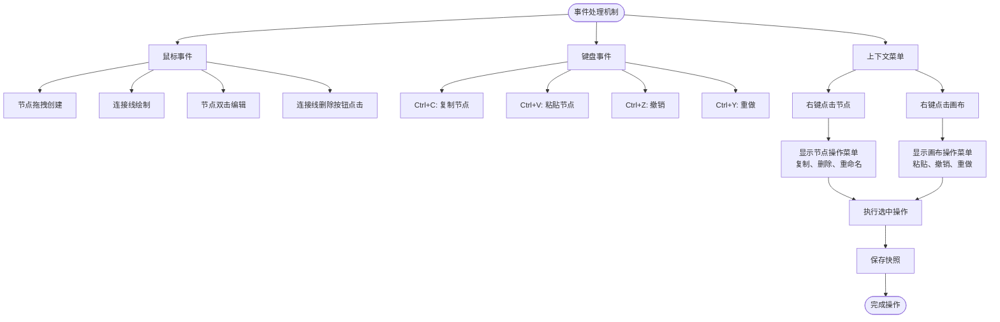
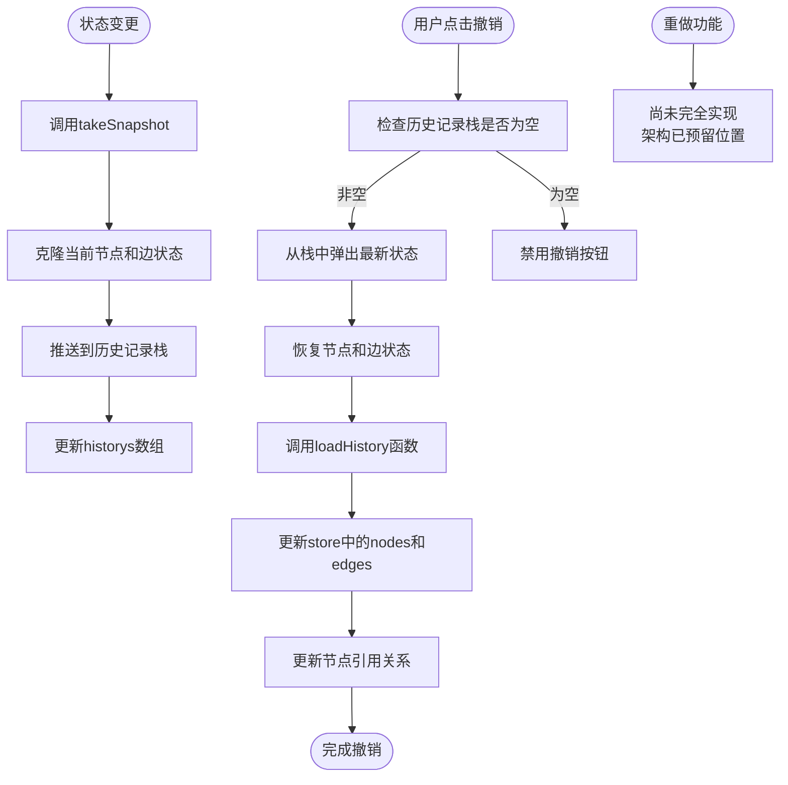
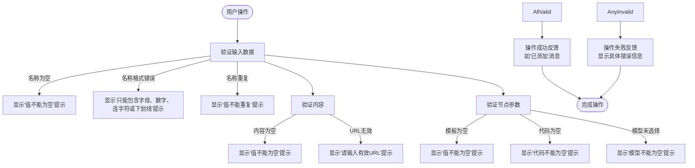
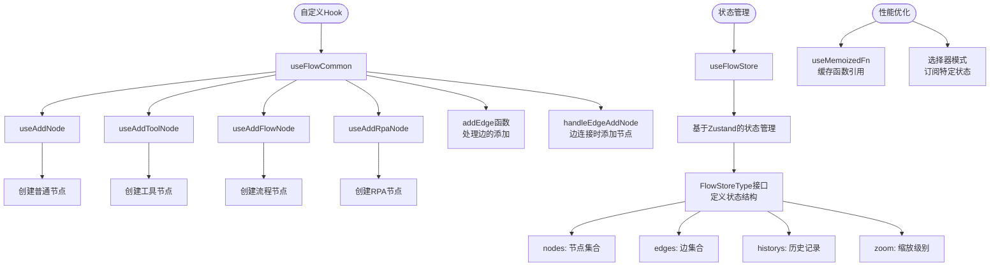

# 交互逻辑与操作流程

<cite>
**本文档引用的文件**  
- [use-flow-store.ts](file://console/frontend/src/components/workflow/store/use-flow-store.ts)
- [reactflowUtils.ts](file://console/frontend/src/components/workflow/utils/reactflowUtils.ts)
- [flow-function.ts](file://console/frontend/src/components/workflow/store/flow-function.ts)
- [use-flow-common.ts](file://console/frontend/src/components/workflow/hooks/use-flow-common.ts)
- [index.tsx](file://console/frontend/src/components/workflow/edges/index.tsx)
- [connection-line/index.tsx](file://console/frontend/src/components/workflow/nodes/components/connection-line/index.tsx)
</cite>

## 目录
1. [节点拖拽创建](#节点拖拽创建)
2. [连接线绘制](#连接线绘制)
3. [节点编辑](#节点编辑)
4. [事件处理机制](#事件处理机制)
5. [撤销/重做功能](#撤销重做功能)
6. [错误处理与用户反馈](#错误处理与用户反馈)
7. [自定义Hook封装](#自定义hook封装)

## 节点拖拽创建

工作流设计器中的节点拖拽创建功能通过`useFlowCommon`钩子实现。当用户从节点面板拖拽节点到画布时，系统会调用`handleAddNode`函数，该函数根据节点类型创建新的节点实例。对于特殊节点类型如迭代器（iteration），系统会同时创建关联的开始和结束节点。

节点创建时，系统会自动生成唯一ID，设置初始位置，并根据同类型节点的命名规则生成默认名称（如"LLM_1"、"LLM_2"）。创建完成后，系统会自动保存当前状态到历史记录中，以便支持撤销操作。

**Diagram sources**
- [use-flow-common.ts](file://console/frontend/src/components/workflow/hooks/use-flow-common.ts#L50-L200)
- [reactflowUtils.ts](file://console/frontend/src/components/workflow/utils/reactflowUtils.ts#L50-L100)

**Section sources**
- [use-flow-common.ts](file://console/frontend/src/components/workflow/hooks/use-flow-common.ts#L50-L250)
- [reactflowUtils.ts](file://console/frontend/src/components/workflow/utils/reactflowUtils.ts#L50-L150)

## 连接线绘制

连接线的绘制通过React Flow库的连接功能实现。当用户从一个节点的输出句柄拖动到另一个节点的输入句柄时，系统会触发`onConnect`事件处理函数。该函数会创建新的连接边，并将其添加到边集合中。

连接线具有自定义样式，包括紫色的描边和目标端的圆形标记。用户可以通过点击连接线上的删除按钮来移除连接。当连接被删除时，系统会同步更新相关的节点引用关系。

**Diagram sources**
- [flow-function.ts](file://console/frontend/src/components/workflow/store/flow-function.ts#L500-L550)
- [index.tsx](file://console/frontend/src/components/workflow/edges/index.tsx#L50-L80)
- [connection-line/index.tsx](file://console/frontend/src/components/workflow/nodes/components/connection-line/index.tsx#L10-L30)

**Section sources**
- [flow-function.ts](file://console/frontend/src/components/workflow/store/flow-function.ts#L500-L580)
- [index.tsx](file://console/frontend/src/components/workflow/edges/index.tsx#L10-L90)

## 节点编辑

节点编辑功能包括节点重命名、复制、删除等操作。用户可以通过双击节点标签进入编辑模式，修改节点名称。系统会验证新名称的合法性（只能包含字母、数字、连字符或下划线），并在失去焦点时保存更改。

节点复制功能会创建节点的副本，位置偏移一定距离，并生成新的ID。复制的节点会继承原节点的大部分属性，但会清除引用关系。节点删除时，系统会同时删除相关的连接线，并更新受影响节点的引用。

**Diagram sources**
- [flow-function.ts](file://console/frontend/src/components/workflow/store/flow-function.ts#L300-L450)
- [use-flow-store.ts](file://console/frontend/src/components/workflow/store/use-flow-store.ts#L50-L100)

**Section sources**
- [flow-function.ts](file://console/frontend/src/components/workflow/store/flow-function.ts#L300-L480)
- [use-flow-store.ts](file://console/frontend/src/components/workflow/store/use-flow-store.ts#L50-L120)

## 事件处理机制

工作流设计器的事件处理机制包括鼠标事件、键盘快捷键和上下文菜单。鼠标事件主要处理节点的拖拽、连接线的绘制和编辑操作。键盘快捷键支持常见的编辑操作，如Ctrl+C复制节点、Ctrl+V粘贴节点、Ctrl+Z撤销操作等。

上下文菜单通过右键点击节点或画布空白区域触发，提供与当前选中对象相关的操作选项。例如，右键点击节点会显示"复制"、"删除"、"重命名"等选项，而右键点击画布空白区域则可能显示"粘贴"、"撤销"等全局操作。

**Diagram sources**
- [use-flow-store.ts](file://console/frontend/src/components/workflow/store/use-flow-store.ts#L100-L150)
- [flow-function.ts](file://console/frontend/src/components/workflow/store/flow-function.ts#L200-L300)
- [use-flow-common.ts](file://console/frontend/src/components/workflow/hooks/use-flow-common.ts#L200-L250)

**Section sources**
- [use-flow-store.ts](file://console/frontend/src/components/workflow/store/use-flow-store.ts#L100-L180)
- [flow-function.ts](file://console/frontend/src/components/workflow/store/flow-function.ts#L200-L350)

## 撤销/重做功能

撤销/重做功能通过维护一个历史记录栈实现。每次重要的状态变更（如节点创建、删除、连接等）都会触发`takeSnapshot`函数，将当前的节点和边的状态保存到历史记录中。历史记录采用浅拷贝的方式存储，以提高性能。

撤销操作会从历史记录栈中弹出最新的状态，并将其恢复到画布中。系统会同步更新节点和边的集合，并触发相关的引用关系更新。重做功能尚未在代码中完全实现，但架构上已预留了相应的位置。

**Diagram sources**
- [flow-function.ts](file://console/frontend/src/components/workflow/store/flow-function.ts#L100-L200)
- [use-flow-store.ts](file://console/frontend/src/components/workflow/store/use-flow-store.ts#L150-L180)

**Section sources**
- [flow-function.ts](file://console/frontend/src/components/workflow/store/flow-function.ts#L100-L250)
- [use-flow-store.ts](file://console/frontend/src/components/workflow/store/use-flow-store.ts#L150-L200)

## 错误处理与用户反馈

系统通过多种方式提供错误处理和用户反馈。当用户进行无效操作时，如创建重复名称的节点、连接不兼容的节点类型等，系统会在相应位置显示视觉提示。这些提示通常以红色边框或错误消息的形式出现。

对于节点参数验证，系统会在保存或检查节点时验证输入输出参数的合法性。如果验证失败，相关字段会显示错误消息，指导用户进行修正。此外，系统还提供了操作成功或失败的全局消息提示，如"工具已添加"、"复制失败"等。

**Diagram sources**
- [reactflowUtils.ts](file://console/frontend/src/components/workflow/utils/reactflowUtils.ts#L200-L500)
- [flow-function.ts](file://console/frontend/src/components/workflow/store/flow-function.ts#L350-L400)

**Section sources**
- [reactflowUtils.ts](file://console/frontend/src/components/workflow/utils/reactflowUtils.ts#L200-L600)
- [flow-function.ts](file://console/frontend/src/components/workflow/store/flow-function.ts#L350-L450)

## 自定义Hook封装

系统通过自定义Hook封装了复用的交互逻辑。`useFlowCommon`是核心的自定义Hook，它整合了节点添加、工具节点添加、流程节点添加等多种功能。这些Hook利用`useMemoizedFn`来优化函数引用，避免不必要的重新渲染。

通过Zustand状态管理库，系统实现了跨组件的状态共享。`useFlowStore`提供了对画布状态的集中管理，包括节点、边、缩放级别、历史记录等。其他组件可以通过选择器模式订阅所需的状态部分，实现高效的更新。

**Diagram sources**
- [use-flow-common.ts](file://console/frontend/src/components/workflow/hooks/use-flow-common.ts#L1-L500)
- [use-flow-store.ts](file://console/frontend/src/components/workflow/store/use-flow-store.ts#L1-L80)
- [flow-function.ts](file://console/frontend/src/components/workflow/store/flow-function.ts#L1-L100)

**Section sources**
- [use-flow-common.ts](file://console/frontend/src/components/workflow/hooks/use-flow-common.ts#L1-L520)
- [use-flow-store.ts](file://console/frontend/src/components/workflow/store/use-flow-store.ts#L1-L83)
- [flow-function.ts](file://console/frontend/src/components/workflow/store/flow-function.ts#L1-L100)