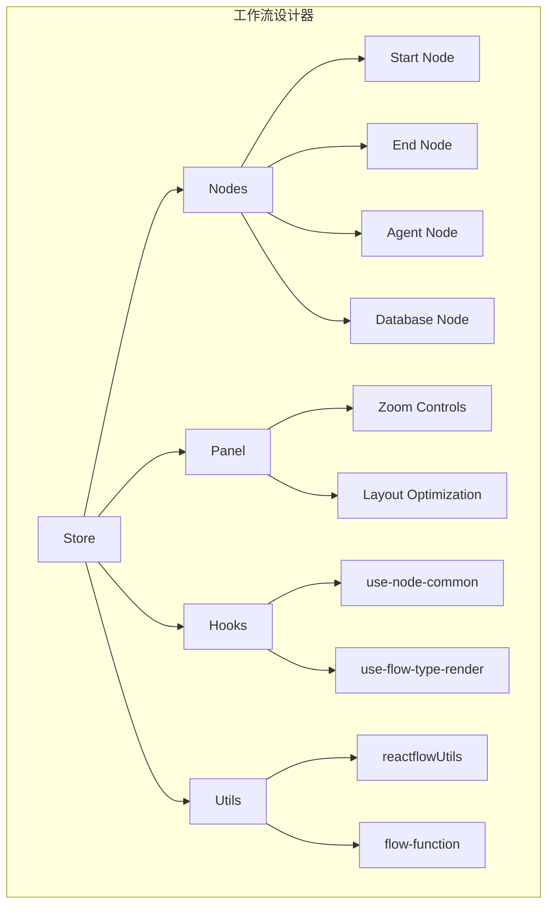
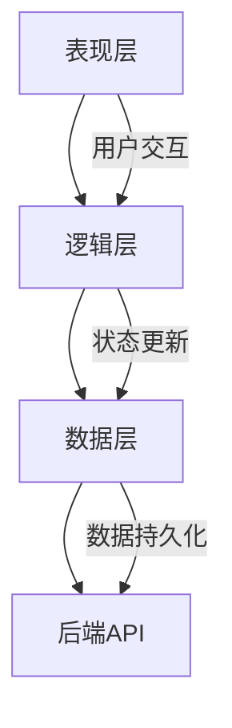
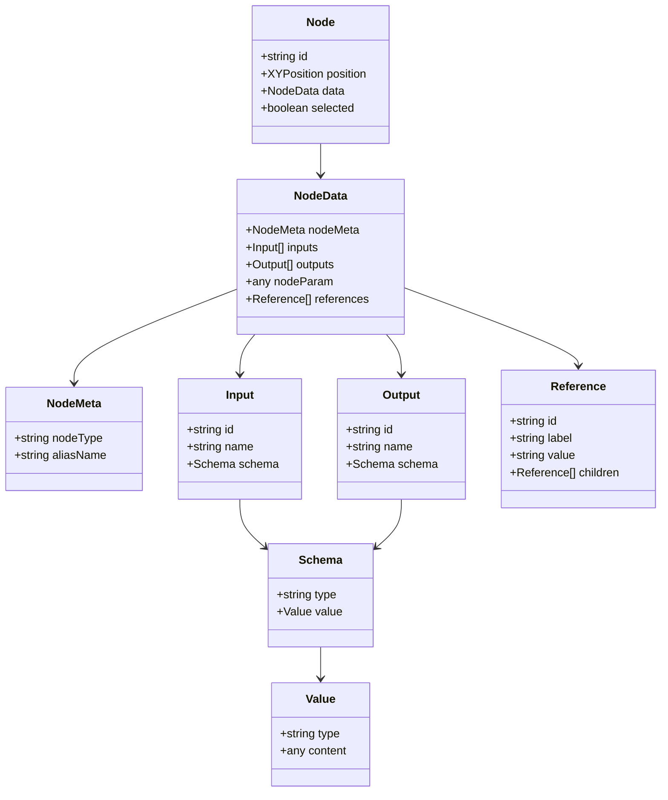
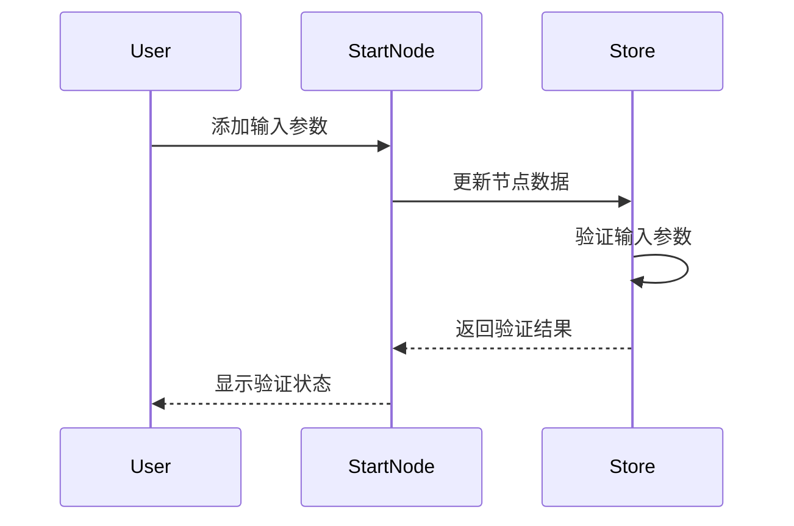
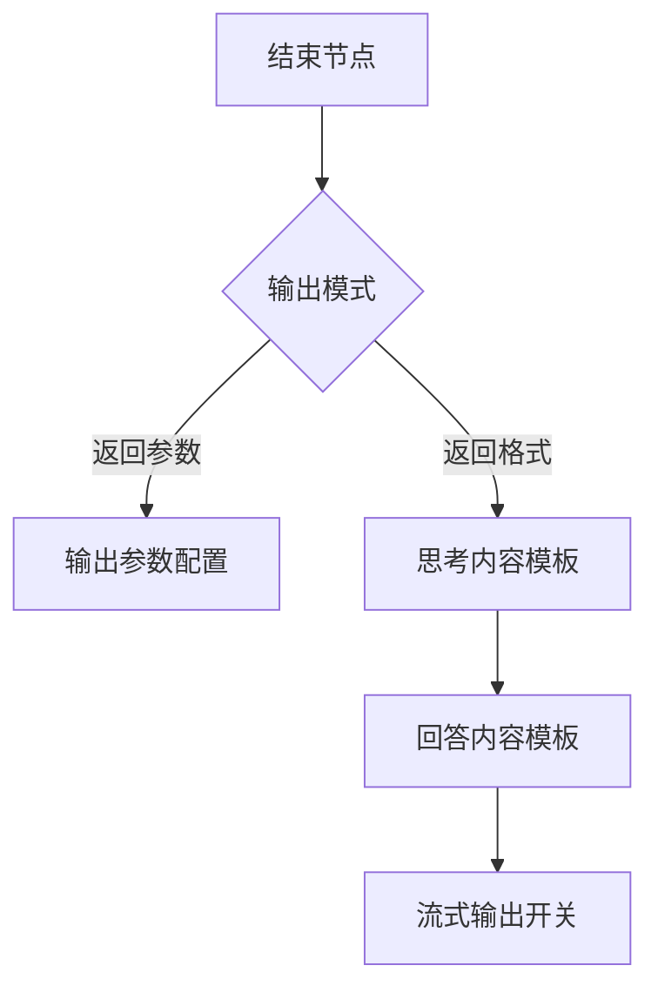
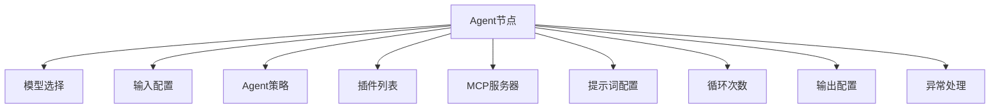
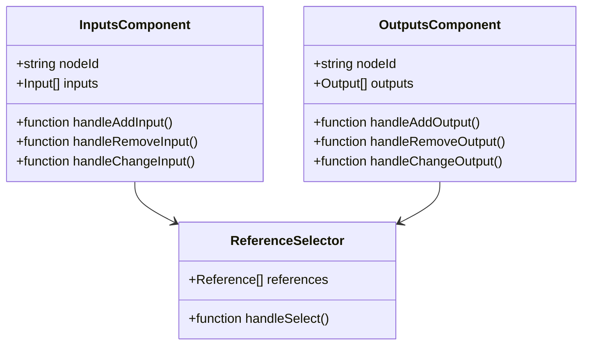
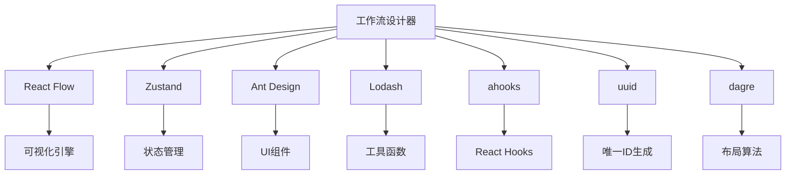

# 工作流设计器

<cite>
**本文档引用的文件**  
- [use-flow-store.ts](file://console/frontend/src/components/workflow/store/use-flow-store.ts)
- [flow-function.ts](file://console/frontend/src/components/workflow/store/flow-function.ts)
- [use-node-common.tsx](file://console/frontend/src/components/workflow/hooks/use-node-common.tsx)
- [reactflowUtils.ts](file://console/frontend/src/components/workflow/utils/reactflowUtils.ts)
- [panel/index.tsx](file://console/frontend/src/components/workflow/panel/index.tsx)
- [nodes/index.tsx](file://console/frontend/src/components/workflow/nodes/index.tsx)
- [nodes/start/index.tsx](file://console/frontend/src/components/workflow/nodes/start/index.tsx)
- [nodes/end/index.tsx](file://console/frontend/src/components/workflow/nodes/end/index.tsx)
- [nodes/agent/index.tsx](file://console/frontend/src/components/workflow/nodes/agent/index.tsx)
- [nodes/components/inputs/index.tsx](file://console/frontend/src/components/workflow/nodes/components/inputs/index.tsx)
- [nodes/components/outputs/index.tsx](file://console/frontend/src/components/workflow/nodes/components/outputs/index.tsx)
- [flow.scss](file://console/frontend/src/styles/flow.scss)
</cite>

## 目录
1. [简介](#简介)
2. [项目结构](#项目结构)
3. [核心组件](#核心组件)
4. [架构概述](#架构概述)
5. [详细组件分析](#详细组件分析)
6. [依赖分析](#依赖分析)
7. [性能考虑](#性能考虑)
8. [故障排除指南](#故障排除指南)
9. [结论](#结论)

## 简介
工作流设计器是Astron Agent平台的核心功能之一，提供了一个直观的可视化界面，用于构建和管理复杂的AI工作流。该设计器基于React Flow库构建，允许用户通过拖拽节点、连接线创建和配置工作流。系统支持多种节点类型，包括开始节点、结束节点、LLM节点、数据库节点、决策节点等，每个节点都可以进行详细的参数配置。设计器采用Zustand进行状态管理，确保工作流数据的一致性和可追溯性。通过CSS模块化样式，实现了节点外观的定制化，同时提供了丰富的交互功能，如布局优化、缩放控制、撤销重做等。

## 项目结构
工作流设计器的前端代码主要位于`console/frontend/src/components/workflow`目录下，采用模块化设计，各组件职责分明。核心结构包括store（状态管理）、nodes（节点组件）、panel（控制面板）、hooks（自定义钩子）、utils（工具函数）等模块。状态管理使用Zustand存储工作流的节点、边、缩放级别等数据。节点组件实现了各种工作流节点的可视化和交互逻辑。控制面板提供了缩放、布局优化、模式切换等操作控件。自定义钩子封装了节点操作、数据验证等通用逻辑。工具函数包含了节点ID生成、数据验证、引用处理等辅助功能。

**Diagram sources**
- [use-flow-store.ts](file://console/frontend/src/components/workflow/store/use-flow-store.ts)
- [nodes/index.tsx](file://console/frontend/src/components/workflow/nodes/index.tsx)
- [panel/index.tsx](file://console/frontend/src/components/workflow/panel/index.tsx)
- [hooks/use-node-common.tsx](file://console/frontend/src/components/workflow/hooks/use-node-common.tsx)
- [utils/reactflowUtils.ts](file://console/frontend/src/components/workflow/utils/reactflowUtils.ts)

**Section sources**
- [use-flow-store.ts](file://console/frontend/src/components/workflow/store/use-flow-store.ts)
- [nodes/index.tsx](file://console/frontend/src/components/workflow/nodes/index.tsx)
- [panel/index.tsx](file://console/frontend/src/components/workflow/panel/index.tsx)

## 核心组件
工作流设计器的核心组件包括状态管理、节点渲染、连接线处理和用户交互。状态管理通过Zustand实现，存储了工作流的所有节点、边和视图状态。节点渲染基于React Flow的自定义节点功能，每个节点类型都有对应的React组件。连接线处理通过自定义边类型实现，支持曲线和折线两种样式。用户交互功能包括节点拖拽、连接、复制、删除等操作，这些操作都通过Zustand store中的方法进行管理。设计器还实现了撤销/重做功能，通过维护历史快照来支持用户回退操作。

**Section sources**
- [use-flow-store.ts](file://console/frontend/src/components/workflow/store/use-flow-store.ts)
- [flow-function.ts](file://console/frontend/src/components/workflow/store/flow-function.ts)
- [nodes/index.tsx](file://console/frontend/src/components/workflow/nodes/index.tsx)

## 架构概述
工作流设计器采用分层架构，从下到上分为数据层、逻辑层和表现层。数据层由Zustand store构成，负责存储和管理工作流的完整状态。逻辑层包含各种自定义钩子和工具函数，处理业务逻辑和数据转换。表现层由React组件构成，负责UI渲染和用户交互。这种分层架构使得代码结构清晰，易于维护和扩展。设计器与后端通过API进行数据同步，支持工作流的保存、加载和发布。

**Diagram sources**
- [use-flow-store.ts](file://console/frontend/src/components/workflow/store/use-flow-store.ts)
- [flow-function.ts](file://console/frontend/src/components/workflow/store/flow-function.ts)
- [panel/index.tsx](file://console/frontend/src/components/workflow/panel/index.tsx)

## 详细组件分析
### 节点分析
工作流设计器的节点系统基于React Flow的自定义节点功能实现。每个节点都是一个React组件，包含节点头、节点内容和句柄。节点头显示节点名称和操作按钮，节点内容根据节点类型显示不同的配置表单，句柄用于创建连接线。节点的状态存储在Zustand store中，包括位置、大小、选中状态等。

#### 节点类型

**Diagram sources**
- [types/index.ts](file://console/frontend/src/components/workflow/types/index.ts)
- [nodes/index.tsx](file://console/frontend/src/components/workflow/nodes/index.tsx)

### 开始节点分析
开始节点是工作流的入口点，负责定义工作流的输入参数。用户可以在开始节点中添加输入字段，每个字段都有名称、类型和默认值。开始节点的输出会自动传递给后续节点，作为上下文数据。开始节点的UI设计简洁明了，突出显示输入参数的配置区域。

**Diagram sources**
- [nodes/start/index.tsx](file://console/frontend/src/components/workflow/nodes/start/index.tsx)
- [use-node-common.tsx](file://console/frontend/src/components/workflow/hooks/use-node-common.tsx)

### 结束节点分析
结束节点是工作流的出口点，负责定义工作流的输出格式和响应内容。用户可以选择返回参数或返回格式两种模式。在返回格式模式下，可以配置思考内容和回答内容的模板。结束节点还支持流式输出开关，控制响应的输出方式。结束节点的UI设计采用了折叠面板，将不同配置项分组展示，提高可读性。

**Diagram sources**
- [nodes/end/index.tsx](file://console/frontend/src/components/workflow/nodes/end/index.tsx)
- [use-node-common.tsx](file://console/frontend/src/components/workflow/hooks/use-node-common.tsx)

### Agent节点分析
Agent节点是工作流中的核心处理节点，集成了LLM模型、插件、知识库等功能。用户可以在Agent节点中配置模型参数、选择插件、设置提示词等。Agent节点支持复杂的输入输出配置，可以引用其他节点的输出作为输入。节点的UI设计采用了多级折叠面板，将不同功能模块分组展示，保持界面整洁。

**Diagram sources**
- [nodes/agent/index.tsx](file://console/frontend/src/components/workflow/nodes/agent/index.tsx)
- [use-node-common.tsx](file://console/frontend/src/components/workflow/hooks/use-node-common.tsx)

### 输入输出组件分析
输入输出组件是工作流设计器的基础构建块，用于配置节点的输入输出参数。输入组件支持字面量和引用两种值类型，用户可以通过级联选择器引用其他节点的输出。输出组件采用树形结构展示，支持嵌套属性。组件的UI设计采用了表格布局，清晰展示参数名称、类型和值。

**Diagram sources**
- [nodes/components/inputs/index.tsx](file://console/frontend/src/components/workflow/nodes/components/inputs/index.tsx)
- [nodes/components/outputs/index.tsx](file://console/frontend/src/components/workflow/nodes/components/outputs/index.tsx)

## 依赖分析
工作流设计器依赖于多个第三方库和内部模块。主要依赖包括React Flow（可视化引擎）、Zustand（状态管理）、Ant Design（UI组件）、Lodash（工具函数）等。内部模块之间通过清晰的接口进行通信，如store提供状态和操作方法，hooks封装通用逻辑，components负责UI渲染。这种依赖关系使得代码模块化程度高，便于维护和测试。

**Diagram sources**
- [package.json](file://console/frontend/package.json)
- [use-flow-store.ts](file://console/frontend/src/components/workflow/store/use-flow-store.ts)

**Section sources**
- [package.json](file://console/frontend/package.json)
- [use-flow-store.ts](file://console/frontend/src/components/workflow/store/use-flow-store.ts)

## 性能考虑
工作流设计器在性能方面做了多项优化。首先，通过React的memoization技术避免不必要的组件重新渲染。其次，使用Zustand的选择器功能，确保只有相关状态变化时组件才会更新。对于大型工作流，设计器实现了虚拟滚动和懒加载，只渲染可视区域内的节点。此外，连接线的渲染也进行了优化，使用Web Workers处理复杂的布局计算，避免阻塞主线程。

## 故障排除指南
### 节点连接问题
如果节点无法连接，请检查以下几点：
1. 源节点和目标节点的句柄类型是否匹配
2. 连接线是否已存在
3. 节点是否被锁定或禁用

### 数据引用问题
如果数据引用不生效，请检查：
1. 引用的节点是否存在
2. 引用的输出参数是否存在
3. 节点的依赖关系是否正确

### 性能问题
如果设计器响应缓慢，请尝试：
1. 减少工作流中的节点数量
2. 关闭不必要的调试面板
3. 清理浏览器缓存

**Section sources**
- [flow-function.ts](file://console/frontend/src/components/workflow/store/flow-function.ts)
- [reactflowUtils.ts](file://console/frontend/src/components/workflow/utils/reactflowUtils.ts)

## 结论
工作流设计器是一个功能强大且灵活的可视化编程工具，为用户提供了直观的方式来构建复杂的AI工作流。通过合理的架构设计和模块化实现，设计器具有良好的可扩展性和可维护性。未来可以进一步优化性能，增加更多节点类型和高级功能，如条件分支、循环控制等，以满足更复杂的应用场景。