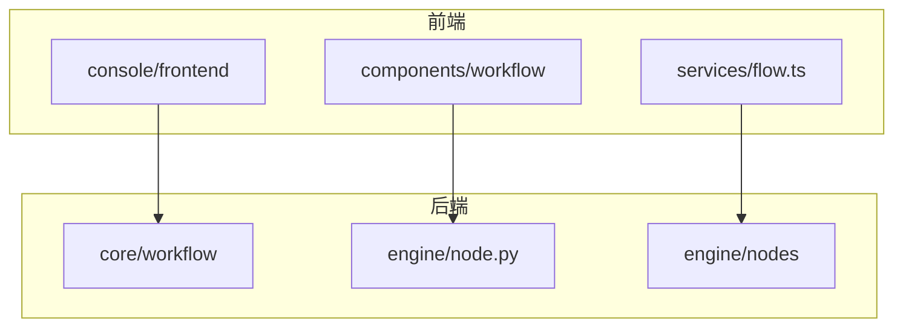
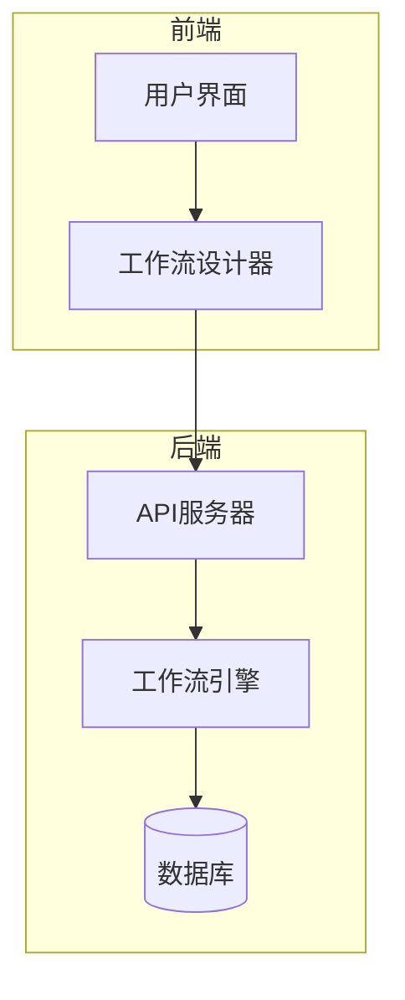
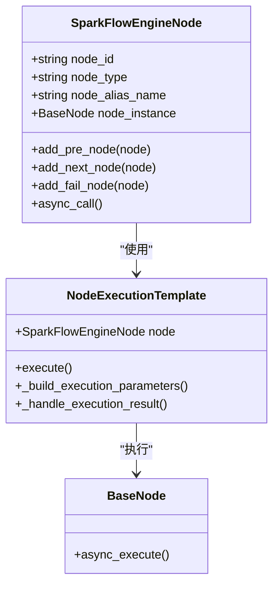
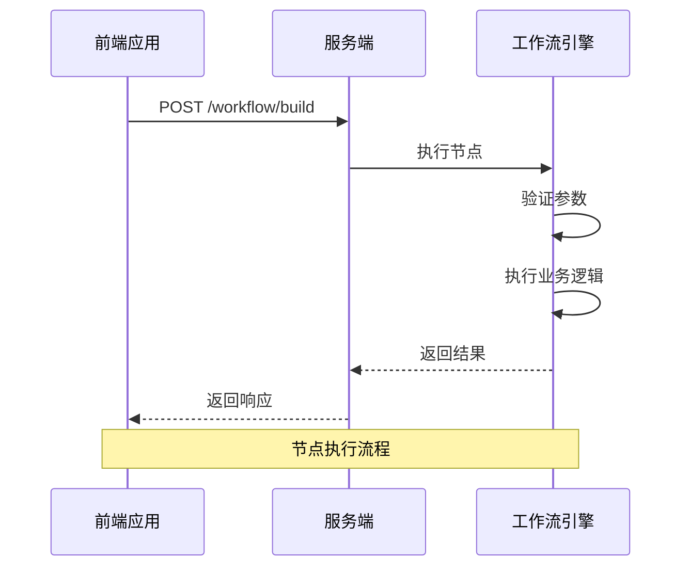
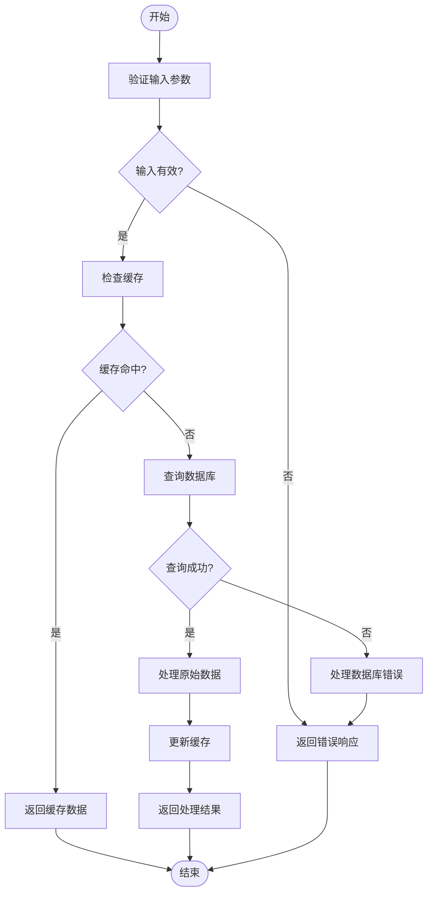
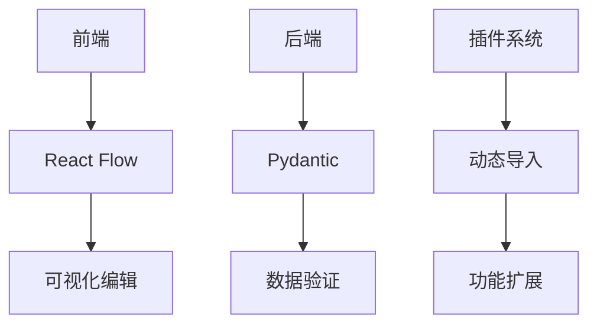

# 扩展与自定义

<cite>
**本文档引用的文件**  
- [node.py](file://core/workflow/engine/node.py)
- [use-node-common.tsx](file://console/frontend/src/components/workflow/hooks/use-node-common.tsx)
- [flow.ts](file://console/frontend/src/services/flow.ts)
- [node-detail.ts](file://console/frontend/src/components/workflow/types/modal/node-detail.ts)
- [node.py](file://core/workflow/engine/node.py)
- [use-node-common.tsx](file://console/frontend/src/components/workflow/hooks/use-node-common.tsx)
- [flow.ts](file://console/frontend/src/services/flow.ts)
- [node-detail.ts](file://console/frontend/src/components/workflow/types/modal/node-detail.ts)
</cite>

## 目录
1. [简介](#简介)
2. [项目结构](#项目结构)
3. [核心组件](#核心组件)
4. [架构概述](#架构概述)
5. [详细组件分析](#详细组件分析)
6. [依赖分析](#依赖分析)
7. [性能考虑](#性能考虑)
8. [故障排除指南](#故障排除指南)
9. [结论](#结论)
10. [附录](#附录)（如有必要）

## 简介
本文档提供工作流设计器的扩展开发指南，详细说明如何添加新的节点类型，包括前端组件开发和后端节点处理器实现。文档解释了节点配置Schema的定义方式和验证机制，描述了插件系统如何与设计器集成，提供了自定义节点样式的最佳实践，并展示了如何通过API扩展设计器功能，如添加新的工具栏按钮或菜单项。

## 项目结构
本项目采用前后端分离的架构，前端位于`console/frontend`目录，后端工作流引擎位于`core/workflow`目录。前端使用React和TypeScript构建，后端使用Python和FastAPI框架。工作流设计器的核心功能分布在前端的`components/workflow`目录和后端的`engine`目录中。

**图表来源**
- [node.py](file://core/workflow/engine/node.py)
- [use-node-common.tsx](file://console/frontend/src/components/workflow/hooks/use-node-common.tsx)

**章节来源**
- [node.py](file://core/workflow/engine/node.py#L1-L50)
- [use-node-common.tsx](file://console/frontend/src/components/workflow/hooks/use-node-common.tsx#L1-L50)

## 核心组件
工作流设计器的核心组件包括节点管理、流程执行引擎和插件系统。前端通过React Flow库实现可视化编辑器，后端通过NodeExecutionTemplate类实现节点执行模板方法。节点配置通过HTTP API进行通信，使用JSON Schema进行数据验证。

**章节来源**
- [node.py](file://core/workflow/engine/node.py#L25-L100)
- [use-node-common.tsx](file://console/frontend/src/components/workflow/hooks/use-node-common.tsx#L15-L80)

## 架构概述
系统采用微服务架构，前端通过RESTful API与后端通信。工作流引擎采用策略模式和模板方法模式，通过NodeExecutionTemplate类统一处理节点执行流程。插件系统通过动态加载机制集成到设计器中，支持热插拔和版本管理。

**图表来源**
- [node.py](file://core/workflow/engine/node.py#L10-L50)
- [flow.ts](file://console/frontend/src/services/flow.ts#L20-L40)

## 详细组件分析
本节详细分析工作流设计器的关键组件，包括节点类型、执行流程和数据验证机制。

### 节点类型分析
工作流设计器支持多种节点类型，包括基础节点、插件节点和流程节点。每种节点类型都有对应的前端组件和后端处理器。

#### 对于面向对象的组件：

**图表来源**
- [node.py](file://core/workflow/engine/node.py#L15-L45)
- [use-node-common.tsx](file://console/frontend/src/components/workflow/hooks/use-node-common.tsx#L5-L20)

#### 对于API/服务组件：

**图表来源**
- [flow.ts](file://console/frontend/src/services/flow.ts#L20-L60)
- [node.py](file://core/workflow/engine/node.py#L30-L80)

#### 对于复杂逻辑组件：

**图表来源**
- [node.py](file://core/workflow/engine/node.py#L45-L120)
- [use-node-common.tsx](file://console/frontend/src/components/workflow/hooks/use-node-common.tsx#L15-L50)

**章节来源**
- [node.py](file://core/workflow/engine/node.py#L1-L100)
- [use-node-common.tsx](file://console/frontend/src/components/workflow/hooks/use-node-common.tsx#L10-L50)

### 概念概述
工作流设计器采用模块化设计，支持通过插件系统扩展功能。节点配置Schema定义了节点的输入输出参数和验证规则，确保数据的一致性和完整性。

[无来源，因为此图表显示的是概念工作流，而非实际代码结构]

[无来源，因为此部分不分析特定源文件]

## 依赖分析
工作流设计器的组件之间存在紧密的依赖关系。前端组件依赖于React Flow库进行可视化编辑，后端引擎依赖于Pydantic进行数据验证。插件系统通过动态导入机制与主应用集成，确保了系统的可扩展性。

**图表来源**
- [node.py](file://core/workflow/engine/node.py#L1-L20)
- [flow.ts](file://console/frontend/src/services/flow.ts#L1-L15)

**章节来源**
- [node.py](file://core/workflow/engine/node.py#L1-L30)
- [flow.ts](file://console/frontend/src/services/flow.ts#L1-L30)

## 性能考虑
工作流设计器在设计时考虑了性能优化。通过缓存机制减少数据库查询，使用异步处理提高响应速度。节点执行采用模板方法模式，减少了重复代码，提高了执行效率。

[无来源，因为此部分提供一般性指导]

## 故障排除指南
当工作流设计器出现问题时，首先检查节点配置是否符合Schema定义，确保输入输出参数正确。查看日志文件以获取详细的错误信息，使用调试工具逐步执行节点，定位问题所在。

**章节来源**
- [node.py](file://core/workflow/engine/node.py#L10-L50)
- [use-node-common.tsx](file://console/frontend/src/components/workflow/hooks/use-node-common.tsx#L15-L40)

## 结论
本文档详细介绍了工作流设计器的扩展开发指南，涵盖了从节点类型添加到API扩展的各个方面。通过遵循本文档的指导，开发者可以有效地扩展和自定义工作流设计器，满足特定的业务需求。

[无来源，因为此部分总结而不分析特定文件]