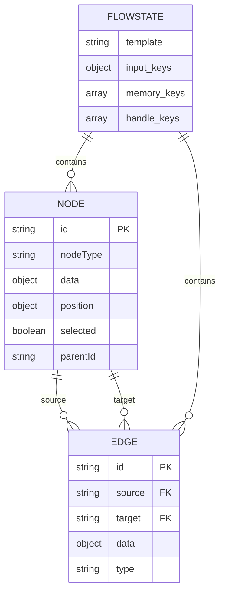
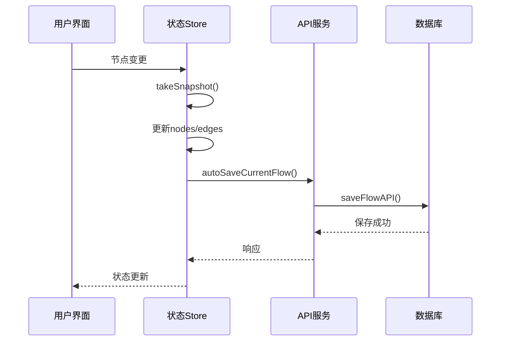

# 状态管理机制

<cite>
**本文档引用的文件**
- [use-flow-store.ts](file://console/frontend/src/components/workflow/store/use-flow-store.ts)
- [flow-function.ts](file://console/frontend/src/components/workflow/store/flow-function.ts)
- [index.ts](file://console/frontend/src/components/workflow/types/zustand/flow/index.ts)
- [use-iterator-flow-store.ts](file://console/frontend/src/components/workflow/store/use-iterator-flow-store.ts)
- [space-store.ts](file://console/frontend/src/store/space-store.ts)
- [locale-store.ts](file://console/frontend/src/store/spark-store/locale-store.ts)
- [reactflowUtils.ts](file://console/frontend/src/components/workflow/utils/reactflowUtils.ts)
- [flow.ts](file://console/frontend/src/services/flow.ts)
</cite>

## 目录
1. [Zustand状态库使用方式](#zustand状态库使用方式)
2. [工作流数据模型结构](#工作流数据模型结构)
3. [状态持久化与API同步](#状态持久化与api同步)
4. [状态选择器优化策略](#状态选择器优化策略)
5. [错误处理与数据验证](#错误处理与数据验证)

## Zustand状态库使用方式

工作流设计器采用Zustand作为状态管理解决方案，通过创建集中式store来管理工作流的节点、边和连接等核心状态。系统定义了`FlowStoreType`接口来规范store的结构，包含节点管理、边管理、缩放控制、历史记录等操作方法。

状态store通过`create`函数创建，结合`useFlowStore`自定义Hook在组件中使用。store实现了两种类型的store：普通工作流store和迭代器工作流store，两者共享相同的功能函数但独立管理状态。这种设计模式支持多工作流并行编辑，通过`useFlowsManager`状态管理器协调不同工作流实例。

store中的action方法被精心设计为纯函数，接收当前状态并返回新状态，确保状态变更的可预测性。每个action都遵循单一职责原则，如`setNodes`用于更新节点集合，`onConnect`处理节点连接等。

**Section sources**
- [use-flow-store.ts](file://console/frontend/src/components/workflow/store/use-flow-store.ts#L1-L83)
- [index.ts](file://console/frontend/src/components/workflow/types/zustand/flow/index.ts#L1-L65)
- [use-iterator-flow-store.ts](file://console/frontend/src/components/workflow/store/use-iterator-flow-store.ts#L1-L83)

## 工作流数据模型结构

工作流数据模型基于React Flow库构建，包含节点(Node)、边(Edge)和连接(Connection)三个核心元素。节点表示工作流中的各个处理单元，如LLM节点、代码节点、插件节点等，每个节点包含id、类型、位置、数据等属性。

节点数据结构`NodeDataType`包含输入(inputs)、输出(outputs)、参数(nodeParam)等关键字段。输入和输出字段定义了节点的接口契约，包含id、名称、类型和模式(schema)等信息。模式(schema)支持字面量(literal)和引用(ref)两种类型，实现数据在节点间的传递。

边表示节点间的连接关系，包含源节点(source)、目标节点(target)和数据(data)等属性。连接信息存储在边的数据字段中，包含连接类型、参数映射等元数据。系统通过`generateReferences`函数动态生成引用关系，确保数据流的正确性。

**Diagram sources**
- [index.ts](file://console/frontend/src/components/workflow/types/zustand/flow/index.ts#L1-L65)
- [reactflowUtils.ts](file://console/frontend/src/components/workflow/utils/reactflowUtils.ts#L1-L200)

**Section sources**
- [index.ts](file://console/frontend/src/components/workflow/types/zustand/flow/index.ts#L1-L65)
- [reactflowUtils.ts](file://console/frontend/src/components/workflow/utils/reactflowUtils.ts#L1-L200)

## 状态持久化与API同步

系统实现了完善的状态持久化机制，通过Zustand的`persist`中间件将关键状态保存到浏览器的sessionStorage中。以`space-store.ts`为例，配置了`partialize`函数来选择性持久化`spaceId`、`spaceName`等关键字段，确保用户会话状态的连续性。

工作流状态与后端API的同步通过`flow.ts`服务模块实现。当用户执行保存操作时，`saveFlowAPI`方法将当前工作流状态发送到后端`/workflow`端点。系统在关键操作如节点变更、连接建立时自动调用`autoSaveCurrentFlow`方法，实现自动保存功能。

状态同步采用乐观更新策略，在发送API请求前先更新本地状态，提升用户体验。同时实现`takeSnapshot`和`undo`功能，维护操作历史记录，支持用户撤销操作。历史记录存储在`historys`数组中，每次状态变更前创建快照。

**Diagram sources**
- [space-store.ts](file://console/frontend/src/store/space-store.ts#L1-L75)
- [flow.ts](file://console/frontend/src/services/flow.ts#L1-L205)
- [flow-function.ts](file://console/frontend/src/components/workflow/store/flow-function.ts#L1-L733)

**Section sources**
- [space-store.ts](file://console/frontend/src/store/space-store.ts#L1-L75)
- [flow.ts](file://console/frontend/src/services/flow.ts#L1-L205)

## 状态选择器优化策略

为避免不必要的重新渲染，系统采用多种优化策略。首先，通过Zustand的选择器(selectors)机制，组件只订阅所需的状态片段，而不是整个store。例如，节点组件只订阅特定节点的状态，而不是所有节点。

其次，利用Zustand的`shallow`比较函数，确保只有当选择的状态真正发生变化时才触发重新渲染。对于复杂对象的比较，系统实现了自定义比较逻辑，避免因对象引用变化导致的无效渲染。

在迭代器节点等复杂场景中，系统采用延迟更新策略(`delayUpdateNodeRef`)，将多个连续的状态更新合并为一次，减少渲染次数。同时，通过`useMemo`和`useCallback`等React Hook优化组件的渲染性能。

对于大规模工作流，系统实现了虚拟滚动和懒加载机制，只渲染视口内的节点，显著提升性能。节点引用更新通过`updateNodeRef`函数集中处理，避免在每次状态变更时都重新计算引用关系。

**Section sources**
- [use-flow-store.ts](file://console/frontend/src/components/workflow/store/use-flow-store.ts#L1-L83)
- [flow-function.ts](file://console/frontend/src/components/workflow/store/flow-function.ts#L1-L733)

## 错误处理与数据验证

系统实现了多层次的错误处理和数据验证机制。在节点级别，`checkedNodeInputData`、`checkedNodeOutputData`和`checkedNodeParams`函数分别验证输入、输出和参数的完整性。验证规则包括字段不能为空、名称符合命名规范、URL格式正确等。

当检测到错误时，系统在相应字段设置错误消息(`nameErrMsg`、`contentErrMsg`)，并在UI中高亮显示。对于引用类型的数据，系统验证引用的目标是否存在，避免悬空引用。在连接操作中，`onConnect`函数验证连接的合法性，防止形成无效的工作流。

异常处理通过`ExceptionHandling`组件实现，允许用户配置节点的错误处理策略。系统还实现了全局错误边界，捕获未处理的异常，防止应用崩溃。对于异步操作，采用try-catch模式处理可能的错误，并提供用户友好的错误提示。

数据验证贯穿整个工作流生命周期，在保存、构建和发布等关键操作前执行全面验证。`checkNode`函数作为核心验证入口，协调各项验证规则，返回综合验证结果，决定节点是否可以参与工作流执行。

**Section sources**
- [flow-function.ts](file://console/frontend/src/components/workflow/store/flow-function.ts#L1-L733)
- [reactflowUtils.ts](file://console/frontend/src/components/workflow/utils/reactflowUtils.ts#L1-L200)