# 设计器用户界面

<cite>
**本文档中引用的文件**  
- [index.tsx](file://console/frontend/src/components/workflow/nodes/index.tsx)
- [use-flow-store.ts](file://console/frontend/src/components/workflow/store/use-flow-store.ts)
- [edges/index.tsx](file://console/frontend/src/components/workflow/edges/index.tsx)
- [llm/index.tsx](file://console/frontend/src/components/workflow/nodes/llm/index.tsx)
- [knowledge/index.tsx](file://console/frontend/src/components/workflow/nodes/knowledge/index.tsx)
- [plugin/index.tsx](file://console/frontend/src/components/workflow/nodes/plugin/index.tsx)
- [ui/index.tsx](file://console/frontend/src/components/workflow/ui/index.tsx)
- [flow-input.tsx](file://console/frontend/src/components/workflow/ui/flow-input.tsx)
- [flow-select.tsx](file://console/frontend/src/components/workflow/ui/flow-select.tsx)
- [flow.scss](file://console/frontend/src/styles/flow.scss)
- [zustand/flow/index.ts](file://console/frontend/src/components/workflow/types/zustand/flow/index.ts)
</cite>

## 目录
1. [简介](#简介)
2. [项目结构](#项目结构)
3. [核心组件](#核心组件)
4. [架构概述](#架构概述)
5. [详细组件分析](#详细组件分析)
6. [依赖分析](#依赖分析)
7. [性能考虑](#性能考虑)
8. [故障排除指南](#故障排除指南)
9. [结论](#结论)

## 简介
本项目是一个基于React的工作流设计器，用于构建和管理复杂的AI工作流。设计器提供了直观的可视化界面，支持多种节点类型（如LLM、知识库、插件等），并集成了React Flow库来实现画布交互和节点连接功能。系统采用Ant Design组件库构建一致的UI体验，并通过Zustand进行状态管理。

## 项目结构
工作流设计器的主要组件位于`console/frontend/src/components/workflow`目录下，包含节点、边、UI组件、状态管理等多个子模块。

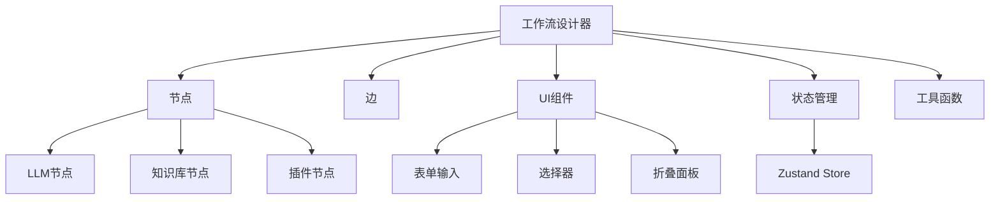

**图示来源**
- [nodes/index.tsx](file://console/frontend/src/components/workflow/nodes/index.tsx)
- [edges/index.tsx](file://console/frontend/src/components/workflow/edges/index.tsx)
- [ui/index.tsx](file://console/frontend/src/components/workflow/ui/index.tsx)
- [store/use-flow-store.ts](file://console/frontend/src/components/workflow/store/use-flow-store.ts)

**节来源**
- [console/frontend/src/components/workflow](file://console/frontend/src/components/workflow)

## 核心组件
工作流设计器的核心组件包括节点系统、边系统、状态管理系统和UI组件库。节点系统支持多种类型的节点渲染，边系统处理节点间的连接逻辑，状态管理系统使用Zustand管理画布状态，UI组件库基于Ant Design构建统一的界面风格。

**节来源**
- [index.tsx](file://console/frontend/src/components/workflow/nodes/index.tsx)
- [use-flow-store.ts](file://console/frontend/src/components/workflow/store/use-flow-store.ts)
- [edges/index.tsx](file://console/frontend/src/components/workflow/edges/index.tsx)

## 架构概述
工作流设计器采用模块化架构，主要由以下几个部分组成：React Flow集成层、节点渲染系统、状态管理层、UI组件层和工具函数层。各层之间通过清晰的接口进行通信，确保系统的可维护性和扩展性。

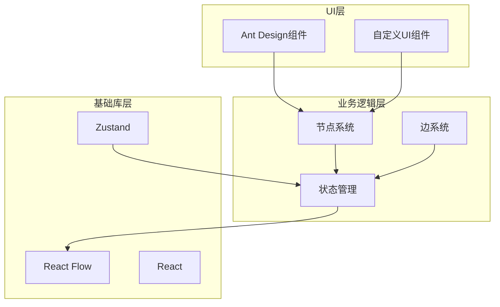

**图示来源**
- [use-flow-store.ts](file://console/frontend/src/components/workflow/store/use-flow-store.ts)
- [zustand/flow/index.ts](file://console/frontend/src/components/workflow/types/zustand/flow/index.ts)
- [ui/index.tsx](file://console/frontend/src/components/workflow/ui/index.tsx)

## 详细组件分析

### 节点系统分析
工作流设计器的节点系统基于React Flow实现，每个节点都是一个可复用的React组件，支持自定义渲染和交互。

#### 节点基础结构
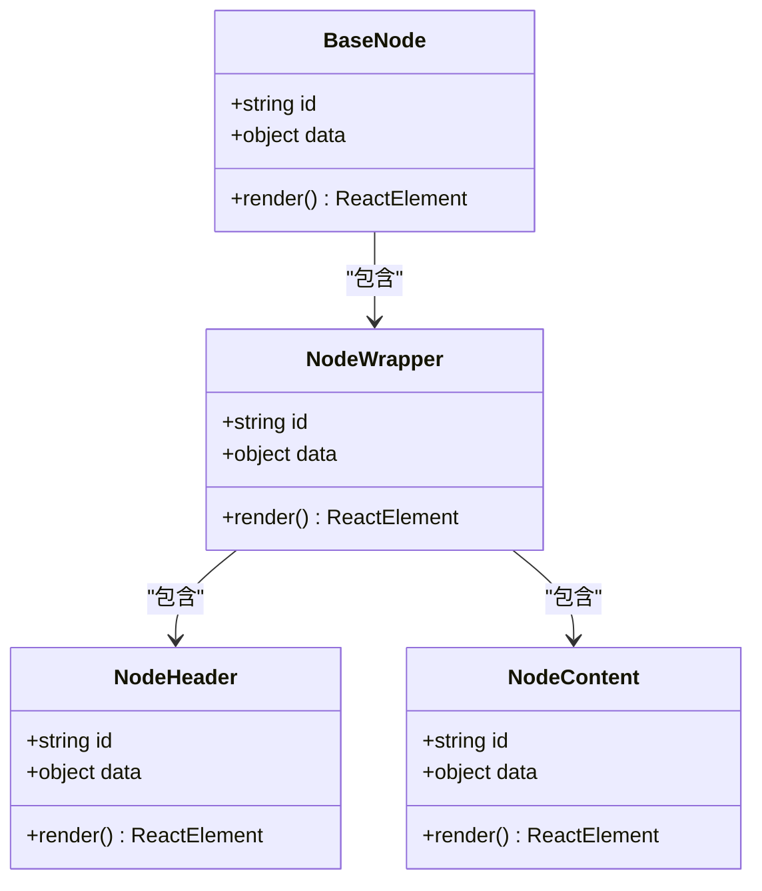

**图示来源**
- [index.tsx](file://console/frontend/src/components/workflow/nodes/index.tsx)

**节来源**
- [index.tsx](file://console/frontend/src/components/workflow/nodes/index.tsx)

### React Flow集成分析
工作流设计器深度集成了React Flow库，实现了自定义节点渲染、连接线样式和画布交互等功能。

#### 集成架构
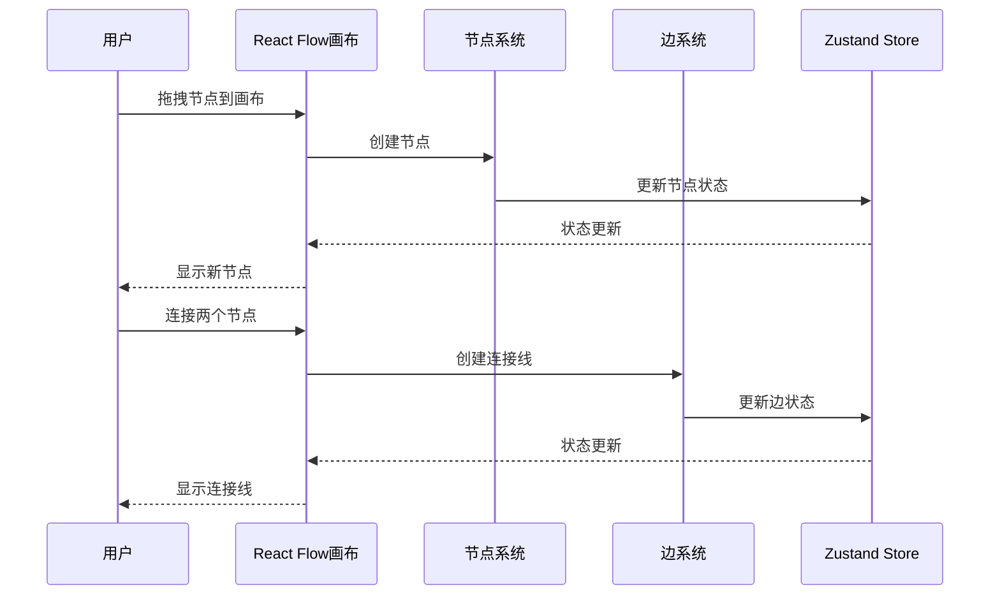

**图示来源**
- [use-flow-store.ts](file://console/frontend/src/components/workflow/store/use-flow-store.ts)
- [edges/index.tsx](file://console/frontend/src/components/workflow/edges/index.tsx)

**节来源**
- [use-flow-store.ts](file://console/frontend/src/components/workflow/store/use-flow-store.ts)
- [edges/index.tsx](file://console/frontend/src/components/workflow/edges/index.tsx)

### 节点类型分析
工作流设计器支持多种节点类型，每种类型都有独特的视觉表示和交互模式。

#### LLM节点分析
LLM节点用于集成大语言模型，提供系统提示和用户提示的配置界面。

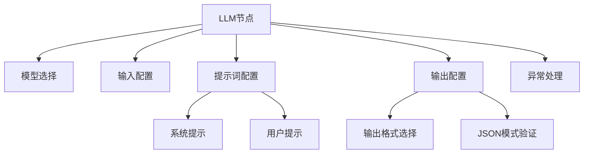

**图示来源**
- [llm/index.tsx](file://console/frontend/src/components/workflow/nodes/llm/index.tsx)

**节来源**
- [llm/index.tsx](file://console/frontend/src/components/workflow/nodes/llm/index.tsx)

#### 知识库节点分析
知识库节点用于连接外部知识库，支持知识库的选择和参数配置。

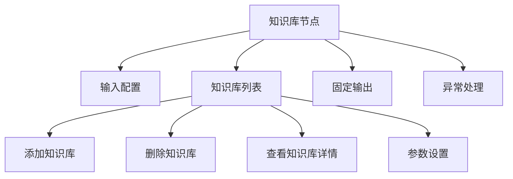

**图示来源**
- [knowledge/index.tsx](file://console/frontend/src/components/workflow/nodes/knowledge/index.tsx)

**节来源**
- [knowledge/index.tsx](file://console/frontend/src/components/workflow/nodes/knowledge/index.tsx)

#### 插件节点分析
插件节点用于集成各种插件功能，提供统一的输入输出配置界面。

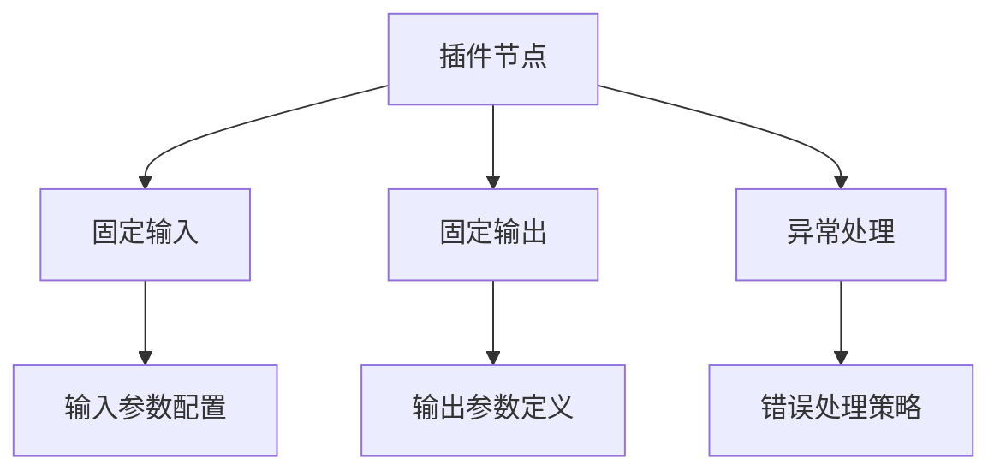

**图示来源**
- [plugin/index.tsx](file://console/frontend/src/components/workflow/nodes/plugin/index.tsx)

**节来源**
- [plugin/index.tsx](file://console/frontend/src/components/workflow/nodes/plugin/index.tsx)

### 节点配置面板分析
节点配置面板采用统一的布局结构，包含多个功能区域，提供一致的用户体验。

#### 面板布局
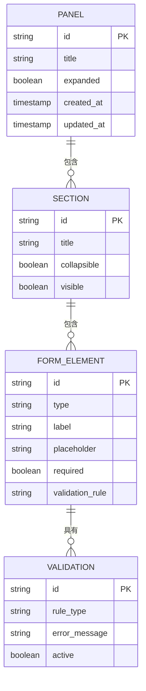

**图示来源**
- [llm/index.tsx](file://console/frontend/src/components/workflow/nodes/llm/index.tsx)
- [knowledge/index.tsx](file://console/frontend/src/components/workflow/nodes/knowledge/index.tsx)

**节来源**
- [llm/index.tsx](file://console/frontend/src/components/workflow/nodes/llm/index.tsx)
- [knowledge/index.tsx](file://console/frontend/src/components/workflow/nodes/knowledge/index.tsx)

### UI组件库分析
UI组件库基于Ant Design构建，提供了表单输入、选择器、折叠面板等常用组件。

#### 组件关系
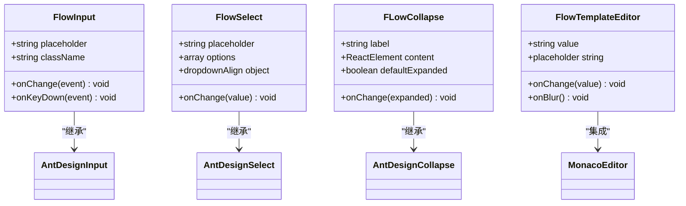

**图示来源**
- [ui/index.tsx](file://console/frontend/src/components/workflow/ui/index.tsx)
- [flow-input.tsx](file://console/frontend/src/components/workflow/ui/flow-input.tsx)
- [flow-select.tsx](file://console/frontend/src/components/workflow/ui/flow-select.tsx)

**节来源**
- [ui/index.tsx](file://console/frontend/src/components/workflow/ui/index.tsx)
- [flow-input.tsx](file://console/frontend/src/components/workflow/ui/flow-input.tsx)
- [flow-select.tsx](file://console/frontend/src/components/workflow/ui/flow-select.tsx)

### 样式系统分析
样式系统采用CSS模块化设计，支持主题定制和响应式布局。

#### 样式架构
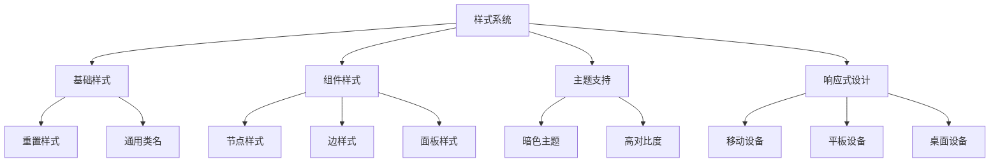

**图示来源**
- [flow.scss](file://console/frontend/src/styles/flow.scss)

**节来源**
- [flow.scss](file://console/frontend/src/styles/flow.scss)

## 依赖分析
工作流设计器依赖多个第三方库和内部模块，形成了复杂的依赖关系网络。

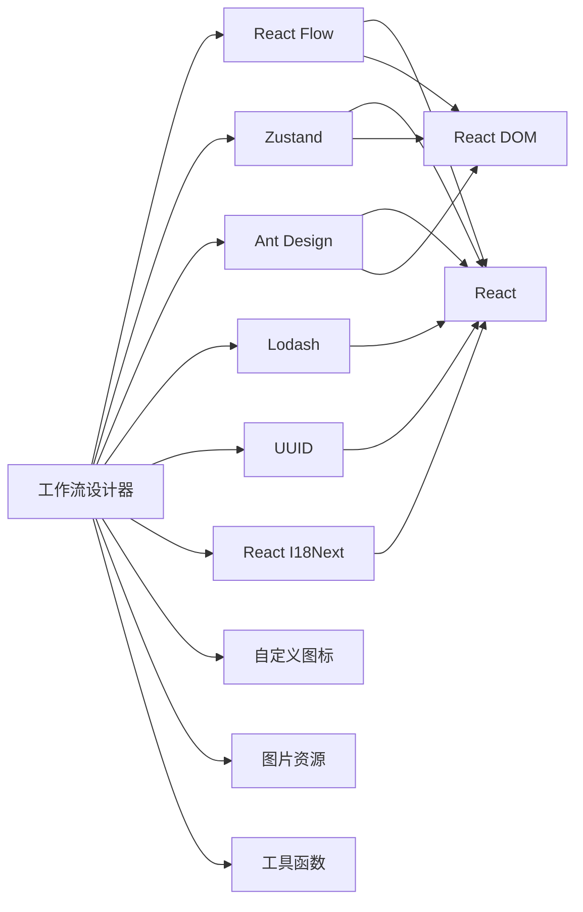

**图示来源**
- [package-lock.json](file://console/frontend/package-lock.json)
- [use-flow-store.ts](file://console/frontend/src/components/workflow/store/use-flow-store.ts)

**节来源**
- [package-lock.json](file://console/frontend/package-lock.json)
- [use-flow-store.ts](file://console/frontend/src/components/workflow/store/use-flow-store.ts)

## 性能考虑
工作流设计器在性能方面进行了多项优化，包括组件记忆化、状态更新优化和事件处理优化。

- 使用`React.memo`对节点组件进行记忆化，避免不必要的重新渲染
- 通过Zustand的状态选择器减少组件重渲染范围
- 在输入组件中阻止事件冒泡，提高交互性能
- 对复杂计算进行节流和防抖处理
- 使用虚拟滚动技术处理大量节点的渲染

## 故障排除指南
### 常见问题及解决方案

1. **节点无法拖拽**
   - 检查是否启用了画布禁用状态
   - 确认React Flow实例是否正确初始化
   - 检查是否有CSS样式冲突

2. **连接线无法创建**
   - 验证源节点和目标节点的连接配置
   - 检查连接回调函数是否正确实现
   - 确认边状态更新逻辑

3. **配置面板不显示**
   - 检查节点数据是否正确传递
   - 验证组件是否正确导入
   - 确认状态管理store是否正常工作

4. **样式丢失**
   - 检查SCSS文件是否正确导入
   - 验证CSS类名是否正确应用
   - 确认主题变量是否正确配置

**节来源**
- [use-flow-store.ts](file://console/frontend/src/components/workflow/store/use-flow-store.ts)
- [nodes/index.tsx](file://console/frontend/src/components/workflow/nodes/index.tsx)
- [edges/index.tsx](file://console/frontend/src/components/workflow/edges/index.tsx)

## 结论
工作流设计器通过集成React Flow库，实现了强大的可视化工作流编辑功能。系统采用模块化设计，各组件职责清晰，易于维护和扩展。通过使用Ant Design组件库和自定义UI组件，提供了统一且美观的用户界面。状态管理采用Zustand，确保了应用状态的一致性和可预测性。整体架构合理，性能优化到位，为用户提供了一个高效、稳定的工作流设计环境。