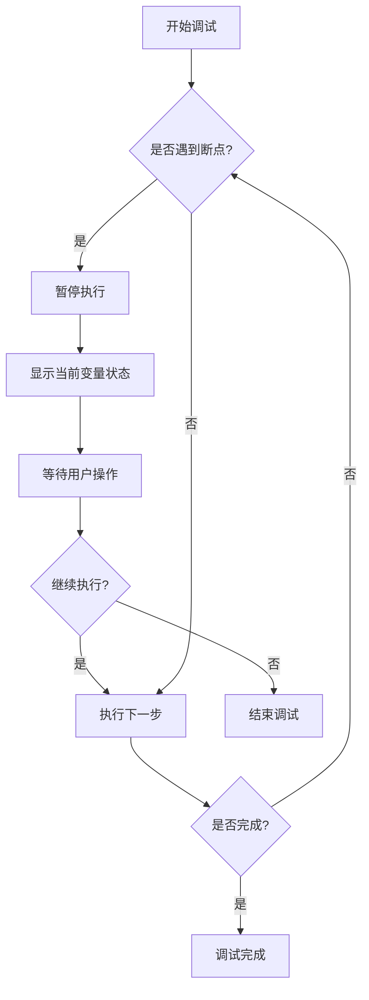
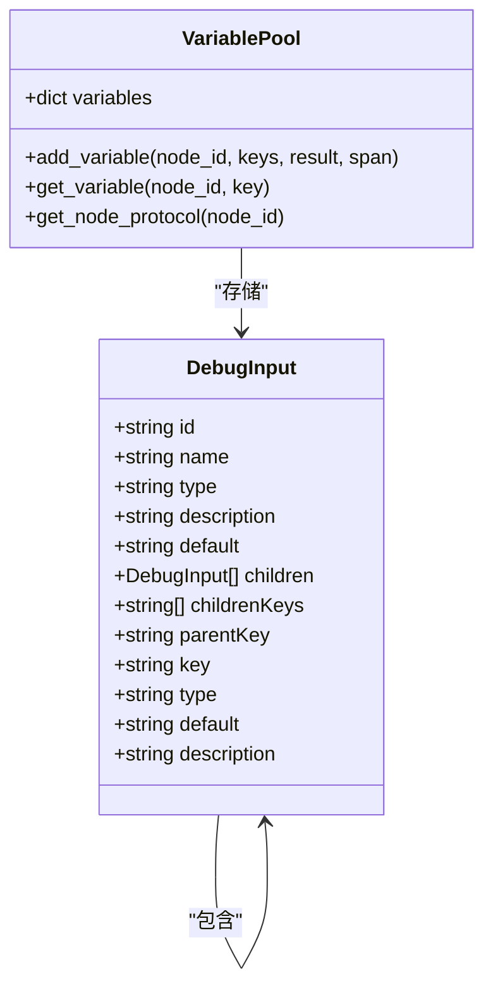
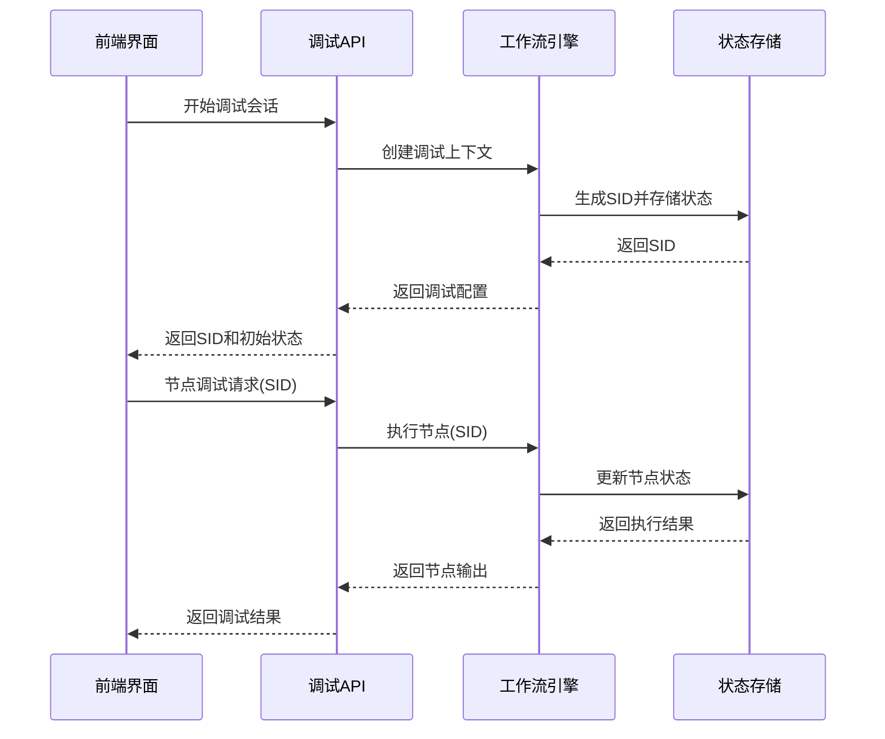
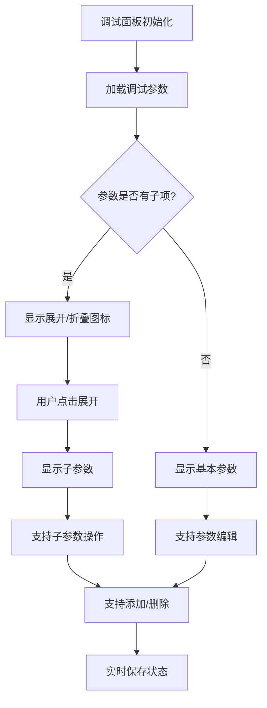
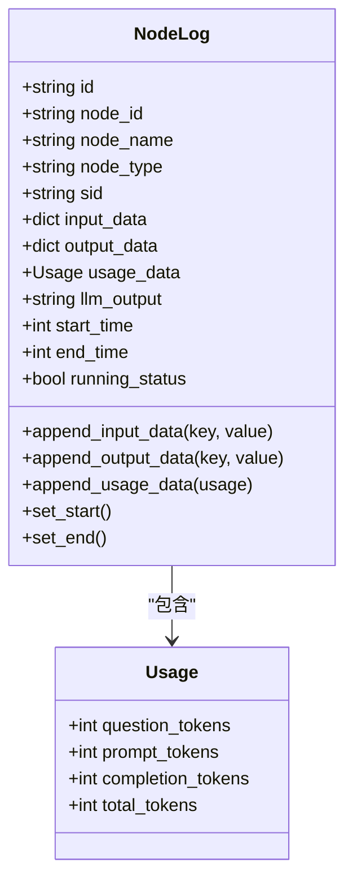
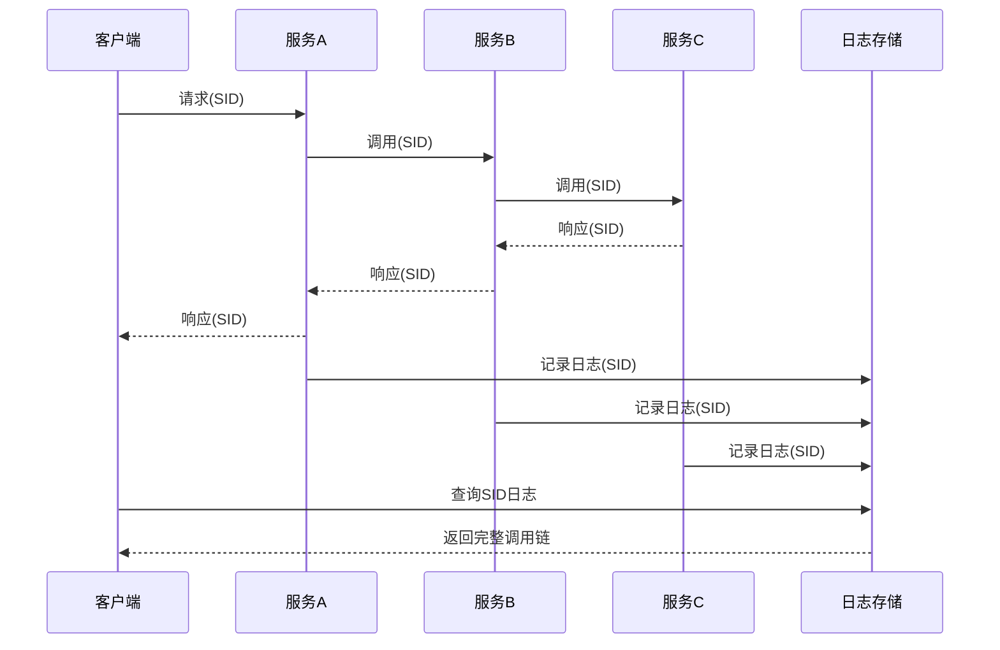

# 工作流调试与监控

<cite>
**本文档引用的文件**  
- [components.ts](file://console/frontend/src/components/workflow/types/nodes/components.ts)
- [debugger-table.tsx](file://console/frontend/src/components/plugin-store/debugger-table.tsx)
- [trace.py](file://core/common/otlp/trace/trace.py)
- [meter.py](file://core/common/otlp/metrics/meter.py)
- [node.py](file://core/workflow/engine/node.py)
- [base.py](file://core/common/otlp/log_trace/base.py)
</cite>

## 目录
1. [简介](#简介)
2. [调试功能使用方法](#调试功能使用方法)
3. [调试API接口设计与实现](#调试api接口设计与实现)
4. [前端调试面板实现原理](#前端调试面板实现原理)
5. [执行轨迹记录与性能分析](#执行轨迹记录与性能分析)
6. [错误诊断与日志追溯](#错误诊断与日志追溯)
7. [常见问题排查与最佳实践](#常见问题排查与最佳实践)

## 简介
本项目提供了一套完整的工作流调试与监控系统，支持单步执行、断点设置、变量查看等调试功能。系统基于OpenTelemetry标准实现分布式追踪，通过SID（Session ID）关联调用链路，提供全面的性能分析和错误诊断能力。前端调试面板与后端执行引擎紧密集成，为用户提供直观的调试体验。

## 调试功能使用方法

### 单步执行与断点设置
系统支持工作流节点的单步执行和断点调试功能。用户可以通过前端界面在特定节点设置断点，系统会在执行到该节点时暂停，允许开发者检查当前状态。



**调试功能核心接口**
- `handleNodeDebug`: 处理节点调试请求
- `nodeDebugExect`: 执行节点调试
- `setOpen`: 控制调试面板开关状态

**Section sources**
- [components.ts](file://console/frontend/src/components/workflow/types/nodes/components.ts#L0-L16)

### 变量查看功能
调试过程中，系统会自动收集每个节点的输入输出变量，并在前端面板中展示。用户可以查看变量的类型、值和描述信息。



**Diagram sources**
- [debugger-table.tsx](file://console/frontend/src/components/plugin-store/debugger-table.tsx#L0-L38)
- [node.py](file://core/workflow/engine/node.py#L0-L799)

## 调试API接口设计与实现

### 调试会话管理
系统通过SID（Session ID）机制管理调试会话，每个调试会话都有唯一的标识符，用于关联分布式调用链。



**Diagram sources**
- [trace.py](file://core/common/otlp/trace/trace.py#L0-L126)
- [node.py](file://core/workflow/engine/node.py#L0-L799)

### 状态同步机制
系统采用实时状态同步机制，确保前端调试面板与后端执行引擎的状态一致。通过WebSocket或长轮询方式，后端将执行状态实时推送到前端。

```python
class NodeExecutionTemplate:
    async def execute(self, **kwargs: Any) -> NodeRunResult:
        span = kwargs.get("span", Span())
        with span.start(f"run_node:{self.node.node_id}") as span_context:
            # 设置日志
            self.node.node_log.sid = span_context.sid
            self.node.node_log.set_start()
            
            # 记录输入输出
            self.gather_node_event_log(result)
            
            # 更新执行状态
            if event_log_trace:
                event_log_trace.add_node_log([self.node.node_log])
```

**Section sources**
- [node.py](file://core/workflow/engine/node.py#L0-L799)

## 前端调试面板实现原理

### 用户体验设计
前端调试面板采用树形结构展示调试参数，支持展开/折叠、添加/删除参数等操作，提供直观的用户交互体验。



**Section sources**
- [debugger-table.tsx](file://console/frontend/src/components/plugin-store/debugger-table.tsx#L36-L83)

### 核心功能实现
调试面板的核心功能包括参数配置、状态管理和交互操作，通过React组件和状态管理实现。

```typescript
const handleExpand = useCallback((record: DebugInput) => {
    setExpandedRowKeys(expandedRowKeys => [...expandedRowKeys, record.id]);
}, []);

const handleCollapse = useCallback((record: DebugInput) => {
    setExpandedRowKeys(expandedRowKeys =>
        expandedRowKeys.filter(id => id !== record.id)
    );
}, []);

const handleAddItem = useCallback(
    (record: DebugInput) => {
        const newData = updateIds(record?.children?.[0] as DebugInput);
        const currentNode = findNodeById(debuggerParamsData, record?.id);
        if (currentNode) {
            currentNode.children?.push(newData);
        }
        setDebuggerParamsData(cloneDeep(debuggerParamsData));
    },
    [debuggerParamsData, setDebuggerParamsData]
);
```

**Section sources**
- [debugger-table.tsx](file://console/frontend/src/components/plugin-store/debugger-table.tsx#L36-L83)

## 执行轨迹记录与性能分析

### 轨迹记录机制
系统通过OpenTelemetry框架记录完整的执行轨迹，包括每个节点的执行时间、输入输出和资源消耗。



**Diagram sources**
- [base.py](file://core/common/otlp/log_trace/base.py#L0-L8)
- [node.py](file://core/workflow/engine/node.py#L0-L799)

### 性能分析工具
系统提供多维度的性能分析指标，包括执行时间、令牌消耗和错误率等。

```python
class Meter:
    def in_histogram(self, lables: Optional[dict] = None) -> None:
        """
        上报耗时
        :param lables: 耗时标签
        :return:
        """
        if self.in_histogram_flag:
            return

        attr = self._get_default_labels()
        if lables:
            attr.update(lables)

        end_time = int(int(round(time.time() * 1000)))
        duration = end_time - self.start_time
        if metric.histogram is None:
            raise Exception("histogram is None")
        metric.histogram.record(duration, attr)
```

**Section sources**
- [meter.py](file://core/common/otlp/metrics/meter.py#L0-L131)

## 错误诊断与日志追溯

### 分布式调用链追踪
系统通过SID机制关联分布式调用链，实现跨服务的错误追踪和诊断。



**Diagram sources**
- [trace.py](file://core/common/otlp/trace/trace.py#L0-L126)

### 错误诊断流程
系统提供完整的错误诊断流程，从错误捕获到日志分析，帮助开发者快速定位问题。

```python
def _handle_failed_result(self, result: NodeRunResult, span_context: Span) -> None:
    """处理失败的执行结果"""
    if not result.error:
        raise CustomException(
            CodeEnum.NODE_RUN_ERROR,
            cause_error=f"node {result.node_id} run failed, not error",
        )

    self.node.node_log.running_status = False
    span_context.add_error_event(
        f"node {result.node_id} run failed, "
        f"err code {result.error.code}, err reason: {result.error}"
    )
    raise result.error
```

**Section sources**
- [node.py](file://core/workflow/engine/node.py#L0-L799)

## 常见问题排查与最佳实践

### 常见问题排查
| 问题现象 | 可能原因 | 解决方案 |
|--------|--------|--------|
| 调试会话无法启动 | SID生成失败 | 检查网络配置和IP地址 |
| 节点执行超时 | 资源不足或死循环 | 优化算法，增加超时设置 |
| 变量值不正确 | 数据类型不匹配 | 检查输入输出类型定义 |
| 调用链断裂 | SID传递失败 | 检查服务间调用的上下文传递 |

### 最佳实践
1. **合理设置断点**：在关键业务逻辑节点设置断点，避免在高频调用节点设置断点影响性能
2. **监控资源消耗**：关注令牌消耗和执行时间，优化高消耗节点
3. **完善错误处理**：为每个节点配置适当的错误处理策略和重试机制
4. **定期清理日志**：设置日志保留策略，避免存储空间不足
5. **使用标准化SID**：确保SID在分布式系统中的一致性和唯一性

**Section sources**
- [trace.py](file://core/common/otlp/trace/trace.py#L0-L126)
- [meter.py](file://core/common/otlp/metrics/meter.py#L0-L131)
- [node.py](file://core/workflow/engine/node.py#L0-L799)