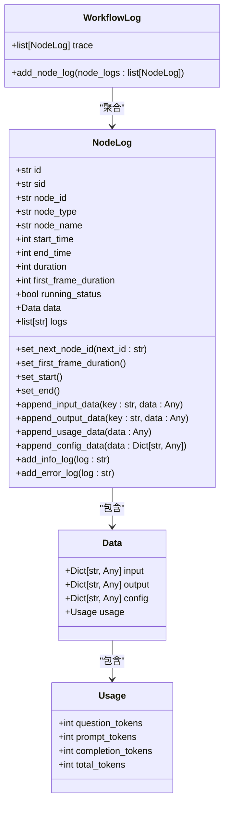
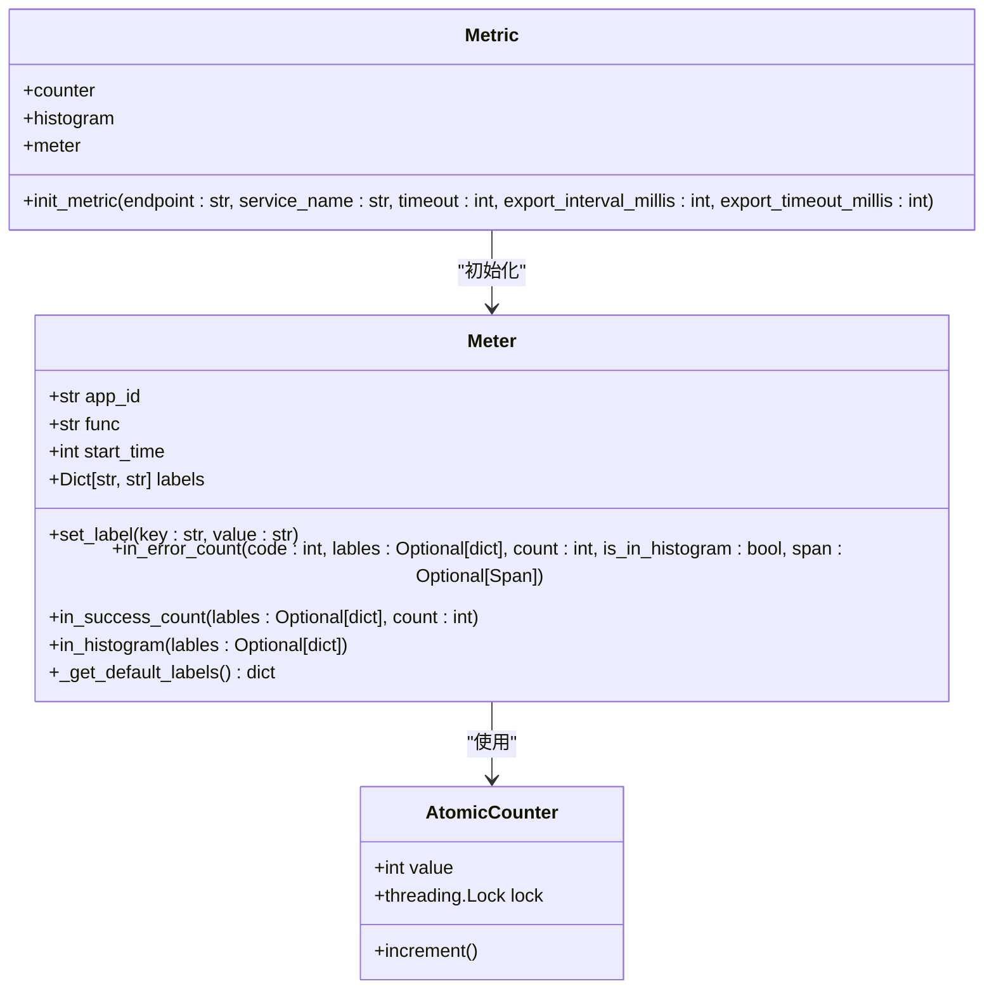
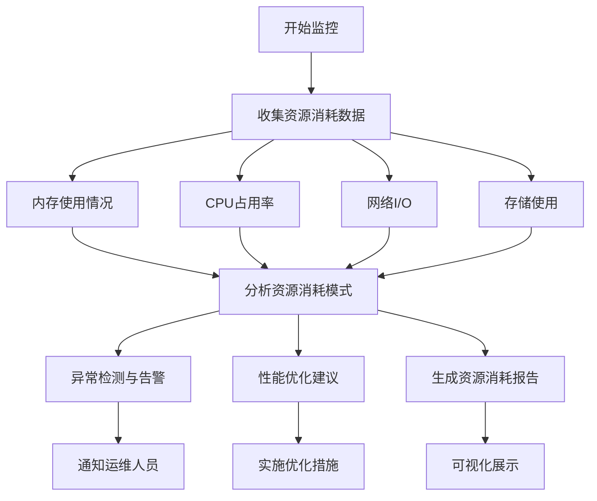
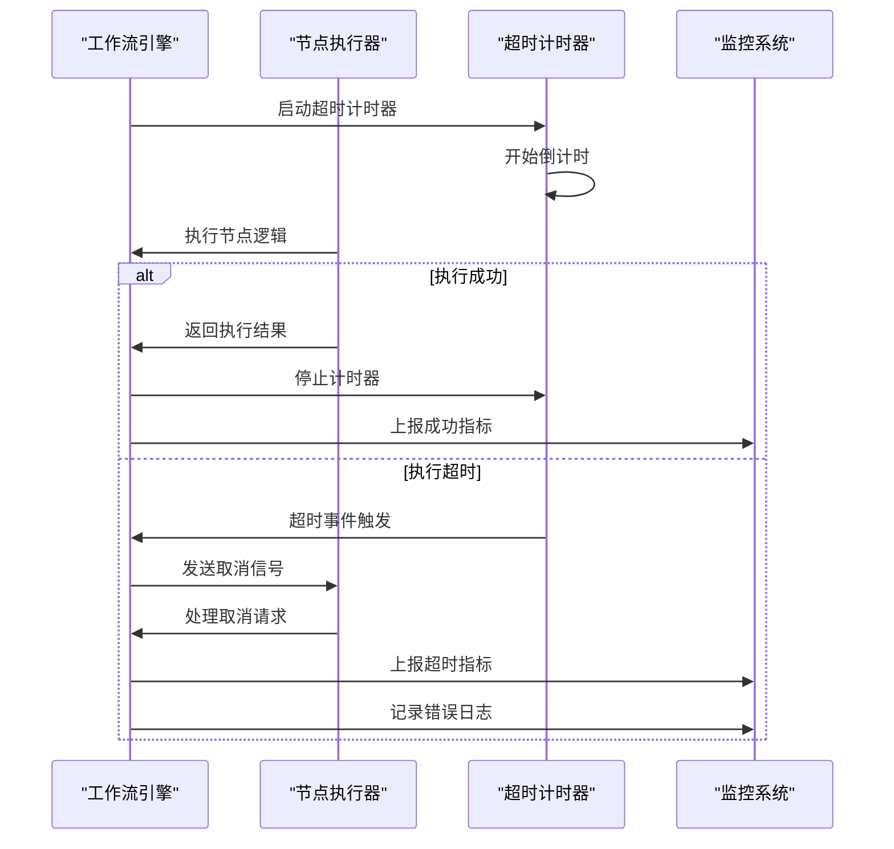
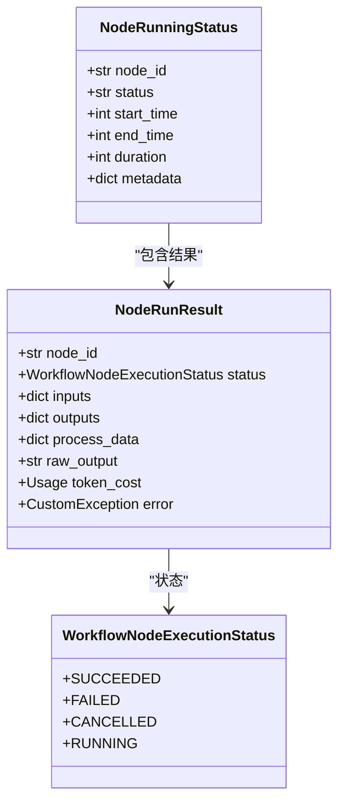
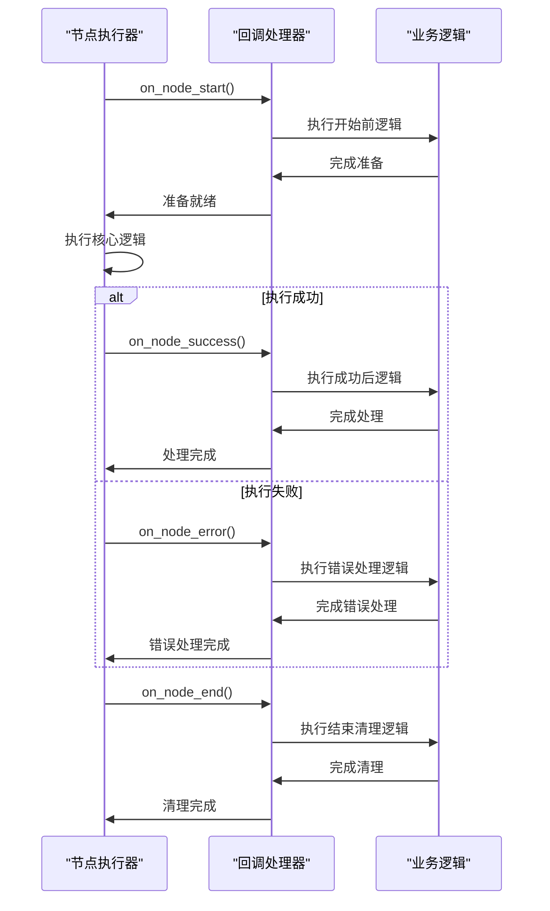
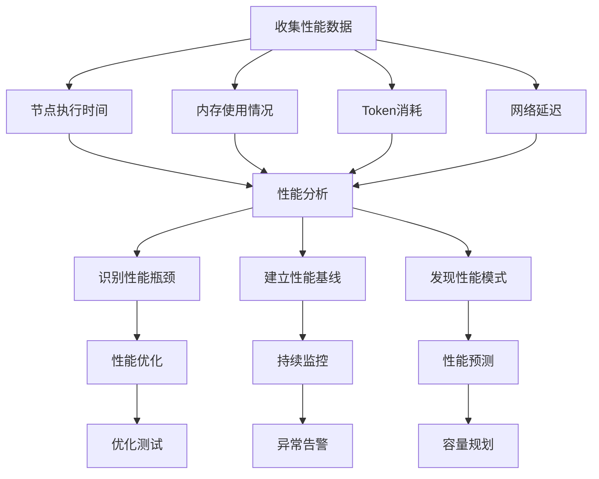
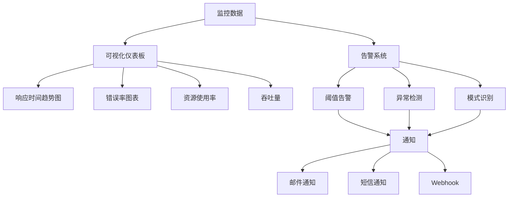
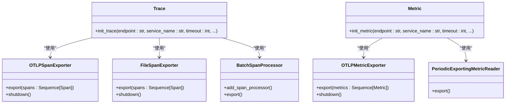
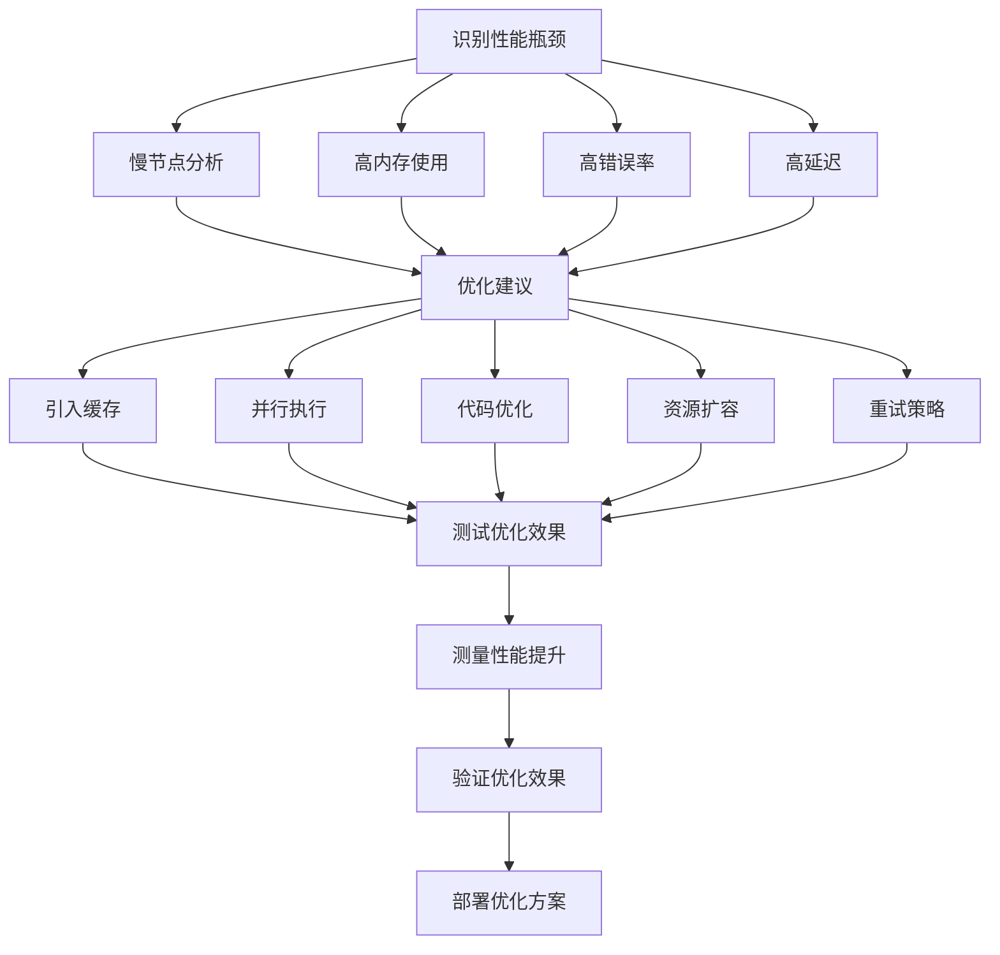

# 执行监控与性能分析

<cite>
**本文档引用的文件**
- [base.py](file://core/common/otlp/log_trace/base.py)
- [meter.py](file://core/common/otlp/metrics/meter.py)
- [metric.py](file://core/common/otlp/metrics/metric.py)
- [trace.py](file://core/common/otlp/trace/trace.py)
- [node_log.py](file://core/common/otlp/log_trace/node_log.py)
- [workflow_log.py](file://core/common/otlp/log_trace/workflow_log.py)
- [node.py](file://core/workflow/engine/node.py)
- [span.py](file://core/common/otlp/trace/span.py)
</cite>

## 目录
1. [引言](#引言)
2. [执行轨迹记录](#执行轨迹记录)
3. [性能指标采集](#性能指标采集)
4. [资源消耗监控](#资源消耗监控)
5. [超时控制机制](#超时控制机制)
6. [执行状态跟踪](#执行状态跟踪)
7. [回调处理程序](#回调处理程序)
8. [性能数据收集与分析](#性能数据收集与分析)
9. [监控数据可视化与告警](#监控数据可视化与告警)
10. [OTLP协议数据导出](#otlp协议数据导出)
11. [性能瓶颈识别与优化](#性能瓶颈识别与优化)

## 引言
本文档全面介绍astron-agent项目中工作流执行的监控与性能分析功能。系统通过OpenTelemetry(OTLP)协议实现了完整的可观测性解决方案，包括执行轨迹记录、性能指标采集和资源消耗监控。文档详细描述了超时控制、执行状态跟踪和回调处理等核心机制，以及如何收集和分析工作流执行的性能数据。同时，本文档还提供了监控数据的可视化展示方法、告警配置指南，以及与外部监控系统的集成方案。

## 执行轨迹记录
系统通过OpenTelemetry框架实现了完整的分布式追踪功能，能够记录工作流执行的完整轨迹。每个工作流执行都会生成一个唯一的会话ID(SID)，用于关联所有相关的追踪数据。

**图表来源**
- [node_log.py](file://core/common/otlp/log_trace/node_log.py#L0-L157)
- [workflow_log.py](file://core/common/otlp/log_trace/workflow_log.py#L0-L28)
- [base.py](file://core/common/otlp/log_trace/base.py#L0-L8)

**本节来源**
- [node_log.py](file://core/common/otlp/log_trace/node_log.py#L0-L157)
- [workflow_log.py](file://core/common/otlp/log_trace/workflow_log.py#L0-L28)

## 性能指标采集
系统实现了全面的性能指标采集功能，通过Meter类和Metric模块收集和上报各种性能数据。性能指标包括请求计数、耗时统计、错误率等关键性能指标。

**图表来源**
- [meter.py](file://core/common/otlp/metrics/meter.py#L0-L131)
- [metric.py](file://core/common/otlp/metrics/metric.py#L0-L82)

**本节来源**
- [meter.py](file://core/common/otlp/metrics/meter.py#L0-L131)
- [metric.py](file://core/common/otlp/metrics/metric.py#L0-L82)

## 资源消耗监控
系统通过OTLP协议监控工作流执行过程中的资源消耗情况，包括内存使用、CPU占用和网络I/O等指标。资源消耗数据与执行轨迹和性能指标关联，便于进行综合分析。

**图表来源**
- [node_log.py](file://core/common/otlp/log_trace/node_log.py#L0-L157)
- [workflow_log.py](file://core/common/otlp/log_trace/workflow_log.py#L0-L28)

**本节来源**
- [node_log.py](file://core/common/otlp/log_trace/node_log.py#L0-L157)
- [workflow_log.py](file://core/common/otlp/log_trace/workflow_log.py#L0-L28)

## 超时控制机制
系统实现了精细化的超时控制机制，确保工作流执行不会无限期挂起。超时控制在多个层面实现，包括节点级超时、工作流级超时和外部服务调用超时。

**图表来源**
- [node.py](file://core/workflow/engine/node.py#L0-L799)
- [span.py](file://core/common/otlp/trace/span.py)

**本节来源**
- [node.py](file://core/workflow/engine/node.py#L0-L799)

## 执行状态跟踪
系统通过NodeExecutionTemplate类实现了工作流执行状态的全面跟踪。每个节点的执行状态都会被记录，包括开始时间、结束时间、执行时长、首帧响应时间等关键指标。

**图表来源**
- [node.py](file://core/workflow/engine/node.py#L0-L799)
- [node_log.py](file://core/common/otlp/log_trace/node_log.py#L0-L157)

**本节来源**
- [node.py](file://core/workflow/engine/node.py#L0-L799)

## 回调处理程序
系统实现了灵活的回调处理机制，允许在节点执行的不同阶段执行自定义逻辑。回调处理程序支持成功回调、失败回调和结束回调，便于实现复杂的业务逻辑。

**图表来源**
- [node.py](file://core/workflow/engine/node.py#L0-L799)

**本节来源**
- [node.py](file://core/workflow/engine/node.py#L0-L799)

## 性能数据收集与分析
系统通过集成的监控框架收集工作流执行的性能数据，包括节点执行时间、内存使用情况、token消耗等指标。这些数据被用于分析性能瓶颈和优化系统性能。

**图表来源**
- [meter.py](file://core/common/otlp/metrics/meter.py#L0-L131)
- [node_log.py](file://core/common/otlp/log_trace/node_log.py#L0-L157)

**本节来源**
- [meter.py](file://core/common/otlp/metrics/meter.py#L0-L131)
- [node_log.py](file://core/common/otlp/log_trace/node_log.py#L0-L157)

## 监控数据可视化与告警
系统支持将监控数据可视化展示，并配置告警规则。通过集成的可视化工具，可以直观地查看工作流执行的性能指标和资源消耗情况。

**图表来源**
- [node_log.py](file://core/common/otlp/log_trace/node_log.py#L0-L157)
- [workflow_log.py](file://core/common/otlp/log_trace/workflow_log.py#L0-L28)

**本节来源**
- [node_log.py](file://core/common/otlp/log_trace/node_log.py#L0-L157)
- [workflow_log.py](file://core/common/otlp/log_trace/workflow_log.py#L0-L28)

## OTLP协议数据导出
系统通过OTLP(OpenTelemetry Protocol)协议将监控数据导出到外部监控系统。支持gRPC和HTTP两种传输方式，确保与各种监控后端的兼容性。

**图表来源**
- [trace.py](file://core/common/otlp/trace/trace.py#L0-L126)
- [metric.py](file://core/common/otlp/metrics/metric.py#L0-L82)

**本节来源**
- [trace.py](file://core/common/otlp/trace/trace.py#L0-L126)
- [metric.py](file://core/common/otlp/metrics/metric.py#L0-L82)

## 性能瓶颈识别与优化
系统通过综合分析执行轨迹、性能指标和资源消耗数据，识别工作流执行中的性能瓶颈，并提供优化建议。

**图表来源**
- [meter.py](file://core/common/otlp/metrics/meter.py#L0-L131)
- [node_log.py](file://core/common/otlp/log_trace/node_log.py#L0-L157)

**本节来源**
- [meter.py](file://core/common/otlp/metrics/meter.py#L0-L131)
- [node_log.py](file://core/common/otlp/log_trace/node_log.py#L0-L157)