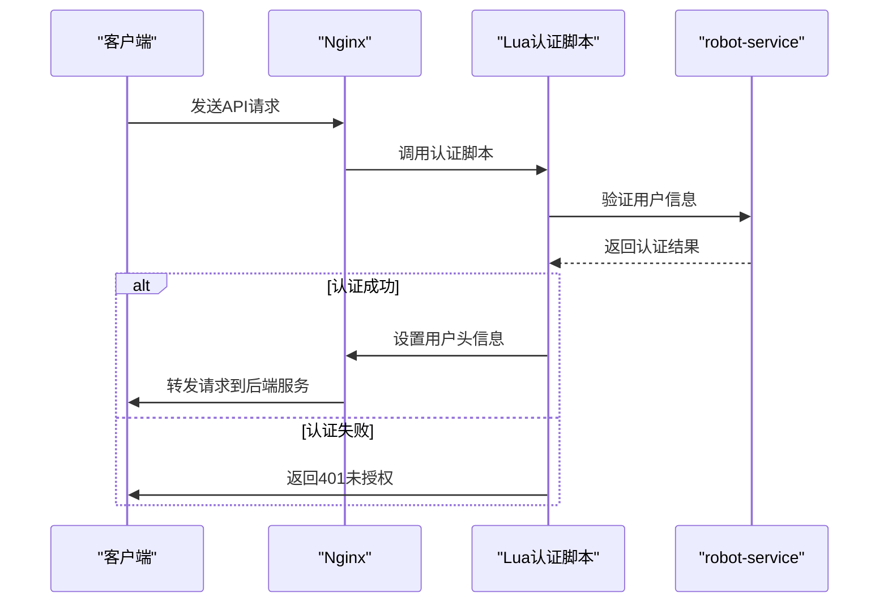
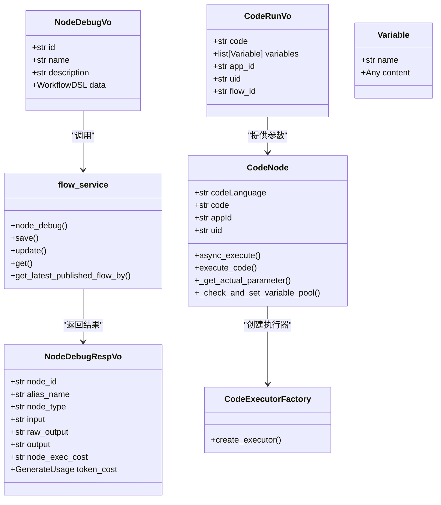
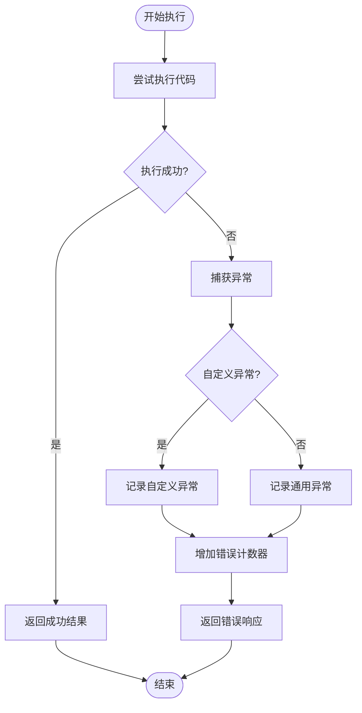
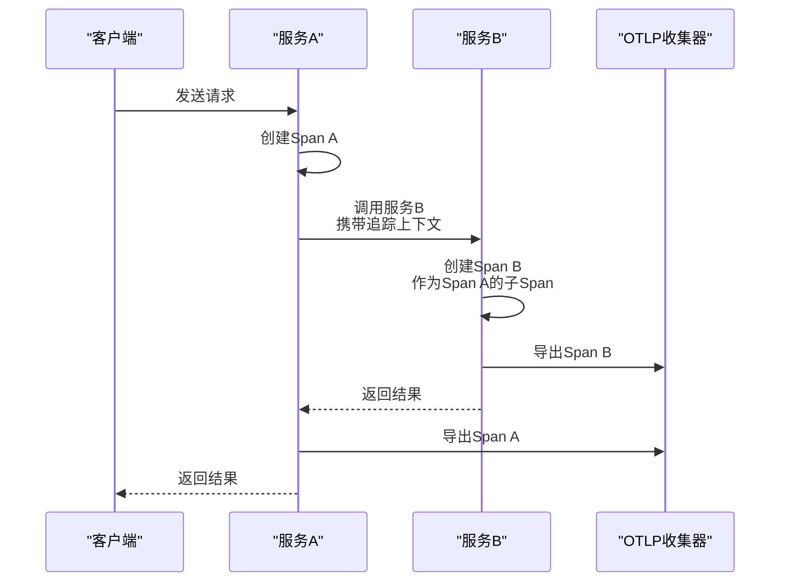

# 调试API接口设计

<cite>
**本文档引用的文件**
- [node_debug.py](file://core/workflow/api/v1/chat/node_debug.py)
- [debug.py](file://core/workflow/api/v1/chat/debug.py)
- [node_debug_vo.py](file://core/workflow/domain/entities/node_debug_vo.py)
- [code_node.py](file://core/workflow/engine/nodes/code/code_node.py)
- [flow_service.py](file://core/workflow/service/flow_service.py)
- [trace.py](file://core/common/otlp/trace/trace.py)
- [trace.py](file://core/workflow/extensions/otlp/trace/trace.py)
- [node_trace_patch.py](file://core/agent/api/schemas/node_trace_patch.py)
</cite>

## 目录
1. [引言](#引言)
2. [调试API设计与实现](#调试api设计与实现)
3. [HTTP方法与URL模式](#http方法与url模式)
4. [请求/响应数据结构](#请求响应数据结构)
5. [认证机制](#认证机制)
6. [调试API与工作流引擎交互](#调试api与工作流引擎交互)
7. [API调用示例](#api调用示例)
8. [错误处理策略](#错误处理策略)
9. [调试数据序列化与反序列化](#调试数据序列化与反序列化)
10. [分布式调用链追踪](#分布式调用链追踪)
11. [API性能优化建议](#api性能优化建议)
12. [安全考虑](#安全考虑)

## 引言
本文档全面介绍astron-agent项目中调试API的设计与实现。调试API为工作流开发提供了关键的调试功能，包括调试会话创建、节点调试和状态查询等接口。通过这些API，开发者可以对工作流中的节点进行单步执行、状态同步和结果验证，极大地提高了开发效率和调试体验。

## 调试API设计与实现
调试API的设计基于OpenTelemetry标准，实现了完整的分布式追踪能力。API主要分为两类：节点调试API和聊天调试API，分别用于单个节点的调试和完整工作流的调试。

节点调试API允许开发者对工作流中的特定节点进行独立调试，而聊天调试API则提供了完整的聊天会话调试功能，支持流式响应和会话恢复。这些API通过与工作流引擎的紧密集成，实现了单步执行和状态同步功能。

**Section sources**
- [node_debug.py](file://core/workflow/api/v1/chat/node_debug.py)
- [debug.py](file://core/workflow/api/v1/chat/debug.py)

## HTTP方法与URL模式
调试API使用标准的HTTP方法和RESTful URL模式，确保了接口的一致性和易用性。

### 节点调试API
- `POST /api/v1/chat/node/debug` - 调试工作流中的节点
- `POST /api/v1/chat/run` 和 `POST /api/v1/chat/code/run` - 执行代码节点代码

### 聊天调试API
- `POST /api/v1/chat/debug/chat/completions` - 处理调试聊天完成
- `POST /api/v1/chat/debug/resume` - 恢复调试聊天事件

这些URL模式遵循一致的命名约定，以`/api/v1/chat/`为前缀，便于识别和管理。

**Section sources**
- [node_debug.py](file://core/workflow/api/v1/chat/node_debug.py)
- [debug.py](file://core/workflow/api/v1/chat/debug.py)

## 请求/响应数据结构
调试API使用Pydantic模型定义请求和响应数据结构，确保了数据的类型安全和验证。

### 节点调试请求
`NodeDebugVo`类定义了节点调试的请求数据结构，包含：
- `id`: 工作流ID
- `name`: 工作流名称
- `description`: 工作流描述
- `data`: 节点DSL数据

### 代码执行请求
`CodeRunVo`类定义了代码节点执行的请求数据结构，包含：
- `code`: 要执行的用户代码
- `variables`: 函数参数列表
- `app_id`: 应用程序ID
- `uid`: 用户ID
- `flow_id`: 工作流ID

### 节点调试响应
`NodeDebugRespVo`类定义了节点调试的响应数据结构，包含：
- `node_id`: 节点标识符
- `alias_name`: 节点别名
- `node_type`: 节点类型
- `input`: 输入数据
- `raw_output`: 原始输出数据
- `output`: 处理后的输出数据
- `node_exec_cost`: 节点执行成本
- `token_cost`: 令牌使用成本信息

**Section sources**
- [node_debug_vo.py](file://core/workflow/domain/entities/node_debug_vo.py)

## 认证机制
调试API的认证机制通过Nginx配置和Lua脚本实现，确保了API的安全访问。

在Nginx配置中，多个API路由都使用了`access_by_lua_file lua/auth_handler.lua`来调用外部Lua认证脚本。这种设计将认证逻辑与业务逻辑分离，提高了系统的可维护性。

认证流程包括：
1. 通过Lua脚本验证请求的认证信息
2. 调用robot-service进行用户认证
3. 如果认证成功，设置`user_id`和`user-info`请求头
4. 如果认证失败，返回相应的错误状态码

这种分层认证机制确保了只有经过验证的用户才能访问调试API。



**Diagram sources**
- [auth_handler.lua](file://docker/astronAgent/astronRPA/volumes/nginx/lua/auth_handler.lua)
- [default.conf](file://docker/astronAgent/astronRPA/volumes/nginx/default.conf)

## 调试API与工作流引擎交互
调试API与工作流引擎通过`flow_service`模块进行交互，实现了单步执行和状态同步功能。

当接收到节点调试请求时，API会调用`flow_service.node_debug`方法，该方法负责：
1. 验证节点类型
2. 创建调试上下文
3. 执行节点逻辑
4. 收集执行结果和性能指标

对于代码节点的执行，系统使用`CodeNode`类来封装执行逻辑。`CodeNode`通过`CodeExecutorFactory`创建适当的代码执行器，并在安全的环境中执行用户代码。



**Diagram sources**
- [node_debug.py](file://core/workflow/api/v1/chat/node_debug.py)
- [code_node.py](file://core/workflow/engine/nodes/code/code_node.py)
- [flow_service.py](file://core/workflow/service/flow_service.py)

**Section sources**
- [node_debug.py](file://core/workflow/api/v1/chat/node_debug.py)
- [code_node.py](file://core/workflow/engine/nodes/code/code_node.py)
- [flow_service.py](file://core/workflow/service/flow_service.py)

## API调用示例
以下是调试API的调用示例：

### 节点调试调用
```json
POST /api/v1/chat/node/debug
Content-Type: application/json

{
  "id": "workflow-123",
  "name": "测试工作流",
  "description": "用于调试的测试工作流",
  "data": {
    "nodes": [
      {
        "id": "node-456",
        "data": {
          "nodeParam": {
            "code": "def main(name):\n    return f'Hello {name}'",
            "variables": [
              {
                "name": "name",
                "content": "World"
              }
            ]
          }
        }
      }
    ]
  }
}
```

### 代码执行调用
```json
POST /api/v1/chat/code/run
Content-Type: application/json

{
  "code": "def main(a, b):\n    return a + b",
  "variables": [
    {
      "name": "a",
      "content": 5
    },
    {
      "name": "b",
      "content": 3
    }
  ],
  "app_id": "app-789",
  "uid": "user-101"
}
```

**Section sources**
- [node_debug.py](file://core/workflow/api/v1/chat/node_debug.py)

## 错误处理策略
调试API实现了全面的错误处理策略，确保了系统的稳定性和可维护性。

### 异常分类
系统定义了多种异常类型，包括：
- `CustomException`: 自定义业务异常
- `CodeEnum`: 代码执行相关的错误码
- `NODE_DEBUG_ERROR`: 节点调试错误

### 错误处理流程
当发生异常时，系统会：
1. 记录异常到追踪系统
2. 增加相应的错误计数器
3. 返回标准化的错误响应



**Diagram sources**
- [node_debug.py](file://core/workflow/api/v1/chat/node_debug.py)
- [code_node.py](file://core/workflow/engine/nodes/code/code_node.py)

**Section sources**
- [node_debug.py](file://core/workflow/api/v1/chat/node_debug.py)
- [code_node.py](file://core/workflow/engine/nodes/code/code_node.py)

## 调试数据序列化与反序列化
调试API使用Pydantic模型进行数据的序列化和反序列化，确保了数据的一致性和完整性。

### 序列化过程
当返回响应时，系统会：
1. 将响应对象转换为字典
2. 使用JSON格式序列化
3. 添加`sid`（追踪ID）到响应中

### 反序列化过程
当接收请求时，系统会：
1. 解析JSON请求体
2. 验证数据类型和约束
3. 创建相应的Pydantic模型实例

这种基于Pydantic的序列化/反序列化机制提供了自动的数据验证和类型转换，减少了手动处理JSON的错误。

**Section sources**
- [node_debug_vo.py](file://core/workflow/domain/entities/node_debug_vo.py)

## 分布式调用链追踪
调试API集成了OpenTelemetry标准，实现了完整的分布式调用链追踪功能。

### 追踪实现
系统通过`Span`类和`Meter`类实现追踪和指标收集：
- `Span`: 用于追踪单个操作的执行过程
- `Meter`: 用于收集和导出性能指标

### 追踪上下文传播
系统支持追踪上下文的传播，通过`Trace.inject_context()`和`Trace.extract_context()`方法实现跨服务的追踪上下文传递。



**Diagram sources**
- [trace.py](file://core/common/otlp/trace/trace.py)
- [node_debug.py](file://core/workflow/api/v1/chat/node_debug.py)

**Section sources**
- [trace.py](file://core/common/otlp/trace/trace.py)
- [node_trace_patch.py](file://core/agent/api/schemas/node_trace_patch.py)

## API性能优化建议
为了确保调试API的高性能，建议采取以下优化措施：

### 缓存策略
- 使用Redis缓存频繁访问的工作流定义
- 实现工作流引擎实例的缓存，避免重复初始化
- 设置合理的缓存过期时间

### 异步处理
- 使用异步I/O操作，提高并发处理能力
- 对于耗时的操作，考虑使用消息队列进行异步处理
- 实现流式响应，减少客户端等待时间

### 资源管理
- 限制代码执行的超时时间，防止长时间运行
- 控制并发执行的代码节点数量
- 监控系统资源使用情况，及时发现性能瓶颈

## 安全考虑
调试API的安全性至关重要，需要考虑以下安全措施：

### 认证与授权
- 强制所有调试API调用都需要有效的认证
- 实施基于角色的访问控制（RBAC）
- 限制调试功能仅对开发和测试环境开放

### 代码执行安全
- 在隔离的环境中执行用户代码
- 限制代码可以访问的系统资源
- 实施代码执行的超时机制
- 监控和记录所有代码执行活动

### 数据安全
- 对敏感数据进行加密存储
- 实施严格的输入验证，防止注入攻击
- 限制调试API返回的数据量，防止信息泄露

### 审计与监控
- 记录所有调试API的调用日志
- 实现异常行为的实时监控和告警
- 定期审查调试活动，确保符合安全策略