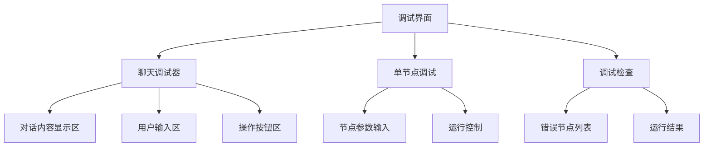
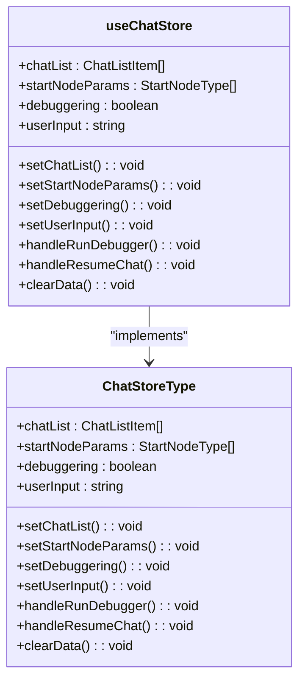
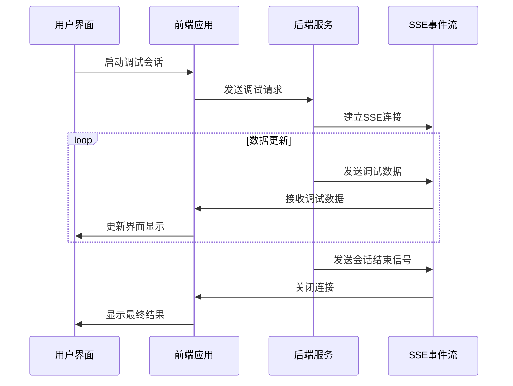
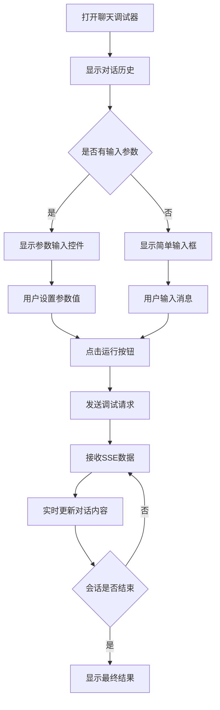

# 调试界面与用户体验

<cite>
**本文档引用的文件**
- [chat-debugger/index.tsx](file://console/frontend/src/components/workflow/drawer/chat-debugger/index.tsx)
- [single-node-debugging/index.tsx](file://console/frontend/src/components/workflow/drawer/single-node-debugging/index.tsx)
- [debugger-check/index.tsx](file://console/frontend/src/components/workflow/drawer/debugger-check/index.tsx)
- [chat-debugger/components/chat-content.tsx](file://console/frontend/src/components/workflow/drawer/chat-debugger/components/chat-content.tsx)
- [chat-debugger/components/chat-input.tsx](file://console/frontend/src/components/workflow/drawer/chat-debugger/components/chat-input.tsx)
- [use-chat-store.ts](file://console/frontend/src/components/workflow/store/use-chat-store.ts)
- [types/index.ts](file://console/frontend/src/components/workflow/types/index.ts)
</cite>

## 目录
1. [引言](#引言)
2. [调试界面布局结构](#调试界面布局结构)
3. [核心调试组件](#核心调试组件)
4. [状态管理机制](#状态管理机制)
5. [实时数据更新与通信](#实时数据更新与通信)
6. [用户交互设计](#用户交互设计)
7. [界面优化与最佳实践](#界面优化与最佳实践)
8. [常见问题解决方案](#常见问题解决方案)
9. [结论](#结论)

## 引言
本文档全面介绍astron-agent项目中前端调试面板的设计与实现。调试界面作为开发工作流的核心工具，为开发者提供了单节点调试、调试检查和聊天调试器等关键功能。通过Zustand状态管理库实现调试会话的状态同步，确保了用户在不同调试场景下的流畅体验。调试界面与后端API通过SSE事件流进行通信，实现了实时数据更新和错误状态的可视化展示。

## 调试界面布局结构
调试界面采用抽屉式布局，从右侧滑出，不影响主工作区的显示。界面分为三个主要组件：聊天调试器、单节点调试和调试检查。聊天调试器用于模拟用户与工作流的完整对话过程，单节点调试允许开发者针对特定节点进行参数测试，调试检查则提供工作流的运行结果和错误诊断信息。

**Diagram sources**
- [chat-debugger/index.tsx](file://console/frontend/src/components/workflow/drawer/chat-debugger/index.tsx)
- [single-node-debugging/index.tsx](file://console/frontend/src/components/workflow/drawer/single-node-debugging/index.tsx)
- [debugger-check/index.tsx](file://console/frontend/src/components/workflow/drawer/debugger-check/index.tsx)

**Section sources**
- [chat-debugger/index.tsx](file://console/frontend/src/components/workflow/drawer/chat-debugger/index.tsx)
- [single-node-debugging/index.tsx](file://console/frontend/src/components/workflow/drawer/single-node-debugging/index.tsx)
- [debugger-check/index.tsx](file://console/frontend/src/components/workflow/drawer/debugger-check/index.tsx)

## 核心调试组件

### 聊天调试器
聊天调试器是调试界面的核心组件，提供了完整的对话模拟功能。它包含对话内容显示区、用户输入区和操作按钮区。对话内容显示区以消息气泡的形式展示用户和工作流的交互过程，支持Markdown渲染和JSON格式化显示。用户输入区根据工作流的输入参数动态生成相应的输入控件。

**Section sources**
- [chat-debugger/index.tsx](file://console/frontend/src/components/workflow/drawer/chat-debugger/index.tsx)
- [chat-debugger/components/chat-content.tsx](file://console/frontend/src/components/workflow/drawer/chat-debugger/components/chat-content.tsx)
- [chat-debugger/components/chat-input.tsx](file://console/frontend/src/components/workflow/drawer/chat-debugger/components/chat-input.tsx)

### 单节点调试
单节点调试组件允许开发者针对特定节点进行参数测试。用户可以为节点的每个输入参数设置测试值，然后运行节点查看输出结果。该组件支持多种数据类型的输入，包括字符串、数字、布尔值、对象和数组，以及文件上传。

**Section sources**
- [single-node-debugging/index.tsx](file://console/frontend/src/components/workflow/drawer/single-node-debugging/index.tsx)

### 调试检查
调试检查组件提供工作流的运行结果和错误诊断信息。当工作流存在错误节点时，该组件会显示错误节点列表，包括节点名称、错误信息和子节点错误信息。用户可以点击错误节点直接跳转到工作流编辑器中的相应位置进行修改。

**Section sources**
- [debugger-check/index.tsx](file://console/frontend/src/components/workflow/drawer/debugger-check/index.tsx)

## 状态管理机制
调试界面使用Zustand状态管理库来管理调试会话的状态。Zustand提供了一个轻量级的状态管理解决方案，通过create函数创建状态存储，实现了状态的集中管理和组件间的共享。

**Diagram sources**
- [use-chat-store.ts](file://console/frontend/src/components/workflow/store/use-chat-store.ts)

**Section sources**
- [use-chat-store.ts](file://console/frontend/src/components/workflow/store/use-chat-store.ts)

## 实时数据更新与通信
调试界面与后端API通过SSE（Server-Sent Events）事件流进行通信，实现了实时数据更新。当用户启动调试会话时，前端会建立一个SSE连接，后端通过这个连接持续发送调试过程中的数据更新。

**Diagram sources**
- [chat-debugger/index.tsx](file://console/frontend/src/components/workflow/drawer/chat-debugger/index.tsx)
- [use-chat-store.ts](file://console/frontend/src/components/workflow/store/use-chat-store.ts)

**Section sources**
- [chat-debugger/index.tsx](file://console/frontend/src/components/workflow/drawer/chat-debugger/index.tsx)
- [use-chat-store.ts](file://console/frontend/src/components/workflow/store/use-chat-store.ts)

## 用户交互设计
调试界面的用户交互设计注重直观性和易用性。聊天调试器采用类似即时通讯应用的界面设计，用户可以轻松理解对话流程。单节点调试组件根据节点的输入参数自动生成相应的输入控件，减少了用户的操作复杂度。调试检查组件通过清晰的视觉设计突出显示错误信息，帮助开发者快速定位问题。

### 聊天调试器交互流程

**Diagram sources**
- [chat-debugger/index.tsx](file://console/frontend/src/components/workflow/drawer/chat-debugger/index.tsx)
- [chat-debugger/components/chat-content.tsx](file://console/frontend/src/components/workflow/drawer/chat-debugger/components/chat-content.tsx)
- [chat-debugger/components/chat-input.tsx](file://console/frontend/src/components/workflow/drawer/chat-debugger/components/chat-input.tsx)

**Section sources**
- [chat-debugger/index.tsx](file://console/frontend/src/components/workflow/drawer/chat-debugger/index.tsx)
- [chat-debugger/components/chat-content.tsx](file://console/frontend/src/components/workflow/drawer/chat-debugger/components/chat-content.tsx)
- [chat-debugger/components/chat-input.tsx](file://console/frontend/src/components/workflow/drawer/chat-debugger/components/chat-input.tsx)

## 界面优化与最佳实践
为了提供最佳的用户体验，调试界面在多个方面进行了优化：

1. **性能优化**：通过虚拟滚动技术处理大量对话记录，避免界面卡顿。
2. **响应式设计**：界面能够适应不同屏幕尺寸，确保在各种设备上都有良好的显示效果。
3. **可访问性**：遵循WCAG标准，确保界面对于所有用户都是可访问的。
4. **错误处理**：提供清晰的错误信息和恢复选项，帮助用户从错误状态中恢复。

## 常见问题解决方案
在使用调试界面时，可能会遇到一些常见问题。以下是这些问题的解决方案：

1. **SSE连接失败**：检查网络连接，确保后端服务正常运行。
2. **参数验证错误**：确保输入的JSON格式正确，符合参数的验证模式。
3. **文件上传失败**：检查文件大小和类型是否符合要求。
4. **界面卡顿**：减少同时显示的对话记录数量，或升级硬件配置。

## 结论
调试界面作为astron-agent项目的重要组成部分，为开发者提供了强大的调试工具。通过精心设计的用户界面和高效的状态管理机制，开发者可以轻松地测试和调试工作流。未来可以进一步优化界面性能，增加更多高级调试功能，如断点调试和性能分析，以满足更复杂的开发需求。