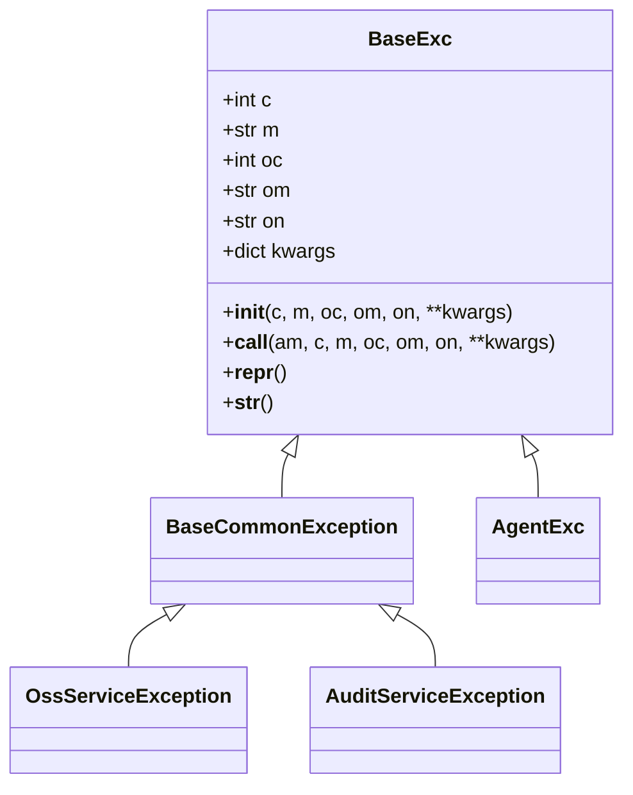
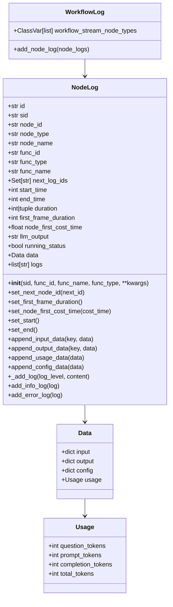
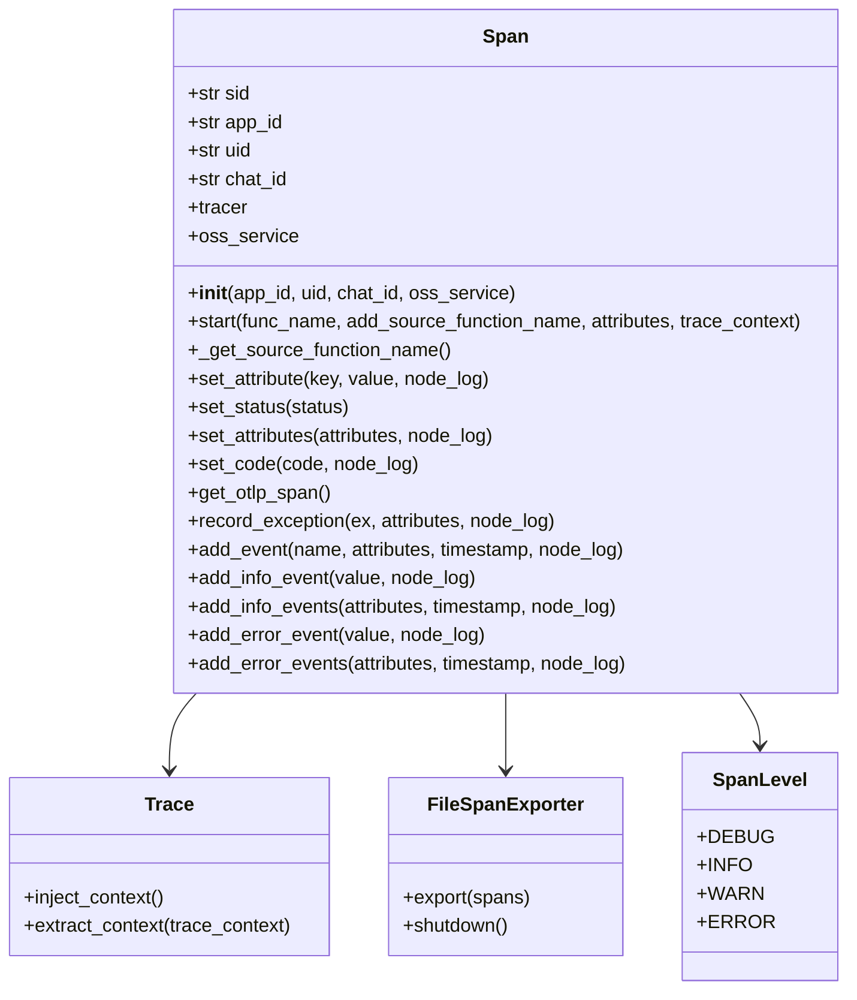
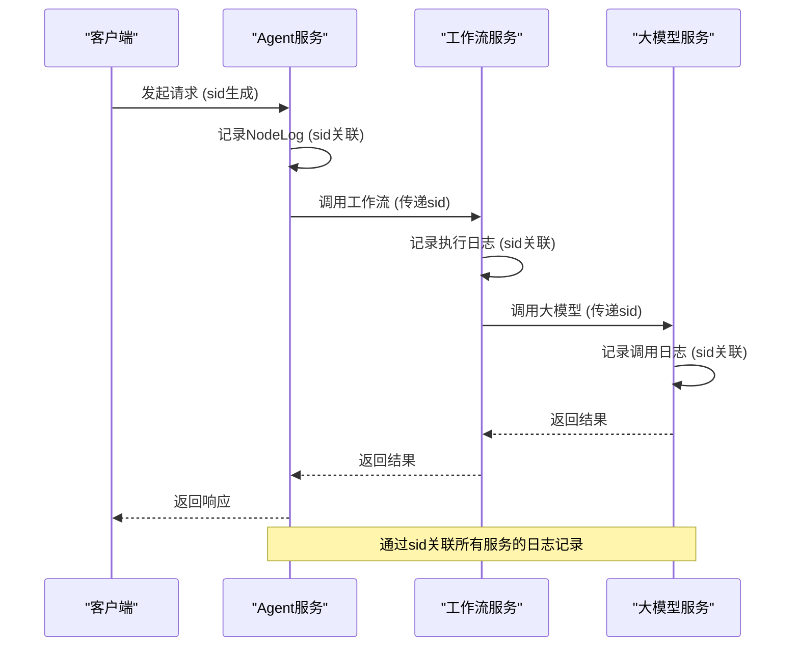

# 错误诊断与日志追溯

<cite>
**本文档引用的文件**  
- [base.py](file://core/common/exceptions/base.py)
- [codes.py](file://core/common/exceptions/codes.py)
- [errs.py](file://core/common/exceptions/errs.py)
- [node_log.py](file://core/common/otlp/log_trace/node_log.py)
- [workflow_log.py](file://core/common/otlp/log_trace/workflow_log.py)
- [span.py](file://core/common/otlp/trace/span.py)
- [trace.py](file://core/common/otlp/trace/trace.py)
- [agent_exc.py](file://core/agent/exceptions/agent_exc.py)
- [llm_codes.py](file://core/agent/exceptions/llm_codes.py)
- [logger.py](file://core/plugin/rpa/utils/log/logger.py)
</cite>

## 目录
1. [引言](#引言)
2. [错误处理机制与异常分类](#错误处理机制与异常分类)
3. [日志记录策略](#日志记录策略)
4. [分布式追踪系统](#分布式追踪系统)
5. [错误码体系结构](#错误码体系结构)
6. [日志分析工具使用指南](#日志分析工具使用指南)
7. [常见错误模式识别与修复建议](#常见错误模式识别与修复建议)
8. [日志安全性与隐私保护最佳实践](#日志安全性与隐私保护最佳实践)
9. [结论](#结论)

## 引言

本项目采用基于OpenTelemetry的分布式追踪和日志系统，结合自定义异常处理机制，实现了完整的错误诊断与日志追溯能力。系统通过统一的异常基类、分层的错误码体系和结构化的日志记录，为开发人员提供了强大的问题定位和调试支持。

## 错误处理机制与异常分类

系统采用分层的异常处理架构，以`BaseExc`为基础构建了完整的异常体系。异常类继承关系清晰，便于捕获和处理不同类型的错误。



**异常属性说明**：
- `c`：当前系统错误码
- `m`：当前系统错误信息
- `oc`：调用其他系统返回的原始错误码
- `om`：调用其他系统返回的原始错误信息
- `on`：调用的其他系统名称
- `kwargs`：扩展参数

该设计支持错误码的映射管理，当系统调用外部服务时，可以保留原始错误信息，便于问题追溯。

**Section sources**
- [base.py](file://core/common/exceptions/base.py)
- [errs.py](file://core/common/exceptions/errs.py)
- [agent_exc.py](file://core/agent/exceptions/agent_exc.py)

## 日志记录策略

系统采用结构化的日志记录策略，通过`NodeLog`和`WorkflowLog`类实现细粒度的日志追踪。日志包含完整的执行上下文信息，便于问题分析。



**日志字段说明**：
- `input`：节点输入数据
- `output`：节点输出数据
- `config`：节点配置参数
- `usage`：大模型使用统计
- `start_time`/`end_time`：执行时间戳（毫秒）
- `duration`：执行时长
- `first_frame_duration`：首帧响应时间
- `logs`：详细日志条目

**Section sources**
- [base.py](file://core/common/otlp/log_trace/base.py)
- [node_log.py](file://core/common/otlp/log_trace/node_log.py)
- [workflow_log.py](file://core/common/otlp/log_trace/workflow_log.py)

## 分布式追踪系统

系统基于OpenTelemetry实现分布式追踪，通过`Span`类和`Trace`类提供完整的追踪能力。追踪系统支持上下文传播、属性设置和异常记录。



**追踪上下文传播**：
- `inject_context()`：将当前追踪上下文注入到字典中
- `extract_context()`：从字典中提取追踪上下文

**Span操作**：
- `start()`：开始一个新的Span，支持上下文传播
- `record_exception()`：记录异常并设置错误状态
- `add_event()`：添加事件（如日志）
- `set_attribute()`：设置属性（如业务参数）

当日志内容超过10KB时，系统会自动将其上传到OSS存储，并在日志中记录链接，避免日志过大影响性能。

**Section sources**
- [span.py](file://core/common/otlp/trace/span.py)
- [trace.py](file://core/common/otlp/trace/trace.py)

## 错误码体系结构

系统采用分层的错误码体系，错误码由三位或五位数字组成，具有明确的分类含义。错误码定义在`codes.py`文件中，便于统一管理和引用。

```mermaid
flowchart TD
A[错误码体系] --> B[通用错误码]
A --> C[Agent专用错误码]
A --> D[LLM相关错误码]
B --> B1[c9000: 登录polaris失败]
B --> B2[c9001: 未知异常]
B --> B3[c9010: oss服务失败]
B --> B4[c9020: 审核异常]
B --> B5[c9021: 审核服务异常]
B --> B6[c9022: 输入内容审核不通过]
B --> B7[c9023: 输出内容涉及敏感信息]
C --> C1[c_0: success]
C --> C2[c_10000: WebSocket升级错误]
C --> C3[c_10001: WebSocket读取错误]
C --> C4[c_10002: WebSocket发送错误]
C --> C5[c_10003: 用户消息格式错误]
C --> C6[c_10004: 用户数据schema错误]
C --> C7[c_10005: 用户参数值错误]
C --> C8[c_10006: 用户并发错误]
C --> C9[c_10007: 用户流量限制]
C --> C10[c_10008: 服务容量不足]
D --> D1[IfyTekLLMCodes]
D --> D2[WorkflowLLMCodes]
D --> D3[_CODE_MAPPING]
D1 --> D11[SparkWSError]
D1 --> D12[SparkWSReadError]
D1 --> D13[SparkWSSendError]
D2 --> D21[SparkWSError]
D2 --> D22[SparkWSReadError]
D2 --> D23[SparkWSSendError]
D3 --> D31[错误码映射字典]
D3 --> D32[ify_code_convert函数]
```



**错误码分类**：
1. **通用错误码**（9xxx）：跨服务的通用错误
2. **Agent专用错误码**（1xxxx, 4xxxx）：Agent服务专用错误
3. **LLM相关错误码**：大模型调用相关错误

系统还提供了错误码转换功能，通过`_CODE_MAPPING`字典和`ify_code_convert`函数，可以将不同来源的错误码统一转换为标准格式，便于前端处理和用户展示。

**Section sources**
- [codes.py](file://core/common/exceptions/codes.py)
- [codes.py](file://core/agent/exceptions/codes.py)
- [llm_codes.py](file://core/agent/exceptions/llm_codes.py)

## 日志分析工具使用指南

系统提供了多种日志分析工具和方法，帮助开发人员快速定位和解决问题。

### 日志文件配置

RPA服务的日志配置在`logger.py`文件中，支持环境变量控制日志级别和输出路径。

```python
VALID_LOG_LEVELS = ["DEBUG", "INFO", "WARNING", "ERROR", "CRITICAL"]

def set_log(log_level: Optional[str] = None, log_path: Optional[str] = None) -> None:
    """设置日志配置"""
    if os.getenv(const.LOG_LEVEL_KEY) in VALID_LOG_LEVELS and log_level is None:
        log_level = os.getenv(const.LOG_LEVEL_KEY)
    if log_level is None:
        log_level = "INFO"
    
    log_format = (
        "{level} | {time:YYYY-MM-DD HH:mm:ss} | {process} - {thread} "
        "| {file} - {function}: {line} {message}"
    )
    
    logger.remove()
    logger.patch(patcher=patching)
    
    if not log_path:
        log_path = appdirs.user_cache_dir("rpa-server")
    
    log_path = f"{log_path}/rpa-server.log"
    log_path_ = Path(log_path)
    log_path_.parent.mkdir(parents=True, exist_ok=True)
    
    logger.add(
        sink=str(log_path_),
        level=log_level.upper(),
        format=log_format,
        rotation="10 MB",  # 基于文件大小的日志轮转
    )
```

**日志配置要点**：
- 支持通过环境变量`LOG_LEVEL_KEY`控制日志级别
- 默认日志级别为INFO
- 日志格式包含级别、时间、进程、线程、文件、函数、行号和消息
- 日志文件大小达到10MB时自动轮转
- 日志文件存储在用户缓存目录下

### 多服务日志关联

通过`sid`（会话ID）可以关联多个服务的日志记录。`sid`在请求开始时生成，并通过HTTP头或消息体传递到下游服务。



**日志关联步骤**：
1. 在请求入口生成唯一的`sid`
2. 将`sid`添加到所有日志记录中
3. 通过HTTP头或消息体将`sid`传递给下游服务
4. 在所有相关服务中使用相同的`sid`进行日志记录
5. 使用日志分析工具按`sid`过滤和关联日志

**Section sources**
- [logger.py](file://core/plugin/rpa/utils/log/logger.py)
- [span.py](file://core/common/otlp/trace/span.py)
- [node_log.py](file://core/common/otlp/log_trace/node_log.py)

## 常见错误模式识别与修复建议

基于系统日志和错误码，可以识别出几种常见的错误模式，并提供相应的修复建议。

### WebSocket连接错误

**错误码**：c_10000, c_10001, c_10002, c_40350, c_40351, c_40352

**症状**：
- 客户端无法建立WebSocket连接
- 连接后无法接收或发送消息
- 连接频繁断开

**可能原因**：
1. 网络问题或防火墙限制
2. 服务器负载过高
3. 客户端代码错误
4. 认证信息无效

**修复建议**：
1. 检查网络连接和防火墙设置
2. 查看服务器资源使用情况（CPU、内存）
3. 验证客户端WebSocket实现
4. 检查认证token的有效性
5. 增加连接超时时间

### 输入内容审核失败

**错误码**：c_10013, c_40363, c9022

**症状**：
- 用户输入被拒绝
- 系统返回"输入内容审核不通过"错误
- 特定类型的输入总是失败

**可能原因**：
1. 输入内容包含敏感词汇
2. 输入格式不符合要求
3. 审核规则过于严格

**修复建议**：
1. 检查输入内容是否包含违规信息
2. 验证输入格式是否符合API规范
3. 调整审核规则的敏感度
4. 提供更清晰的用户提示

### 大模型调用错误

**错误码**：c_10012, c_40362, c_40303

**症状**：
- 大模型无响应或响应错误
- 返回内部错误
- 响应时间过长

**可能原因**：
1. 大模型服务不可用
2. 请求参数错误
3. 网络连接问题
4. 模型负载过高

**修复建议**：
1. 检查大模型服务状态
2. 验证请求参数的正确性
3. 检查网络连接质量
4. 实现重试机制
5. 添加超时处理

### 并发控制错误

**错误码**：c_10006, c_10007, c_40356, c_40357

**症状**：
- 用户无法同时从多个位置连接
- 请求被限流
- 系统提示"请等待当前请求完成"

**可能原因**：
1. 并发连接数超过限制
2. 用户在同一会话中发送过多请求
3. 流量控制策略过于严格

**修复建议**：
1. 检查并发连接数限制配置
2. 优化客户端请求频率
3. 调整流量控制策略
4. 实现请求队列机制

**Section sources**
- [codes.py](file://core/agent/exceptions/codes.py)
- [llm_codes.py](file://core/agent/exceptions/llm_codes.py)
- [node_log.py](file://core/common/otlp/log_trace/node_log.py)

## 日志安全性与隐私保护最佳实践

系统在日志记录和处理方面遵循严格的安全性和隐私保护原则。

### 敏感信息处理

系统通过多种机制保护敏感信息：

1. **密码掩码**：在日志中对密码等敏感信息进行掩码处理
```json
"object": "{\"application\":\"app-built-in\",\"organization\":\"built-in\",\"username\":\"admin\",\"password\":\"***\",\"autoSignin\":true,\"language\":\"\",\"signinMethod\":\"Password\",\"type\":\"login\"}"
```

2. **大日志处理**：当日志内容超过10KB时，自动上传到OSS存储
```python
def add_info_event(self, value: str, node_log: Optional[NodeLog] = None) -> None:
    value_bytes = value.encode("utf-8")
    if len(value_bytes) >= SPAN_SIZE_LIMIT:
        try:
            if self.oss_service is not None:
                trace_link = self.oss_service.upload_file(
                    f"{str(uuid.uuid4())}", value_bytes
                )
                value = f"trace_link: {trace_link}"
        except Exception:
            value = "日志内容过大，上传s3存储时失败"
```

3. **环境变量控制**：通过环境变量控制日志级别和追踪功能
```python
if os.getenv("OTLP_ENABLE", "false").lower() in ("true", "1", "yes", "on"):
    exporter = OTLPSpanExporter(insecure=True, endpoint=endpoint, timeout=timeout)
    processor = BatchSpanProcessor(exporter, ...)
    provider.add_span_processor(processor)
```

### 日志安全最佳实践

1. **最小化日志原则**：只记录必要的调试信息
2. **敏感数据过滤**：在日志记录前过滤敏感数据
3. **访问控制**：限制日志文件的访问权限
4. **加密存储**：对存储的日志进行加密
5. **定期清理**：设置日志保留策略，定期清理旧日志

### 隐私保护措施

1. **数据脱敏**：对用户个人信息进行脱敏处理
2. **会话隔离**：确保不同用户的日志完全隔离
3. **审计日志**：记录所有敏感操作的审计日志
4. **合规性**：遵循相关法律法规和行业标准

**Section sources**
- [span.py](file://core/common/otlp/trace/span.py)
- [trace.py](file://core/common/otlp/trace/trace.py)
- [logger.py](file://core/plugin/rpa/utils/log/logger.py)

## 结论

本系统通过完善的错误处理机制、结构化的日志记录和强大的分布式追踪能力，为开发人员提供了全面的错误诊断与日志追溯解决方案。关键特性包括：

1. **分层的异常体系**：基于`BaseExc`的异常继承体系，支持错误码映射和上下文传递
2. **结构化的日志记录**：`NodeLog`和`WorkflowLog`提供详细的执行上下文
3. **完整的分布式追踪**：基于OpenTelemetry的Span和Trace实现
4. **统一的错误码体系**：清晰分类的错误码便于问题定位
5. **安全的隐私保护**：敏感信息处理和访问控制机制

通过合理使用这些工具和方法，开发人员可以快速定位和解决系统中的问题，提高系统的稳定性和可维护性。