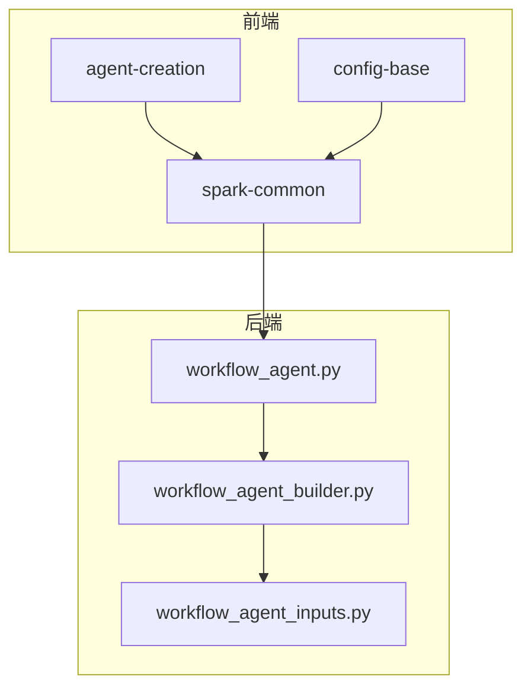
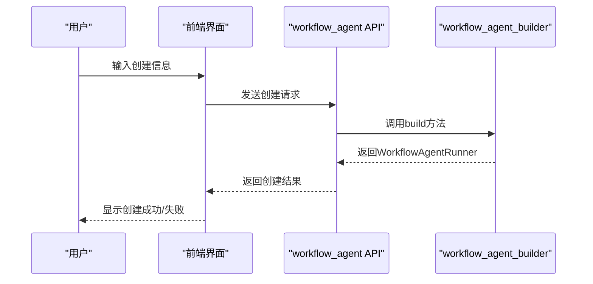
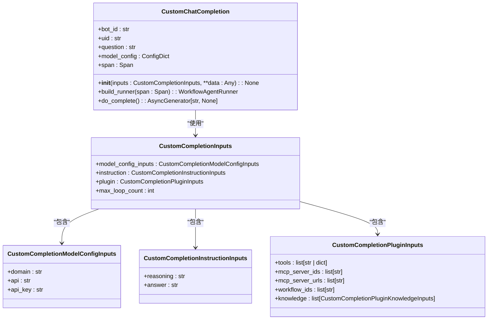
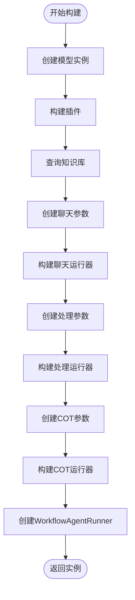
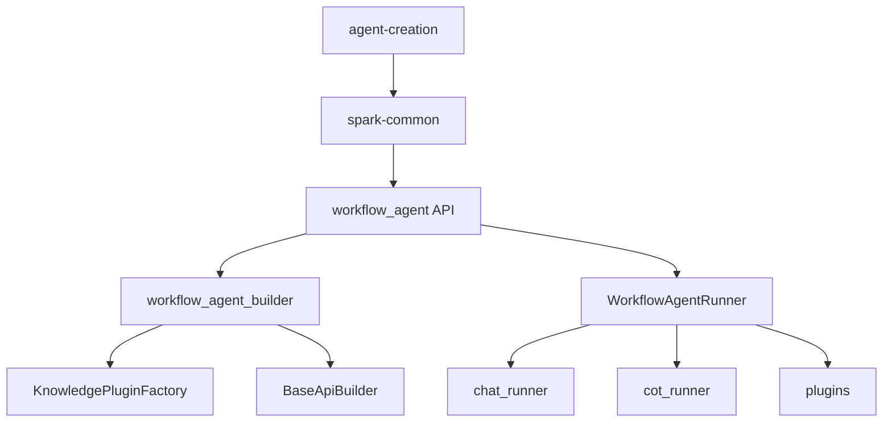

# 智能体创建

<cite>
**本文档引用的文件**  
- [index.tsx](file://console/frontend/src/components/agent-creation/index.tsx)
- [agent.ts](file://console/frontend/src/services/agent.ts)
- [workflow_agent.py](file://core/agent/api/v1/workflow_agent.py)
- [workflow_agent_builder.py](file://core/agent/service/builder/workflow_agent_builder.py)
- [workflow_agent_inputs.py](file://core/agent/api/schemas/workflow_agent_inputs.py)
- [config-base/index.tsx](file://console/frontend/src/components/config-page-component/config-base/index.tsx)
- [spark-common.ts](file://console/frontend/src/services/spark-common.ts)
- [agent-create.ts](file://console/frontend/src/types/agent-create.ts)
</cite>

## 目录
1. [简介](#简介)
2. [项目结构](#项目结构)
3. [核心组件](#核心组件)
4. [架构概述](#架构概述)
5. [详细组件分析](#详细组件分析)
6. [依赖分析](#依赖分析)
7. [性能考虑](#性能考虑)
8. [故障排除指南](#故障排除指南)
9. [结论](#结论)
10. [附录](#附录)（如有必要）

## 简介
本文档详细描述了智能体创建功能的完整流程，从用户界面启动创建流程到后端服务完成智能体实例化的全过程。文档涵盖了创建表单中各个字段的含义和配置要求、前端组件agent-creation的工作机制和状态管理、后端API接口workflow_agent.py如何接收创建请求并通过workflow_agent_builder.py构建智能体配置等内容。同时提供了创建过程中的错误处理机制和验证规则，以及成功创建后的返回数据结构和后续操作指引。

## 项目结构
智能体创建功能分布在前端和后端两个主要部分。前端位于console/frontend目录下，主要包含用户界面组件和服务调用；后端位于core/agent目录下，包含API接口、服务构建器和核心逻辑处理。



**图表来源**  
- [index.tsx](file://console/frontend/src/components/agent-creation/index.tsx)
- [config-base/index.tsx](file://console/frontend/src/components/config-page-component/config-base/index.tsx)
- [spark-common.ts](file://console/frontend/src/services/spark-common.ts)
- [workflow_agent.py](file://core/agent/api/v1/workflow_agent.py)
- [workflow_agent_builder.py](file://core/agent/service/builder/workflow_agent_builder.py)
- [workflow_agent_inputs.py](file://core/agent/api/schemas/workflow_agent_inputs.py)

**章节来源**
- [index.tsx](file://console/frontend/src/components/agent-creation/index.tsx#L0-L218)
- [config-base/index.tsx](file://console/frontend/src/components/config-page-component/config-base/index.tsx#L0-L799)

## 核心组件
智能体创建功能的核心组件包括前端的agent-creation组件、后端的workflow_agent API和workflow_agent_builder服务构建器。这些组件协同工作，实现了从用户输入到智能体实例化的完整流程。

**章节来源**
- [index.tsx](file://console/frontend/src/components/agent-creation/index.tsx#L0-L218)
- [workflow_agent.py](file://core/agent/api/v1/workflow_agent.py#L0-L105)
- [workflow_agent_builder.py](file://core/agent/service/builder/workflow_agent_builder.py#L0-L230)

## 架构概述
智能体创建功能采用前后端分离架构，前端负责用户界面展示和用户交互，后端负责业务逻辑处理和数据持久化。整个创建流程遵循典型的MVC模式，前端作为View层，后端API作为Controller层，服务构建器和数据访问层作为Model层。



**图表来源**  
- [workflow_agent.py](file://core/agent/api/v1/workflow_agent.py#L0-L105)
- [workflow_agent_builder.py](file://core/agent/service/builder/workflow_agent_builder.py#L0-L230)

## 详细组件分析

### 前端组件分析
前端agent-creation组件负责收集用户输入的智能体创建信息，包括智能体名称、描述、图标等基础信息，并通过API调用将这些信息发送到后端。

```mermaid
classDiagram
class HeaderFeedbackModal {
+visible : boolean
+onCancel : () => void
+loading : boolean
+form : Form
+tuijian : BotMarketItem[]
+handleSubmit(values : { preset_detail : string }) : void
+aiGen() : void
}
class BotMarketItem {
+id : number
+botName : string
+botDesc : string
+botTemplate : string
+botType : number
+inputExample : string
+prompt : string
}
HeaderFeedbackModal --> BotMarketItem : "使用"
```

**图表来源**  
- [index.tsx](file://console/frontend/src/components/agent-creation/index.tsx#L0-L218)
- [agent-create.ts](file://console/frontend/src/types/agent-create.ts#L0-L32)

**章节来源**
- [index.tsx](file://console/frontend/src/components/agent-creation/index.tsx#L0-L218)

### 后端API分析
后端workflow_agent.py文件定义了智能体创建的API接口，接收前端发送的创建请求，并通过workflow_agent_builder构建智能体配置。



**图表来源**  
- [workflow_agent.py](file://core/agent/api/v1/workflow_agent.py#L0-L105)
- [workflow_agent_inputs.py](file://core/agent/api/schemas/workflow_agent_inputs.py#L0-L50)

**章节来源**
- [workflow_agent.py](file://core/agent/api/v1/workflow_agent.py#L0-L105)
- [workflow_agent_inputs.py](file://core/agent/api/schemas/workflow_agent_inputs.py#L0-L50)

### 服务构建器分析
workflow_agent_builder.py文件实现了智能体配置的构建逻辑，根据输入参数创建模型、插件和知识库查询任务，并最终构建WorkflowAgentRunner实例。



**图表来源**  
- [workflow_agent_builder.py](file://core/agent/service/builder/workflow_agent_builder.py#L0-L230)

**章节来源**
- [workflow_agent_builder.py](file://core/agent/service/builder/workflow_agent_builder.py#L0-L230)

## 依赖分析
智能体创建功能涉及多个组件之间的依赖关系，包括前端组件之间的依赖、前端与后端服务之间的依赖，以及后端服务内部的依赖。



**图表来源**  
- [index.tsx](file://console/frontend/src/components/agent-creation/index.tsx#L0-L218)
- [spark-common.ts](file://console/frontend/src/services/spark-common.ts#L0-L558)
- [workflow_agent.py](file://core/agent/api/v1/workflow_agent.py#L0-L105)
- [workflow_agent_builder.py](file://core/agent/service/builder/workflow_agent_builder.py#L0-L230)

**章节来源**
- [index.tsx](file://console/frontend/src/components/agent-creation/index.tsx#L0-L218)
- [spark-common.ts](file://console/frontend/src/services/spark-common.ts#L0-L558)
- [workflow_agent.py](file://core/agent/api/v1/workflow_agent.py#L0-L105)
- [workflow_agent_builder.py](file://core/agent/service/builder/workflow_agent_builder.py#L0-L230)

## 性能考虑
智能体创建功能在设计时考虑了性能优化，特别是在知识库查询和并发处理方面。workflow_agent_builder中的_query_knowledge_by_workflow方法使用asyncio.gather并发执行多个知识查询任务，提高了查询效率。

**章节来源**
- [workflow_agent_builder.py](file://core/agent/service/builder/workflow_agent_builder.py#L0-L230)

## 故障排除指南
在智能体创建过程中可能遇到的常见问题包括：表单验证失败、API调用超时、知识库查询失败等。前端通过Ant Design的Form组件提供了表单验证功能，后端通过异常处理机制捕获和处理各种错误情况。

**章节来源**
- [index.tsx](file://console/frontend/src/components/agent-creation/index.tsx#L0-L218)
- [workflow_agent.py](file://core/agent/api/v1/workflow_agent.py#L0-L105)

## 结论
智能体创建功能通过前后端协同工作，实现了从用户界面到后端服务的完整创建流程。前端组件负责用户交互和表单验证，后端API负责接收请求和业务逻辑处理，服务构建器负责构建智能体配置。整个流程设计合理，代码结构清晰，便于维护和扩展。