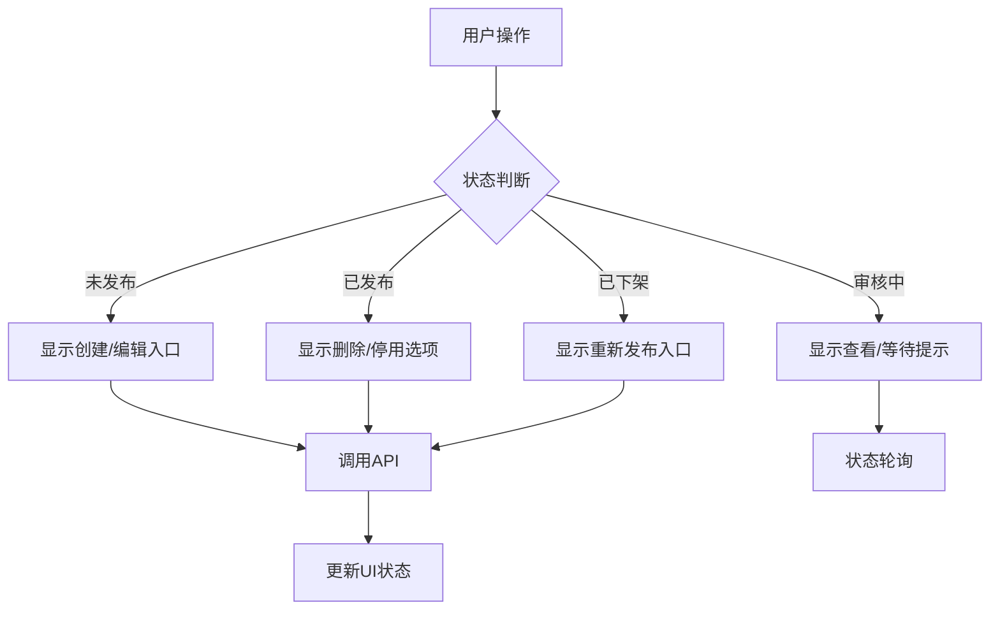
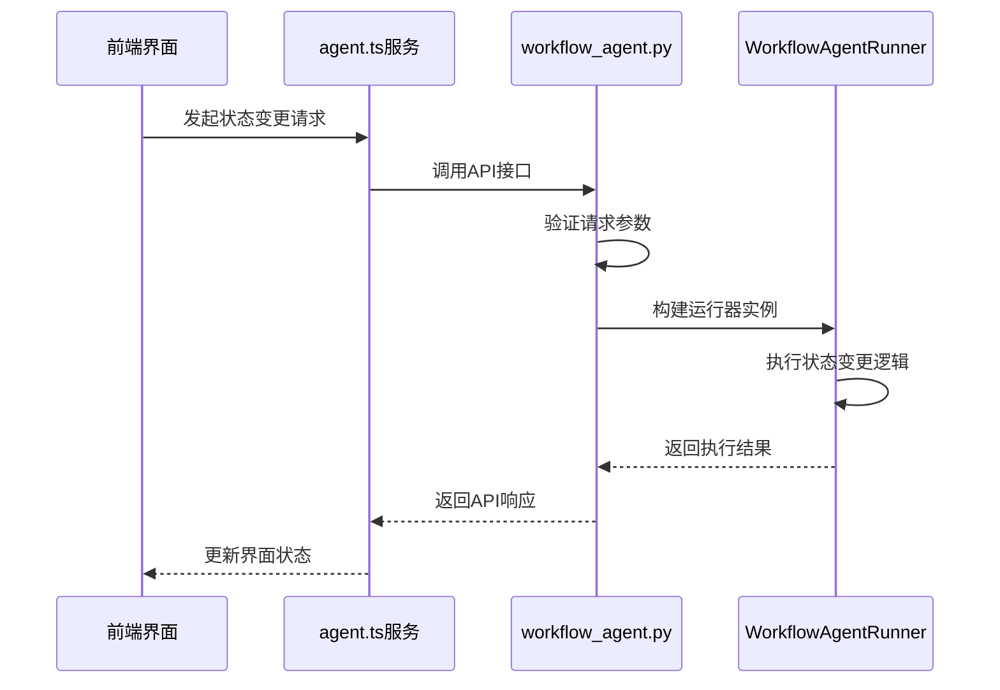
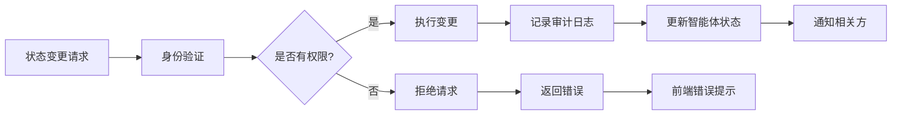
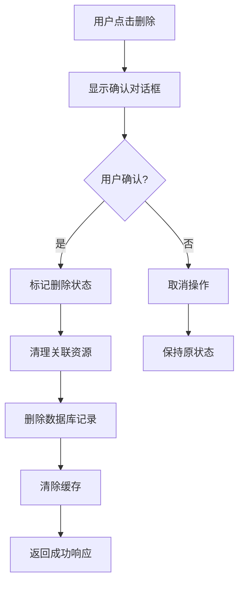
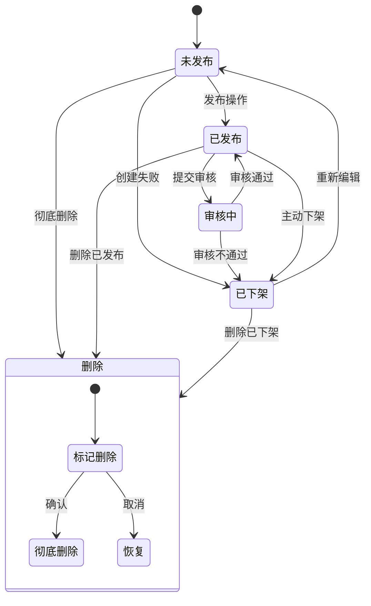

# 智能体生命周期管理

<cite>
**本文档引用的文件**  
- [agent.ts](file://console/frontend/src/services/agent.ts)
- [workflow_agent.py](file://core/agent/api/v1/workflow_agent.py)
- [agent_response.py](file://core/agent/api/schemas/agent_response.py)
- [workflow_agent_inputs.py](file://core/agent/api/schemas/workflow_agent_inputs.py)
- [agent.tsx](file://console/frontend/src/components/workflow/types/nodes/agent.ts)
- [agentPage.ts](file://console/frontend/src/locales/zh-ZH/openPlatform-ZH/agentPage.ts)
</cite>

## 目录
1. [智能体生命周期概述](#智能体生命周期概述)
2. [前端服务封装](#前端服务封装)
3. [后端状态变更实现](#后端状态变更实现)
4. [权限验证与审计日志](#权限验证与审计日志)
5. [删除操作与数据清理](#删除操作与数据清理)
6. [状态转换图示](#状态转换图示)
7. [常见问题与解决方案](#常见问题与解决方案)

## 智能体生命周期概述

智能体生命周期包含创建、激活、停用、更新和删除等核心状态。系统通过前后端协同工作来管理这些状态转换。智能体的主要状态包括：未发布、已发布、审核中、已下架等。每个状态都有相应的操作权限和业务规则约束。

**Section sources**
- [agentPage.ts](file://console/frontend/src/locales/zh-ZH/openPlatform-ZH/agentPage.ts#L0-L32)

## 前端服务封装

前端通过`agent.ts`服务文件封装了智能体生命周期管理的API调用。该服务提供了创建、编辑、删除智能体等关键方法。`getAgentList`方法用于获取智能体列表，支持分页、排序和状态过滤。`deleteAgent`方法通过POST请求实现智能体删除功能，使用URL编码格式传递参数。

agent-page组件负责展示智能体状态并提供操作入口。界面显示智能体的当前状态（如"已发布"、"未发布"、"审核中"、"已下架"），并根据状态显示相应的操作按钮，如编辑、删除、分享等。

**Diagram sources**
- [agent.ts](file://console/frontend/src/services/agent.ts#L0-L158)
- [agentPage.ts](file://console/frontend/src/locales/zh-ZH/openPlatform-ZH/agentPage.ts#L0-L32)

**Section sources**
- [agent.ts](file://console/frontend/src/services/agent.ts#L0-L158)
- [agentPage.ts](file://console/frontend/src/locales/zh-ZH/openPlatform-ZH/agentPage.ts#L0-L32)

## 后端状态变更实现

后端在`workflow_agent.py`文件中实现了智能体的状态变更接口。系统通过FastAPI框架提供RESTful API，处理智能体的创建、更新和执行等操作。`CustomChatCompletion`类继承自`CompletionBase`，负责构建和执行智能体运行器。

状态变更接口采用流式响应(StreamingResponse)方式返回结果，设置`Cache-Control: no-cache`和`X-Accel-Buffering: no`头部确保实时性。`custom_chat_completions`函数处理POST请求，接收用户输入并启动智能体执行流程。

**Diagram sources**
- [workflow_agent.py](file://core/agent/api/v1/workflow_agent.py#L0-L105)
- [agent.ts](file://console/frontend/src/services/agent.ts#L0-L158)

**Section sources**
- [workflow_agent.py](file://core/agent/api/v1/workflow_agent.py#L0-L105)

## 权限验证与审计日志

系统在状态变更时实施严格的权限验证机制。通过`x_consumer_username`请求头获取用户身份信息，确保只有授权用户才能执行特定操作。权限验证在API网关和业务逻辑层双重实施，防止未授权访问。

审计日志记录所有关键状态变更操作，包括操作时间、操作者、智能体ID和变更前后的状态。日志信息通过`Span`对象收集，包含`app_id`、`bot_id`和`uid`等上下文信息。这些日志用于安全审计、故障排查和行为分析。

**Diagram sources**
- [workflow_agent.py](file://core/agent/api/v1/workflow_agent.py#L0-L105)
- [agent.ts](file://console/frontend/src/services/agent.ts#L0-L158)

**Section sources**
- [workflow_agent.py](file://core/agent/api/v1/workflow_agent.py#L0-L105)

## 删除操作与数据清理

删除操作采用软删除与硬删除相结合的策略。首先将智能体标记为删除状态，经过确认后执行彻底删除。系统在删除时清理关联资源，包括配置数据、日志记录和缓存信息。

数据清理策略确保不会留下孤立数据。删除操作会级联清理与智能体相关的所有数据，如prompt编排配置、执行日志和用户交互记录。系统提供删除确认对话框，警告用户删除操作不可撤销。

**Diagram sources**
- [agent.ts](file://console/frontend/src/services/agent.ts#L0-L158)
- [workflow_agent.py](file://core/agent/api/v1/workflow_agent.py#L0-L105)

**Section sources**
- [agent.ts](file://console/frontend/src/services/agent.ts#L0-L158)

## 状态转换图示

智能体各状态间的关系如下图所示：

**Diagram sources**
- [agentPage.ts](file://console/frontend/src/locales/zh-ZH/openPlatform-ZH/agentPage.ts#L0-L32)
- [agent.ts](file://console/frontend/src/services/agent.ts#L0-L158)

## 常见问题与解决方案

状态变更失败的常见原因包括：权限不足、网络问题、数据验证失败和系统异常。解决方案如下：

1. **权限不足**：检查用户角色和权限配置，确保具有执行操作的必要权限
2. **网络问题**：检查网络连接，重试请求或联系系统管理员
3. **数据验证失败**：检查输入数据格式和完整性，确保符合API要求
4. **系统异常**：查看系统日志，联系技术支持团队

对于删除操作，系统会明确提示"删除后无法撤销"的风险，要求用户二次确认。如果删除失败，系统会返回具体的错误信息，帮助用户定位问题。

**Section sources**
- [agent.ts](file://console/frontend/src/services/agent.ts#L0-L158)
- [agentPage.ts](file://console/frontend/src/locales/zh-ZH/openPlatform-ZH/agentPage.ts#L0-L32)