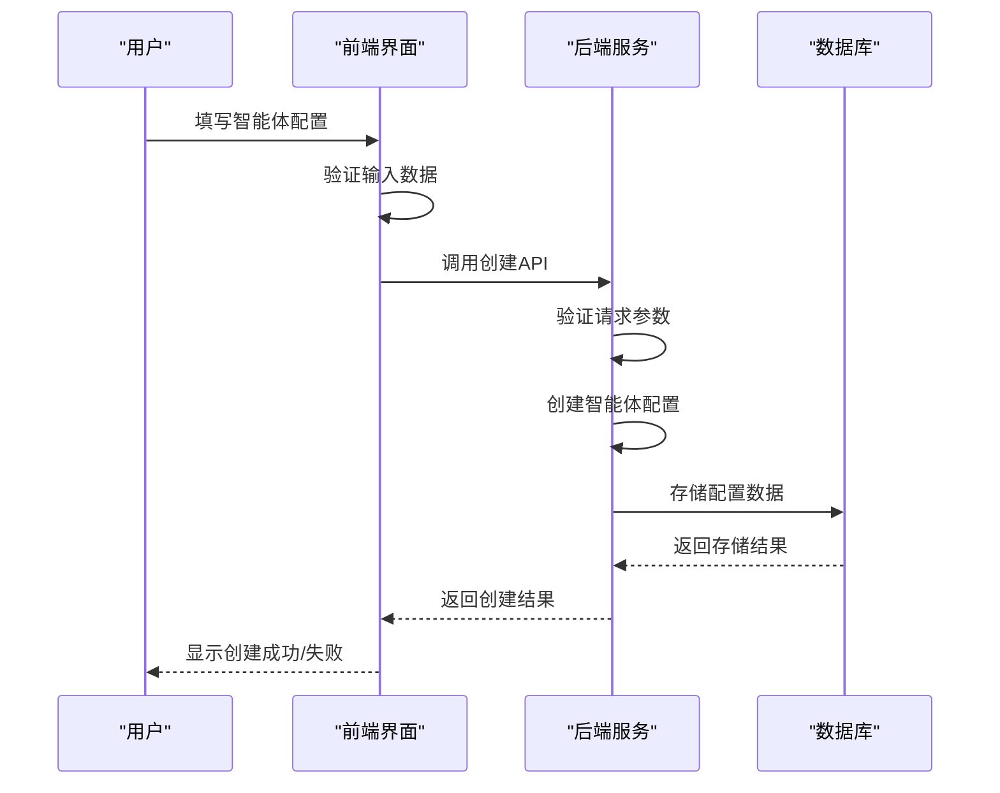
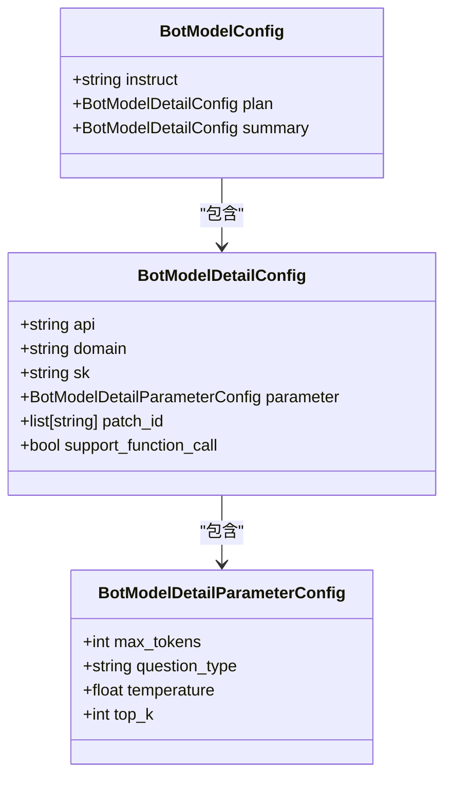
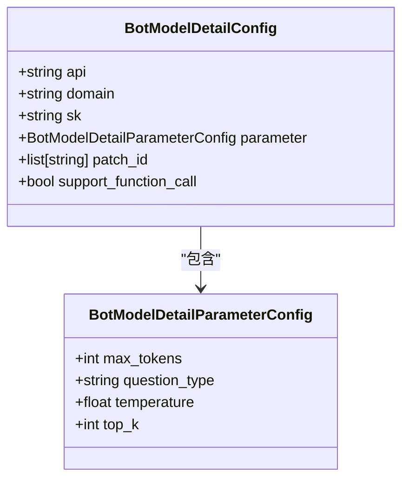
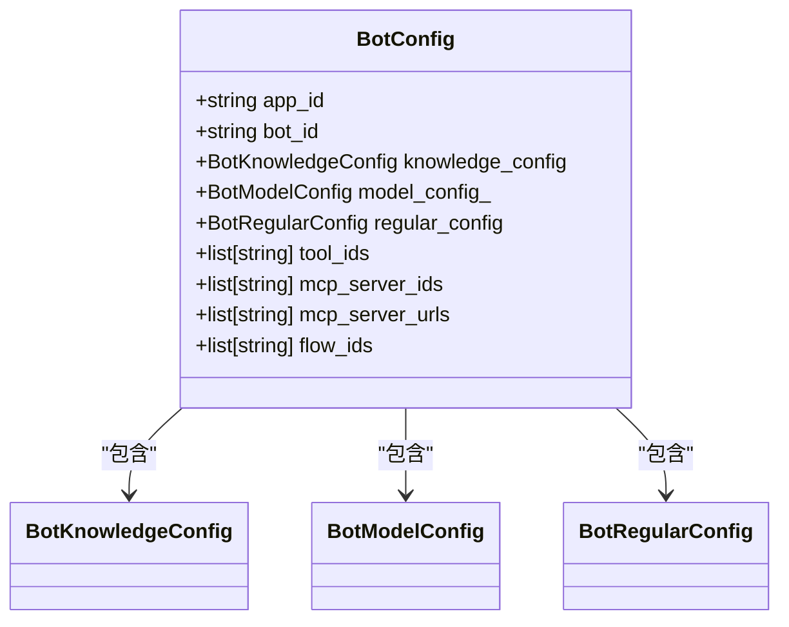
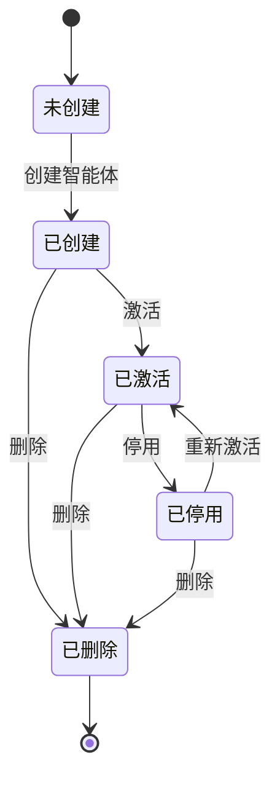
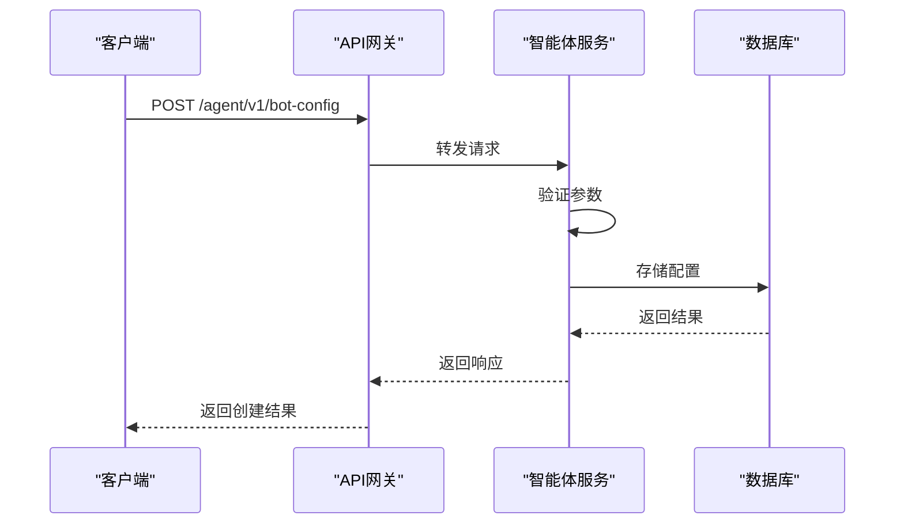
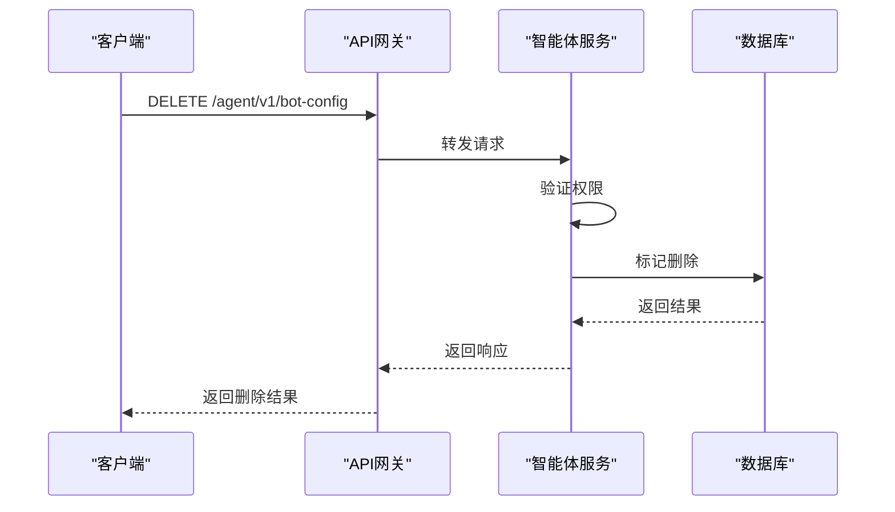
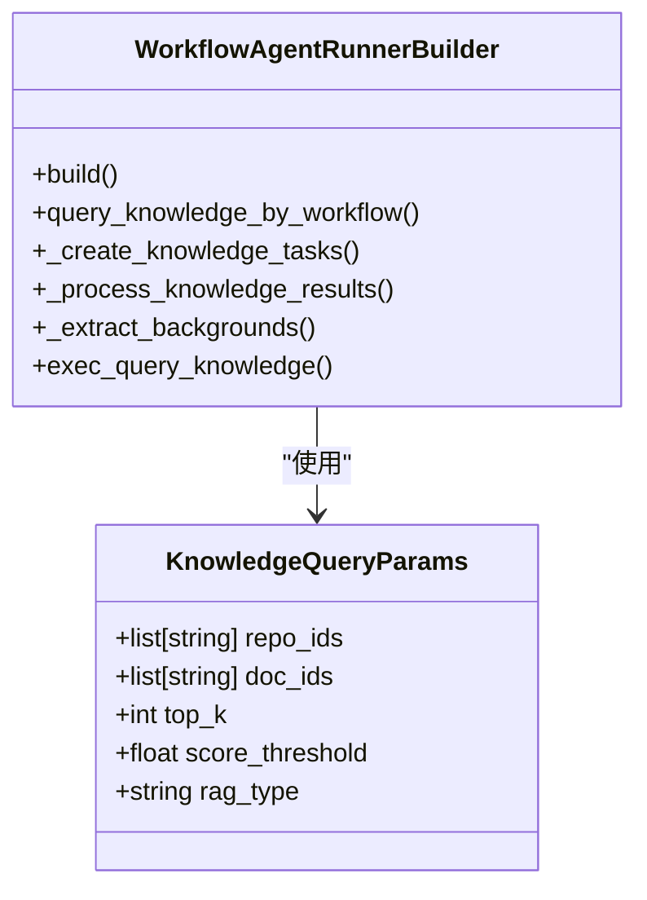
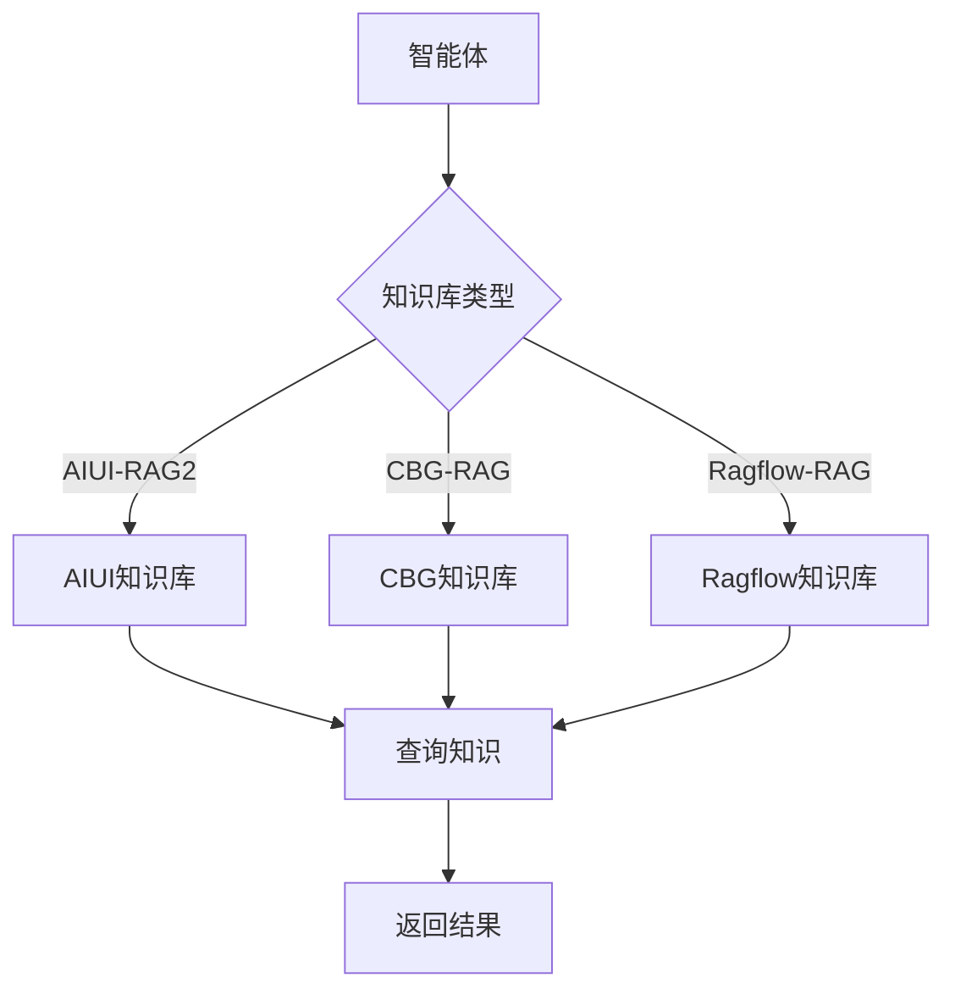

# 智能体管理

<cite>
**本文档引用的文件**  
- [agent.ts](file://console/frontend/src/services/agent.ts)
- [bot_config_mgr_api.py](file://core/agent/api/v1/bot_config_mgr_api.py)
- [bot_config.py](file://core/agent/api/schemas/bot_config.py)
- [bot_config_table.py](file://core/agent/domain/models/bot_config_table.py)
- [config-base/index.tsx](file://console/frontend/src/components/config-page-component/config-base/index.tsx)
- [spark-common.ts](file://console/frontend/src/services/spark-common.ts)
- [workflow_agent_builder.py](file://core/agent/service/builder/workflow_agent_builder.py)
</cite>

## 目录
1. [简介](#简介)
2. [智能体创建流程](#智能体创建流程)
3. [智能体配置参数详解](#智能体配置参数详解)
4. [智能体状态管理](#智能体状态管理)
5. [API调用示例](#api调用示例)
6. [系统组件集成](#系统组件集成)
7. [常见问题排查](#常见问题排查)
8. [最佳实践建议](#最佳实践建议)

## 简介

智能体管理系统提供了一套完整的解决方案，用于创建、配置、管理和集成智能体。系统从前端用户界面到后端服务处理，实现了智能体的全生命周期管理。用户可以通过直观的界面创建智能体，配置各种参数，并通过RESTful API进行程序化管理。系统支持与工作流、知识库等其他组件的深度集成，为用户提供强大的智能体管理能力。

## 智能体创建流程

智能体创建流程从用户界面交互开始，经过前端服务调用，最终在后端完成持久化存储。整个流程分为三个主要阶段：前端交互、API调用和后端处理。

**图示来源**  
- [config-base/index.tsx](file://console/frontend/src/components/config-page-component/config-base/index.tsx#L0-L799)
- [agent.ts](file://console/frontend/src/services/agent.ts#L0-L158)
- [bot_config_mgr_api.py](file://core/agent/api/v1/bot_config_mgr_api.py#L0-L211)

**本节来源**  
- [config-base/index.tsx](file://console/frontend/src/components/config-page-component/config-base/index.tsx#L0-L799)
- [agent.ts](file://console/frontend/src/services/agent.ts#L0-L158)
- [bot_config_mgr_api.py](file://core/agent/api/v1/bot_config_mgr_api.py#L0-L211)

## 智能体配置参数详解

智能体配置包含多个关键参数，这些参数定义了智能体的行为和功能。主要配置参数包括提示词配置、模型选择、知识库配置、工具集成等。

### 提示词配置

提示词配置是智能体的核心，它定义了智能体的指令和行为模式。`BotConfig`模型中的`instruct`字段用于存储提示词内容。

**图示来源**  
- [bot_config.py](file://core/agent/api/schemas/bot_config.py#L0-L58)

### 模型选择

模型选择配置允许用户指定智能体使用的底层大模型。系统支持多种模型配置，包括API端点、领域、密钥等参数。

**图示来源**  
- [bot_config.py](file://core/agent/api/schemas/bot_config.py#L0-L58)

### 插件集成

插件集成配置允许智能体使用外部工具和服务。系统支持多种插件类型，包括MCP服务器、工作流和工具ID。

**图示来源**  
- [bot_config.py](file://core/agent/api/schemas/bot_config.py#L0-L58)
- [workflow_agent_builder.py](file://core/agent/service/builder/workflow_agent_builder.py#L0-L230)

**本节来源**  
- [bot_config.py](file://core/agent/api/schemas/bot_config.py#L0-L58)
- [workflow_agent_builder.py](file://core/agent/service/builder/workflow_agent_builder.py#L0-L230)

## 智能体状态管理

智能体状态管理包括激活、停用和删除等操作。系统通过RESTful API提供这些功能，确保智能体的生命周期得到有效控制。

### 状态转换流程

### 状态管理API

系统提供了以下API端点用于智能体状态管理：
- `POST /agent/v1/bot-config`：创建智能体
- `PUT /agent/v1/bot-config`：更新智能体
- `DELETE /agent/v1/bot-config`：删除智能体
- `GET /agent/v1/bot-config`：查询智能体配置

**图示来源**  
- [bot_config_mgr_api.py](file://core/agent/api/v1/bot_config_mgr_api.py#L0-L211)

**本节来源**  
- [bot_config_mgr_api.py](file://core/agent/api/v1/bot_config_mgr_api.py#L0-L211)

## API调用示例

以下是通过RESTful接口管理智能体的示例代码。

### 创建智能体

**图示来源**  
- [bot_config_mgr_api.py](file://core/agent/api/v1/bot_config_mgr_api.py#L0-L211)

### 删除智能体

**图示来源**  
- [bot_config_mgr_api.py](file://core/agent/api/v1/bot_config_mgr_api.py#L0-L211)

**本节来源**  
- [bot_config_mgr_api.py](file://core/agent/api/v1/bot_config_mgr_api.py#L0-L211)

## 系统组件集成

智能体系统与其他组件如工作流、知识库等深度集成，提供强大的功能扩展能力。

### 与工作流集成

智能体可以作为工作流的一部分，与其他节点协同工作。`WorkflowAgentRunnerBuilder`类负责构建工作流智能体运行器。

**图示来源**  
- [workflow_agent_builder.py](file://core/agent/service/builder/workflow_agent_builder.py#L0-L230)

### 与知识库集成

智能体可以集成知识库，利用外部知识增强回答能力。系统支持多种知识库类型，包括AIUI-RAG2、CBG-RAG和Ragflow-RAG。

**图示来源**  
- [workflow_agent_builder.py](file://core/agent/service/builder/workflow_agent_builder.py#L0-L230)

**本节来源**  
- [workflow_agent_builder.py](file://core/agent/service/builder/workflow_agent_builder.py#L0-L230)

## 常见问题排查

### 配置错误

当智能体配置出现错误时，系统会返回相应的错误码和消息。常见配置错误包括：
- 必填字段缺失
- 字段长度超出限制
- 数据类型不匹配

### 权限问题

权限问题通常发生在用户尝试访问或修改无权操作的智能体时。解决方法包括：
- 检查用户角色和权限
- 确认应用ID和智能体ID的关联关系
- 验证API密钥的有效性

**本节来源**  
- [bot_config_mgr_api.py](file://core/agent/api/v1/bot_config_mgr_api.py#L0-L211)
- [bot_config.py](file://core/agent/api/schemas/bot_config.py#L0-L58)

## 最佳实践建议

### 配置优化

- 为提示词设置清晰的指令
- 合理配置模型参数，平衡性能和成本
- 选择合适的知识库和工具集成

### 性能优化

- 使用缓存减少重复计算
- 优化知识库查询参数
- 监控智能体响应时间

### 安全性

- 保护API密钥等敏感信息
- 验证用户输入数据
- 实施适当的访问控制

**本节来源**  
- [bot_config.py](file://core/agent/api/schemas/bot_config.py#L0-L58)
- [workflow_agent_builder.py](file://core/agent/service/builder/workflow_agent_builder.py#L0-L230)
- [bot_config_mgr_api.py](file://core/agent/api/v1/bot_config_mgr_api.py#L0-L211)