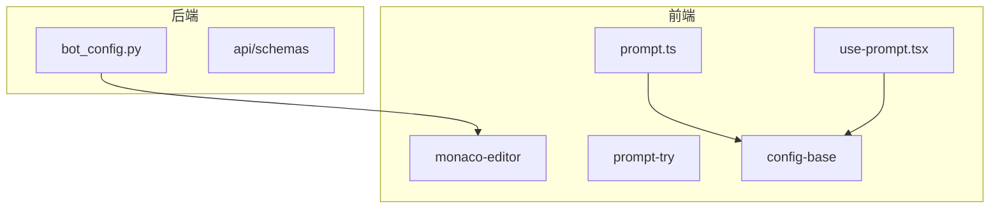
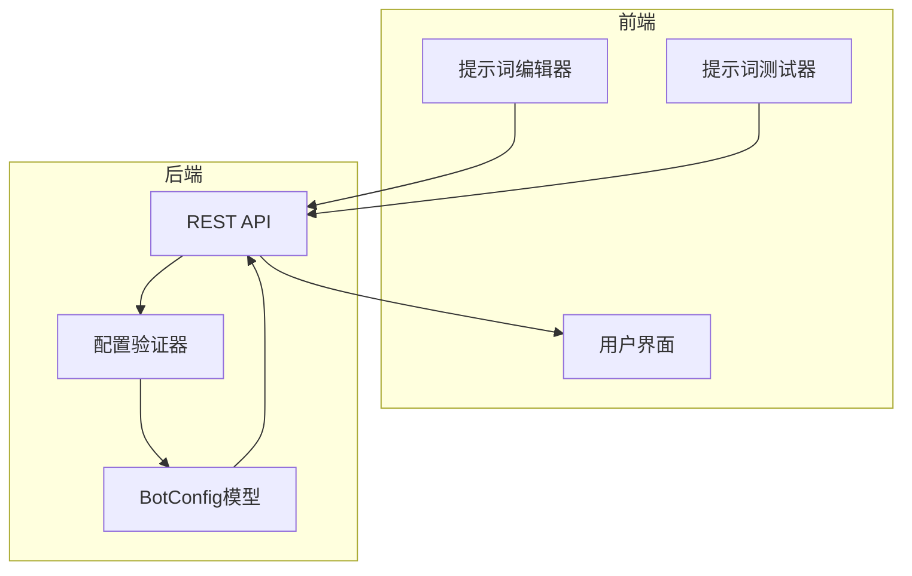
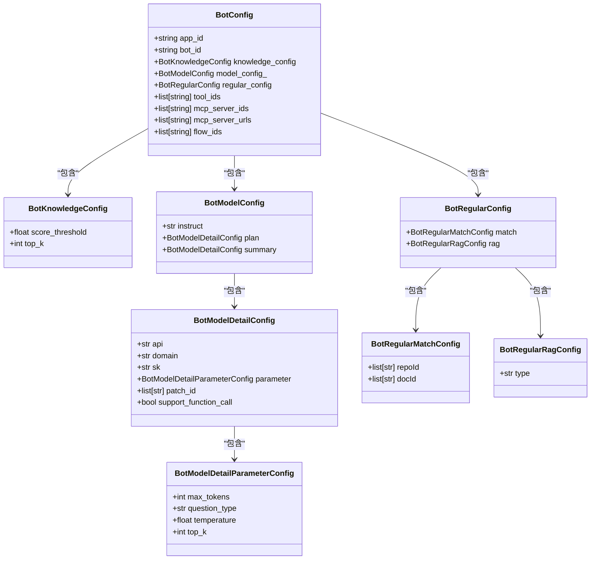
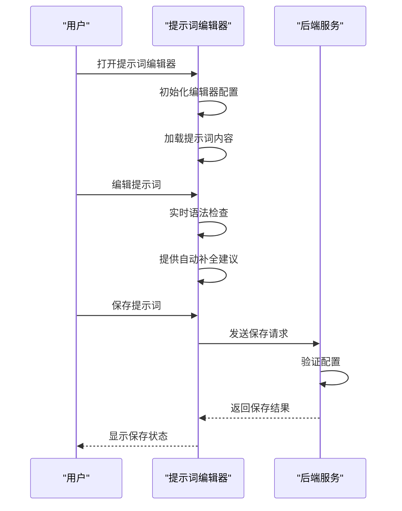
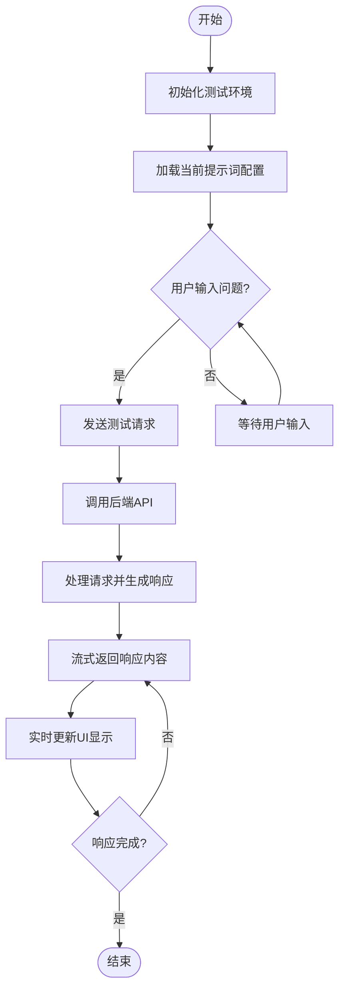
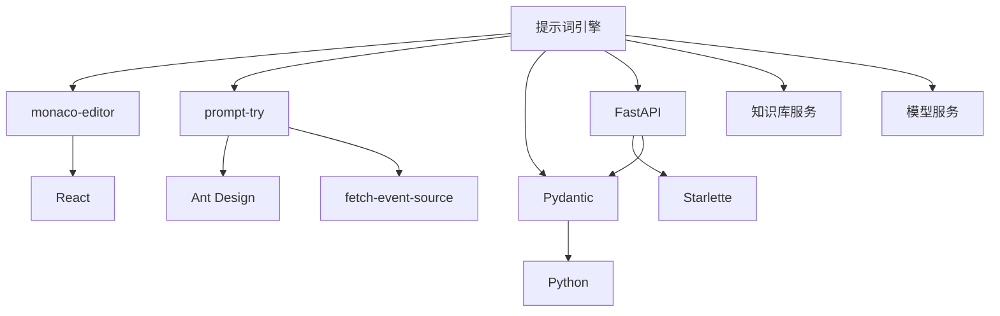

# 提示词工程配置

<cite>
**本文档引用的文件**
- [bot_config.py](file://core/agent/api/schemas/bot_config.py)
- [index.tsx](file://console/frontend/src/components/monaco-editor/index.tsx)
- [config-base/index.tsx](file://console/frontend/src/components/config-page-component/config-base/index.tsx)
- [prompt-try/index.tsx](file://console/frontend/src/components/prompt-try/index.tsx)
- [prompt.ts](file://console/frontend/src/services/prompt.ts)
- [use-prompt.tsx](file://console/frontend/src/hooks/use-prompt.tsx)
</cite>

## 目录
1. [简介](#简介)
2. [项目结构](#项目结构)
3. [核心组件](#核心组件)
4. [架构概述](#架构概述)
5. [详细组件分析](#详细组件分析)
6. [依赖分析](#依赖分析)
7. [性能考虑](#性能考虑)
8. [故障排除指南](#故障排除指南)
9. [结论](#结论)
10. [附录](#附录)（如有必要）

## 简介
本文档详细阐述了astron-agent项目中的提示词工程配置系统。该系统为智能体提供了强大的提示词管理能力，支持复杂的提示词模板语法、动态上下文变量、高级优化技术等。系统主要由后端配置模型和前端编辑器两大部分组成，通过bot_config.py定义的配置结构与前端的monaco-editor实现的编辑器协同工作，为用户提供完整的提示词工程解决方案。

## 项目结构
提示词工程配置系统分布在项目的多个目录中，主要集中在core/agent和console/frontend两个部分。后端配置模型位于core/agent/api/schemas/bot_config.py，定义了提示词相关的数据结构和验证规则。前端编辑器和相关组件位于console/frontend/src/components目录下，包括monaco-editor、prompt-try等关键组件。

**图表来源**
- [bot_config.py](file://core/agent/api/schemas/bot_config.py)
- [index.tsx](file://console/frontend/src/components/monaco-editor/index.tsx)
- [config-base/index.tsx](file://console/frontend/src/components/config-page-component/config-base/index.tsx)

**章节来源**
- [bot_config.py](file://core/agent/api/schemas/bot_config.py)
- [index.tsx](file://console/frontend/src/components/monaco-editor/index.tsx)

## 核心组件
提示词工程配置系统的核心组件包括后端的BotConfig模型和前端的提示词编辑器。BotConfig模型定义了提示词配置的完整结构，包括知识库配置、模型参数、正则匹配等。前端编辑器基于monaco-editor实现，提供语法高亮、自动补全等高级编辑功能。prompt-try组件则提供了实时的提示词测试功能，允许用户在配置过程中即时预览效果。

**章节来源**
- [bot_config.py](file://core/agent/api/schemas/bot_config.py)
- [index.tsx](file://console/frontend/src/components/monaco-editor/index.tsx)
- [prompt-try/index.tsx](file://console/frontend/src/components/prompt-try/index.tsx)

## 架构概述
提示词工程配置系统采用前后端分离的架构设计。后端通过Pydantic模型定义配置结构，确保数据的完整性和有效性。前端通过React组件实现用户界面，利用monaco-editor提供专业的代码编辑体验。系统通过REST API进行通信，支持提示词的创建、更新、测试等操作。

**图表来源**
- [bot_config.py](file://core/agent/api/schemas/bot_config.py)
- [prompt.ts](file://console/frontend/src/services/prompt.ts)

## 详细组件分析

### 提示词配置模型分析
BotConfig模型是提示词工程的核心数据结构，定义了智能体的所有配置参数。该模型采用分层设计，将相关配置分组管理，提高了配置的可维护性和可读性。

**图表来源**
- [bot_config.py](file://core/agent/api/schemas/bot_config.py#L1-L58)

**章节来源**
- [bot_config.py](file://core/agent/api/schemas/bot_config.py#L1-L58)

### 提示词编辑器实现分析
提示词编辑器基于monaco-editor实现，提供了专业的代码编辑体验。编辑器支持语法高亮、自动补全、错误检查等高级功能，帮助用户高效地编写和调试提示词。

**图表来源**
- [index.tsx](file://console/frontend/src/components/monaco-editor/index.tsx)
- [config-base/index.tsx](file://console/frontend/src/components/config-page-component/config-base/index.tsx)

**章节来源**
- [index.tsx](file://console/frontend/src/components/monaco-editor/index.tsx#L1-L87)
- [config-base/index.tsx](file://console/frontend/src/components/config-page-component/config-base/index.tsx)

### 提示词测试功能分析
提示词测试功能允许用户在配置过程中实时预览提示词的效果。通过prompt-try组件，用户可以输入测试问题，查看模型的响应，从而快速迭代和优化提示词。

**图表来源**
- [prompt-try/index.tsx](file://console/frontend/src/components/prompt-try/index.tsx)
- [prompt.ts](file://console/frontend/src/services/prompt.ts)

**章节来源**
- [prompt-try/index.tsx](file://console/frontend/src/components/prompt-try/index.tsx#L1-L344)

## 依赖分析
提示词工程配置系统依赖于多个关键组件和服务。前端依赖monaco-editor提供编辑功能，依赖prompt-try提供测试功能。后端依赖Pydantic进行数据验证，依赖FastAPI提供REST接口。系统还依赖于知识库、模型服务等外部组件。

**图表来源**
- [go.mod](file://go.mod)
- [package.json](file://console/frontend/package.json)

**章节来源**
- [bot_config.py](file://core/agent/api/schemas/bot_config.py)
- [index.tsx](file://console/frontend/src/components/monaco-editor/index.tsx)
- [prompt-try/index.tsx](file://console/frontend/src/components/prompt-try/index.tsx)

## 性能考虑
提示词工程配置系统在设计时考虑了多项性能优化。前端采用React的memoization和useCallback优化渲染性能。后端采用异步处理和流式响应，确保大响应的实时性。系统还实现了配置缓存，减少重复的配置验证开销。

## 故障排除指南
当提示词配置出现问题时，可以按照以下步骤进行排查：首先检查配置的语法是否正确，然后验证配置参数是否符合要求，最后测试提示词的实际效果。系统提供了详细的错误信息和日志，帮助快速定位问题。

**章节来源**
- [bot_config.py](file://core/agent/api/schemas/bot_config.py)
- [prompt-try/index.tsx](file://console/frontend/src/components/prompt-try/index.tsx)

## 结论
astron-agent的提示词工程配置系统提供了一套完整的提示词管理解决方案。通过精心设计的配置模型和功能丰富的编辑器，系统支持复杂的提示词模板和高级优化技术。系统的模块化设计和清晰的架构使其易于扩展和维护，为智能体的开发提供了强大的支持。